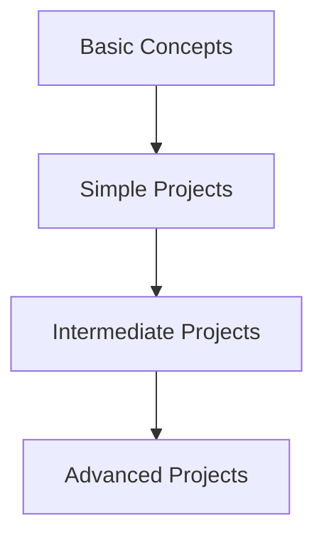

## 1.3.1 Learning by Doing: Mastering Flutter Through Real-World Projects

In the realm of software development, the adage "learning by doing" holds significant weight. This book, "Interactive Flutter: Building Apps with Hands-On Projects," embraces this philosophy by guiding you through a series of carefully crafted projects that not only teach you the fundamentals of Flutter and Dart but also empower you to build real-world applications. This section will delve into the project-based approach that underpins this book, highlighting the importance of hands-on exercises, the incremental complexity of projects, and how this methodology will enhance your learning experience.

### Project-Based Approach: Building Real-World Applications

The core of this book's teaching strategy is its project-based approach. Unlike traditional learning methods that often focus on theoretical concepts without practical application, this book emphasizes building real-world projects from the ground up. By engaging in project-based learning, you will:

- **Apply Concepts Immediately:** Each chapter introduces new concepts and immediately challenges you to apply them in a practical context. This ensures that you not only understand the theory but also know how to implement it effectively.
- **Develop Problem-Solving Skills:** Working on projects simulates real-world scenarios where you must think critically and solve problems as they arise. This enhances your ability to tackle challenges in actual development environments.
- **Gain Practical Experience:** By the end of this book, you will have a portfolio of projects that demonstrate your skills and understanding of Flutter and Dart, which can be invaluable for career advancement or personal growth.

### Hands-On Exercises: Reinforcing Learning

To reinforce the concepts covered in each section, the book includes hands-on exercises that encourage you to experiment and explore further. These exercises are designed to:

- **Solidify Understanding:** By actively engaging with the material, you reinforce your understanding and retention of key concepts.
- **Encourage Exploration:** Exercises often pose open-ended questions or challenges that encourage you to explore different solutions and approaches, fostering creativity and innovation.
- **Provide Immediate Feedback:** As you complete exercises, you receive immediate feedback on your understanding, allowing you to identify areas where you may need further study or practice.

### Incremental Complexity: Gradual Skill Building

The projects in this book are structured to gradually increase in complexity, allowing you to build your skills incrementally. This approach ensures that you are not overwhelmed by advanced concepts before you have a solid foundation. The progression is as follows:

- **Basic Concepts:** You will start with foundational concepts and simple projects that introduce you to the basics of Flutter and Dart.
- **Simple Projects:** As you gain confidence, you will tackle simple projects that integrate multiple concepts, reinforcing your understanding and skills.
- **Intermediate Projects:** These projects introduce more complexity, requiring you to apply your knowledge in new ways and explore additional features of Flutter.
- **Advanced Projects:** Finally, you will work on advanced projects that challenge you to integrate everything you've learned, resulting in feature-rich applications.

Here's a visual representation of the learning progression through projects:

### Practical Code Examples and Real-World Scenarios

Throughout the book, you will encounter practical code examples and real-world scenarios that illustrate key concepts. These examples are designed to be:

- **Clear and Well-Documented:** Each code snippet is accompanied by detailed comments and explanations, ensuring that you understand the purpose and functionality of each line of code.
- **Actionable and Relevant:** Examples are chosen to reflect real-world applications and scenarios, providing you with insights that you can apply directly to your own projects.
- **Encouraging Experimentation:** You are encouraged to modify and extend the examples, experimenting with different approaches and solutions to deepen your understanding.

### Encouraging Hands-On Practice and Experimentation

To maximize your learning experience, this book encourages you to engage in hands-on practice and experimentation. Here are some strategies to consider:

- **Extend Code Examples:** Try extending the provided code examples by adding new features or modifying existing ones. This will help you understand how different components interact and how to implement new functionality.
- **Contemplate Alternative Implementations:** Consider different ways to achieve the same result. This will enhance your problem-solving skills and expose you to multiple approaches to a given problem.
- **Pose Questions and Mini-Exercises:** At the end of each section, you will find questions and mini-exercises designed to challenge your understanding and encourage further exploration.

### Diagrams and Visual Aids

To enhance your understanding of complex concepts, this book incorporates diagrams and visual aids, including Mermaid.js diagrams. These visuals are designed to:

- **Clarify Concepts:** Diagrams provide a visual representation of abstract concepts, making them easier to understand and remember.
- **Illustrate Relationships:** Visual aids help illustrate relationships between different components, such as widget hierarchies or data flow, providing a clearer picture of how everything fits together.
- **Enhance Engagement:** By breaking up text with visuals, the book maintains reader engagement and makes complex information more digestible.

### Best Practices and Common Pitfalls

As you progress through the book, you will encounter best practices and common pitfalls associated with Flutter development. These insights are designed to:

- **Guide Your Development:** Best practices provide guidance on how to write clean, efficient, and maintainable code, ensuring that your projects are of high quality.
- **Avoid Common Mistakes:** By highlighting common pitfalls, the book helps you avoid mistakes that could lead to bugs or inefficient code, saving you time and frustration.
- **Encourage Critical Thinking:** By understanding why certain practices are recommended or discouraged, you develop a deeper understanding of the underlying principles of Flutter development.

### References and Additional Resources

To support your continued learning, the book includes references to official documentation, open-source projects, and additional resources. These references are intended to:

- **Provide Further Exploration:** Links to official documentation and open-source projects allow you to explore topics in greater depth and gain a broader understanding of Flutter and Dart.
- **Suggest Additional Learning Materials:** Recommended books, articles, and online courses provide opportunities for further study and skill development.
- **Encourage Community Engagement:** By connecting with the broader Flutter community, you can stay updated on the latest developments and trends in the field.

### Conclusion: Embrace the Journey

In conclusion, this book's project-based approach to learning Flutter and Dart is designed to provide you with a comprehensive, hands-on experience that prepares you for real-world development. By engaging with the material, completing exercises, and building projects, you will gain the skills and confidence needed to create your own applications. Embrace the journey, and remember that learning is a continuous process. As you progress, set future goals, build a portfolio of your work, and continue exploring new topics and technologies.

---

## Quiz Time!



### What is the primary teaching strategy of this book?

- [x] Project-based learning
- [ ] Lecture-based learning
- [ ] Textbook reading
- [ ] Video tutorials

> **Explanation:** The book emphasizes a project-based approach, focusing on building real-world applications to teach concepts.

### How does the book reinforce learning after each section?

- [x] Hands-on exercises
- [ ] Quizzes only
- [ ] Reading assignments
- [ ] Group discussions

> **Explanation:** Hands-on exercises are included at the end of each section to reinforce learning and encourage experimentation.

### What is the purpose of gradually increasing project complexity?

- [x] To build skills incrementally
- [ ] To overwhelm the reader
- [ ] To cover more topics quickly
- [ ] To make the book longer

> **Explanation:** Projects increase in complexity to help readers build their skills incrementally, starting from basic concepts to advanced applications.

### What type of visual aids are used in the book to enhance understanding?

- [x] Diagrams and Mermaid.js charts
- [ ] Only text descriptions
- [ ] Video tutorials
- [ ] Audio explanations

> **Explanation:** Diagrams and Mermaid.js charts are used to visually represent concepts and enhance understanding.

### What are readers encouraged to do with code examples?

- [x] Extend and modify them
- [ ] Ignore them
- [ ] Memorize them
- [ ] Delete them

> **Explanation:** Readers are encouraged to extend and modify code examples to deepen their understanding and experiment with different solutions.

### What is the benefit of using real-world scenarios in examples?

- [x] Provides actionable insights
- [ ] Makes the book fictional
- [ ] Reduces relevance
- [ ] Limits creativity

> **Explanation:** Real-world scenarios provide actionable insights that readers can apply directly to their own projects.

### How does the book help avoid common mistakes in Flutter development?

- [x] By highlighting common pitfalls
- [ ] By ignoring them
- [ ] By providing incorrect examples
- [ ] By focusing only on theory

> **Explanation:** The book highlights common pitfalls to help readers avoid mistakes and write efficient code.

### What does the book encourage readers to do with exercises?

- [x] Experiment and explore
- [ ] Skip them
- [ ] Copy answers
- [ ] Avoid them

> **Explanation:** Exercises encourage readers to experiment and explore different solutions, fostering creativity and innovation.

### What is the role of best practices in the book?

- [x] Guide development and ensure quality
- [ ] Confuse the reader
- [ ] Limit creativity
- [ ] Make the book longer

> **Explanation:** Best practices guide development and ensure that projects are of high quality, helping readers write clean and maintainable code.

### True or False: The book includes references to official documentation and additional resources.

- [x] True
- [ ] False

> **Explanation:** The book includes references to official documentation and additional resources to support continued learning and exploration.


