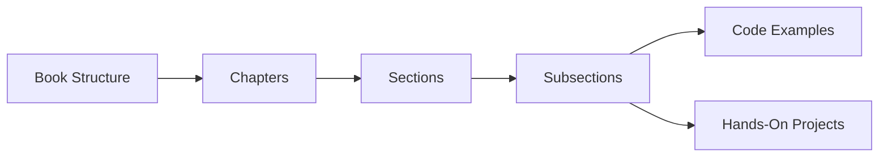

## 1.3.2 Book Structure

Embarking on a journey to master Flutter and Dart requires a structured approach that guides you through the complexities of mobile app development. "Interactive Flutter: Building Apps with Hands-On Projects" is meticulously crafted to provide a seamless learning experience, ensuring that each chapter builds upon the previous one, reinforcing your understanding and skills. This section will delve into the book's structure, offering insights into how it is organized to facilitate effective learning.

### Chapter Overview

The book is divided into a series of chapters, each designed to introduce you to new concepts and techniques in Flutter and Dart development. The progression from one chapter to the next is intentional, ensuring that foundational knowledge is established before moving on to more advanced topics. Here's a brief overview of how the chapters are structured:

- **Chapter 1: Introduction to Flutter and Dart** - This chapter lays the groundwork by introducing you to Flutter and Dart, explaining why they are powerful tools for app development, and setting the stage for the hands-on projects that follow.

- **Chapter 2: Setting Up Your Development Environment** - Before diving into coding, you'll learn how to set up your development environment, ensuring you have all the necessary tools and configurations in place.

- **Chapter 3: Dart Basics: Foundations for Flutter** - This chapter focuses on the Dart programming language, covering essential concepts such as variables, control flow, and functions, which are crucial for building Flutter applications.

- **Chapter 4: Introduction to Widgets** - Widgets are the building blocks of Flutter apps. This chapter introduces you to the different types of widgets and how to use them to create user interfaces.

- **Chapter 5: Handling User Input** - Learn how to create interactive applications by handling user input through various widgets and forms.

- **Chapter 6: State Management Basics** - Managing state is a critical aspect of app development. This chapter introduces you to basic state management techniques in Flutter.

- **Chapter 7: Navigation and Routing** - Explore how to create multi-screen applications with effective navigation and routing strategies.

- **Chapter 8: Working with External Packages** - Discover how to extend your app's functionality by integrating external packages and plugins.

- **Chapter 9: Networking and APIs** - Learn how to connect your app to the internet, fetch data from APIs, and handle network requests.

- **Chapter 10: Basic Animations and Interactivity** - Enhance your app's user experience with animations and interactive elements.

- **Chapter 11: Data Persistence and Local Storage** - Understand how to save and retrieve data locally, ensuring your app retains information between sessions.

- **Chapter 12: Debugging and Testing Your App** - Ensure your app is reliable and bug-free by learning debugging and testing techniques.

- **Chapter 13: Preparing for Deployment** - Get your app ready for the world by learning how to prepare it for deployment on app stores.

- **Chapter 14: Next Steps in Flutter Development** - Conclude your journey with insights into advanced topics and resources for continued learning.

### Section Breakdown

Each chapter is further divided into sections and subsections, each focusing on specific topics. This breakdown allows for a detailed exploration of each subject, ensuring that you gain a comprehensive understanding before moving on. Here's how the sections are typically structured:

- **Introduction** - Each section begins with an introduction to the topic, providing context and explaining its relevance to Flutter development.

- **Conceptual Explanation** - The core concepts are explained in detail, often accompanied by diagrams and illustrations to aid understanding.

- **Code Examples** - Practical code examples are provided to demonstrate how the concepts are applied in real-world scenarios. These examples are well-documented, with comments explaining key lines of code.

- **Hands-On Projects** - Each section culminates in a hands-on project, allowing you to apply what you've learned in a practical setting. These projects are designed to reinforce your understanding and provide a sense of accomplishment.

- **Summary and Best Practices** - The section concludes with a summary of key points and best practices, ensuring you have a clear understanding of the material covered.

### Consistent Format

The book follows a consistent format throughout, making it easy to follow and understand. Each chapter begins with an introduction to the topic, followed by detailed explanations, code examples, and hands-on projects. This format ensures that you not only learn the theoretical aspects of Flutter development but also gain practical experience by building real-world applications.

The consistent format is designed to:

- **Reinforce Learning** - By consistently applying the same structure, the book reinforces learning, helping you to retain information and build upon your knowledge as you progress.

- **Facilitate Hands-On Practice** - The inclusion of hands-on projects in each chapter encourages you to apply what you've learned, solidifying your understanding and building your confidence as a developer.

- **Promote Critical Thinking** - The book encourages you to think critically about the concepts and techniques you learn, considering how they can be applied to your own projects and exploring alternative implementations.

### Book Structure Diagram

To provide a visual representation of the book's structure, we have included a Mermaid.js diagram. This diagram illustrates the hierarchical layout of the book, showing how chapters are divided into sections, subsections, code examples, and hands-on projects.

### Practical Examples and Real-World Scenarios

Throughout the book, you'll encounter practical examples and real-world scenarios that illustrate how the concepts you're learning can be applied in real app development projects. These examples are designed to:

- **Bridge Theory and Practice** - By connecting theoretical concepts with practical applications, the book helps you understand how to apply what you've learned in real-world situations.

- **Provide Actionable Insights** - Each example is accompanied by actionable insights, offering tips and strategies that you can apply to your own projects.

- **Encourage Experimentation** - The book encourages you to experiment with the code examples, posing questions and mini-exercises to challenge your understanding and inspire creativity.

### Encouragement for Continuous Learning

As you progress through the book, you'll be encouraged to continue learning and exploring new topics in Flutter development. The book provides references to official documentation, open-source projects, and additional resources for further exploration. You'll also find suggestions for books, articles, and online courses that offer deeper insights into the topics covered.

### Summary

In summary, "Interactive Flutter: Building Apps with Hands-On Projects" is structured to provide a comprehensive learning experience, guiding you through the complexities of Flutter and Dart development. By following a consistent format and incorporating practical examples and hands-on projects, the book ensures that you gain both theoretical knowledge and practical skills. As you work through each chapter, you'll build a solid foundation in Flutter development, preparing you for more advanced topics and real-world projects.

## Quiz Time!



### What is the primary goal of the book's structure?

- [x] To provide a seamless learning experience by building upon previous chapters
- [ ] To cover as many topics as possible without focusing on depth
- [ ] To focus solely on theoretical concepts without practical application
- [ ] To provide a random assortment of topics for exploration

> **Explanation:** The book is structured to provide a seamless learning experience, ensuring that each chapter builds upon the previous one, reinforcing understanding and skills.

### How are chapters typically divided in the book?

- [x] Into sections and subsections focusing on specific topics
- [ ] Into random topics without a clear structure
- [ ] Into unrelated projects without context
- [ ] Into theoretical concepts only

> **Explanation:** Each chapter is divided into sections and subsections, each focusing on specific topics with accompanying projects.

### What is the consistent format followed in the book?

- [x] Introduction, conceptual explanation, code examples, hands-on projects
- [ ] Random topics, unrelated examples, no projects
- [ ] Theoretical concepts only, no examples
- [ ] Projects only, no explanations

> **Explanation:** The book follows a consistent format of introducing concepts, followed by examples and hands-on projects.

### What is the purpose of the hands-on projects in each chapter?

- [x] To reinforce understanding and provide practical experience
- [ ] To confuse the reader with complex tasks
- [ ] To focus solely on theoretical knowledge
- [ ] To provide unrelated tasks without context

> **Explanation:** Hands-on projects are designed to reinforce understanding and provide practical experience by applying learned concepts.

### What does the Mermaid.js diagram illustrate?

- [x] The hierarchical layout of the book
- [ ] The code structure of a Flutter app
- [ ] The design of a specific project
- [ ] The history of Flutter development

> **Explanation:** The Mermaid.js diagram illustrates the hierarchical layout of the book, showing how chapters are divided into sections, subsections, code examples, and hands-on projects.

### How does the book encourage critical thinking?

- [x] By posing questions and mini-exercises for readers to consider
- [ ] By providing all answers without explanation
- [ ] By focusing only on theoretical concepts
- [ ] By discouraging experimentation

> **Explanation:** The book encourages critical thinking by posing questions and mini-exercises for readers to consider, inspiring creativity and deeper understanding.

### What resources does the book provide for further exploration?

- [x] References to official documentation, open-source projects, and additional resources
- [ ] Only the content within the book
- [ ] Unrelated topics without context
- [ ] No additional resources

> **Explanation:** The book provides references to official documentation, open-source projects, and additional resources for further exploration.

### What is the benefit of the practical examples included in the book?

- [x] They bridge theory and practice, providing actionable insights
- [ ] They focus solely on theoretical knowledge
- [ ] They are unrelated to the topics covered
- [ ] They provide no practical application

> **Explanation:** Practical examples bridge theory and practice, providing actionable insights and illustrating how concepts can be applied in real-world situations.

### What is the main focus of Chapter 1?

- [x] Introduction to Flutter and Dart
- [ ] Advanced state management techniques
- [ ] Networking and APIs
- [ ] Data persistence and local storage

> **Explanation:** Chapter 1 focuses on introducing Flutter and Dart, laying the groundwork for the topics covered in subsequent chapters.

### True or False: The book is structured to cover topics randomly without building upon previous chapters.

- [ ] True
- [x] False

> **Explanation:** False. The book is structured to provide a seamless learning experience, ensuring that each chapter builds upon the previous one, reinforcing understanding and skills.


