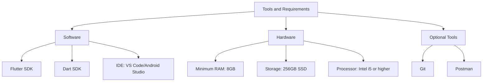

## 1.3.3 Tools and Requirements

Embarking on your journey to build Flutter applications requires a solid foundation of tools and resources. This section will guide you through the essential software and hardware requirements, as well as optional tools that can enhance your development experience. Whether you're a beginner or an experienced developer, having the right setup is crucial for efficient and effective Flutter development.

### Software Requirements

To start developing with Flutter, you'll need to set up a few key software components. These include the Flutter SDK, Dart SDK, and a suitable Integrated Development Environment (IDE). Let's explore each of these in detail:

#### Flutter SDK

The Flutter Software Development Kit (SDK) is the core component you'll need to build Flutter applications. It provides the necessary tools and libraries to create, test, and deploy apps across multiple platforms, including iOS, Android, web, and desktop.

- **Installation:** You can download the Flutter SDK from the official [Flutter website](https://flutter.dev/docs/get-started/install). Follow the installation instructions specific to your operating system (Windows, macOS, or Linux).
- **Configuration:** After installation, ensure that the Flutter SDK is added to your system's PATH. This allows you to run Flutter commands from the terminal or command prompt.

#### Dart SDK

Dart is the programming language used to write Flutter applications. The Dart SDK is included with the Flutter SDK, so you don't need to install it separately. However, understanding Dart's role in Flutter development is crucial.

- **Features:** Dart offers features like strong typing, asynchronous programming, and a rich standard library, making it ideal for building high-performance apps.
- **Usage:** You'll write your Flutter app code in Dart, leveraging its capabilities to create responsive and interactive user interfaces.

#### Recommended IDEs

Choosing the right IDE can significantly impact your productivity and development experience. Here are two popular options for Flutter development:

- **Visual Studio Code (VS Code):**
  - **Overview:** VS Code is a lightweight, open-source code editor with a rich ecosystem of extensions.
  - **Flutter Extension:** Install the Flutter extension for VS Code to enable features like code completion, debugging, and hot reload.
  - **Customization:** VS Code offers extensive customization options, allowing you to tailor the editor to your preferences.

- **Android Studio:**
  - **Overview:** Android Studio is a powerful IDE specifically designed for Android development, but it also supports Flutter.
  - **Flutter Plugin:** Install the Flutter plugin to integrate Flutter development features into Android Studio.
  - **Advantages:** Android Studio provides robust tools for UI design, performance profiling, and device emulation.

### Hardware Requirements

Having the right hardware is essential for a smooth development experience. While Flutter can run on a variety of systems, certain specifications are recommended for optimal performance:

#### Minimum RAM: 8GB

- **Reasoning:** Flutter development involves running emulators, IDEs, and other tools simultaneously. A minimum of 8GB of RAM ensures that your system can handle these tasks without significant slowdowns.

#### Storage: 256GB SSD

- **Reasoning:** An SSD (Solid State Drive) provides faster read and write speeds compared to traditional HDDs. This results in quicker boot times, faster file access, and improved overall system responsiveness.

#### Processor: Intel i5 or Higher

- **Reasoning:** A multi-core processor, such as an Intel i5 or higher, allows for efficient multitasking and faster compilation times. This is particularly important when building and testing Flutter apps.

### Optional Tools

In addition to the essential software and hardware, there are several optional tools that can enhance your Flutter development workflow:

#### Git

- **Purpose:** Git is a version control system that helps you manage changes to your codebase. It allows you to track revisions, collaborate with others, and revert to previous states if needed.
- **Installation:** You can download Git from the official [Git website](https://git-scm.com/). Once installed, you can use Git commands from the terminal or integrate it with your IDE.

#### Postman

- **Purpose:** Postman is a tool for testing APIs. It allows you to send requests, inspect responses, and automate testing of your app's backend services.
- **Usage:** Use Postman to ensure that your app's API interactions are functioning correctly, which is especially useful when working with RESTful services.

### Visualizing the Tools and Requirements

To better understand the relationships between these tools and requirements, refer to the following Mermaid.js diagram:

### Best Practices and Considerations

- **Stay Updated:** Regularly update your Flutter and Dart SDKs to benefit from the latest features and improvements.
- **Optimize Your Environment:** Customize your IDE settings and extensions to suit your workflow and enhance productivity.
- **Leverage Community Resources:** Join the Flutter community to access tutorials, forums, and support from fellow developers.

### Conclusion

Equipping yourself with the right tools and understanding the requirements is the first step towards successful Flutter development. By setting up a robust development environment, you'll be well-prepared to tackle the projects and challenges presented in this book. As you progress, remember to explore additional tools and resources that can further enhance your skills and capabilities.

## Quiz Time!



### What is the primary role of the Flutter SDK?

- [x] To provide the necessary tools and libraries for building Flutter applications.
- [ ] To manage version control for Flutter projects.
- [ ] To test APIs used in Flutter applications.
- [ ] To optimize hardware performance for Flutter development.

> **Explanation:** The Flutter SDK provides the essential tools and libraries needed to create, test, and deploy Flutter applications across various platforms.

### Which IDE is specifically designed for Android development but also supports Flutter?

- [ ] Visual Studio Code
- [x] Android Studio
- [ ] IntelliJ IDEA
- [ ] Sublime Text

> **Explanation:** Android Studio is primarily designed for Android development but supports Flutter through the Flutter plugin.

### What is the minimum recommended RAM for Flutter development?

- [ ] 4GB
- [x] 8GB
- [ ] 16GB
- [ ] 32GB

> **Explanation:** A minimum of 8GB of RAM is recommended to handle the demands of running emulators, IDEs, and other development tools simultaneously.

### Why is an SSD recommended for Flutter development?

- [x] It provides faster read and write speeds, improving system responsiveness.
- [ ] It is cheaper than an HDD.
- [ ] It offers more storage capacity than an HDD.
- [ ] It is required for running Flutter applications.

> **Explanation:** An SSD offers faster read and write speeds, leading to quicker boot times and improved overall system performance, which is beneficial for development tasks.

### What is the purpose of Git in Flutter development?

- [x] To manage changes to the codebase and facilitate collaboration.
- [ ] To test APIs used in Flutter applications.
- [ ] To provide a graphical interface for designing UI components.
- [ ] To compile and build Flutter applications.

> **Explanation:** Git is a version control system that helps manage code changes, track revisions, and collaborate with others on a project.

### Which tool is recommended for testing APIs in Flutter development?

- [ ] Git
- [ ] Visual Studio Code
- [x] Postman
- [ ] Android Studio

> **Explanation:** Postman is a tool used for testing APIs, allowing developers to send requests and inspect responses to ensure correct API interactions.

### What is the role of the Dart SDK in Flutter development?

- [x] To provide the programming language and libraries for writing Flutter applications.
- [ ] To manage version control for Flutter projects.
- [ ] To optimize hardware performance for Flutter development.
- [ ] To test APIs used in Flutter applications.

> **Explanation:** The Dart SDK provides the programming language and libraries necessary for writing Flutter applications.

### Which of the following is an optional tool that can enhance the Flutter development experience?

- [ ] Flutter SDK
- [ ] Dart SDK
- [x] Git
- [ ] Android Studio

> **Explanation:** Git is an optional tool that enhances the development experience by providing version control capabilities.

### What is the recommended processor for optimal Flutter development?

- [ ] Intel i3
- [x] Intel i5 or higher
- [ ] Intel i7
- [ ] AMD Ryzen 3

> **Explanation:** An Intel i5 or higher processor is recommended for efficient multitasking and faster compilation times during Flutter development.

### True or False: The Dart SDK needs to be installed separately from the Flutter SDK.

- [ ] True
- [x] False

> **Explanation:** The Dart SDK is included with the Flutter SDK, so it does not need to be installed separately.


