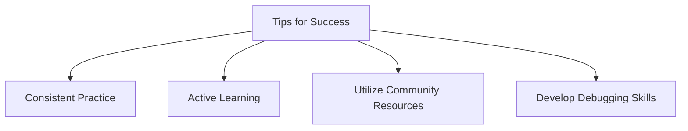

## 1.3.4 Tips for Success

Embarking on your journey with Flutter and Dart can be both exciting and challenging. This section aims to equip you with essential tips for success, ensuring that you not only understand the material but also apply it effectively in your projects. By focusing on consistent practice, active learning, community engagement, and strong debugging skills, you will build a solid foundation in Flutter development.

### Consistent Practice

Consistent practice is the cornerstone of mastering any new skill, and Flutter development is no exception. Here are some strategies to help you practice effectively:

- **Daily Coding:** Set aside time each day to write code. This could be as simple as experimenting with a new widget or as complex as building a small app feature. The key is consistency, which helps reinforce learning and build muscle memory.

- **Project-Based Learning:** Work on small projects that interest you. This approach not only makes learning more enjoyable but also provides practical experience. For example, try creating a simple to-do list app or a weather app using public APIs.

- **Code Reviews:** Regularly review your code and seek feedback from peers or mentors. Code reviews can provide new perspectives and highlight areas for improvement.

- **Reflect on Mistakes:** When you encounter errors, take the time to understand what went wrong and why. This reflection helps prevent similar mistakes in the future.

#### Practical Exercise

Try to implement a simple Flutter app that displays a list of items. Use a `ListView` widget and practice adding, removing, and updating items. This exercise will help you understand state management and widget trees.

### Active Learning

Active learning involves engaging with the material in a way that promotes critical thinking and retention. Here are some techniques to enhance your learning experience:

- **Take Notes:** Write down key concepts, code snippets, and personal insights as you progress through the book. This practice aids memory retention and provides a valuable reference.

- **Experiment with Code:** Don't just copy code examples—modify them to see how changes affect the outcome. This experimentation fosters a deeper understanding of how Flutter works.

- **Ask Questions:** As you learn, questions will naturally arise. Write them down and seek answers through research or by asking the community.

- **Teach Others:** Explaining concepts to others is a powerful way to solidify your understanding. Consider writing blog posts or participating in forums to share your knowledge.

#### Code Example

Modify the following code snippet to change the text color and font size:

```dart
import 'package:flutter/material.dart';

void main() => runApp(MyApp());

class MyApp extends StatelessWidget {
  @override
  Widget build(BuildContext context) {
    return MaterialApp(
      home: Scaffold(
        appBar: AppBar(title: Text('Active Learning Example')),
        body: Center(
          child: Text(
            'Hello, Flutter!',
            style: TextStyle(fontSize: 24), // Modify this line
          ),
        ),
      ),
    );
  }
}
```

### Utilizing Community Resources

The Flutter community is a vibrant and supportive network of developers. Leveraging these resources can significantly enhance your learning and problem-solving capabilities:

- **Online Forums:** Platforms like Stack Overflow and Reddit are excellent places to ask questions and find solutions to common problems.

- **Official Documentation:** The Flutter documentation is comprehensive and regularly updated. Make it your first stop when you encounter issues or need clarification on a topic.

- **Tutorials and Courses:** Numerous free and paid tutorials are available online. Platforms like Udemy, Coursera, and YouTube offer courses tailored to different skill levels.

- **Meetups and Conferences:** Attend local meetups or virtual conferences to network with other developers and learn from industry experts.

#### Real-World Scenario

Imagine you're stuck on a problem related to state management. You can search for similar issues on Stack Overflow or join a Flutter community on Discord to discuss potential solutions.

### Debugging and Problem-Solving

Developing strong debugging skills is crucial for any developer. Here are some tips to enhance your problem-solving abilities:

- **Understand the Error:** Read error messages carefully and try to understand what they mean. This understanding is the first step in resolving issues.

- **Break Down the Problem:** Divide complex problems into smaller, manageable parts. Solve each part individually before combining them.

- **Use Debugging Tools:** Flutter provides powerful debugging tools like Flutter DevTools. Use these tools to inspect widget trees, analyze performance, and track down issues.

- **Stay Calm and Patient:** Debugging can be frustrating, but staying calm and patient will help you think clearly and find solutions more effectively.

#### Debugging Exercise

Create a simple app with a button that updates a counter. Introduce an intentional error, such as a typo in a variable name, and practice using Flutter DevTools to identify and fix the issue.

### Mermaid.js Diagram

To visually represent these success tips, refer to the following flowchart:



### Conclusion

By incorporating these tips into your learning routine, you'll be well-equipped to tackle the challenges of Flutter development. Remember, the journey to mastery is a marathon, not a sprint. Embrace the process, stay curious, and enjoy the learning experience.

For further exploration, consider reading books on software engineering best practices, such as "Clean Code" by Robert C. Martin, or taking online courses on platforms like Coursera or Udemy to deepen your understanding of Flutter and Dart.

## Quiz Time!



### What is the primary benefit of consistent practice in Flutter development?

- [x] Reinforces learning and builds muscle memory
- [ ] Allows you to skip difficult topics
- [ ] Guarantees immediate mastery of Flutter
- [ ] Eliminates the need for debugging

> **Explanation:** Consistent practice helps reinforce learning and build muscle memory, which is essential for mastering Flutter development.

### How can active learning enhance your understanding of Flutter?

- [x] By engaging with the material through experimentation and questioning
- [ ] By memorizing code examples without modification
- [ ] By avoiding complex topics
- [ ] By focusing solely on theoretical concepts

> **Explanation:** Active learning involves engaging with the material through experimentation, questioning, and teaching others, which enhances understanding.

### Which community resource is NOT mentioned as beneficial for Flutter developers?

- [ ] Online forums
- [ ] Official documentation
- [ ] Tutorials and courses
- [x] Social media influencers

> **Explanation:** While social media influencers can provide insights, the primary resources mentioned are online forums, official documentation, and tutorials.

### What is a recommended approach when you encounter a complex problem in Flutter?

- [x] Break down the problem into smaller parts
- [ ] Ignore the problem and move on
- [ ] Wait for someone else to solve it
- [ ] Memorize the error message

> **Explanation:** Breaking down complex problems into smaller parts makes them more manageable and easier to solve.

### Which tool is suggested for inspecting widget trees and analyzing performance in Flutter?

- [x] Flutter DevTools
- [ ] Visual Studio Code
- [ ] Android Studio
- [ ] Xcode

> **Explanation:** Flutter DevTools is a powerful tool for inspecting widget trees and analyzing performance in Flutter apps.

### What is a benefit of participating in Flutter meetups and conferences?

- [x] Networking with other developers and learning from experts
- [ ] Avoiding coding practice
- [ ] Receiving free software
- [ ] Guaranteeing job offers

> **Explanation:** Participating in meetups and conferences allows you to network with other developers and learn from industry experts.

### How can you modify code examples to enhance active learning?

- [x] By changing parameters and observing different outcomes
- [ ] By copying them exactly as they are
- [ ] By avoiding any changes
- [ ] By deleting them

> **Explanation:** Modifying code examples helps you understand how changes affect outcomes, enhancing active learning.

### What should you do when you encounter an error message in Flutter?

- [x] Read the error message carefully to understand it
- [ ] Ignore it and hope it resolves itself
- [ ] Immediately ask for help without trying to solve it
- [ ] Restart your computer

> **Explanation:** Reading and understanding error messages is the first step in resolving issues effectively.

### Which of the following is NOT a recommended debugging strategy?

- [ ] Using debugging tools
- [ ] Staying calm and patient
- [ ] Breaking down the problem
- [x] Avoiding error messages

> **Explanation:** Avoiding error messages is not recommended; understanding them is crucial for debugging.

### True or False: Consistent practice guarantees immediate mastery of Flutter.

- [ ] True
- [x] False

> **Explanation:** Consistent practice is essential for learning, but it does not guarantee immediate mastery. Mastery takes time and effort.


