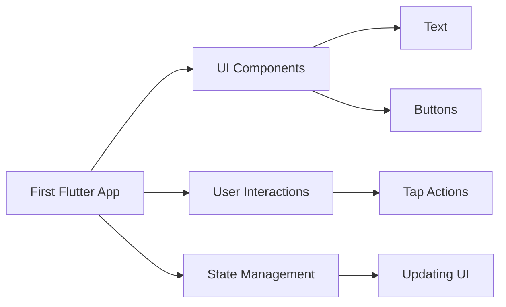

## 1.4.1 What We'll Build

Embarking on the journey of building your first Flutter app is an exciting and rewarding experience. In this section, we will provide a comprehensive overview of the first project you'll create: a simple yet functional counter app. This project is designed to introduce you to the fundamental concepts of Flutter, including UI components, user interactions, and basic state management. By the end of this section, you'll have a clear understanding of what the completed app will look like and how it will function, setting a solid foundation for more complex projects in the future.

### Project Description

The first project you'll build is a **Simple Counter App**. This app is a quintessential beginner project in Flutter development, offering a hands-on introduction to the framework's core principles. The counter app will allow users to increment and decrement a numerical value displayed on the screen. This seemingly simple functionality will help you grasp essential concepts such as widget trees, stateful and stateless widgets, and the hot reload feature that makes Flutter development so efficient.

### Features Overview

The Simple Counter App will incorporate several key features that highlight the versatility and power of Flutter:

- **UI Components:**
  - **Text Widget:** Displays the current count.
  - **Buttons:** Two buttons to increment and decrement the counter value.

- **User Interactions:**
  - **Tap Actions:** Users can tap buttons to change the counter value.

- **State Management:**
  - **Stateful Widget:** Manages the state of the counter, updating the UI in response to user interactions.

These features will provide a practical introduction to building interactive user interfaces and managing application state, which are critical skills in Flutter development.

### Expected Outcome

Upon completing the Simple Counter App, you'll have a fully functional application that responds to user input and updates its display in real-time. The app will feature a clean and intuitive interface, with a central display showing the current count and two buttons for user interaction. The app's functionality will be smooth and responsive, demonstrating the power of Flutter's reactive framework.

Here's a visual representation of the app's feature flow:



### Building the App: Step-by-Step Guide

#### Step 1: Setting Up the Project

Begin by creating a new Flutter project. Open your terminal or command prompt and run the following command:

```bash
flutter create simple_counter_app
```

Navigate into the project directory:

```bash
cd simple_counter_app
```

Open the project in your preferred IDE, such as Visual Studio Code or Android Studio.

#### Step 2: Understanding the Project Structure

Familiarize yourself with the project structure. The main files you'll work with are located in the `lib` directory. The `main.dart` file is the entry point of your Flutter application.

#### Step 3: Designing the UI

Open `main.dart` and replace its content with the following code to set up the basic UI:

```dart
import 'package:flutter/material.dart';

void main() => runApp(MyApp());

class MyApp extends StatelessWidget {
  @override
  Widget build(BuildContext context) {
    return MaterialApp(
      title: 'Simple Counter App',
      theme: ThemeData(
        primarySwatch: Colors.blue,
      ),
      home: CounterScreen(),
    );
  }
}

class CounterScreen extends StatefulWidget {
  @override
  _CounterScreenState createState() => _CounterScreenState();
}

class _CounterScreenState extends State<CounterScreen> {
  int _counter = 0;

  void _incrementCounter() {
    setState(() {
      _counter++;
    });
  }

  void _decrementCounter() {
    setState(() {
      _counter--;
    });
  }

  @override
  Widget build(BuildContext context) {
    return Scaffold(
      appBar: AppBar(
        title: Text('Simple Counter App'),
      ),
      body: Center(
        child: Column(
          mainAxisAlignment: MainAxisAlignment.center,
          children: <Widget>[
            Text(
              'You have pushed the button this many times:',
            ),
            Text(
              '$_counter',
              style: Theme.of(context).textTheme.headline4,
            ),
          ],
        ),
      ),
      floatingActionButton: Row(
        mainAxisAlignment: MainAxisAlignment.end,
        children: <Widget>[
          FloatingActionButton(
            onPressed: _incrementCounter,
            tooltip: 'Increment',
            child: Icon(Icons.add),
          ),
          SizedBox(width: 10),
          FloatingActionButton(
            onPressed: _decrementCounter,
            tooltip: 'Decrement',
            child: Icon(Icons.remove),
          ),
        ],
      ),
    );
  }
}
```

#### Step 4: Running the App

To see your app in action, run the following command in your terminal:

```bash
flutter run
```

This command will compile your app and launch it on the connected device or emulator. You should see a screen with a counter and two buttons, allowing you to increment and decrement the counter value.

### Practical Code Examples and Snippets

Let's break down the code to understand how each part contributes to the app's functionality:

- **Main Function and MyApp Class:**

```dart
void main() => runApp(MyApp());

class MyApp extends StatelessWidget {
  @override
  Widget build(BuildContext context) {
    return MaterialApp(
      title: 'Simple Counter App',
      theme: ThemeData(
        primarySwatch: Colors.blue,
      ),
      home: CounterScreen(),
    );
  }
}
```

The `main` function is the entry point of the app, calling `runApp` to start the application. `MyApp` is a stateless widget that sets up the app's theme and home screen.

- **CounterScreen and State Management:**

```dart
class CounterScreen extends StatefulWidget {
  @override
  _CounterScreenState createState() => _CounterScreenState();
}

class _CounterScreenState extends State<CounterScreen> {
  int _counter = 0;

  void _incrementCounter() {
    setState(() {
      _counter++;
    });
  }

  void _decrementCounter() {
    setState(() {
      _counter--;
    });
  }
```

`CounterScreen` is a stateful widget that manages the counter's state. The `_CounterScreenState` class contains the logic for incrementing and decrementing the counter, using `setState` to update the UI.

- **Building the UI:**

```dart
@override
Widget build(BuildContext context) {
  return Scaffold(
    appBar: AppBar(
      title: Text('Simple Counter App'),
    ),
    body: Center(
      child: Column(
        mainAxisAlignment: MainAxisAlignment.center,
        children: <Widget>[
          Text(
            'You have pushed the button this many times:',
          ),
          Text(
            '$_counter',
            style: Theme.of(context).textTheme.headline4,
          ),
        ],
      ),
    ),
    floatingActionButton: Row(
      mainAxisAlignment: MainAxisAlignment.end,
      children: <Widget>[
        FloatingActionButton(
          onPressed: _incrementCounter,
          tooltip: 'Increment',
          child: Icon(Icons.add),
        ),
        SizedBox(width: 10),
        FloatingActionButton(
          onPressed: _decrementCounter,
          tooltip: 'Decrement',
          child: Icon(Icons.remove),
        ),
      ],
    ),
  );
}
```

The `build` method constructs the UI using a `Scaffold` widget, which provides a structure for the app's layout. The `AppBar` displays the app's title, while the `body` contains a `Column` with text widgets showing the counter value. The `floatingActionButton` provides interactive buttons for user input.

### Encouraging Hands-On Practice

As you build this app, take the opportunity to experiment with the code. Try changing the text, colors, or layout to see how Flutter's hot reload feature allows you to see changes instantly. Consider adding additional features, such as resetting the counter or changing the increment value, to deepen your understanding of Flutter's capabilities.

### Best Practices and Common Pitfalls

- **Best Practices:**
  - Use meaningful names for variables and methods to enhance code readability.
  - Keep your widget tree organized and modular to simplify maintenance and scalability.

- **Common Pitfalls:**
  - Forgetting to call `setState` when updating state variables can lead to UI inconsistencies.
  - Overcomplicating the widget tree can make the app difficult to debug and extend.

### References and Further Reading

- [Flutter Official Documentation](https://flutter.dev/docs): Comprehensive resource for Flutter development.
- [Dart Language Tour](https://dart.dev/guides/language/language-tour): In-depth guide to the Dart programming language.
- [Flutter Widget Catalog](https://flutter.dev/docs/development/ui/widgets): Explore the wide range of widgets available in Flutter.

### Conclusion

Building your first Flutter app is a significant milestone in your development journey. The Simple Counter App introduces you to the core concepts of Flutter, providing a solid foundation for more advanced projects. As you continue to explore Flutter, remember to experiment, learn from the community, and apply best practices to create efficient and engaging applications.

## Quiz Time!



### What is the primary purpose of the Simple Counter App project?

- [x] To introduce fundamental Flutter concepts
- [ ] To create a complex, feature-rich application
- [ ] To demonstrate advanced state management techniques
- [ ] To build a production-ready app

> **Explanation:** The Simple Counter App is designed to introduce beginners to fundamental Flutter concepts, such as UI components and basic state management.

### Which widget is used to display the current count in the Simple Counter App?

- [x] Text
- [ ] Button
- [ ] Scaffold
- [ ] Column

> **Explanation:** The `Text` widget is used to display the current count in the app.

### What method is used to update the UI in response to user interactions?

- [x] setState
- [ ] build
- [ ] runApp
- [ ] initState

> **Explanation:** The `setState` method is used to update the UI when the state changes in a stateful widget.

### What is the role of the `FloatingActionButton` in the app?

- [x] To provide interactive buttons for incrementing and decrementing the counter
- [ ] To display the current count
- [ ] To manage the app's state
- [ ] To set the app's theme

> **Explanation:** The `FloatingActionButton` provides interactive buttons that allow users to increment and decrement the counter.

### Which of the following is a common pitfall when building Flutter apps?

- [x] Forgetting to call `setState` when updating state variables
- [ ] Using meaningful names for variables and methods
- [ ] Keeping the widget tree organized
- [ ] Applying best practices

> **Explanation:** Forgetting to call `setState` when updating state variables can lead to UI inconsistencies.

### What is the purpose of the `Scaffold` widget in the app?

- [x] To provide a structure for the app's layout
- [ ] To display the current count
- [ ] To manage user interactions
- [ ] To handle state management

> **Explanation:** The `Scaffold` widget provides a structure for the app's layout, including the app bar and body.

### How can you experiment with the Simple Counter App to deepen your understanding of Flutter?

- [x] By changing the text, colors, or layout
- [ ] By ignoring the hot reload feature
- [ ] By avoiding additional features
- [ ] By not experimenting with the code

> **Explanation:** Experimenting with the text, colors, or layout allows you to see how Flutter's hot reload feature works and deepens your understanding of the framework.

### What is the entry point of a Flutter application?

- [x] The `main` function
- [ ] The `build` method
- [ ] The `setState` method
- [ ] The `Scaffold` widget

> **Explanation:** The `main` function is the entry point of a Flutter application, where `runApp` is called to start the app.

### Which of the following is a best practice when building Flutter apps?

- [x] Keeping the widget tree organized and modular
- [ ] Overcomplicating the widget tree
- [ ] Using vague names for variables and methods
- [ ] Avoiding experimentation

> **Explanation:** Keeping the widget tree organized and modular simplifies maintenance and scalability.

### True or False: The Simple Counter App is a production-ready application.

- [ ] True
- [x] False

> **Explanation:** The Simple Counter App is a beginner project designed to introduce fundamental Flutter concepts, not a production-ready application.


