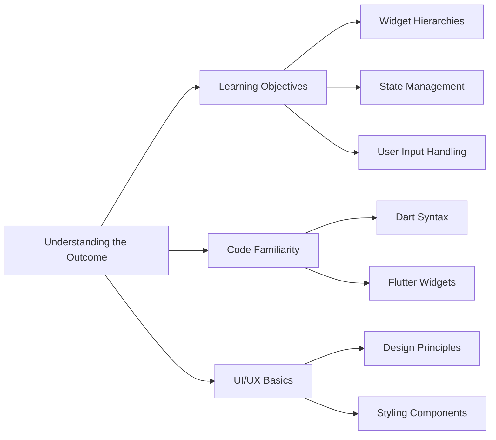

## 1.4.2 Understanding the Outcome

Embarking on your journey to build your first Flutter app is an exciting venture that promises to equip you with a robust set of skills and knowledge. This section aims to provide a comprehensive understanding of what you will achieve by the end of this project. By delving into the intricacies of Flutter and Dart, you will not only gain technical proficiency but also a deeper appreciation for the art of crafting intuitive and responsive mobile applications.

### Learning Objectives

The primary goal of this project is to ensure that you walk away with a solid foundation in Flutter app development. Here are the key learning objectives:

- **Understanding Widget Hierarchies:** Widgets are the cornerstone of Flutter applications. You will learn how to construct and manage widget trees, understanding the parent-child relationships that define the structure of your app. This knowledge is crucial for creating complex, scalable applications.

- **State Management:** Managing the state of your application is vital for ensuring that your app responds dynamically to user interactions. You will explore different state management techniques, learning how to update and maintain the state efficiently.

- **Handling User Input:** Interactivity is a core aspect of any mobile application. You will gain experience in handling various forms of user input, from simple taps to complex gestures, ensuring your app is both functional and user-friendly.

#### Widget Hierarchies

In Flutter, everything is a widget. Understanding how widgets work together to form the user interface is essential. You will learn to:

- Construct widget trees that define the layout and structure of your app.
- Differentiate between **Stateless** and **Stateful** widgets, and know when to use each.
- Utilize common widgets such as `Container`, `Row`, `Column`, and more to build intuitive interfaces.

#### State Management

State management is about controlling the data flow within your app. You will explore:

- The lifecycle of stateful widgets and how to manage state changes using the `setState` method.
- Techniques for lifting state up to share data between widgets.
- Introduction to state management solutions like Provider for more complex applications.

#### User Input Handling

Handling user input effectively is crucial for creating interactive applications. You will learn to:

- Use input widgets like `TextField`, `Checkbox`, and `Button` to capture user data.
- Implement gesture detectors to respond to user interactions such as taps and swipes.
- Validate and process user input to ensure data integrity.

### Code Familiarity

Through hands-on practice, you will become familiar with key Flutter and Dart syntax. This project will serve as a practical introduction to:

- **Dart Syntax:** Gain proficiency in Dart, the language that powers Flutter. You will learn about variables, control flow, functions, and more.

- **Flutter Widgets:** Understand the core widgets provided by Flutter and how to use them to build responsive UIs. You will explore the widget catalog and learn to customize widgets to fit your design needs.

#### Dart Syntax

Dart is a versatile language that is easy to learn and powerful to use. You will cover:

- Basic syntax and data types, such as `int`, `double`, `String`, and `bool`.
- Control structures like `if` statements, loops, and switch cases.
- Function definitions and the use of optional and named parameters.

#### Flutter Widgets

Widgets are the building blocks of Flutter apps. You will explore:

- The widget catalog, including layout widgets like `Row` and `Column`.
- Styling widgets using properties like `padding`, `margin`, and `alignment`.
- Creating custom widgets to encapsulate reusable UI components.

### UI/UX Basics

Designing an app is not just about functionality; it's also about creating an engaging user experience. This project will introduce you to basic UI/UX principles:

- **Design Principles:** Learn about layout design, color theory, and typography to create visually appealing interfaces.

- **Styling Components:** Discover how to style your app using themes, custom fonts, and color schemes to enhance the user experience.

#### Design Principles

Good design is intuitive and user-friendly. You will learn to:

- Apply layout principles to organize content effectively.
- Use color and typography to create a cohesive visual identity.
- Design with accessibility in mind to ensure your app is usable by everyone.

#### Styling Components

Styling is about making your app look good. You will explore:

- Using the `ThemeData` class to define global styles.
- Customizing widgets with properties like `color`, `fontSize`, and `fontWeight`.
- Implementing responsive design to ensure your app looks great on all devices.

### Visualizing the Learning Outcomes

To better understand how these learning outcomes connect to the components of your first Flutter project, let's visualize this with a Mermaid.js diagram:



This diagram illustrates the interconnected nature of the skills and knowledge you will acquire. Each component builds upon the others, creating a comprehensive understanding of Flutter app development.

### Practical Code Examples

To solidify your understanding, let's look at some practical code examples that highlight these concepts:

#### Example: Building a Simple UI with Widgets

```dart
import 'package:flutter/material.dart';

void main() => runApp(MyApp());

class MyApp extends StatelessWidget {
  @override
  Widget build(BuildContext context) {
    return MaterialApp(
      home: Scaffold(
        appBar: AppBar(
          title: Text('My First Flutter App'),
        ),
        body: Center(
          child: Column(
            mainAxisAlignment: MainAxisAlignment.center,
            children: <Widget>[
              Text(
                'Hello, Flutter!',
                style: TextStyle(fontSize: 24),
              ),
              SizedBox(height: 20),
              ElevatedButton(
                onPressed: () {
                  print('Button Pressed!');
                },
                child: Text('Press Me'),
              ),
            ],
          ),
        ),
      ),
    );
  }
}
```

**Explanation:**

- **Widgets:** The app uses a `Column` widget to arrange a `Text` widget and an `ElevatedButton` vertically.
- **Styling:** The `Text` widget is styled with a larger font size.
- **Interactivity:** The button prints a message to the console when pressed.

#### Example: Managing State with Stateful Widgets

```dart
import 'package:flutter/material.dart';

void main() => runApp(MyApp());

class MyApp extends StatelessWidget {
  @override
  Widget build(BuildContext context) {
    return MaterialApp(
      home: Counter(),
    );
  }
}

class Counter extends StatefulWidget {
  @override
  _CounterState createState() => _CounterState();
}

class _CounterState extends State<Counter> {
  int _counter = 0;

  void _incrementCounter() {
    setState(() {
      _counter++;
    });
  }

  @override
  Widget build(BuildContext context) {
    return Scaffold(
      appBar: AppBar(
        title: Text('Counter App'),
      ),
      body: Center(
        child: Column(
          mainAxisAlignment: MainAxisAlignment.center,
          children: <Widget>[
            Text(
              'You have pushed the button this many times:',
            ),
            Text(
              '$_counter',
              style: Theme.of(context).textTheme.headline4,
            ),
          ],
        ),
      ),
      floatingActionButton: FloatingActionButton(
        onPressed: _incrementCounter,
        tooltip: 'Increment',
        child: Icon(Icons.add),
      ),
    );
  }
}
```

**Explanation:**

- **State Management:** The `_counter` variable holds the state of the counter.
- **Stateful Widget:** The `Counter` widget uses a `StatefulWidget` to manage state changes.
- **setState:** The `_incrementCounter` method updates the state, triggering a UI refresh.

### Real-World Scenarios

Consider how these skills apply in real-world scenarios:

- **Building a Shopping App:** Understanding widget hierarchies and state management is crucial for displaying product lists and managing shopping carts.
- **Creating a Social Media App:** Handling user input and designing intuitive interfaces are key to engaging users and encouraging interaction.
- **Developing a Fitness Tracker:** Managing state and styling components are essential for tracking user activities and presenting data visually.

### Encouragement for Hands-On Practice

As you work through this project, remember that hands-on practice is the best way to learn. Experiment with the code examples, modify them, and see how changes affect the app. Consider these mini-exercises:

- **Extend the Counter App:** Add a button to decrement the counter and reset it to zero.
- **Customize the UI:** Change the color scheme and fonts to match your personal style.
- **Add User Input:** Implement a `TextField` to allow users to set the initial counter value.

### Conclusion

By the end of this project, you will have a comprehensive understanding of Flutter app development, from constructing widget hierarchies to managing state and handling user input. These skills will serve as a strong foundation for your future projects, enabling you to create sophisticated and engaging mobile applications.

### Further Exploration

To deepen your understanding, consider exploring these resources:

- **Official Flutter Documentation:** [Flutter.dev](https://flutter.dev/docs)
- **Dart Language Tour:** [Dart.dev](https://dart.dev/guides/language/language-tour)
- **Online Courses:** Platforms like Udemy and Coursera offer courses on Flutter development.

## Quiz Time!



### What is the primary goal of understanding widget hierarchies in Flutter?

- [x] To construct and manage the structure of the app's UI.
- [ ] To handle user input efficiently.
- [ ] To manage the app's state.
- [ ] To implement animations.

> **Explanation:** Understanding widget hierarchies is crucial for constructing and managing the structure of the app's user interface, which involves organizing widgets in a parent-child relationship.

### Which method is used to update the state of a StatefulWidget in Flutter?

- [ ] initState
- [x] setState
- [ ] build
- [ ] dispose

> **Explanation:** The `setState` method is used to update the state of a StatefulWidget, triggering a rebuild of the widget tree.

### What is the purpose of using a `TextField` widget in Flutter?

- [ ] To display images.
- [ ] To create buttons.
- [x] To accept user text input.
- [ ] To manage state.

> **Explanation:** The `TextField` widget is used to accept user text input, making it a key component for forms and interactive applications.

### How does Flutter handle user interactions such as taps and swipes?

- [ ] Through the use of animations.
- [x] By implementing gesture detectors.
- [ ] By using state management.
- [ ] By styling components.

> **Explanation:** Flutter handles user interactions such as taps and swipes by implementing gesture detectors, which respond to various user gestures.

### What is the role of the `ThemeData` class in Flutter?

- [ ] To manage app state.
- [x] To define global styles for the app.
- [ ] To handle user input.
- [ ] To create animations.

> **Explanation:** The `ThemeData` class is used to define global styles for the app, such as colors, fonts, and other visual properties.

### Which of the following is a key learning objective of the first Flutter app project?

- [x] Understanding widget hierarchies.
- [ ] Implementing advanced animations.
- [ ] Using third-party packages.
- [ ] Developing backend services.

> **Explanation:** Understanding widget hierarchies is a key learning objective, as it is fundamental to building and structuring Flutter applications.

### What is the benefit of using a `Column` widget in Flutter?

- [ ] To manage state.
- [ ] To handle user input.
- [x] To arrange widgets vertically.
- [ ] To create animations.

> **Explanation:** The `Column` widget is used to arrange widgets vertically, making it a fundamental layout component in Flutter.

### Which language powers Flutter applications?

- [ ] JavaScript
- [ ] Kotlin
- [x] Dart
- [ ] Swift

> **Explanation:** Dart is the programming language that powers Flutter applications, providing a robust and flexible syntax for app development.

### What is the significance of the `build` method in a Flutter widget?

- [ ] It initializes state.
- [x] It describes the widget's UI.
- [ ] It handles user input.
- [ ] It manages animations.

> **Explanation:** The `build` method describes the widget's UI by returning a widget tree, which Flutter uses to render the interface.

### True or False: The `setState` method can be used in StatelessWidgets.

- [ ] True
- [x] False

> **Explanation:** False. The `setState` method is used in StatefulWidgets to update the state and trigger a rebuild, not in StatelessWidgets.


