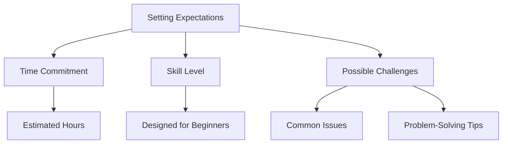

## 1.4.3 Setting Expectations

Embarking on your journey to build your first Flutter app is an exciting and rewarding experience. However, it's crucial to set realistic expectations to ensure a smooth learning process. This section will guide you through understanding the time commitment, skill level, and potential challenges you might encounter. By setting clear expectations, you'll be better prepared to tackle the project and enjoy the learning journey.

### Time Commitment

Building your first Flutter app is a significant step, and it's important to allocate sufficient time to fully engage with the material and practice your skills. Here's a breakdown of the estimated time commitment:

- **Initial Setup:** Expect to spend around 2-3 hours setting up your development environment. This includes installing Flutter, configuring your IDE, and setting up emulators or physical devices for testing.
- **Learning Basics:** Dedicate approximately 5-7 hours to grasp the fundamental concepts of Flutter and Dart. This includes understanding widgets, the widget tree, and basic Dart syntax.
- **Hands-On Practice:** Allocate 10-15 hours for hands-on practice, where you'll apply what you've learned by building small components and experimenting with different widgets.
- **Project Completion:** Completing the first project, a simple Flutter app, will take an additional 10-15 hours. This includes designing the UI, implementing functionality, and testing the app.

Overall, you should plan to invest around 30-40 hours to complete the project. This time frame allows for a thorough understanding of the concepts and sufficient practice to build confidence in your skills.

### Skill Level

This project is designed with absolute beginners in mind. You don't need any prior experience with Flutter or Dart, as the book will guide you through each step. Here's what you can expect in terms of skill development:

- **Gradual Learning Curve:** The project introduces essential concepts gradually, ensuring you build a solid foundation before moving on to more complex topics.
- **Hands-On Approach:** You'll learn by doing, which is an effective way to grasp new concepts and retain information. Each chapter includes practical exercises to reinforce your understanding.
- **Supportive Resources:** The book provides additional resources, such as links to official documentation and community forums, to support your learning journey.

By the end of the project, you'll have a strong understanding of Flutter basics and the confidence to tackle more advanced projects.

### Possible Challenges

As with any new skill, learning Flutter may present some challenges. Here are a few potential hurdles and tips for overcoming them:

- **Understanding the Widget Tree:** One of the initial challenges is grasping the concept of the widget tree and how widgets interact with each other. Take your time to experiment with different widget combinations and refer to the documentation for clarification.
- **Debugging Errors:** Encountering errors is a natural part of the development process. Approach debugging with a problem-solving mindset, and don't hesitate to seek help from the Flutter community if you're stuck.
- **Managing State:** State management can be complex for beginners. Start with simple examples and gradually explore more advanced techniques as you gain confidence.

Remember, challenges are opportunities for growth. Embrace them as part of the learning process and use them to enhance your problem-solving skills.

### Visualizing the Expectation-Setting Process

To better understand the expectation-setting process, let's visualize it using a Mermaid.js diagram:

This diagram illustrates the key components of setting expectations, helping you to visualize the journey ahead.

### Encouragement and Final Thoughts

As you embark on this project, remember that learning a new skill takes time and patience. Celebrate small victories along the way and don't be discouraged by setbacks. The skills you acquire through this project will serve as a foundation for your future endeavors in Flutter development.

To further support your journey, consider exploring additional resources such as:

- [Flutter Documentation](https://flutter.dev/docs): The official documentation provides comprehensive guides and references.
- [Dart Language Tour](https://dart.dev/guides/language/language-tour): A detailed overview of Dart's features and syntax.
- [Flutter Community](https://flutter.dev/community): Connect with other developers and find answers to common questions.

By setting realistic expectations and approaching the project with an open mind, you'll be well-equipped to succeed in building your first Flutter app. Enjoy the process, and happy coding!

## Quiz Time!



### How many hours should you expect to spend setting up your development environment?

- [x] 2-3 hours
- [ ] 5-7 hours
- [ ] 10-15 hours
- [ ] 30-40 hours

> **Explanation:** Setting up the development environment typically takes 2-3 hours, including installing Flutter and configuring your IDE.

### What is the primary focus of the project for beginners?

- [x] Gradual introduction to essential concepts
- [ ] Advanced state management techniques
- [ ] Building complex animations
- [ ] Integrating third-party APIs

> **Explanation:** The project is designed to gradually introduce essential concepts to beginners, ensuring a solid foundation.

### What is a common challenge when learning Flutter?

- [x] Understanding the widget tree
- [ ] Writing complex algorithms
- [ ] Designing advanced UI components
- [ ] Integrating machine learning models

> **Explanation:** Understanding the widget tree is a common challenge for beginners as it involves grasping how widgets interact.

### How should you approach debugging errors in Flutter?

- [x] With a problem-solving mindset
- [ ] By ignoring them
- [ ] By rewriting the entire code
- [ ] By switching to another framework

> **Explanation:** Debugging should be approached with a problem-solving mindset, using errors as learning opportunities.

### What is the estimated total time commitment for completing the first project?

- [x] 30-40 hours
- [ ] 10-15 hours
- [ ] 5-7 hours
- [ ] 2-3 hours

> **Explanation:** The total time commitment for completing the first project is estimated to be 30-40 hours.

### What resource can help you understand Dart's features and syntax?

- [x] Dart Language Tour
- [ ] Flutter Community
- [ ] Google Play Store
- [ ] Apple App Store

> **Explanation:** The Dart Language Tour provides a detailed overview of Dart's features and syntax.

### What is a potential challenge related to state management?

- [x] Complexity for beginners
- [ ] Lack of documentation
- [ ] Incompatibility with Flutter
- [ ] High performance overhead

> **Explanation:** State management can be complex for beginners, requiring a gradual learning approach.

### What is the purpose of the Mermaid.js diagram in this section?

- [x] To visualize the expectation-setting process
- [ ] To illustrate complex algorithms
- [ ] To demonstrate advanced UI layouts
- [ ] To show network architecture

> **Explanation:** The Mermaid.js diagram is used to visualize the expectation-setting process.

### What should you do if you encounter challenges while learning Flutter?

- [x] Embrace them as opportunities for growth
- [ ] Give up and try another framework
- [ ] Ignore them and move on
- [ ] Wait for someone else to solve them

> **Explanation:** Challenges should be embraced as opportunities for growth and learning.

### True or False: The project assumes prior knowledge of Flutter and Dart.

- [ ] True
- [x] False

> **Explanation:** The project is designed for absolute beginners and does not assume prior knowledge of Flutter and Dart.


