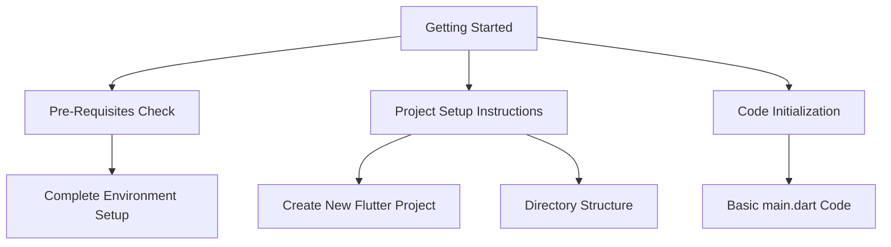

## 1.4.4 Getting Started

Embarking on your journey to build your first Flutter app is an exciting step. This section will guide you through the initial setup and provide you with the foundational knowledge to start coding. Before diving in, ensure you've completed Chapter 2, which covers setting up your development environment. This preparation is crucial for a smooth start.

### Pre-Requisites Check

Before you begin, it's essential to verify that your development environment is correctly set up. This includes having the Flutter SDK installed, an IDE configured, and emulators or physical devices ready for testing. Here's a quick checklist:

- **Flutter SDK:** Ensure that the Flutter SDK is installed and configured on your system. You should be able to run `flutter doctor` in your terminal or command prompt without any errors.
- **IDE Setup:** Have an IDE like Visual Studio Code, Android Studio, or IntelliJ IDEA installed with the Flutter and Dart plugins.
- **Device Configuration:** Set up an Android emulator or iOS simulator, or connect a physical device for testing your app.

### Project Setup Instructions

With your environment ready, let's proceed to set up your first Flutter project. Follow these steps to create the project structure and initialize the necessary files:

1. **Open Your Terminal or Command Prompt:**
   - Navigate to the directory where you want to create your Flutter project.

2. **Create a New Flutter Project:**
   - Run the following command to create a new Flutter project:
     ```bash
     flutter create my_first_flutter_app
     ```
   - This command generates a new directory named `my_first_flutter_app` with the default Flutter project structure.

3. **Navigate to the Project Directory:**
   - Change into the newly created project directory:
     ```bash
     cd my_first_flutter_app
     ```

4. **Open the Project in Your IDE:**
   - Launch your preferred IDE and open the `my_first_flutter_app` directory. This will allow you to view and edit the project files.

5. **Understand the Directory Structure:**
   - Familiarize yourself with the key directories and files:
     - `lib/`: Contains the main Dart code for your app.
     - `pubspec.yaml`: Manages the app's dependencies and metadata.
     - `android/` and `ios/`: Platform-specific configurations.

### Code Example: Initializing the main.dart File

Now that your project is set up, let's initialize the `main.dart` file. This file is the entry point of your Flutter application. We'll start with a simple example to get you acquainted with Flutter's structure.

Open the `lib/main.dart` file in your IDE and replace its contents with the following code:

```dart
import 'package:flutter/material.dart';

void main() {
  runApp(MyFirstApp());
}

class MyFirstApp extends StatelessWidget {
  @override
  Widget build(BuildContext context) {
    return MaterialApp(
      home: Scaffold(
        appBar: AppBar(
          title: Text('My First Flutter App'),
        ),
        body: Center(
          child: Text('Hello, Flutter!'),
        ),
      ),
    );
  }
}
```

#### Code Explanation:

- **`import 'package:flutter/material.dart';`**: This line imports the Flutter material package, which provides a set of visual, structural, and interactive widgets.
- **`void main() { runApp(MyFirstApp()); }`**: The `main` function is the entry point of the application. `runApp` takes a widget and makes it the root of the widget tree.
- **`MyFirstApp` Class**: This is a stateless widget that represents the app. It returns a `MaterialApp`, which is the top-level widget for a Flutter app using Material Design.
- **`Scaffold` Widget**: Provides a basic structure for the app, including an app bar and a body.
- **`AppBar` and `Text` Widgets**: Used to display a title and a message on the screen.

### Visualizing the Project Setup

To better understand the steps involved in setting up your Flutter project, refer to the following Mermaid.js diagram:



This diagram outlines the logical flow from ensuring your environment is ready, through setting up the project, to initializing the code.

### Practical Tips and Best Practices

- **Experiment with Code:** Don't hesitate to modify the example code. Change the text, colors, or layout to see how Flutter responds.
- **Use Hot Reload:** Take advantage of Flutter's hot reload feature to see changes instantly without restarting the app.
- **Explore Widgets:** Familiarize yourself with different widgets available in Flutter. The `MaterialApp`, `Scaffold`, `AppBar`, and `Text` widgets are just the beginning.
- **Read Documentation:** Flutter's official documentation is a valuable resource. Refer to it for detailed explanations of widgets and features.

### Common Pitfalls and Challenges

- **Environment Issues:** Ensure all tools and SDKs are correctly installed. Use `flutter doctor` to diagnose common setup issues.
- **Understanding Widgets:** Initially, the concept of widgets might be overwhelming. Start with simple examples and gradually explore more complex widgets.
- **Debugging:** Use the debugging tools in your IDE to troubleshoot issues. Flutter's error messages are usually informative and can guide you to the solution.

### Further Learning and Resources

- **Official Flutter Documentation:** [Flutter.dev](https://flutter.dev/docs) provides comprehensive guides and API references.
- **Online Courses:** Platforms like Udemy and Coursera offer courses on Flutter development.
- **Community Forums:** Engage with the Flutter community on platforms like Stack Overflow and Reddit for support and inspiration.

### Conclusion

Congratulations on setting up your first Flutter project! This foundational step is crucial as you embark on your journey to become a proficient Flutter developer. Remember, practice is key. Experiment with the code, explore new widgets, and don't hesitate to seek help from the community. As you progress, you'll find that Flutter offers a powerful and flexible framework for building beautiful, high-performance apps.

## Quiz Time!



### What is the first step in setting up a new Flutter project?

- [x] Ensure the development environment is set up correctly.
- [ ] Write the main.dart file.
- [ ] Open the IDE.
- [ ] Create a new directory.

> **Explanation:** Before starting a new Flutter project, it's crucial to ensure that the development environment is correctly set up, including the Flutter SDK and IDE configuration.

### Which command is used to create a new Flutter project?

- [x] `flutter create my_first_flutter_app`
- [ ] `flutter init my_first_flutter_app`
- [ ] `flutter new my_first_flutter_app`
- [ ] `flutter start my_first_flutter_app`

> **Explanation:** The `flutter create` command is used to generate a new Flutter project with the specified name.

### What is the purpose of the `main.dart` file in a Flutter project?

- [x] It serves as the entry point of the application.
- [ ] It contains the app's configuration settings.
- [ ] It manages the app's dependencies.
- [ ] It stores the app's assets.

> **Explanation:** The `main.dart` file is the entry point of a Flutter application, where the `main` function is defined to run the app.

### Which widget provides the basic structure for a Flutter app?

- [x] Scaffold
- [ ] Container
- [ ] Column
- [ ] Row

> **Explanation:** The `Scaffold` widget provides a basic structure for a Flutter app, including an app bar, body, and other elements.

### What is the role of the `runApp` function?

- [x] It makes the specified widget the root of the widget tree.
- [ ] It initializes the Flutter SDK.
- [ ] It compiles the Dart code.
- [ ] It manages app state.

> **Explanation:** The `runApp` function takes a widget and makes it the root of the widget tree, starting the Flutter application.

### What tool can you use to diagnose common setup issues in Flutter?

- [x] `flutter doctor`
- [ ] `flutter check`
- [ ] `flutter setup`
- [ ] `flutter verify`

> **Explanation:** The `flutter doctor` command is used to diagnose common setup issues and ensure that the development environment is correctly configured.

### Which widget is used to display a title in the app bar?

- [x] Text
- [ ] Icon
- [ ] Image
- [ ] Button

> **Explanation:** The `Text` widget is used to display a title or any text content in the app bar or other parts of the UI.

### What is the benefit of using hot reload in Flutter?

- [x] It allows you to see changes instantly without restarting the app.
- [ ] It compiles the app faster.
- [ ] It reduces the app size.
- [ ] It improves app security.

> **Explanation:** Hot reload allows developers to see changes instantly without restarting the app, making the development process more efficient.

### What should you do if you encounter an error message in Flutter?

- [x] Use the debugging tools in your IDE to troubleshoot.
- [ ] Ignore the error and continue coding.
- [ ] Restart your computer.
- [ ] Reinstall Flutter.

> **Explanation:** When encountering an error message, use the debugging tools in your IDE to troubleshoot and resolve the issue.

### True or False: The `MaterialApp` widget is optional in a Flutter app.

- [ ] True
- [x] False

> **Explanation:** The `MaterialApp` widget is essential for a Flutter app that uses Material Design, as it provides the necessary structure and theming.


