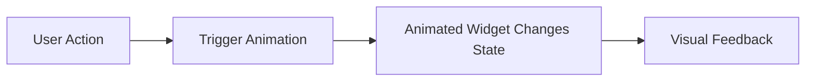

## 10.1.1 Why Use Animations?

In the realm of mobile app development, animations play a pivotal role in crafting an engaging and intuitive user experience. They are not merely decorative elements; rather, they serve as a bridge between the user and the interface, enhancing usability and interaction. This section delves into the significance of animations in Flutter applications, illustrating how they can transform static interfaces into dynamic, responsive environments that captivate users.

### Enhancing User Experience and Engagement

Animations are instrumental in creating a seamless and enjoyable user experience. They add a layer of polish and sophistication to an app, making it feel more alive and interactive. By incorporating animations, developers can:

- **Create a Sense of Flow:** Animations help in transitioning between different states or screens, providing a smooth flow that mimics real-world interactions. This continuity reduces cognitive load and makes navigation intuitive.
  
- **Add Delight and Personality:** Subtle animations can inject personality into an app, making it memorable and enjoyable. For instance, a playful bounce effect when a button is pressed can evoke a sense of delight.

- **Enhance Aesthetic Appeal:** Well-designed animations contribute to the visual appeal of an app, making it more attractive and engaging. This can lead to increased user retention and satisfaction.

### Providing Visual Feedback for User Actions

Visual feedback is crucial in informing users about the results of their actions. Animations serve as an effective medium for providing this feedback, ensuring that users are aware of the system's response to their inputs. For example:

- **Button Press Animations:** When a user taps a button, a quick animation can indicate that the action has been registered, preventing repeated taps and potential frustration.
  
- **Loading Indicators:** Animated spinners or progress bars can inform users that a process is ongoing, reducing uncertainty and impatience.

### Guiding User Attention to Important Elements

Animations can be strategically used to draw attention to specific elements within an app. This is particularly useful for onboarding new users or highlighting new features. Consider the following scenarios:

- **Highlighting New Features:** A subtle animation can guide users to explore new functionalities, ensuring they are aware of updates and enhancements.
  
- **Error Notifications:** Animations can be used to emphasize error messages, ensuring that users notice and address issues promptly.

### Making the Interface Feel More Responsive and Dynamic

A responsive interface is key to a positive user experience. Animations contribute to this by making interactions feel immediate and natural. They can:

- **Indicate State Changes:** Animations can visually represent changes in state, such as toggling a switch or expanding a menu, providing clarity and context.
  
- **Smooth Transitions:** By animating transitions between screens or components, developers can create a cohesive experience that feels fluid and responsive.

### Examples of Effective Use of Animations in Well-Known Apps

Many popular apps leverage animations to enhance user experience. Here are a few examples:

- **Instagram:** The app uses animations to transition between different views, such as switching from the feed to the camera. This creates a seamless experience that feels intuitive and engaging.

- **Google Maps:** Animations are used to smoothly transition between different map views and provide feedback when interacting with map elements, such as pins or routes.

- **Apple's iOS:** The operating system itself is rich with animations, from the subtle bounce of icons to the fluid transitions between apps, all contributing to a cohesive and polished user experience.

### Practical Code Example

Let's explore a simple animation example using Flutter's `AnimatedOpacity` widget. This example demonstrates how to create a fade-in effect for a text widget.

```dart
// Simple animation example using AnimatedOpacity
class FadeInDemo extends StatefulWidget {
  @override
  _FadeInDemoState createState() => _FadeInDemoState();
}

class _FadeInDemoState extends State<FadeInDemo> {
  double _opacity = 0.0;

  void _fadeIn() {
    setState(() {
      _opacity = 1.0;
    });
  }

  @override
  Widget build(BuildContext context) {
    return Scaffold(
      appBar: AppBar(title: Text('Fade In Demo')),
      body: Center(
        child: Column(
          mainAxisAlignment: MainAxisAlignment.center,
          children: [
            AnimatedOpacity(
              opacity: _opacity,
              duration: Duration(seconds: 2),
              child: Text(
                'Hello, Flutter!',
                style: TextStyle(fontSize: 24),
              ),
            ),
            SizedBox(height: 20),
            ElevatedButton(
              onPressed: _fadeIn,
              child: Text('Fade In'),
            ),
          ],
        ),
      ),
    );
  }
}
```

**Explanation:**

- **AnimatedOpacity Widget:** This widget is used to animate the opacity of a child widget. It provides a simple way to create fade-in and fade-out effects.
  
- **State Management:** The `_opacity` variable controls the opacity level. The `_fadeIn` method updates this variable, triggering a rebuild of the widget with the new opacity value.

- **User Interaction:** An `ElevatedButton` is used to initiate the fade-in effect, demonstrating how animations can be tied to user actions.

### Visualizing the Animation Process

To better understand the flow of animations, consider the following diagram:



**Diagram Explanation:**

- **User Action:** The process begins with a user action, such as pressing a button.
  
- **Trigger Animation:** This action triggers an animation, initiating a change in the widget's state.
  
- **Animated Widget Changes State:** The widget updates its state, altering properties like opacity, position, or size.
  
- **Visual Feedback:** The user receives visual feedback, confirming that their action has been processed.

### Best Practices for Using Animations

When implementing animations, consider the following best practices:

- **Keep It Subtle:** Avoid overwhelming users with excessive animations. Subtle effects are often more effective and less distracting.
  
- **Ensure Consistency:** Maintain consistency in animation styles and durations throughout the app to provide a cohesive experience.
  
- **Optimize Performance:** Ensure animations are smooth and do not degrade app performance. Test on various devices to confirm responsiveness.

- **Provide User Control:** Allow users to skip or disable animations if they prefer a more static experience.

### Common Pitfalls and Challenges

While animations can greatly enhance an app, they also present challenges:

- **Overuse:** Excessive animations can lead to a cluttered interface and distract from the core functionality.
  
- **Performance Issues:** Poorly optimized animations can cause lag and reduce app performance, particularly on lower-end devices.

- **Inconsistent Experience:** Inconsistent animation styles can confuse users and disrupt the user experience.

### Encouraging Experimentation and Learning

Animations offer a rich field for experimentation. As you integrate animations into your Flutter projects, consider:

- **Exploring Different Widgets:** Experiment with various animated widgets, such as `AnimatedContainer`, `AnimatedPositioned`, and `AnimatedBuilder`, to discover their capabilities.

- **Custom Animations:** Create custom animations using `AnimationController` and `Tween` for more complex effects.

- **User Feedback:** Gather user feedback to refine animations and ensure they enhance the user experience.

### Conclusion

Animations are a powerful tool in the Flutter developer's arsenal, capable of transforming static interfaces into dynamic, engaging experiences. By understanding the principles and best practices of animation, developers can create apps that not only function well but also delight and captivate users. As you continue your journey in Flutter development, embrace the creative possibilities that animations offer, and explore how they can elevate your projects to new heights.

## Quiz Time!



### What is one primary benefit of using animations in mobile apps?

- [x] Enhancing user experience and engagement
- [ ] Reducing app size
- [ ] Increasing code complexity
- [ ] Decreasing app performance

> **Explanation:** Animations enhance user experience by making interactions more engaging and intuitive.

### How can animations provide visual feedback for user actions?

- [x] By indicating that an action has been registered
- [ ] By hiding user actions
- [ ] By slowing down the app
- [ ] By removing user input

> **Explanation:** Animations can show users that their actions have been recognized, such as a button press animation.

### What is a common use of animations in guiding user attention?

- [x] Highlighting new features
- [ ] Hiding important elements
- [ ] Increasing app complexity
- [ ] Reducing user interaction

> **Explanation:** Animations can draw attention to new features or important elements, guiding user focus.

### Which widget is used in the provided code example to create a fade-in effect?

- [x] AnimatedOpacity
- [ ] AnimatedContainer
- [ ] AnimatedPositioned
- [ ] AnimatedBuilder

> **Explanation:** The `AnimatedOpacity` widget is used to animate the opacity of a child widget, creating a fade-in effect.

### What is a best practice when implementing animations in an app?

- [x] Keep animations subtle
- [ ] Use as many animations as possible
- [ ] Ignore performance considerations
- [ ] Make animations inconsistent

> **Explanation:** Subtle animations are less distracting and more effective in enhancing user experience.

### What is a potential challenge when using animations in apps?

- [x] Performance issues
- [ ] Reducing user engagement
- [ ] Simplifying code
- [ ] Decreasing app functionality

> **Explanation:** Poorly optimized animations can cause lag and reduce app performance, especially on lower-end devices.

### How can developers ensure animations do not degrade app performance?

- [x] Optimize animations and test on various devices
- [ ] Ignore performance testing
- [ ] Use complex animations everywhere
- [ ] Avoid using animations

> **Explanation:** Developers should optimize animations and test them on different devices to ensure smooth performance.

### What is a common pitfall when using animations excessively?

- [x] Overwhelming users
- [ ] Simplifying the interface
- [ ] Enhancing app functionality
- [ ] Improving app performance

> **Explanation:** Excessive animations can clutter the interface and distract from core functionality.

### Which of the following is a benefit of providing user control over animations?

- [x] Allowing users to skip or disable animations
- [ ] Forcing users to watch all animations
- [ ] Reducing app usability
- [ ] Increasing app complexity

> **Explanation:** Providing user control over animations can enhance user satisfaction by accommodating preferences.

### True or False: Animations should always be consistent in style and duration throughout an app.

- [x] True
- [ ] False

> **Explanation:** Consistent animations provide a cohesive experience and help users understand the app's behavior.


