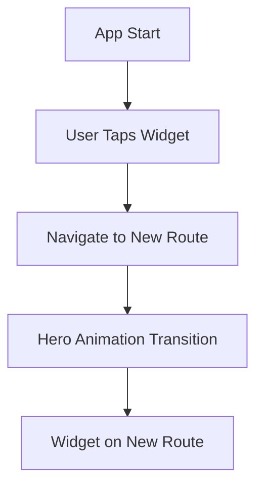

## 10.1.2 Types of Animations in Flutter

Animations are a powerful tool in Flutter that can significantly enhance the user experience by providing visual feedback, guiding user interactions, and adding a layer of polish to your applications. Flutter offers a rich set of animation capabilities, categorized primarily into implicit and explicit animations, along with specialized types like hero animations and physics-based animations. In this section, we will delve into these types, exploring when and how to use each, supported by practical examples and code snippets.

### Implicit Animations

Implicit animations in Flutter are designed to be simple and easy to use. They automatically animate changes to their properties over a given duration whenever those properties change. This makes them ideal for straightforward animations where you don't need fine-grained control over the animation process.

#### Key Characteristics of Implicit Animations

- **Ease of Use:** Implicit animations are straightforward to implement, requiring minimal code.
- **Automatic Handling:** The animation is automatically handled by the widget when its properties change.
- **Built-in Widgets:** Flutter provides several built-in widgets for implicit animations.

#### Common Implicit Animation Widgets

- **`AnimatedContainer`:** Animates changes to its properties such as color, width, height, and alignment.
- **`AnimatedOpacity`:** Fades a widget in and out by animating its opacity.
- **`AnimatedPadding`:** Animates changes to the padding of a widget.

#### Example: Using `AnimatedContainer`

```dart
class ImplicitAnimationExample extends StatefulWidget {
  @override
  _ImplicitAnimationExampleState createState() => _ImplicitAnimationExampleState();
}

class _ImplicitAnimationExampleState extends State<ImplicitAnimationExample> {
  bool _isExpanded = false;

  @override
  Widget build(BuildContext context) {
    return Scaffold(
      appBar: AppBar(title: Text('Implicit Animation')),
      body: Center(
        child: GestureDetector(
          onTap: () {
            setState(() {
              _isExpanded = !_isExpanded;
            });
          },
          child: AnimatedContainer(
            duration: Duration(seconds: 1),
            width: _isExpanded ? 200 : 100,
            height: _isExpanded ? 200 : 100,
            color: _isExpanded ? Colors.blue : Colors.red,
            alignment: _isExpanded ? Alignment.center : Alignment.topCenter,
            child: FlutterLogo(size: 75),
          ),
        ),
      ),
    );
  }
}
```

In this example, tapping the widget toggles its size, color, and alignment, all animated smoothly over one second.

### Explicit Animations

Explicit animations provide more control over the animation process, allowing you to define the animation's behavior, timing, and sequence. They are suitable for more complex animations where you need to orchestrate multiple animations or respond to user interactions dynamically.

#### Key Characteristics of Explicit Animations

- **Fine-Grained Control:** Offers detailed control over the animation's timing and behavior.
- **AnimationController:** Requires the use of an `AnimationController` to manage the animation's lifecycle.
- **Tween:** Uses `Tween` to define the range of values for the animation.

#### Example: Creating a Custom Animation

```dart
class ExplicitAnimationExample extends StatefulWidget {
  @override
  _ExplicitAnimationExampleState createState() => _ExplicitAnimationExampleState();
}

class _ExplicitAnimationExampleState extends State<ExplicitAnimationExample> with SingleTickerProviderStateMixin {
  AnimationController _controller;
  Animation<double> _animation;

  @override
  void initState() {
    super.initState();
    _controller = AnimationController(
      duration: const Duration(seconds: 2),
      vsync: this,
    )..repeat(reverse: true);

    _animation = Tween<double>(begin: 0, end: 300).animate(_controller)
      ..addListener(() {
        setState(() {});
      });
  }

  @override
  void dispose() {
    _controller.dispose();
    super.dispose();
  }

  @override
  Widget build(BuildContext context) {
    return Scaffold(
      appBar: AppBar(title: Text('Explicit Animation')),
      body: Center(
        child: Container(
          width: _animation.value,
          height: _animation.value,
          color: Colors.green,
          child: FlutterLogo(),
        ),
      ),
    );
  }
}
```

This example demonstrates an explicit animation where the size of a container oscillates between 0 and 300 pixels.

### Hero Animations

Hero animations are used for shared element transitions between routes. They create a smooth transition effect for a widget as it moves from one screen to another, maintaining the user's focus on the element.

#### Example: Implementing a Hero Animation

```dart
class HeroExample extends StatelessWidget {
  @override
  Widget build(BuildContext context) {
    return Scaffold(
      appBar: AppBar(title: Text('Hero Animation')),
      body: Center(
        child: GestureDetector(
          onTap: () {
            Navigator.push(context, MaterialPageRoute(builder: (_) => DetailPage()));
          },
          child: Hero(
            tag: 'hero-logo',
            child: FlutterLogo(size: 100),
          ),
        ),
      ),
    );
  }
}

class DetailPage extends StatelessWidget {
  @override
  Widget build(BuildContext context) {
    return Scaffold(
      appBar: AppBar(title: Text('Detail Page')),
      body: Center(
        child: Hero(
          tag: 'hero-logo',
          child: FlutterLogo(size: 200),
        ),
      ),
    );
  }
}
```

In this example, tapping the logo transitions it to a new screen, smoothly resizing it in the process.

### Physics-Based Animations

Physics-based animations simulate real-world physics, such as springs and gravity, to create more natural and intuitive animations. Flutter provides the `SpringSimulation` and `GravitySimulation` classes to achieve these effects.

#### Example: Spring Animation

```dart
class PhysicsAnimationExample extends StatefulWidget {
  @override
  _PhysicsAnimationExampleState createState() => _PhysicsAnimationExampleState();
}

class _PhysicsAnimationExampleState extends State<PhysicsAnimationExample> with SingleTickerProviderStateMixin {
  AnimationController _controller;
  Animation<double> _animation;

  @override
  void initState() {
    super.initState();
    _controller = AnimationController(
      duration: const Duration(seconds: 2),
      vsync: this,
    );

    final spring = SpringDescription(
      mass: 1,
      stiffness: 100,
      damping: 5,
    );

    _animation = _controller.drive(
      Tween<double>(begin: 0, end: 300).chain(CurveTween(curve: Curves.easeInOut)),
    );

    _controller.animateWith(SpringSimulation(spring, 0, 300, 0));
  }

  @override
  void dispose() {
    _controller.dispose();
    super.dispose();
  }

  @override
  Widget build(BuildContext context) {
    return Scaffold(
      appBar: AppBar(title: Text('Physics-Based Animation')),
      body: Center(
        child: AnimatedBuilder(
          animation: _animation,
          builder: (context, child) {
            return Container(
              width: _animation.value,
              height: _animation.value,
              color: Colors.orange,
              child: FlutterLogo(),
            );
          },
        ),
      ),
    );
  }
}
```

This example uses a spring simulation to animate the size of a container, creating a bouncy effect.

### Sequence and Chained Animations

Sequence and chained animations involve combining multiple animations either in sequence or simultaneously. This is useful for creating complex animations that involve multiple elements or stages.

#### Example: Chained Animations

```dart
class ChainedAnimationExample extends StatefulWidget {
  @override
  _ChainedAnimationExampleState createState() => _ChainedAnimationExampleState();
}

class _ChainedAnimationExampleState extends State<ChainedAnimationExample> with SingleTickerProviderStateMixin {
  AnimationController _controller;
  Animation<double> _sizeAnimation;
  Animation<Color> _colorAnimation;

  @override
  void initState() {
    super.initState();
    _controller = AnimationController(
      duration: const Duration(seconds: 3),
      vsync: this,
    );

    _sizeAnimation = Tween<double>(begin: 50, end: 200).animate(
      CurvedAnimation(parent: _controller, curve: Interval(0.0, 0.5, curve: Curves.easeIn)),
    );

    _colorAnimation = ColorTween(begin: Colors.red, end: Colors.blue).animate(
      CurvedAnimation(parent: _controller, curve: Interval(0.5, 1.0, curve: Curves.easeOut)),
    );

    _controller.forward();
  }

  @override
  void dispose() {
    _controller.dispose();
    super.dispose();
  }

  @override
  Widget build(BuildContext context) {
    return Scaffold(
      appBar: AppBar(title: Text('Chained Animation')),
      body: Center(
        child: AnimatedBuilder(
          animation: _controller,
          builder: (context, child) {
            return Container(
              width: _sizeAnimation.value,
              height: _sizeAnimation.value,
              color: _colorAnimation.value,
              child: FlutterLogo(),
            );
          },
        ),
      ),
    );
  }
}
```

In this example, the size and color of a container are animated in sequence, creating a smooth transition from one state to another.

### Best Practices for Animations in Flutter

- **Keep It Simple:** Use implicit animations for simple changes to keep your code clean and maintainable.
- **Optimize Performance:** Avoid unnecessary animations that can degrade performance, especially on lower-end devices.
- **Use Explicit Animations for Complex Scenarios:** When you need precise control over the animation, opt for explicit animations.
- **Test on Real Devices:** Always test animations on physical devices to ensure they perform well across different hardware.

### Common Pitfalls and Challenges

- **Overusing Animations:** Too many animations can overwhelm users and make the app feel sluggish.
- **Ignoring User Preferences:** Consider providing options to disable animations for users who prefer a more static interface.
- **Inconsistent Animation Speeds:** Ensure that animations are consistent in speed and style to maintain a cohesive user experience.

### Conclusion

Animations in Flutter are a versatile tool that can greatly enhance the user experience when used appropriately. By understanding the different types of animations available and their use cases, you can create engaging and intuitive applications. Whether you're using implicit animations for simple transitions or explicit animations for complex sequences, Flutter provides the tools you need to bring your app to life.

For further exploration, consider diving into the official [Flutter animations documentation](https://flutter.dev/docs/development/ui/animations) and experimenting with different animation techniques in your projects.



## Quiz Time!



### What is the primary difference between implicit and explicit animations in Flutter?

- [x] Implicit animations handle changes automatically, while explicit animations require manual control.
- [ ] Implicit animations are faster than explicit animations.
- [ ] Explicit animations are only for complex animations.
- [ ] Implicit animations cannot be customized.

> **Explanation:** Implicit animations automatically handle changes to properties, while explicit animations require the developer to control the animation process using controllers and tweens.

### Which widget is commonly used for implicit animations in Flutter?

- [x] AnimatedContainer
- [ ] AnimationController
- [ ] Tween
- [ ] Hero

> **Explanation:** `AnimatedContainer` is a widget that automatically animates changes to its properties, making it a common choice for implicit animations.

### What is the role of an AnimationController in explicit animations?

- [x] It manages the animation's lifecycle and timing.
- [ ] It defines the animation's start and end values.
- [ ] It automatically animates property changes.
- [ ] It is used only for physics-based animations.

> **Explanation:** An `AnimationController` is used in explicit animations to manage the animation's lifecycle, including its timing and state.

### What type of animation is best suited for shared element transitions between routes?

- [x] Hero Animation
- [ ] Implicit Animation
- [ ] Explicit Animation
- [ ] Physics-Based Animation

> **Explanation:** Hero animations are specifically designed for shared element transitions between routes, creating a smooth transition effect.

### Which animation type in Flutter simulates real-world physics?

- [x] Physics-Based Animation
- [ ] Implicit Animation
- [ ] Explicit Animation
- [ ] Hero Animation

> **Explanation:** Physics-based animations simulate real-world physics, such as springs and gravity, to create natural motion effects.

### What is a common use case for sequence and chained animations?

- [x] Combining multiple animations in sequence or simultaneously.
- [ ] Automatically animating property changes.
- [ ] Simulating real-world physics.
- [ ] Transitioning shared elements between routes.

> **Explanation:** Sequence and chained animations are used to combine multiple animations either in sequence or simultaneously, allowing for complex animation flows.

### Which of the following is a best practice for using animations in Flutter?

- [x] Test animations on real devices.
- [ ] Use as many animations as possible for a dynamic UI.
- [ ] Avoid using implicit animations.
- [ ] Only use animations for transitions between screens.

> **Explanation:** Testing animations on real devices ensures they perform well across different hardware, which is a best practice for Flutter development.

### What is a potential challenge when using too many animations in an app?

- [x] It can overwhelm users and degrade performance.
- [ ] It makes the app more engaging.
- [ ] It simplifies the codebase.
- [ ] It improves app performance.

> **Explanation:** Overusing animations can overwhelm users and negatively impact app performance, especially on lower-end devices.

### How can you ensure consistent animation speeds in your app?

- [x] Use consistent timing and curves across animations.
- [ ] Use only implicit animations.
- [ ] Avoid using AnimationController.
- [ ] Use different speeds for variety.

> **Explanation:** Ensuring consistent timing and curves across animations helps maintain a cohesive user experience.

### True or False: Implicit animations in Flutter require an AnimationController.

- [x] False
- [ ] True

> **Explanation:** Implicit animations do not require an `AnimationController`; they handle animations automatically when properties change.


