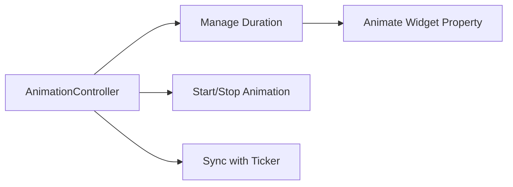

## 10.1.3 Animation Controllers

Animations are a crucial part of creating engaging and interactive user interfaces in mobile applications. They can bring your app to life, making it more dynamic and visually appealing. In Flutter, `AnimationController` is a powerful tool that provides fine-grained control over animations. This section will delve into the role of `AnimationController`, how to use it effectively, and best practices for integrating it into your Flutter projects.

### Understanding AnimationController

`AnimationController` is a special type of animation object in Flutter that controls the animation's duration, progress, and direction. It acts as the backbone of most animations in Flutter, providing the necessary control to start, stop, and reverse animations. Unlike other animation types, `AnimationController` requires a `Ticker` to function, which is why understanding the `TickerProvider` is essential.

#### Key Features of AnimationController

- **Duration Management**: You can specify how long an animation should run.
- **Control Over Animation Flow**: Start, stop, and reverse animations at will.
- **Synchronization with Ticker**: Ensures smooth frame updates.
- **Integration with Widgets**: Easily bind animations to widget properties.

### Initializing and Disposing AnimationController

To use an `AnimationController`, you need to initialize it in your widget's state. It's crucial to dispose of the `AnimationController` when it's no longer needed to free up resources and avoid memory leaks.

#### Initialization

The `AnimationController` is typically initialized in the `initState` method of a `StatefulWidget`. You must provide a `vsync` parameter, which is a `TickerProvider`. This is often achieved by using the `SingleTickerProviderStateMixin` or `TickerProviderStateMixin`.

```dart
class ScaleAnimationDemo extends StatefulWidget {
  @override
  _ScaleAnimationDemoState createState() => _ScaleAnimationDemoState();
}

class _ScaleAnimationDemoState extends State<ScaleAnimationDemo> with SingleTickerProviderStateMixin {
  late AnimationController _controller;
  late Animation<double> _animation;

  @override
  void initState() {
    super.initState();
    _controller = AnimationController(
      duration: Duration(seconds: 2),
      vsync: this, // Provides the Ticker
    );
    _animation = Tween<double>(begin: 1.0, end: 2.0).animate(_controller);
  }

  @override
  void dispose() {
    _controller.dispose();
    super.dispose();
  }

  void _startAnimation() {
    _controller.forward();
  }

  @override
  Widget build(BuildContext context) {
    return Scaffold(
      appBar: AppBar(title: Text('Scale Animation')),
      body: Center(
        child: ScaleTransition(
          scale: _animation,
          child: FlutterLogo(size: 100),
        ),
      ),
      floatingActionButton: FloatingActionButton(
        onPressed: _startAnimation,
        child: Icon(Icons.play_arrow),
      ),
    );
  }
}
```

#### Disposal

Disposing of the `AnimationController` is crucial to prevent memory leaks. This is done in the `dispose` method of the `State` class.

```dart
@override
void dispose() {
  _controller.dispose();
  super.dispose();
}
```

### Binding AnimationController to Widgets

Once you have an `AnimationController`, you can bind it to widget properties to animate them. This is often done using `Tween` objects, which define the start and end values for the animation. The `animate` method of the `Tween` is used to create an `Animation` object that can be applied to widget properties.

### Controlling the Flow of Animations

`AnimationController` provides several methods to control the animation's flow:

- **`forward()`**: Starts the animation from the beginning to the end.
- **`reverse()`**: Reverses the animation from the end to the beginning.
- **`stop()`**: Stops the animation at its current value.
- **`repeat()`**: Repeats the animation indefinitely or for a specified number of times.

These methods allow you to create complex animations that respond to user interactions or other events in your app.

### Using TickerProviderStateMixin for Ticker Synchronization

The `TickerProviderStateMixin` is used to provide a `Ticker` for the `AnimationController`. A `Ticker` is an object that calls a callback at a fixed interval, typically every frame. This ensures that the animation is updated smoothly and consistently.

#### Example with TickerProviderStateMixin

```dart
class MyAnimatedWidget extends StatefulWidget {
  @override
  _MyAnimatedWidgetState createState() => _MyAnimatedWidgetState();
}

class _MyAnimatedWidgetState extends State<MyAnimatedWidget> with TickerProviderStateMixin {
  late AnimationController _controller;

  @override
  void initState() {
    super.initState();
    _controller = AnimationController(
      duration: const Duration(seconds: 2),
      vsync: this,
    );
  }

  @override
  void dispose() {
    _controller.dispose();
    super.dispose();
  }

  @override
  Widget build(BuildContext context) {
    return Container(); // Your animated widget here
  }
}
```

### Practical Example: Scale Animation

Let's revisit the `ScaleAnimationDemo` example to see how `AnimationController` can be used in a practical scenario. This example demonstrates a simple scale animation using a `FlutterLogo`.

```dart
class ScaleAnimationDemo extends StatefulWidget {
  @override
  _ScaleAnimationDemoState createState() => _ScaleAnimationDemoState();
}

class _ScaleAnimationDemoState extends State<ScaleAnimationDemo> with SingleTickerProviderStateMixin {
  late AnimationController _controller;
  late Animation<double> _animation;

  @override
  void initState() {
    super.initState();
    _controller = AnimationController(
      duration: Duration(seconds: 2),
      vsync: this,
    );
    _animation = Tween<double>(begin: 1.0, end: 2.0).animate(_controller);
  }

  @override
  void dispose() {
    _controller.dispose();
    super.dispose();
  }

  void _startAnimation() {
    _controller.forward();
  }

  @override
  Widget build(BuildContext context) {
    return Scaffold(
      appBar: AppBar(title: Text('Scale Animation')),
      body: Center(
        child: ScaleTransition(
          scale: _animation,
          child: FlutterLogo(size: 100),
        ),
      ),
      floatingActionButton: FloatingActionButton(
        onPressed: _startAnimation,
        child: Icon(Icons.play_arrow),
      ),
    );
  }
}
```

### Visualizing AnimationController with Mermaid.js

To better understand the flow and control of `AnimationController`, let's visualize it using a Mermaid.js diagram.



### Best Practices and Common Pitfalls

- **Always Dispose Controllers**: Ensure that you dispose of your `AnimationController` in the `dispose` method to prevent memory leaks.
- **Use TickerProviderStateMixin**: Always use `TickerProviderStateMixin` or `SingleTickerProviderStateMixin` to provide a `vsync` for your `AnimationController`.
- **Avoid Long Animations**: Long-running animations can affect performance. Keep animations short and responsive.
- **Test on Real Devices**: Always test animations on real devices to ensure they perform as expected.

### Further Exploration

For those interested in diving deeper into Flutter animations, consider exploring the following resources:

- [Flutter Animation Documentation](https://flutter.dev/docs/development/ui/animations)
- [Flutter Cookbook: Animations](https://flutter.dev/docs/cookbook/animation)
- [Flutter Animation Codelab](https://codelabs.developers.google.com/codelabs/flutter-animations)

These resources provide additional examples and insights into creating complex animations in Flutter.

### Conclusion

`AnimationController` is a versatile and powerful tool in Flutter that allows developers to create dynamic and engaging animations. By understanding how to initialize, control, and dispose of `AnimationController`, you can enhance your app's user experience significantly. Remember to follow best practices and test your animations thoroughly to ensure they perform well across different devices.

## Quiz Time!



### What is the primary role of an AnimationController in Flutter?

- [x] To manage the duration, progress, and direction of animations.
- [ ] To handle user input events.
- [ ] To render widgets on the screen.
- [ ] To manage network requests.

> **Explanation:** An `AnimationController` is used to manage the duration, progress, and direction of animations in Flutter.

### Which method is used to start an animation using AnimationController?

- [x] `forward()`
- [ ] `start()`
- [ ] `begin()`
- [ ] `animate()`

> **Explanation:** The `forward()` method is used to start an animation from the beginning to the end.

### What mixin is commonly used with AnimationController to provide a Ticker?

- [x] `SingleTickerProviderStateMixin`
- [ ] `MultiTickerProviderStateMixin`
- [ ] `TickerProvider`
- [ ] `AnimationProvider`

> **Explanation:** `SingleTickerProviderStateMixin` is commonly used to provide a `Ticker` for an `AnimationController`.

### Why is it important to dispose of an AnimationController?

- [x] To prevent memory leaks.
- [ ] To stop the animation.
- [ ] To reset the animation.
- [ ] To save battery life.

> **Explanation:** Disposing of an `AnimationController` is important to free up resources and prevent memory leaks.

### Which method is used to reverse an animation using AnimationController?

- [x] `reverse()`
- [ ] `backward()`
- [ ] `rewind()`
- [ ] `reset()`

> **Explanation:** The `reverse()` method is used to reverse an animation from the end to the beginning.

### What parameter is required when initializing an AnimationController?

- [x] `vsync`
- [ ] `duration`
- [ ] `curve`
- [ ] `repeat`

> **Explanation:** The `vsync` parameter is required to synchronize the animation with the screen refresh rate.

### How can you repeat an animation indefinitely using AnimationController?

- [x] Use the `repeat()` method.
- [ ] Use the `loop()` method.
- [ ] Use the `cycle()` method.
- [ ] Use the `restart()` method.

> **Explanation:** The `repeat()` method is used to repeat an animation indefinitely.

### What is the purpose of the Ticker in Flutter animations?

- [x] To call a callback at a fixed interval for smooth animations.
- [ ] To handle user input events.
- [ ] To manage network requests.
- [ ] To render widgets on the screen.

> **Explanation:** A `Ticker` calls a callback at a fixed interval, typically every frame, to ensure smooth animations.

### Which method is used to stop an animation at its current value?

- [x] `stop()`
- [ ] `pause()`
- [ ] `halt()`
- [ ] `end()`

> **Explanation:** The `stop()` method is used to stop an animation at its current value.

### True or False: AnimationController can be used without a TickerProvider.

- [ ] True
- [x] False

> **Explanation:** False. An `AnimationController` requires a `TickerProvider` to function properly.


