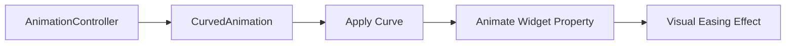

## 10.1.4 CurvedAnimation

In the realm of mobile app development, animations play a crucial role in enhancing user experience by making interactions more intuitive and engaging. Flutter, with its rich set of animation tools, allows developers to create smooth and dynamic animations. One of the key components in Flutter's animation toolkit is the `CurvedAnimation`, which applies easing curves to animations, making them more natural and visually appealing. In this section, we will delve into the concept of `CurvedAnimation`, explore different types of curves available in Flutter, and demonstrate how to apply them to animations for unique effects.

### Understanding CurvedAnimation

`CurvedAnimation` is a class in Flutter that modifies the progression of an animation over time by applying a non-linear curve. This curve defines how the animation's value changes as it progresses from start to finish. By default, animations in Flutter progress linearly, meaning the change in value is constant over time. However, linear animations can sometimes feel mechanical or unnatural. By applying a curve, you can create animations that accelerate, decelerate, bounce, or exhibit other dynamic behaviors, enhancing the overall user experience.

#### Purpose of CurvedAnimation

The primary purpose of `CurvedAnimation` is to provide a more realistic and visually appealing animation by altering the rate of change of the animation's value. This is achieved by mapping the linear progression of an animation to a curve, which can represent various easing functions such as ease-in, ease-out, bounce, and more. These curves can simulate physical behaviors, such as gravity or elasticity, making animations feel more lifelike.

### Commonly Used Curves in Flutter

Flutter provides a variety of predefined curves that can be used with `CurvedAnimation`. Each curve has a distinct effect on the animation's progression, allowing developers to choose the most suitable one for their specific use case. Here are some commonly used curves:

- **`Curves.linear`**: Represents a linear progression with no acceleration or deceleration. This is the default behavior of animations.
- **`Curves.easeIn`**: Starts slowly and accelerates towards the end. Useful for animations that need to build momentum.
- **`Curves.easeOut`**: Begins quickly and decelerates towards the end. Ideal for animations that need to come to a smooth stop.
- **`Curves.easeInOut`**: Combines ease-in and ease-out, starting and ending slowly with a faster middle section. This is a versatile curve for many animations.
- **`Curves.bounceOut`**: Ends with a bounce effect, simulating a bouncing ball. Great for playful or attention-grabbing animations.
- **`Curves.elasticIn`**: Starts with an elastic effect, overshooting the target before settling. Useful for dramatic entrances.
- **`Curves.fastOutSlowIn`**: A commonly used curve that starts quickly and slows down towards the end, providing a smooth and natural feel.

### Combining AnimationController with CurvedAnimation

To apply a `CurvedAnimation`, you need to combine it with an `AnimationController`. The `AnimationController` manages the animation's duration and progression, while the `CurvedAnimation` modifies its rate of change. Here's a step-by-step guide on how to implement a `CurvedAnimation` in Flutter:

1. **Create an AnimationController**: This controller will manage the animation's duration and state.
2. **Define a CurvedAnimation**: Use the `CurvedAnimation` class to apply a curve to the animation.
3. **Use the CurvedAnimation**: Apply the curved animation to a widget property, such as opacity or position, to see the effect.

Let's look at a practical example:

```dart
class CurvedAnimationDemo extends StatefulWidget {
  @override
  _CurvedAnimationDemoState createState() => _CurvedAnimationDemoState();
}

class _CurvedAnimationDemoState extends State<CurvedAnimationDemo> with SingleTickerProviderStateMixin {
  late AnimationController _controller;
  late Animation<double> _animation;

  @override
  void initState() {
    super.initState();
    _controller = AnimationController(
      duration: Duration(seconds: 2),
      vsync: this,
    );
    _animation = CurvedAnimation(parent: _controller, curve: Curves.easeInOut);
  }

  @override
  void dispose() {
    _controller.dispose();
    super.dispose();
  }

  void _startAnimation() {
    _controller.forward();
  }

  @override
  Widget build(BuildContext context) {
    return Scaffold(
      appBar: AppBar(title: Text('Curved Animation')),
      body: Center(
        child: FadeTransition(
          opacity: _animation,
          child: FlutterLogo(size: 100),
        ),
      ),
      floatingActionButton: FloatingActionButton(
        onPressed: _startAnimation,
        child: Icon(Icons.play_arrow),
      ),
    );
  }
}
```

In this example, we create a simple animation that fades in a `FlutterLogo` widget. The `CurvedAnimation` is applied to the opacity property, using the `Curves.easeInOut` curve to create a smooth fade-in effect.

### Customizing Animation Curves for Unique Effects

While Flutter provides a wide range of predefined curves, you may encounter scenarios where you need a custom curve to achieve a specific animation effect. Flutter allows you to define custom curves by extending the `Curve` class and overriding the `transform` method. This method takes a linear value (from 0.0 to 1.0) and maps it to a new value based on your custom logic.

Here's an example of a custom curve that creates a unique wave effect:

```dart
class WaveCurve extends Curve {
  @override
  double transform(double t) {
    return Math.sin(t * Math.pi * 2);
  }
}
```

You can then use this custom curve with `CurvedAnimation`:

```dart
_animation = CurvedAnimation(parent: _controller, curve: WaveCurve());
```

### Impact of Different Curves on Animation Behavior

The choice of curve can significantly impact the behavior and perception of an animation. For instance, using `Curves.bounceOut` can make an animation feel playful and energetic, while `Curves.easeInOut` provides a more subtle and smooth transition. Understanding the characteristics of each curve allows you to select the most appropriate one for your animation's context and desired effect.

#### Practical Example: Button Press Animation

Consider a button that scales up slightly when pressed and returns to its original size when released. Using `CurvedAnimation`, you can create a more engaging interaction:

```dart
class ScaleButton extends StatefulWidget {
  @override
  _ScaleButtonState createState() => _ScaleButtonState();
}

class _ScaleButtonState extends State<ScaleButton> with SingleTickerProviderStateMixin {
  late AnimationController _controller;
  late Animation<double> _animation;

  @override
  void initState() {
    super.initState();
    _controller = AnimationController(
      duration: Duration(milliseconds: 200),
      vsync: this,
    );
    _animation = CurvedAnimation(parent: _controller, curve: Curves.elasticInOut);
  }

  @override
  void dispose() {
    _controller.dispose();
    super.dispose();
  }

  void _onTapDown(TapDownDetails details) {
    _controller.forward();
  }

  void _onTapUp(TapUpDetails details) {
    _controller.reverse();
  }

  @override
  Widget build(BuildContext context) {
    return GestureDetector(
      onTapDown: _onTapDown,
      onTapUp: _onTapUp,
      child: ScaleTransition(
        scale: _animation,
        child: Container(
          width: 100,
          height: 50,
          color: Colors.blue,
          alignment: Alignment.center,
          child: Text('Press Me', style: TextStyle(color: Colors.white)),
        ),
      ),
    );
  }
}
```

In this example, the button scales up with an elastic effect when pressed, creating a satisfying interaction for the user.

### Visualizing CurvedAnimation with Mermaid.js

To better understand the flow of `CurvedAnimation`, let's visualize it using a Mermaid.js diagram:



This diagram illustrates how the `AnimationController` is combined with `CurvedAnimation` to apply a curve, which then animates a widget property, resulting in a visual easing effect.

### Best Practices and Common Pitfalls

- **Choose the Right Curve**: Select a curve that aligns with the intended user experience. Overusing dramatic curves like `bounceOut` can make the UI feel inconsistent.
- **Test on Multiple Devices**: Animations may behave differently on devices with varying performance capabilities. Ensure your animations are smooth across all target devices.
- **Avoid Overcomplicating**: While custom curves can create unique effects, they can also complicate the animation logic. Use them judiciously and test thoroughly.
- **Consider Accessibility**: Ensure that animations do not hinder accessibility. Provide options to reduce motion for users who may be sensitive to animations.

### Further Exploration

To deepen your understanding of animations in Flutter, consider exploring the following resources:

- [Flutter Animation Documentation](https://flutter.dev/docs/development/ui/animations)
- [Flutter Cookbook: Animations](https://flutter.dev/docs/cookbook/animation)
- [Advanced Flutter Animations Course](https://www.udemy.com/course/advanced-flutter-animations)

These resources provide additional insights and examples to help you master animations in Flutter.

### Conclusion

`CurvedAnimation` is a powerful tool in Flutter's animation arsenal, enabling developers to create more engaging and lifelike animations. By understanding and applying different curves, you can enhance the user experience and bring your app's UI to life. Experiment with various curves and customizations to discover the full potential of animations in your Flutter projects.

## Quiz Time!



### What is the primary purpose of `CurvedAnimation` in Flutter?

- [x] To apply non-linear curves to animations for more natural effects.
- [ ] To increase the speed of animations.
- [ ] To simplify animation code.
- [ ] To create static UI elements.

> **Explanation:** `CurvedAnimation` is used to apply non-linear curves to animations, making them more natural and visually appealing.

### Which curve starts slowly and accelerates towards the end?

- [x] Curves.easeIn
- [ ] Curves.easeOut
- [ ] Curves.linear
- [ ] Curves.bounceOut

> **Explanation:** `Curves.easeIn` starts slowly and accelerates towards the end, making it ideal for animations that need to build momentum.

### How do you create a custom curve in Flutter?

- [x] By extending the `Curve` class and overriding the `transform` method.
- [ ] By modifying the `AnimationController` directly.
- [ ] By using the `Curves.custom` property.
- [ ] By applying multiple predefined curves together.

> **Explanation:** To create a custom curve, you extend the `Curve` class and override the `transform` method to define the custom behavior.

### What is the effect of using `Curves.bounceOut`?

- [x] It creates a bounce effect at the end of the animation.
- [ ] It makes the animation loop indefinitely.
- [ ] It reverses the animation direction.
- [ ] It slows down the animation at the start.

> **Explanation:** `Curves.bounceOut` creates a bounce effect at the end of the animation, simulating a bouncing ball.

### Which of the following is a commonly used curve for smooth transitions?

- [x] Curves.easeInOut
- [ ] Curves.elasticIn
- [ ] Curves.fastOutSlowIn
- [ ] Curves.bounceIn

> **Explanation:** `Curves.easeInOut` is commonly used for smooth transitions, as it starts and ends slowly with a faster middle section.

### What is the role of `AnimationController` in animations?

- [x] It manages the animation's duration and state.
- [ ] It applies curves to animations.
- [ ] It renders the final animation on the screen.
- [ ] It handles user input during animations.

> **Explanation:** `AnimationController` manages the animation's duration and state, controlling how the animation progresses over time.

### How can you apply a `CurvedAnimation` to a widget property?

- [x] By using it with an `AnimationController` and applying it to the widget's property.
- [ ] By directly assigning it to the widget.
- [ ] By using a special widget called `CurveWidget`.
- [ ] By modifying the widget's build method.

> **Explanation:** You apply a `CurvedAnimation` by combining it with an `AnimationController` and using it to animate a widget's property.

### What should you consider when using animations in your app?

- [x] Accessibility and user preferences for reduced motion.
- [ ] Only the visual appeal of the animation.
- [ ] The complexity of the animation code.
- [ ] The number of animations on the screen.

> **Explanation:** Consider accessibility and user preferences for reduced motion to ensure animations do not hinder the user experience.

### Which curve would you use for a dramatic entrance effect?

- [x] Curves.elasticIn
- [ ] Curves.linear
- [ ] Curves.easeOut
- [ ] Curves.bounceOut

> **Explanation:** `Curves.elasticIn` is suitable for a dramatic entrance effect, as it starts with an elastic overshoot before settling.

### True or False: `CurvedAnimation` can only be used with predefined curves in Flutter.

- [ ] True
- [x] False

> **Explanation:** False. `CurvedAnimation` can be used with both predefined and custom curves in Flutter.


