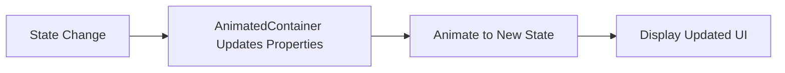

## 10.2.1 AnimatedContainer

In the realm of mobile app development, creating visually appealing and interactive user interfaces is paramount. Flutter, with its rich set of widgets, offers developers the tools to craft such experiences effortlessly. One of the standout features in Flutter's animation toolkit is the `AnimatedContainer`. This widget allows developers to animate changes to its properties implicitly, providing smooth transitions between different UI states without the need for manual animation controllers. In this section, we will delve into the intricacies of `AnimatedContainer`, exploring its properties, use cases, and best practices.

### What is `AnimatedContainer`?

`AnimatedContainer` is a powerful widget in Flutter that automatically animates changes to its properties over a specified duration. Unlike traditional animations that require explicit controllers and listeners, `AnimatedContainer` simplifies the process by handling the animation internally. This makes it an excellent choice for developers who want to add animations to their apps without delving into the complexities of animation management.

#### Benefits of Using `AnimatedContainer`

- **Ease of Use**: `AnimatedContainer` abstracts the complexity of animations, allowing developers to focus on the UI logic rather than the animation mechanics.
- **Smooth Transitions**: By interpolating between the old and new values of its properties, `AnimatedContainer` ensures seamless transitions.
- **Flexibility**: It supports a wide range of properties that can be animated, making it versatile for various UI scenarios.
- **Performance**: Designed to be efficient, `AnimatedContainer` leverages Flutter's rendering engine to deliver high-performance animations.

### Key Properties of `AnimatedContainer`

The `AnimatedContainer` widget can animate several properties, enabling developers to create dynamic and responsive UIs. Here are some of the key properties that can be animated:

- **Width and Height**: Adjust the size of the container dynamically.
- **Color**: Change the background color smoothly.
- **Padding**: Animate the padding to create spacing effects.
- **Margin**: Similar to padding, but affects the space outside the container.
- **Alignment**: Transition the alignment of child widgets within the container.
- **Decoration**: Animate changes to the decoration, such as border radius or box shadows.

### Triggering Animations with State Changes

To animate a property using `AnimatedContainer`, you need to update its state. This is typically done using Flutter's `setState` method, which triggers a rebuild of the widget with the new property values. The `AnimatedContainer` then interpolates between the old and new values over the specified duration.

#### Example Code

Let's explore a practical example to understand how `AnimatedContainer` works. We'll create a simple app that toggles the size, color, and alignment of a container when a button is pressed.

```dart
import 'package:flutter/material.dart';

class AnimatedContainerDemo extends StatefulWidget {
  @override
  _AnimatedContainerDemoState createState() => _AnimatedContainerDemoState();
}

class _AnimatedContainerDemoState extends State<AnimatedContainerDemo> {
  bool _isExpanded = false;

  void _toggleContainer() {
    setState(() {
      _isExpanded = !_isExpanded;
    });
  }

  @override
  Widget build(BuildContext context) {
    return Scaffold(
      appBar: AppBar(title: Text('AnimatedContainer')),
      body: Center(
        child: AnimatedContainer(
          width: _isExpanded ? 200.0 : 100.0,
          height: _isExpanded ? 200.0 : 100.0,
          color: _isExpanded ? Colors.blue : Colors.red,
          alignment: _isExpanded ? Alignment.center : AlignmentDirectional.topCenter,
          duration: Duration(seconds: 1),
          curve: Curves.fastOutSlowIn,
          child: Text(
            'Tap Me',
            style: TextStyle(color: Colors.white, fontSize: 18),
          ),
        ),
      ),
      floatingActionButton: FloatingActionButton(
        onPressed: _toggleContainer,
        child: Icon(Icons.swap_horiz),
      ),
    );
  }
}
```

In this example, the `AnimatedContainer` animates its width, height, color, and alignment properties based on the `_isExpanded` state. The `FloatingActionButton` toggles this state, triggering the animation.

### Performance Considerations and Best Practices

While `AnimatedContainer` is designed to be efficient, there are best practices to ensure optimal performance:

- **Limit the Number of Animated Properties**: Animating multiple properties simultaneously can be resource-intensive. Focus on animating only the necessary properties.
- **Use Appropriate Durations**: Choose a duration that feels natural for the animation. Too fast or too slow animations can disrupt the user experience.
- **Optimize for Rebuilds**: Minimize the number of rebuilds by ensuring that only the necessary parts of the widget tree are updated.

### Responsive Design and State Changes

`AnimatedContainer` can be a valuable tool in creating responsive designs. By animating changes in response to user interactions or data updates, you can enhance the user experience significantly. Consider scenarios such as expanding a card to reveal more information or changing the layout based on device orientation.

#### Real-World Scenario

Imagine a shopping app where product cards expand to show more details when tapped. Using `AnimatedContainer`, you can smoothly transition the card's size and reveal additional information, creating an engaging and interactive experience for users.

### Mermaid.js Diagram

To visualize the process of state changes and animations in `AnimatedContainer`, consider the following diagram:



This diagram illustrates the flow from a state change to the animation of properties and the final display of the updated UI.

### Conclusion

`AnimatedContainer` is a versatile and powerful widget that simplifies the process of adding animations to your Flutter apps. By understanding its properties and how to leverage them effectively, you can create dynamic and responsive user interfaces that enhance the overall user experience. As you continue to explore Flutter's animation capabilities, consider experimenting with `AnimatedContainer` in your projects to see the impact of smooth transitions firsthand.

### Further Reading and Resources

- [Flutter Official Documentation on AnimatedContainer](https://api.flutter.dev/flutter/widgets/AnimatedContainer-class.html)
- [Flutter Animation Basics](https://flutter.dev/docs/development/ui/animations)
- [Effective Flutter: Animations](https://flutter.dev/docs/perf/rendering/best-practices)

By mastering `AnimatedContainer`, you're well on your way to creating visually stunning and interactive Flutter applications. Keep experimenting and pushing the boundaries of what's possible with Flutter's animation toolkit.

## Quiz Time!



### What is the primary benefit of using `AnimatedContainer` in Flutter?

- [x] It simplifies the animation process by handling animations internally.
- [ ] It requires manual animation controllers for precise control.
- [ ] It is only used for animating text widgets.
- [ ] It can only animate color changes.

> **Explanation:** `AnimatedContainer` simplifies the animation process by automatically handling the interpolation of property changes, eliminating the need for manual animation controllers.

### Which of the following properties can be animated using `AnimatedContainer`?

- [x] Width and Height
- [x] Color
- [x] Padding
- [ ] Text Content

> **Explanation:** `AnimatedContainer` can animate properties like width, height, color, and padding, but not the text content directly.

### How do you trigger an animation in an `AnimatedContainer`?

- [x] By updating the state using `setState`.
- [ ] By using an animation controller.
- [ ] By calling a special animate method.
- [ ] By restarting the app.

> **Explanation:** Animations in `AnimatedContainer` are triggered by updating the state, typically using the `setState` method.

### What is a best practice when using `AnimatedContainer` for performance optimization?

- [x] Limit the number of animated properties.
- [ ] Animate all properties simultaneously for consistency.
- [ ] Use the longest possible duration for animations.
- [ ] Avoid using curves for animations.

> **Explanation:** Limiting the number of animated properties helps optimize performance, as animating multiple properties can be resource-intensive.

### What is the role of the `curve` property in `AnimatedContainer`?

- [x] It defines the animation's easing curve.
- [ ] It sets the color of the container.
- [ ] It determines the text alignment.
- [ ] It specifies the border radius.

> **Explanation:** The `curve` property in `AnimatedContainer` defines the easing curve for the animation, affecting how the animation progresses over time.

### Can `AnimatedContainer` be used for responsive design?

- [x] Yes, it can animate layout changes based on user interactions.
- [ ] No, it is only for static designs.
- [ ] Yes, but only for color changes.
- [ ] No, it requires manual resizing.

> **Explanation:** `AnimatedContainer` can be used for responsive design by animating layout changes in response to user interactions or data updates.

### What happens when you update a property of `AnimatedContainer`?

- [x] The container animates to the new property value.
- [ ] The app crashes.
- [ ] The container remains unchanged.
- [ ] The container resets to its initial state.

> **Explanation:** When a property of `AnimatedContainer` is updated, it animates to the new value over the specified duration.

### Which method is commonly used to update the state in a StatefulWidget?

- [x] `setState`
- [ ] `initState`
- [ ] `dispose`
- [ ] `build`

> **Explanation:** The `setState` method is used to update the state in a StatefulWidget, triggering a rebuild of the widget.

### Is it possible to animate the alignment of child widgets within an `AnimatedContainer`?

- [x] Yes, using the `alignment` property.
- [ ] No, alignment cannot be animated.
- [ ] Yes, but only with a custom animation controller.
- [ ] No, alignment is fixed.

> **Explanation:** The `alignment` property of `AnimatedContainer` can be animated, allowing for smooth transitions of child widget positions.

### True or False: `AnimatedContainer` requires manual animation controllers to function.

- [x] False
- [ ] True

> **Explanation:** False. `AnimatedContainer` does not require manual animation controllers; it handles animations internally by interpolating property changes.


