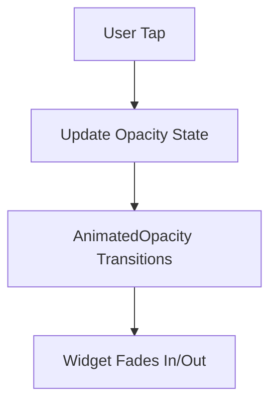

## 10.2.2 AnimatedOpacity

In the world of mobile app development, creating visually appealing and fluid user interfaces is crucial for enhancing user experience. Flutter, with its rich set of widgets, provides developers with powerful tools to achieve this. One such tool is the `AnimatedOpacity` widget, which allows developers to animate the opacity of a widget, creating smooth fade-in and fade-out effects. This article delves into the intricacies of `AnimatedOpacity`, exploring its use cases, implementation, and optimization strategies.

### Understanding `AnimatedOpacity`

`AnimatedOpacity` is a widget in Flutter that animates changes in the opacity of its child widget over a specified duration. This widget is particularly useful for creating fade transitions, which can enhance the visual fluidity of your app by providing smooth transitions between visible and invisible states.

#### Primary Use Cases

- **Fade-In Effects**: Gradually increasing the opacity of a widget to make it appear smoothly.
- **Fade-Out Effects**: Gradually decreasing the opacity to make a widget disappear.
- **Highlighting Changes**: Drawing attention to changes in the UI by fading in new elements.
- **Layered Animations**: Combining with other animations to create complex visual effects.

### Managing Opacity Transitions

The core functionality of `AnimatedOpacity` revolves around the `opacity` property. By updating this property, you can control the visibility of the widget. The transition between opacity values is handled automatically by Flutter, providing a smooth animation effect.

#### Code Example: Basic Implementation

Let's explore a simple example to understand how `AnimatedOpacity` works:

```dart
class AnimatedOpacityDemo extends StatefulWidget {
  @override
  _AnimatedOpacityDemoState createState() => _AnimatedOpacityDemoState();
}

class _AnimatedOpacityDemoState extends State<AnimatedOpacityDemo> {
  double _opacity = 0.0;

  void _toggleOpacity() {
    setState(() {
      _opacity = _opacity == 0.0 ? 1.0 : 0.0;
    });
  }

  @override
  Widget build(BuildContext context) {
    return Scaffold(
      appBar: AppBar(title: Text('AnimatedOpacity')),
      body: Center(
        child: AnimatedOpacity(
          opacity: _opacity,
          duration: Duration(seconds: 2),
          child: FlutterLogo(size: 100),
        ),
      ),
      floatingActionButton: FloatingActionButton(
        onPressed: _toggleOpacity,
        child: Icon(Icons.visibility),
      ),
    );
  }
}
```

In this example, a `FlutterLogo` widget fades in and out when the floating action button is pressed. The `opacity` property is toggled between `0.0` and `1.0`, and the transition duration is set to 2 seconds.

### Handling Visibility Changes Smoothly

`AnimatedOpacity` is ideal for scenarios where you want to change the visibility of a widget without abrupt changes. By animating the opacity, you can ensure that the transition is smooth and visually appealing.

#### Combining with Other Animated Widgets

`AnimatedOpacity` can be combined with other animated widgets to create more complex effects. For example, you can use it alongside `AnimatedContainer` to animate both the size and opacity of a widget simultaneously, creating a more dynamic visual effect.

### Performance Implications and Optimization Tips

While `AnimatedOpacity` is a powerful tool, it's important to consider performance implications, especially when dealing with complex UIs or multiple animations.

- **Avoid Overlapping Animations**: Too many overlapping animations can lead to performance issues. Ensure that animations are well-timed and do not overlap unnecessarily.
- **Optimize Widget Tree**: Keep the widget tree as simple as possible. Avoid nesting too many widgets within `AnimatedOpacity`.
- **Use `setState` Wisely**: Minimize the use of `setState` to only update the necessary parts of the UI. This reduces unnecessary rebuilds and improves performance.

### Practical Example: Fading a List of Widgets

Consider a scenario where you have a list of items, and you want each item to fade in sequentially. This can be achieved by using `AnimatedOpacity` in conjunction with a delay mechanism.

```dart
class FadeInListDemo extends StatefulWidget {
  @override
  _FadeInListDemoState createState() => _FadeInListDemoState();
}

class _FadeInListDemoState extends State<FadeInListDemo> {
  List<double> _opacities = [0.0, 0.0, 0.0];

  @override
  void initState() {
    super.initState();
    _fadeInItems();
  }

  void _fadeInItems() async {
    for (int i = 0; i < _opacities.length; i++) {
      await Future.delayed(Duration(milliseconds: 500));
      setState(() {
        _opacities[i] = 1.0;
      });
    }
  }

  @override
  Widget build(BuildContext context) {
    return Scaffold(
      appBar: AppBar(title: Text('Fade In List')),
      body: ListView.builder(
        itemCount: _opacities.length,
        itemBuilder: (context, index) {
          return AnimatedOpacity(
            opacity: _opacities[index],
            duration: Duration(seconds: 1),
            child: ListTile(
              title: Text('Item ${index + 1}'),
            ),
          );
        },
      ),
    );
  }
}
```

In this example, each list item fades in one after the other, creating a cascading effect. The `Future.delayed` function is used to introduce a delay between each item's fade-in animation.

### Visualizing the Animation Flow

To better understand the flow of an `AnimatedOpacity` transition, consider the following Mermaid.js diagram:



This diagram illustrates the process from user interaction to the visual transition, highlighting the role of state updates in triggering animations.

### Best Practices and Common Pitfalls

- **Consistency**: Ensure that the duration and timing of animations are consistent across your app to maintain a cohesive user experience.
- **Avoid Jarring Transitions**: Sudden changes in opacity can be jarring. Use `AnimatedOpacity` to ensure smooth transitions.
- **Test on Multiple Devices**: Performance can vary across devices. Test your animations on different hardware to ensure smooth performance.

### Further Exploration

For those interested in diving deeper into animations in Flutter, consider exploring the following resources:

- [Flutter Official Documentation on Animations](https://flutter.dev/docs/development/ui/animations)
- [Flutter Animation Samples](https://github.com/flutter/samples/tree/main/animations)
- Online courses on platforms like Udemy or Coursera that focus on Flutter animations.

By mastering `AnimatedOpacity` and other animation techniques, you can create engaging and visually appealing apps that captivate users and enhance their experience.

## Quiz Time!



### What is the primary use of the `AnimatedOpacity` widget in Flutter?

- [x] To animate the opacity of a widget, creating fade-in and fade-out effects.
- [ ] To animate the position of a widget.
- [ ] To animate the color of a widget.
- [ ] To animate the size of a widget.

> **Explanation:** `AnimatedOpacity` is specifically designed to animate changes in the opacity of a widget, allowing for smooth fade transitions.

### How do you trigger an opacity change in `AnimatedOpacity`?

- [x] By updating the `opacity` property within a `setState` call.
- [ ] By directly modifying the widget tree.
- [ ] By using a separate animation controller.
- [ ] By changing the widget's color.

> **Explanation:** The `opacity` property is updated within a `setState` call to trigger the animation.

### What is a potential performance consideration when using `AnimatedOpacity`?

- [x] Avoiding too many overlapping animations to prevent performance issues.
- [ ] Ensuring the widget tree is as complex as possible.
- [ ] Using `setState` frequently without concern.
- [ ] Ignoring the duration of the animation.

> **Explanation:** Overlapping animations can lead to performance issues, so it's important to manage them carefully.

### Which method is used to introduce a delay between animations in a list?

- [x] `Future.delayed`
- [ ] `Timer.periodic`
- [ ] `AnimationController`
- [ ] `Stream.periodic`

> **Explanation:** `Future.delayed` is used to introduce a delay between animations, allowing for sequential animations.

### Can `AnimatedOpacity` be combined with other animated widgets?

- [x] Yes, it can be combined to create complex effects.
- [ ] No, it must be used alone.
- [ ] Only with `AnimatedContainer`.
- [ ] Only with `AnimatedPositioned`.

> **Explanation:** `AnimatedOpacity` can be combined with other animated widgets to create more complex visual effects.

### What is the role of the `duration` property in `AnimatedOpacity`?

- [x] It specifies the length of time the opacity transition should take.
- [ ] It determines the size of the widget.
- [ ] It sets the color of the widget.
- [ ] It controls the position of the widget.

> **Explanation:** The `duration` property defines how long the opacity transition should last.

### What happens if you set the `opacity` property to 0.0 in `AnimatedOpacity`?

- [x] The widget becomes fully transparent.
- [ ] The widget becomes fully opaque.
- [ ] The widget changes color.
- [ ] The widget moves to a new position.

> **Explanation:** Setting the `opacity` to 0.0 makes the widget fully transparent, effectively hiding it.

### What is the effect of setting a very short duration in `AnimatedOpacity`?

- [x] The transition will be very quick, possibly jarring.
- [ ] The transition will be very slow.
- [ ] The widget will not change opacity.
- [ ] The widget will change size.

> **Explanation:** A very short duration results in a quick transition, which can be jarring if not used carefully.

### Is it necessary to use `setState` to update the `opacity` in `AnimatedOpacity`?

- [x] True
- [ ] False

> **Explanation:** `setState` is necessary to update the `opacity` property and trigger the animation.

### What is a common use case for `AnimatedOpacity`?

- [x] Creating smooth fade-in and fade-out effects for widgets.
- [ ] Animating the rotation of a widget.
- [ ] Changing the text of a widget.
- [ ] Adjusting the padding of a widget.

> **Explanation:** `AnimatedOpacity` is commonly used for creating smooth fade transitions in the UI.


