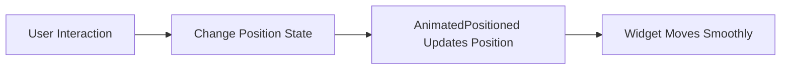

## 10.2.3 AnimatedPositioned

In the realm of mobile app development, creating engaging and dynamic user interfaces is paramount. Flutter, with its rich set of widgets, offers powerful tools to achieve this. One such tool is the `AnimatedPositioned` widget, which allows developers to animate the position of a child widget within a `Stack`. This capability is particularly useful for crafting dynamic layouts and interactive UI elements that respond to user interactions.

### Understanding AnimatedPositioned

`AnimatedPositioned` is an implicit animation widget in Flutter that animates changes to its position properties—`top`, `bottom`, `left`, and `right`. Unlike explicit animations, which require an `AnimationController`, implicit animations like `AnimatedPositioned` handle the animation details for you, making it easier to implement smooth transitions with minimal code.

#### Key Features of AnimatedPositioned

- **Ease of Use**: By simply changing the position properties, `AnimatedPositioned` automatically animates the transition, providing a seamless experience.
- **Integration with Stack**: It works within a `Stack` widget, allowing for layered positioning of widgets.
- **Customizable Animations**: You can specify the duration and curve of the animation to tailor the movement to your design needs.
- **Interactive Potential**: When combined with gesture detectors, `AnimatedPositioned` can create interactive animations that respond to user actions.

### Integrating AnimatedPositioned with Stack

The `Stack` widget in Flutter is a powerful layout tool that allows you to position widgets on top of each other. `AnimatedPositioned` leverages this by animating the position of a widget within the `Stack`. This is particularly useful for creating overlays, draggable elements, or any UI component that needs to move dynamically.

#### Example: Basic Setup

Here's a simple example to illustrate how `AnimatedPositioned` can be used within a `Stack`:

```dart
class AnimatedPositionedDemo extends StatefulWidget {
  @override
  _AnimatedPositionedDemoState createState() => _AnimatedPositionedDemoState();
}

class _AnimatedPositionedDemoState extends State<AnimatedPositionedDemo> {
  bool _isMoved = false;

  void _moveBox() {
    setState(() {
      _isMoved = !_isMoved;
    });
  }

  @override
  Widget build(BuildContext context) {
    return Scaffold(
      appBar: AppBar(title: Text('AnimatedPositioned')),
      body: Stack(
        children: [
          AnimatedPositioned(
            left: _isMoved ? 200.0 : 50.0,
            top: _isMoved ? 400.0 : 200.0,
            duration: Duration(seconds: 2),
            curve: Curves.easeInOut,
            child: GestureDetector(
              onTap: _moveBox,
              child: Container(
                width: 100,
                height: 100,
                color: Colors.green,
                child: Center(child: Text('Tap Me')),
              ),
            ),
          ),
        ],
      ),
      floatingActionButton: FloatingActionButton(
        onPressed: _moveBox,
        child: Icon(Icons.location_on),
      ),
    );
  }
}
```

In this example, tapping the green box or the floating action button toggles its position between two states, demonstrating how `AnimatedPositioned` animates the transition smoothly.

### Animating Position Properties

The core functionality of `AnimatedPositioned` revolves around animating its position properties. By changing these properties, you can move the widget to a new location within the `Stack`.

- **`top`, `bottom`, `left`, `right`**: These properties define the widget's position relative to the `Stack`. Changing any of these values triggers an animation.
- **`duration`**: Specifies how long the animation should take.
- **`curve`**: Defines the animation's easing curve, allowing for effects like ease-in, ease-out, or bounce.

#### Practical Example: Interactive Animations

To create a more interactive experience, you can combine `AnimatedPositioned` with gesture detectors. This allows the widget to respond to user actions, such as taps or swipes.

```dart
class InteractivePositionedDemo extends StatefulWidget {
  @override
  _InteractivePositionedDemoState createState() => _InteractivePositionedDemoState();
}

class _InteractivePositionedDemoState extends State<InteractivePositionedDemo> {
  double _left = 50.0;
  double _top = 200.0;

  void _onPanUpdate(DragUpdateDetails details) {
    setState(() {
      _left += details.delta.dx;
      _top += details.delta.dy;
    });
  }

  @override
  Widget build(BuildContext context) {
    return Scaffold(
      appBar: AppBar(title: Text('Interactive AnimatedPositioned')),
      body: Stack(
        children: [
          AnimatedPositioned(
            left: _left,
            top: _top,
            duration: Duration(milliseconds: 500),
            curve: Curves.easeOut,
            child: GestureDetector(
              onPanUpdate: _onPanUpdate,
              child: Container(
                width: 100,
                height: 100,
                color: Colors.blue,
                child: Center(child: Text('Drag Me')),
              ),
            ),
          ),
        ],
      ),
    );
  }
}
```

In this example, the widget can be dragged around the screen, with `AnimatedPositioned` ensuring that the movement is smooth and fluid.

### Combining AnimatedPositioned with Gesture Detectors

Gesture detectors are essential for creating interactive applications. By detecting user input, such as taps, swipes, or drags, you can trigger animations and update the UI dynamically.

#### Example: Moving Widgets in Response to User Actions

Consider a scenario where you want a widget to move to a new position when tapped. This can be achieved by combining `AnimatedPositioned` with a `GestureDetector`:

```dart
class TapMoveDemo extends StatefulWidget {
  @override
  _TapMoveDemoState createState() => _TapMoveDemoState();
}

class _TapMoveDemoState extends State<TapMoveDemo> {
  bool _isMoved = false;

  void _togglePosition() {
    setState(() {
      _isMoved = !_isMoved;
    });
  }

  @override
  Widget build(BuildContext context) {
    return Scaffold(
      appBar: AppBar(title: Text('Tap to Move')),
      body: Stack(
        children: [
          AnimatedPositioned(
            left: _isMoved ? 250.0 : 50.0,
            top: _isMoved ? 450.0 : 150.0,
            duration: Duration(seconds: 1),
            curve: Curves.fastOutSlowIn,
            child: GestureDetector(
              onTap: _togglePosition,
              child: Container(
                width: 80,
                height: 80,
                color: Colors.red,
                child: Center(child: Text('Tap')),
              ),
            ),
          ),
        ],
      ),
    );
  }
}
```

Here, tapping the red box toggles its position, demonstrating how user interactions can drive animations.

### Best Practices and Common Pitfalls

When using `AnimatedPositioned`, consider the following best practices and potential pitfalls:

- **Performance**: While `AnimatedPositioned` is efficient, animating large numbers of widgets simultaneously can impact performance. Optimize by limiting the number of animated widgets or using more performant techniques for complex animations.
- **State Management**: Ensure that the state changes triggering animations are managed correctly to avoid unexpected behavior.
- **User Experience**: Use animations judiciously to enhance the user experience without overwhelming the user. Consider the duration and curve to ensure animations feel natural.

### Real-World Applications

`AnimatedPositioned` is ideal for scenarios where you need to move elements dynamically within a layout. Some real-world applications include:

- **Interactive Tutorials**: Highlighting elements by moving them into focus.
- **Games**: Animating characters or objects in response to player actions.
- **Dynamic Dashboards**: Rearranging widgets based on user preferences or data changes.

### Visualizing the Animation Flow

To better understand the flow of an `AnimatedPositioned` animation, consider the following Mermaid.js diagram:



This diagram illustrates the process from user interaction to the smooth movement of the widget, highlighting the simplicity and power of `AnimatedPositioned`.

### Conclusion

`AnimatedPositioned` is a versatile widget that simplifies the creation of dynamic and interactive layouts in Flutter. By leveraging its capabilities, you can enhance your app's user interface, making it more engaging and responsive. Whether you're building a simple interactive element or a complex dynamic layout, `AnimatedPositioned` provides the tools you need to bring your designs to life.

### Further Reading and Resources

- [Flutter Official Documentation](https://flutter.dev/docs) - Comprehensive guide to Flutter widgets and animations.
- [Flutter Widget of the Week: AnimatedPositioned](https://www.youtube.com/watch?v=hC3s2YdtWt8) - Video tutorial on using `AnimatedPositioned`.
- [Dart and Flutter: The Complete Developer's Guide](https://www.udemy.com/course/dart-and-flutter-the-complete-developers-guide/) - Online course for mastering Flutter development.

By exploring these resources, you can deepen your understanding of Flutter animations and continue to build more sophisticated and interactive applications.

## Quiz Time!



### What is the primary use of `AnimatedPositioned` in Flutter?

- [x] To animate the position of a widget within a `Stack`.
- [ ] To animate the color of a widget.
- [ ] To animate the size of a widget.
- [ ] To animate the opacity of a widget.

> **Explanation:** `AnimatedPositioned` is specifically designed to animate the position of a widget within a `Stack`, allowing for smooth transitions between different positions.

### Which widget is `AnimatedPositioned` typically used with?

- [x] Stack
- [ ] Column
- [ ] Row
- [ ] ListView

> **Explanation:** `AnimatedPositioned` is used within a `Stack` to animate the position of its child widget.

### What properties of `AnimatedPositioned` can be animated?

- [x] top, bottom, left, right
- [ ] width, height
- [ ] color, opacity
- [ ] text, font size

> **Explanation:** `AnimatedPositioned` animates the position properties: `top`, `bottom`, `left`, and `right`.

### How can you trigger an animation in `AnimatedPositioned`?

- [x] By changing the position properties within a `setState` call.
- [ ] By using an `AnimationController`.
- [ ] By changing the widget's color.
- [ ] By resizing the widget.

> **Explanation:** Changing the position properties within a `setState` call triggers the animation in `AnimatedPositioned`.

### Which Flutter widget can be combined with `AnimatedPositioned` for interactive animations?

- [x] GestureDetector
- [ ] TextField
- [ ] Image
- [ ] Icon

> **Explanation:** `GestureDetector` can be used with `AnimatedPositioned` to create interactive animations that respond to user input.

### What is the role of the `curve` property in `AnimatedPositioned`?

- [x] It defines the animation's easing curve.
- [ ] It sets the animation's duration.
- [ ] It determines the widget's color.
- [ ] It specifies the widget's size.

> **Explanation:** The `curve` property in `AnimatedPositioned` defines the easing curve of the animation, affecting how the animation progresses over time.

### What is a potential pitfall when using `AnimatedPositioned`?

- [x] Animating too many widgets can impact performance.
- [ ] It cannot be used with a `Stack`.
- [ ] It does not support gesture detection.
- [ ] It cannot animate color changes.

> **Explanation:** Animating a large number of widgets simultaneously with `AnimatedPositioned` can impact performance, so it's important to optimize animations.

### What is the recommended duration for animations in `AnimatedPositioned`?

- [x] It depends on the context and user experience goals.
- [ ] Always 1 second.
- [ ] Always 500 milliseconds.
- [ ] Always 2 seconds.

> **Explanation:** The duration of animations in `AnimatedPositioned` should be chosen based on the context and desired user experience, ensuring animations feel natural and responsive.

### Can `AnimatedPositioned` be used to animate a widget's size?

- [ ] True
- [x] False

> **Explanation:** `AnimatedPositioned` is used to animate the position of a widget, not its size. For size animations, `AnimatedSize` would be more appropriate.

### What is a real-world application of `AnimatedPositioned`?

- [x] Creating interactive tutorials by moving elements into focus.
- [ ] Changing the color of a button.
- [ ] Displaying static text.
- [ ] Resizing images.

> **Explanation:** `AnimatedPositioned` is ideal for creating interactive tutorials where elements need to move into focus, enhancing user engagement.


