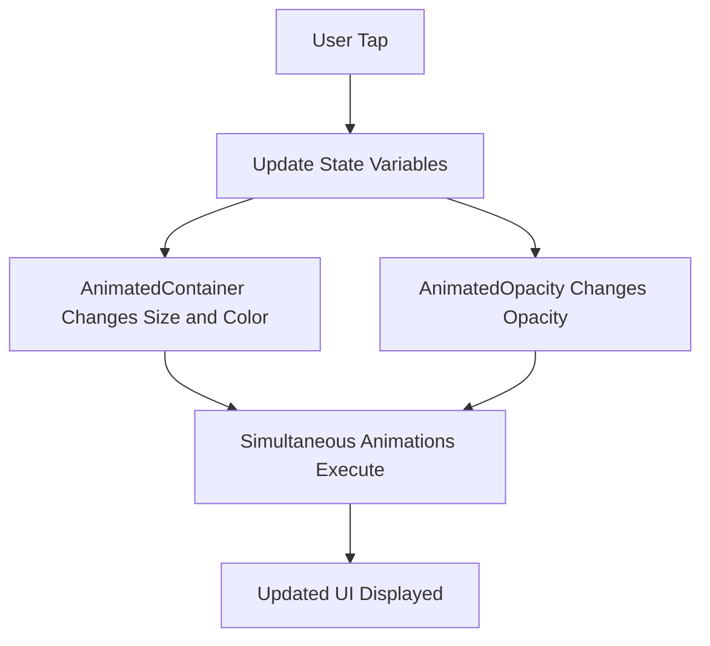

## 10.2.4 Combining Animations

In the world of mobile app development, animations play a crucial role in enhancing user experience by making interactions more intuitive and engaging. Flutter, with its rich set of animation capabilities, allows developers to create stunning visual effects with ease. In this section, we will delve into the art of combining multiple implicit animations to craft complex and visually appealing effects. We will explore strategies for coordinating different animated properties, maintaining performance, and ensuring synchronization among them.

### Understanding Implicit Animations

Before we dive into combining animations, it's essential to understand what implicit animations are. Implicit animations in Flutter are those that automatically transition between values over a specified duration. They are easy to use and require minimal setup, making them ideal for simple animations. Common implicit animation widgets include `AnimatedContainer`, `AnimatedOpacity`, `AnimatedPositioned`, and others.

### Strategies for Combining Multiple Animated Widgets

Combining animations involves orchestrating multiple animated widgets to work in harmony. Here are some strategies to achieve this:

- **Unified State Management:** Use a single state variable to control multiple animations. This ensures that all animations are triggered simultaneously, providing a cohesive effect.

- **Consistent Duration and Curves:** Use the same duration and animation curve for all animations to maintain synchronization. This creates a smooth and unified transition.

- **Layered Animations:** Stack animations on top of each other to create depth. For example, animate the size and color of a container while simultaneously changing the opacity of its child.

- **Sequential Animations:** Trigger animations in sequence to create a storytelling effect. This can be achieved by chaining animations with callbacks.

### Managing the Animation Timeline and Synchronization

Synchronization is key when combining animations. Here are some tips to manage the animation timeline effectively:

- **Use `setState` Wisely:** Ensure that `setState` is called in a way that updates all relevant properties at once. This prevents desynchronized animations.

- **Leverage Animation Controllers:** For more complex scenarios, consider using `AnimationController` to have finer control over the animation timeline.

- **Monitor Performance:** Keep an eye on performance metrics using Flutter's DevTools to ensure that animations run smoothly without jank.

### Example: Compound Animations

Let's explore a practical example where we combine multiple animations to create a compound effect. In this example, we will animate the size, color, and opacity of a container simultaneously.

```dart
class CombinedAnimationsDemo extends StatefulWidget {
  @override
  _CombinedAnimationsDemoState createState() => _CombinedAnimationsDemoState();
}

class _CombinedAnimationsDemoState extends State<CombinedAnimationsDemo> {
  bool _isExpanded = false;
  bool _isRed = false;

  void _toggleAnimations() {
    setState(() {
      _isExpanded = !_isExpanded;
      _isRed = !_isRed;
    });
  }

  @override
  Widget build(BuildContext context) {
    return Scaffold(
      appBar: AppBar(title: Text('Combined Animations')),
      body: Center(
        child: AnimatedContainer(
          width: _isExpanded ? 200.0 : 100.0,
          height: _isExpanded ? 200.0 : 100.0,
          color: _isRed ? Colors.red : Colors.blue,
          alignment: _isExpanded ? Alignment.center : AlignmentDirectional.topCenter,
          duration: Duration(seconds: 1),
          curve: Curves.fastOutSlowIn,
          child: AnimatedOpacity(
            opacity: _isExpanded ? 1.0 : 0.5,
            duration: Duration(seconds: 1),
            child: Text(
              'Hello',
              style: TextStyle(color: Colors.white, fontSize: 18),
            ),
          ),
        ),
      ),
      floatingActionButton: FloatingActionButton(
        onPressed: _toggleAnimations,
        child: Icon(Icons.play_arrow),
      ),
    );
  }
}
```

In this example, we use `AnimatedContainer` to animate the size and color of the container, while `AnimatedOpacity` is used to change the opacity of the text. The animations are synchronized by using the same duration and curve.

### Avoiding Common Pitfalls

When combining animations, it's important to be aware of potential pitfalls:

- **Performance Degradation:** Combining multiple animations can lead to performance issues if not handled properly. Ensure that animations are lightweight and avoid excessive computations during animations.

- **Desynchronized Animations:** Ensure that all animations are triggered and completed simultaneously to avoid a disjointed appearance.

- **Inconsistent Curves and Durations:** Using different curves and durations for animations can lead to an uncoordinated look. Strive for consistency to maintain harmony.

### Tips for Creating Cohesive and Harmonious Animations

- **Plan Your Animations:** Before implementing animations, plan the sequence and interaction of animations to ensure they complement each other.

- **Test on Multiple Devices:** Test animations on different devices to ensure they perform well across various screen sizes and hardware capabilities.

- **Iterate and Refine:** Animations often require fine-tuning. Iterate on your designs and gather feedback to refine the animations for the best user experience.

### Real-World Scenario: Interactive Button Animation

Consider a scenario where you want to create an interactive button that changes size, color, and elevation when pressed. This can be achieved by combining animations as follows:

```dart
class InteractiveButton extends StatefulWidget {
  @override
  _InteractiveButtonState createState() => _InteractiveButtonState();
}

class _InteractiveButtonState extends State<InteractiveButton> {
  bool _isPressed = false;

  void _toggleButtonState() {
    setState(() {
      _isPressed = !_isPressed;
    });
  }

  @override
  Widget build(BuildContext context) {
    return GestureDetector(
      onTap: _toggleButtonState,
      child: AnimatedContainer(
        duration: Duration(milliseconds: 300),
        width: _isPressed ? 150.0 : 100.0,
        height: _isPressed ? 60.0 : 40.0,
        decoration: BoxDecoration(
          color: _isPressed ? Colors.green : Colors.blue,
          borderRadius: BorderRadius.circular(12),
          boxShadow: [
            BoxShadow(
              color: Colors.black26,
              blurRadius: _isPressed ? 10.0 : 5.0,
              offset: Offset(0, _isPressed ? 10.0 : 5.0),
            ),
          ],
        ),
        child: Center(
          child: Text(
            'Press Me',
            style: TextStyle(color: Colors.white, fontSize: 16),
          ),
        ),
      ),
    );
  }
}
```

In this example, we use `AnimatedContainer` to animate the size, color, and shadow of the button. The `GestureDetector` widget is used to detect taps and toggle the button state.

### Mermaid.js Diagram: Animation Flow

To visualize the flow of combined animations, consider the following Mermaid.js diagram:



This diagram illustrates how user interaction triggers state changes, leading to simultaneous execution of animations, resulting in an updated UI.

### Conclusion

Combining animations in Flutter allows you to create rich and engaging user experiences. By understanding the principles of synchronization, performance management, and cohesive design, you can craft animations that enhance your app's visual appeal and usability. Remember to plan, test, and iterate on your animations to achieve the best results.

### Further Reading and Resources

- [Flutter Animation Documentation](https://flutter.dev/docs/development/ui/animations)
- [Implicit Animations in Flutter](https://flutter.dev/docs/cookbook/animation/animated-container)
- [Flutter Performance Best Practices](https://flutter.dev/docs/perf/rendering/best-practices)

By mastering the art of combining animations, you can elevate your Flutter applications to new heights, creating delightful and memorable user experiences.

## Quiz Time!



### What is the primary benefit of combining multiple implicit animations in Flutter?

- [x] To create more complex and visually appealing effects
- [ ] To reduce the code complexity
- [ ] To improve app performance
- [ ] To simplify state management

> **Explanation:** Combining multiple implicit animations allows developers to create complex and visually appealing effects that enhance the user experience.

### Which of the following is a strategy for combining animations?

- [x] Unified State Management
- [ ] Using different durations for each animation
- [ ] Avoiding the use of curves
- [ ] Using separate state variables for each animation

> **Explanation:** Unified State Management involves using a single state variable to control multiple animations, ensuring they are triggered simultaneously.

### What is a common pitfall when combining animations?

- [x] Performance degradation
- [ ] Improved synchronization
- [ ] Reduced visual appeal
- [ ] Increased code readability

> **Explanation:** Performance degradation can occur if multiple animations are not handled properly, leading to jank and reduced app performance.

### How can you ensure animations are synchronized?

- [x] Use the same duration and curve for all animations
- [ ] Use different animation controllers
- [ ] Avoid using `setState`
- [ ] Use separate widgets for each animation

> **Explanation:** Using the same duration and curve for all animations helps maintain synchronization, creating a smooth and unified transition.

### What widget is used to detect user taps in the interactive button example?

- [x] GestureDetector
- [ ] AnimatedContainer
- [ ] AnimatedOpacity
- [ ] Scaffold

> **Explanation:** The `GestureDetector` widget is used to detect user taps and toggle the button state in the interactive button example.

### Which of the following is NOT an implicit animation widget in Flutter?

- [ ] AnimatedContainer
- [ ] AnimatedOpacity
- [x] AnimationController
- [ ] AnimatedPositioned

> **Explanation:** `AnimationController` is not an implicit animation widget; it is used for explicit animations.

### What is the purpose of using `setState` in animations?

- [x] To update the UI and trigger animations
- [ ] To initialize animation controllers
- [ ] To manage app lifecycle
- [ ] To handle user input

> **Explanation:** `setState` is used to update the UI and trigger animations by changing state variables.

### What is the recommended way to test animations on different devices?

- [x] Test on multiple devices to ensure performance
- [ ] Use only emulators for testing
- [ ] Avoid testing on older devices
- [ ] Test only on high-end devices

> **Explanation:** Testing on multiple devices ensures that animations perform well across various screen sizes and hardware capabilities.

### What is the role of `AnimatedOpacity` in the compound animation example?

- [x] To change the opacity of the text
- [ ] To animate the size of the container
- [ ] To detect user gestures
- [ ] To manage animation timing

> **Explanation:** `AnimatedOpacity` is used to change the opacity of the text in the compound animation example.

### True or False: Combining animations can lead to a disjointed appearance if not synchronized properly.

- [x] True
- [ ] False

> **Explanation:** True. If animations are not synchronized properly, they can lead to a disjointed appearance, reducing the overall visual appeal.


