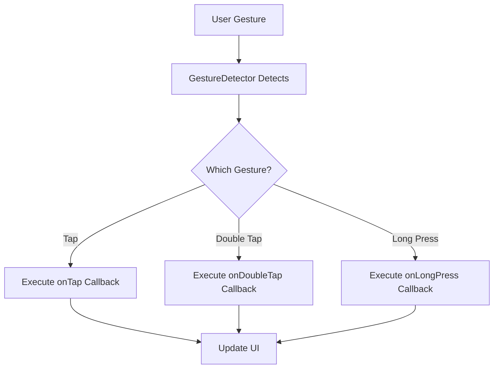

## 10.3.1 Detecting Gestures

In the realm of mobile app development, user interaction is paramount. Flutter provides a robust framework for detecting and responding to user gestures, allowing developers to create intuitive and responsive applications. This section delves into the intricacies of gesture detection in Flutter, focusing on the `GestureDetector` widget and its capabilities.

### Understanding Gesture Detection in Flutter

Flutter's gesture detection system is built around the `GestureDetector` widget, which acts as an invisible layer that captures user interactions. By wrapping widgets with `GestureDetector`, developers can listen for a variety of gestures and respond accordingly. This capability is crucial for creating interactive and engaging user interfaces.

#### Overview of `GestureDetector`

The `GestureDetector` widget is a powerful tool that allows you to detect and respond to user gestures. It provides a wide range of callbacks for different types of gestures, such as taps, double taps, long presses, and more complex gestures like pans and scales.

**Key Features of `GestureDetector`:**

- **Versatility:** Detects a wide array of gestures, from simple taps to complex multi-touch interactions.
- **Customizability:** Allows developers to define custom behaviors for each gesture type.
- **Integration:** Easily integrates with existing widgets to enhance interactivity.

#### Common Gesture Events

The `GestureDetector` widget supports several gesture callbacks, each corresponding to a specific type of user interaction. Here are some of the most commonly used gesture events:

- **`onTap`:** Triggered when the user taps on the widget.
- **`onDoubleTap`:** Triggered when the user double-taps on the widget.
- **`onLongPress`:** Triggered when the user presses and holds on the widget.
- **`onPan`:** Triggered when the user drags their finger across the screen.
- **`onScale`:** Triggered when the user performs a pinch or zoom gesture.

### Implementing Gesture Detection

To implement gesture detection, wrap your widget with a `GestureDetector` and define the desired gesture callbacks. Let's explore a practical example to illustrate how this works.

#### Practical Example: Gesture Detection Demo

In this example, we'll create a simple app that changes the color of a square when different gestures are detected.

```dart
import 'package:flutter/material.dart';

class GestureDetectionDemo extends StatefulWidget {
  @override
  _GestureDetectionDemoState createState() => _GestureDetectionDemoState();
}

class _GestureDetectionDemoState extends State<GestureDetectionDemo> {
  Color _color = Colors.blue;

  void _changeColor() {
    setState(() {
      _color = _color == Colors.blue ? Colors.green : Colors.blue;
    });
  }

  @override
  Widget build(BuildContext context) {
    return Scaffold(
      appBar: AppBar(title: Text('Gesture Detection')),
      body: Center(
        child: GestureDetector(
          onTap: _changeColor,
          onDoubleTap: () {
            setState(() {
              _color = _color == Colors.blue ? Colors.red : Colors.blue;
            });
          },
          onLongPress: () {
            setState(() {
              _color = Colors.yellow;
            });
          },
          child: AnimatedContainer(
            width: 150.0,
            height: 150.0,
            color: _color,
            duration: Duration(milliseconds: 500),
            child: Center(child: Text('Tap Me')),
          ),
        ),
      ),
    );
  }
}
```

**Explanation:**

- **`onTap`:** Changes the color between blue and green.
- **`onDoubleTap`:** Changes the color between blue and red.
- **`onLongPress`:** Changes the color to yellow.

This example demonstrates how to use `GestureDetector` to handle different gestures and update the UI accordingly.

### Differences Between `GestureDetector` and `InkWell`

While `GestureDetector` is a versatile tool for detecting gestures, Flutter also provides the `InkWell` widget, which is specifically designed for material design ripple effects. Here are some key differences:

- **`GestureDetector`:** Offers a broader range of gesture detection capabilities but does not provide visual feedback.
- **`InkWell`:** Primarily used for tap gestures with built-in ripple effects, providing visual feedback to the user.

### Advanced Gesture Detection

For more complex gestures, such as dragging or scaling, `GestureDetector` provides additional callbacks like `onPanUpdate` and `onScaleUpdate`. These allow for more granular control over user interactions.

#### Example: Detecting Drag Gestures

```dart
GestureDetector(
  onPanUpdate: (details) {
    // Handle drag gesture
    print('Dragging: ${details.delta}');
  },
  child: Container(
    width: 100.0,
    height: 100.0,
    color: Colors.blue,
  ),
)
```

In this example, the `onPanUpdate` callback is used to detect drag gestures, providing the change in position (`details.delta`) as the user drags their finger across the screen.

### Visualizing Gesture Detection

To better understand the flow of gesture detection, consider the following Mermaid.js diagram:



This diagram illustrates how the `GestureDetector` processes different gestures and triggers the appropriate callbacks to update the UI.

### Best Practices and Common Pitfalls

**Best Practices:**

- **Use Appropriate Widgets:** Choose between `GestureDetector` and `InkWell` based on your needs for visual feedback.
- **Optimize Performance:** Avoid complex logic within gesture callbacks to maintain smooth interactions.
- **Test on Devices:** Ensure gestures work as expected on different devices and screen sizes.

**Common Pitfalls:**

- **Overlapping Gesture Detectors:** Be cautious of nesting multiple `GestureDetector` widgets, as this can lead to unexpected behavior.
- **Ignoring Accessibility:** Consider accessibility features and ensure gestures are intuitive for all users.

### Further Exploration

For more advanced gesture detection, consider exploring Flutter's `RawGestureDetector`, which provides lower-level gesture detection capabilities. Additionally, the Flutter documentation offers comprehensive guides and examples to deepen your understanding of gesture detection.

**Resources:**

- [Flutter GestureDetector Documentation](https://api.flutter.dev/flutter/widgets/GestureDetector-class.html)
- [Flutter Gesture Handling](https://flutter.dev/docs/development/ui/advanced/gestures)
- [Material Design Guidelines](https://material.io/design/interaction/gestures.html)

By mastering gesture detection in Flutter, you can create dynamic and interactive applications that respond intuitively to user input. Experiment with different gestures and callbacks to enhance the user experience in your apps.

## Quiz Time!



### What is the primary purpose of the `GestureDetector` widget in Flutter?

- [x] To detect and respond to user gestures
- [ ] To provide visual feedback for user interactions
- [ ] To manage state changes in the app
- [ ] To handle network requests

> **Explanation:** The `GestureDetector` widget is used to detect and respond to various user gestures, such as taps, swipes, and drags.

### Which gesture callback is triggered when a user double-taps on a widget?

- [ ] onTap
- [x] onDoubleTap
- [ ] onLongPress
- [ ] onPanUpdate

> **Explanation:** The `onDoubleTap` callback is triggered when a user performs a double-tap gesture on a widget.

### How does the `InkWell` widget differ from the `GestureDetector` widget?

- [x] `InkWell` provides visual feedback with ripple effects
- [ ] `InkWell` can detect more gestures than `GestureDetector`
- [ ] `InkWell` is used for managing state
- [ ] `InkWell` is a lower-level gesture detection widget

> **Explanation:** The `InkWell` widget is designed to provide visual feedback, such as ripple effects, when a user taps on it, whereas `GestureDetector` does not provide visual feedback.

### Which callback would you use to detect a drag gesture in Flutter?

- [ ] onTap
- [ ] onDoubleTap
- [ ] onLongPress
- [x] onPanUpdate

> **Explanation:** The `onPanUpdate` callback is used to detect drag gestures, providing details about the change in position as the user drags their finger.

### What is a common pitfall when using multiple `GestureDetector` widgets?

- [x] Overlapping gesture detectors can lead to unexpected behavior
- [ ] They cannot detect double-tap gestures
- [ ] They provide visual feedback by default
- [ ] They are not compatible with stateful widgets

> **Explanation:** Overlapping `GestureDetector` widgets can interfere with each other, leading to unexpected behavior in gesture detection.

### Which gesture callback would you use to detect a long press?

- [ ] onTap
- [ ] onDoubleTap
- [x] onLongPress
- [ ] onScaleUpdate

> **Explanation:** The `onLongPress` callback is triggered when a user presses and holds on a widget.

### What is the purpose of the `onScaleUpdate` callback?

- [ ] To detect tap gestures
- [ ] To detect double-tap gestures
- [ ] To detect long press gestures
- [x] To detect pinch or zoom gestures

> **Explanation:** The `onScaleUpdate` callback is used to detect pinch or zoom gestures, providing details about the scale factor.

### Why is it important to test gesture detection on different devices?

- [x] To ensure gestures work as expected on various screen sizes
- [ ] To improve network performance
- [ ] To manage app state effectively
- [ ] To provide visual feedback

> **Explanation:** Testing on different devices ensures that gestures are intuitive and function correctly across various screen sizes and device capabilities.

### Which widget is specifically designed for material design ripple effects?

- [ ] GestureDetector
- [x] InkWell
- [ ] RawGestureDetector
- [ ] Container

> **Explanation:** The `InkWell` widget is designed to provide material design ripple effects when a user interacts with it.

### True or False: The `GestureDetector` widget can only detect single-touch gestures.

- [ ] True
- [x] False

> **Explanation:** The `GestureDetector` widget can detect both single-touch and multi-touch gestures, such as pinch and zoom.


