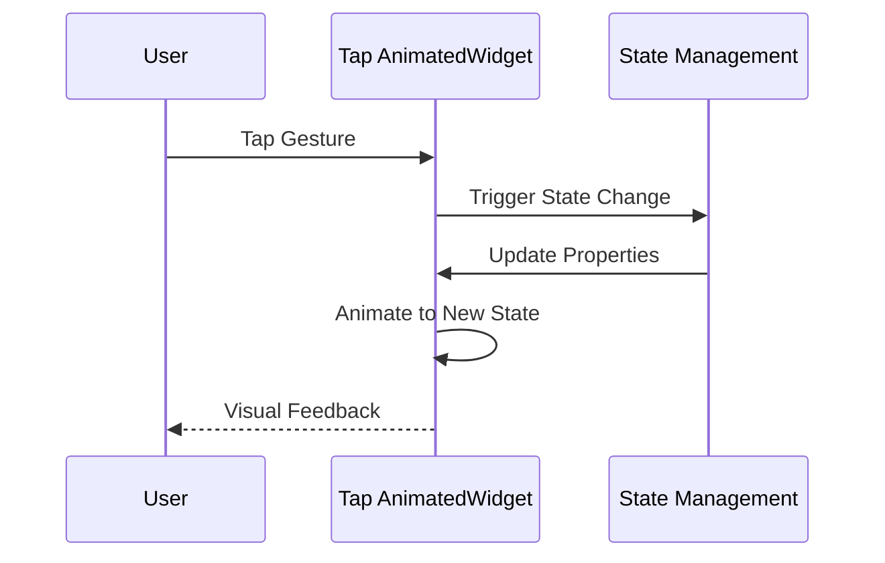

## 10.3.2 Animations on Tap

In the world of mobile app development, creating a responsive and interactive user interface is crucial for engaging users. Flutter, with its rich set of widgets and tools, provides developers with the ability to create dynamic animations that respond to user gestures, such as taps. This section will delve into how you can leverage Flutter's capabilities to create animations that respond to tap gestures, enhancing the interactivity of your applications.

### Understanding Gesture Detection in Flutter

Before diving into animations, it's essential to understand how Flutter detects gestures. The `GestureDetector` widget is a powerful tool that allows you to capture various user interactions, such as taps, double taps, long presses, and more. By wrapping a widget with `GestureDetector`, you can define specific actions that should occur when a user interacts with that widget.

#### Using `GestureDetector` to Detect Tap Events

The `GestureDetector` widget listens for gestures and triggers callbacks when they occur. For tap gestures, you can use the `onTap` property to specify what should happen when the user taps the widget.

Here's a simple example of using `GestureDetector` to detect a tap:

```dart
GestureDetector(
  onTap: () {
    print('Widget tapped!');
  },
  child: Container(
    width: 100.0,
    height: 100.0,
    color: Colors.blue,
  ),
)
```

In this example, when the user taps the blue container, a message is printed to the console. This basic setup is the foundation for creating more complex interactions, such as animations.

### Triggering Implicit Animations on Tap

Implicit animations in Flutter are a straightforward way to add animations to your app. These animations automatically transition between old and new values of properties when they change. The `AnimatedContainer` widget is a prime example of an implicit animation widget.

#### Example: AnimatedContainer on Tap

Let's explore how to use `AnimatedContainer` to create a simple animation that responds to a tap gesture. We'll change the size, color, and alignment of a container when it's tapped.

```dart
class TapAnimationDemo extends StatefulWidget {
  @override
  _TapAnimationDemoState createState() => _TapAnimationDemoState();
}

class _TapAnimationDemoState extends State<TapAnimationDemo> {
  bool _isTapped = false;

  void _toggleAnimation() {
    setState(() {
      _isTapped = !_isTapped;
    });
  }

  @override
  Widget build(BuildContext context) {
    return Scaffold(
      appBar: AppBar(title: Text('Tap Animation')),
      body: Center(
        child: GestureDetector(
          onTap: _toggleAnimation,
          child: AnimatedContainer(
            width: _isTapped ? 150.0 : 100.0,
            height: _isTapped ? 150.0 : 100.0,
            color: _isTapped ? Colors.purple : Colors.orange,
            alignment: _isTapped ? Alignment.center : AlignmentDirectional.topCenter,
            duration: Duration(milliseconds: 300),
            curve: Curves.easeInOut,
            child: _isTapped
                ? Icon(Icons.check, color: Colors.white, size: 50)
                : Text(
                    'Tap',
                    style: TextStyle(color: Colors.white, fontSize: 20),
                  ),
          ),
        ),
      ),
    );
  }
}
```

**Explanation:**

- **State Management:** The `_isTapped` boolean variable is used to track the state of the animation. When the user taps the container, the `_toggleAnimation` method toggles this variable.
- **AnimatedContainer:** The `AnimatedContainer` widget automatically animates changes to its properties, such as `width`, `height`, `color`, and `alignment`.
- **GestureDetector:** The `GestureDetector` widget wraps the `AnimatedContainer` and listens for tap events, triggering the `_toggleAnimation` method.

### Providing Visual Feedback to Users

Visual feedback is crucial for creating an intuitive user experience. When users interact with your app, they should receive immediate feedback that their action has been recognized. In the example above, the change in size, color, and content of the container provides clear visual feedback.

#### Ensuring Smooth and Responsive Animations

To ensure animations are smooth and responsive, consider the following best practices:

- **Duration and Curves:** Choose appropriate durations and animation curves. The `Curves.easeInOut` curve provides a smooth transition, while a duration of 300 milliseconds is generally perceived as quick and responsive.
- **State Management:** Use `setState` judiciously to update the UI. Avoid unnecessary state changes that could lead to performance issues.
- **Testing on Devices:** Test animations on actual devices to ensure they perform well across different hardware.

### Examples of Interactive Buttons and Toggles

Interactive buttons and toggles are common use cases for tap animations. By combining `GestureDetector` with `AnimatedContainer`, you can create buttons that visually respond to user interactions.

#### Example: Toggle Button with Animation

```dart
class ToggleButtonDemo extends StatefulWidget {
  @override
  _ToggleButtonDemoState createState() => _ToggleButtonDemoState();
}

class _ToggleButtonDemoState extends State<ToggleButtonDemo> {
  bool _isOn = false;

  void _toggleButton() {
    setState(() {
      _isOn = !_isOn;
    });
  }

  @override
  Widget build(BuildContext context) {
    return Scaffold(
      appBar: AppBar(title: Text('Toggle Button')),
      body: Center(
        child: GestureDetector(
          onTap: _toggleButton,
          child: AnimatedContainer(
            width: 100.0,
            height: 50.0,
            decoration: BoxDecoration(
              color: _isOn ? Colors.green : Colors.red,
              borderRadius: BorderRadius.circular(25.0),
            ),
            duration: Duration(milliseconds: 300),
            curve: Curves.easeInOut,
            alignment: Alignment.center,
            child: Text(
              _isOn ? 'ON' : 'OFF',
              style: TextStyle(color: Colors.white, fontSize: 20),
            ),
          ),
        ),
      ),
    );
  }
}
```

**Explanation:**

- **Toggle State:** The `_isOn` variable tracks whether the button is in the "ON" or "OFF" state.
- **Visual Feedback:** The button changes color and text to indicate its current state, providing clear feedback to the user.

### Real-World Scenarios and Practical Applications

Animations on tap can be applied in various real-world scenarios to enhance user experience:

- **Interactive Lists:** Use animations to highlight selected items in a list.
- **Form Inputs:** Provide feedback when users interact with form fields.
- **Navigation Elements:** Animate transitions between different sections of an app.

### Mermaid.js Diagram: Visualizing the Tap Animation Process

To better understand the flow of a tap animation, consider the following sequence diagram:



**Explanation:**

- **User Interaction:** The user initiates the process by tapping the widget.
- **State Management:** The widget triggers a state change, updating its properties.
- **Animation:** The widget animates to reflect the new state, providing visual feedback to the user.

### Best Practices and Common Pitfalls

- **Avoid Over-Animation:** While animations can enhance user experience, excessive animations can be distracting. Use them sparingly and purposefully.
- **Performance Considerations:** Ensure animations are smooth by testing on various devices and optimizing performance.
- **User Expectations:** Align animations with user expectations. For example, a toggle button should clearly indicate its state.

### Further Exploration and Resources

To deepen your understanding of animations in Flutter, consider exploring the following resources:

- **Flutter Documentation:** [Animations Overview](https://flutter.dev/docs/development/ui/animations)
- **Open-Source Projects:** Explore GitHub repositories that implement complex animations.
- **Online Courses:** Platforms like Udemy and Coursera offer courses on Flutter animations.

### Conclusion

Animations on tap are a powerful way to create interactive and engaging user interfaces in Flutter. By combining gesture detection with animation widgets, you can provide users with immediate visual feedback, enhancing their overall experience. As you continue to explore Flutter, consider experimenting with different types of animations and gestures to create unique and dynamic applications.

## Quiz Time!



### What widget is used in Flutter to detect tap gestures?

- [x] GestureDetector
- [ ] TapListener
- [ ] TapWidget
- [ ] GestureWidget

> **Explanation:** The `GestureDetector` widget is used to detect various gestures, including tap gestures, in Flutter.

### Which widget is commonly used for implicit animations in Flutter?

- [x] AnimatedContainer
- [ ] Container
- [ ] GestureDetector
- [ ] AnimationBuilder

> **Explanation:** The `AnimatedContainer` widget is used for implicit animations, automatically animating changes to its properties.

### What property of `GestureDetector` is used to specify the action on a tap?

- [x] onTap
- [ ] onGesture
- [ ] onPress
- [ ] onTouch

> **Explanation:** The `onTap` property of `GestureDetector` is used to define the action that occurs when the widget is tapped.

### What is the purpose of the `setState` method in the context of animations?

- [x] To update the UI by changing the state
- [ ] To initialize the widget
- [ ] To destroy the widget
- [ ] To handle errors

> **Explanation:** The `setState` method is used to update the UI by changing the state of the widget, triggering a rebuild.

### Which animation curve provides a smooth transition effect?

- [x] Curves.easeInOut
- [ ] Curves.linear
- [ ] Curves.bounceIn
- [ ] Curves.elasticOut

> **Explanation:** The `Curves.easeInOut` curve provides a smooth transition effect, commonly used for animations.

### What is a common use case for animations on tap?

- [x] Interactive buttons
- [ ] Static images
- [ ] Background music
- [ ] Text formatting

> **Explanation:** Animations on tap are commonly used for interactive buttons, providing visual feedback to users.

### How can you ensure animations are smooth and responsive?

- [x] Test on actual devices
- [ ] Use only linear curves
- [ ] Avoid using `setState`
- [ ] Increase animation duration

> **Explanation:** Testing animations on actual devices helps ensure they are smooth and responsive across different hardware.

### What should you avoid when using animations in your app?

- [x] Over-animating
- [ ] Using colors
- [ ] Using text
- [ ] Using images

> **Explanation:** Over-animating can be distracting to users, so it's important to use animations sparingly and purposefully.

### What is the role of `AnimatedContainer` in the provided code example?

- [x] It animates changes to its properties
- [ ] It detects gestures
- [ ] It handles network requests
- [ ] It manages state

> **Explanation:** The `AnimatedContainer` animates changes to its properties, such as size and color, in response to state changes.

### True or False: The `GestureDetector` widget can only detect tap gestures.

- [ ] True
- [x] False

> **Explanation:** False. The `GestureDetector` widget can detect various gestures, including taps, double taps, long presses, and more.


