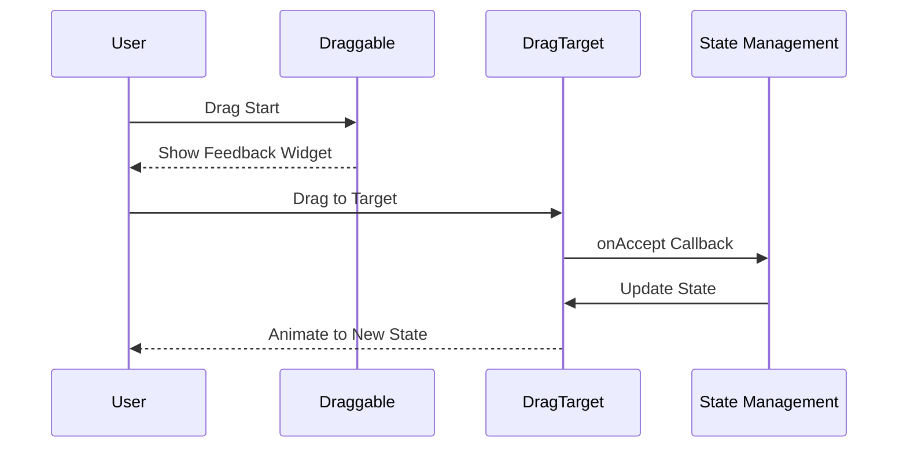

## 10.3.3 Drag and Drop Animations

In the realm of mobile app development, creating interactive and engaging user interfaces is paramount. One such interaction that enhances user experience is the drag and drop functionality. This feature allows users to move elements around the screen, providing a dynamic and intuitive way to interact with the app. In Flutter, implementing drag and drop animations is both straightforward and powerful, thanks to widgets like `Draggable` and `DragTarget`.

### Understanding Drag and Drop in Flutter

Drag and drop interactions involve two primary components: the draggable element and the target area where the element can be dropped. In Flutter, these are represented by the `Draggable` and `DragTarget` widgets, respectively. The `Draggable` widget allows users to move a widget across the screen, while the `DragTarget` widget acts as a receptacle that can accept the draggable item.

#### Key Concepts

- **Draggable Widget**: This widget can be moved by the user. It provides visual feedback during the drag operation and can change its appearance when being dragged.
- **DragTarget Widget**: This widget defines an area where draggable items can be dropped. It handles the logic for accepting or rejecting the dragged item and updating the UI accordingly.
- **Drag Lifecycle**: The drag operation consists of several stages: start, update, and end. Managing these stages allows for smooth animations and state updates.

### Implementing Drag and Drop

Let's delve into the implementation of drag and drop animations using Flutter. We'll explore how to create draggable elements, manage their lifecycle, and provide visual feedback during the drag operation.

#### Using `Draggable` and `DragTarget` Widgets

The `Draggable` widget is the core component that enables drag functionality. It requires a `data` parameter, which is the data being transferred during the drag operation. Additionally, it uses `child`, `feedback`, and `childWhenDragging` parameters to define the widget's appearance in different states.

The `DragTarget` widget is where the draggable items can be dropped. It uses the `onAccept` callback to handle the logic when a draggable item is successfully dropped onto it.

Here's a basic example of how to implement these widgets:

```dart
class DragAndDropDemo extends StatefulWidget {
  @override
  _DragAndDropDemoState createState() => _DragAndDropDemoState();
}

class _DragAndDropDemoState extends State<DragAndDropDemo> {
  Color caughtColor = Colors.grey;

  @override
  Widget build(BuildContext context) {
    return Scaffold(
      appBar: AppBar(title: Text('Drag and Drop')),
      body: Column(
        mainAxisAlignment: MainAxisAlignment.spaceEvenly,
        children: [
          Draggable<Color>(
            data: Colors.deepOrange,
            child: Container(
              width: 100,
              height: 100,
              color: Colors.deepOrange,
              child: Center(child: Text('Drag me')),
            ),
            feedback: Container(
              width: 100,
              height: 100,
              color: Colors.deepOrange.withOpacity(0.5),
              child: Center(child: Text('Dragging')),
            ),
            childWhenDragging: Container(
              width: 100,
              height: 100,
              color: Colors.grey,
              child: Center(child: Text('Dragged')),
            ),
          ),
          DragTarget<Color>(
            onAccept: (color) {
              setState(() {
                caughtColor = color;
              });
            },
            builder: (context, candidateData, rejectedData) {
              return AnimatedContainer(
                width: 150,
                height: 150,
                color: caughtColor,
                duration: Duration(milliseconds: 500),
                child: Center(child: Text('Drop Here')),
              );
            },
          ),
        ],
      ),
    );
  }
}
```

### Managing the Drag Lifecycle

The drag lifecycle consists of three main stages: start, update, and end. Understanding and managing these stages is crucial for creating smooth and responsive drag and drop interactions.

- **Start**: This stage is triggered when the user begins dragging the widget. You can use the `onDragStarted` callback in the `Draggable` widget to perform actions at this point.
- **Update**: During the drag operation, the `onDragUpdate` callback can be used to track the position of the draggable widget and update the UI in real-time.
- **End**: When the drag operation ends, either by dropping the widget or canceling the drag, the `onDragEnd` callback is invoked. This is where you can finalize the drag operation and update the state accordingly.

### Providing Visual Cues

Visual feedback is essential for enhancing the user experience during drag operations. The `Draggable` widget allows you to define a `feedback` widget, which is displayed during the drag. This feedback widget can be styled to indicate that the item is being dragged. Additionally, the `childWhenDragging` parameter allows you to change the appearance of the original widget while it is being dragged.

### Handling Dropped Data

The `DragTarget` widget's `onAccept` callback is used to handle the data when a draggable item is dropped onto it. This is where you can update the state of your application based on the dropped data. For example, you might change the color of the target area or update a list of items.

### Practical Examples

Let's explore some practical examples of drag and drop interactions in Flutter.

#### Example 1: Draggable Cards

Imagine a scenario where you have a list of cards that can be rearranged by dragging and dropping. Each card is a `Draggable` widget, and the list itself is composed of `DragTarget` widgets that accept the cards.

```dart
class DraggableCard extends StatelessWidget {
  final Color color;
  final String label;

  DraggableCard({required this.color, required this.label});

  @override
  Widget build(BuildContext context) {
    return Draggable<Color>(
      data: color,
      child: Card(
        color: color,
        child: Padding(
          padding: const EdgeInsets.all(16.0),
          child: Text(label, style: TextStyle(color: Colors.white)),
        ),
      ),
      feedback: Material(
        color: Colors.transparent,
        child: Card(
          color: color.withOpacity(0.5),
          child: Padding(
            padding: const EdgeInsets.all(16.0),
            child: Text(label, style: TextStyle(color: Colors.white)),
          ),
        ),
      ),
      childWhenDragging: Card(
        color: Colors.grey,
        child: Padding(
          padding: const EdgeInsets.all(16.0),
          child: Text(label, style: TextStyle(color: Colors.white)),
        ),
      ),
    );
  }
}
```

#### Example 2: Interactive Lists

In an interactive list, you might want to allow users to drag items to reorder them. Each list item can be a `Draggable` widget, and the list itself can be a series of `DragTarget` widgets that accept the items.

```dart
class InteractiveList extends StatefulWidget {
  @override
  _InteractiveListState createState() => _InteractiveListState();
}

class _InteractiveListState extends State<InteractiveList> {
  List<Color> colors = [Colors.red, Colors.green, Colors.blue];

  @override
  Widget build(BuildContext context) {
    return ListView.builder(
      itemCount: colors.length,
      itemBuilder: (context, index) {
        return DragTarget<Color>(
          onAccept: (color) {
            setState(() {
              colors[index] = color;
            });
          },
          builder: (context, candidateData, rejectedData) {
            return DraggableCard(
              color: colors[index],
              label: 'Item $index',
            );
          },
        );
      },
    );
  }
}
```

### Animating the Movement Smoothly

To create smooth animations during drag and drop operations, you can use the `AnimatedContainer` widget. This widget allows you to animate changes to its properties, such as size, color, and position, over a specified duration.

In the previous example, the `DragTarget` widget uses an `AnimatedContainer` to animate the color change when a draggable item is dropped onto it.

### Mermaid.js Diagram

To better understand the flow of drag and drop interactions, let's visualize the process using a Mermaid.js sequence diagram:



### Best Practices and Common Pitfalls

- **Visual Feedback**: Always provide clear visual feedback during drag operations to enhance the user experience.
- **Performance**: Ensure that animations and state updates are efficient to maintain smooth performance.
- **Accessibility**: Consider accessibility features, such as screen readers, when implementing drag and drop interactions.
- **Testing**: Thoroughly test drag and drop interactions on different devices to ensure consistent behavior.

### Further Exploration

To deepen your understanding of drag and drop animations in Flutter, consider exploring the following resources:

- [Flutter Documentation on Draggable and DragTarget](https://api.flutter.dev/flutter/widgets/Draggable-class.html)
- [Flutter Cookbook: Drag and Drop](https://flutter.dev/docs/cookbook/gestures/drag-a-widget)
- [Advanced Flutter Animations Course](https://www.udemy.com/course/flutter-animations/)

### Conclusion

Drag and drop animations are a powerful tool for creating interactive and engaging user interfaces in Flutter. By understanding the lifecycle of drag operations and utilizing widgets like `Draggable` and `DragTarget`, you can implement smooth and responsive drag and drop interactions in your apps. Experiment with different visual feedback and animations to enhance the user experience and make your app stand out.

## Quiz Time!



### What is the primary purpose of the `Draggable` widget in Flutter?

- [x] To allow users to move a widget across the screen.
- [ ] To provide a static display of a widget.
- [ ] To handle network requests.
- [ ] To manage app state.

> **Explanation:** The `Draggable` widget is used to enable drag functionality, allowing users to move a widget across the screen.

### Which widget acts as a receptacle for draggable items in Flutter?

- [ ] Draggable
- [x] DragTarget
- [ ] GestureDetector
- [ ] Container

> **Explanation:** The `DragTarget` widget is used to define an area where draggable items can be dropped.

### What callback is used to handle the logic when a draggable item is successfully dropped onto a `DragTarget`?

- [ ] onDragStarted
- [ ] onDragUpdate
- [x] onAccept
- [ ] onDragEnd

> **Explanation:** The `onAccept` callback is used in the `DragTarget` widget to handle the logic when a draggable item is dropped onto it.

### How can you provide visual feedback during a drag operation in Flutter?

- [x] By using the `feedback` parameter in the `Draggable` widget.
- [ ] By changing the app theme.
- [ ] By using a `Container` widget.
- [ ] By updating the app's state.

> **Explanation:** The `feedback` parameter in the `Draggable` widget allows you to define a widget that provides visual feedback during the drag operation.

### What is the role of the `AnimatedContainer` widget in drag and drop animations?

- [x] To animate changes to properties like size, color, and position.
- [ ] To handle network requests.
- [ ] To manage app state.
- [ ] To display static content.

> **Explanation:** The `AnimatedContainer` widget is used to animate changes to its properties, such as size, color, and position, over a specified duration.

### Which stage of the drag lifecycle is triggered when the user begins dragging the widget?

- [x] Start
- [ ] Update
- [ ] End
- [ ] Cancel

> **Explanation:** The start stage is triggered when the user begins dragging the widget, and it can be managed using the `onDragStarted` callback.

### What is a common pitfall to avoid when implementing drag and drop interactions?

- [x] Not providing clear visual feedback during drag operations.
- [ ] Using too many widgets.
- [ ] Overusing network requests.
- [ ] Ignoring app state management.

> **Explanation:** Not providing clear visual feedback during drag operations can lead to a poor user experience, as users may not understand what is happening.

### How can you ensure smooth performance during drag and drop animations?

- [x] By optimizing animations and state updates.
- [ ] By using fewer widgets.
- [ ] By increasing the app's memory usage.
- [ ] By ignoring accessibility features.

> **Explanation:** Ensuring that animations and state updates are efficient helps maintain smooth performance during drag and drop interactions.

### What should you consider regarding accessibility when implementing drag and drop interactions?

- [x] Screen readers and other accessibility features.
- [ ] Only the visual design.
- [ ] The app's color scheme.
- [ ] The app's network usage.

> **Explanation:** Considering accessibility features, such as screen readers, ensures that drag and drop interactions are usable by all users, including those with disabilities.

### True or False: The `Draggable` widget can change its appearance when being dragged.

- [x] True
- [ ] False

> **Explanation:** The `Draggable` widget can change its appearance when being dragged by using the `childWhenDragging` parameter.


