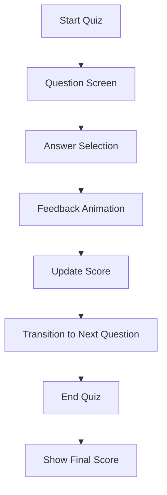

## 10.4.2 Designing the Quiz Flow

Designing the user flow for an interactive quiz app involves a careful balance of user experience, intuitive navigation, and engaging animations. In this section, we will explore how to map out the quiz flow from start to finish, create wireframes or mockups for each screen, and identify key interaction points for animations. Our goal is to ensure a seamless and engaging experience for users as they progress through the quiz.

### Mapping Out the Quiz Flow

Before diving into the design details, it's crucial to have a clear understanding of the overall flow of the quiz app. This involves defining the sequence of screens and the transitions between them. Here's a high-level overview of the typical quiz flow:

- **Start Quiz**: The entry point where users begin the quiz.
- **Question Screen**: Displays the current question and possible answers.
- **Answer Selection**: Users select an answer, triggering feedback.
- **Feedback Animation**: Provides visual feedback on the selected answer.
- **Update Score**: Adjusts the user's score based on their answer.
- **Transition to Next Question**: Moves to the next question in the quiz.
- **End Quiz**: Concludes the quiz when all questions are answered.
- **Show Final Score**: Displays the user's total score and performance summary.

This flow can be visualized using a flowchart to better understand the transitions and interactions:

### Sketching Wireframes or Mockups

Creating wireframes or mockups is an essential step in designing the quiz app's user interface. These visual representations help in planning the layout and functionality of each screen. Tools like Figma or Sketch are excellent for this purpose, allowing you to experiment with different designs and iterate quickly.

#### Key Screens to Design:

1. **Start Screen**: 
   - Includes a "Start Quiz" button.
   - May display quiz instructions or a brief introduction.

2. **Question Screen**:
   - Shows the current question and multiple-choice answers.
   - Includes navigation controls (e.g., "Next" button).

3. **Feedback Screen**:
   - Provides immediate feedback on the user's answer.
   - Uses animations to enhance the feedback experience.

4. **Score Screen**:
   - Displays the user's final score and performance summary.
   - Offers options to restart the quiz or exit.

### Identifying Key Interaction Points for Animations

Animations play a crucial role in enhancing user engagement and providing feedback. Identifying key interaction points where animations can be integrated is vital for a dynamic user experience.

#### Potential Animation Points:

- **Question Transitions**: Smooth transitions between questions can maintain user engagement.
- **Answer Selection Feedback**: Animations can indicate whether the selected answer is correct or incorrect.
- **Score Updates**: Animations can visually represent score changes, making the experience more interactive.
- **Final Score Reveal**: A celebratory animation can enhance the user's sense of achievement.

### Deciding on the Types of Animations

Choosing the right type of animation for each interaction point is essential for maintaining a cohesive design. Here are some animation types to consider:

- **Fade In/Out**: Useful for transitioning between screens or displaying feedback.
- **Slide Transitions**: Effective for moving between questions.
- **Scale Animations**: Can be used to emphasize correct answers or highlight scores.
- **Custom Animations**: Tailored animations for unique interactions, such as a confetti effect for a perfect score.

### Ensuring Consistency and Coherence in Animation Styles

Consistency in animation styles is crucial for a professional and polished app. Here are some tips to ensure coherence:

- **Use a Consistent Animation Duration**: Keep animation durations uniform across the app to avoid jarring transitions.
- **Align Animations with User Actions**: Ensure that animations enhance user actions rather than distract from them.
- **Maintain a Unified Theme**: Use animations that align with the app's overall theme and design language.

### Design Tips

- **Use Tools Like Figma or Sketch**: These tools are invaluable for creating detailed UI mockups and iterating on designs.
- **Define User States**: Clearly define different user states, such as waiting for an answer or showing feedback, to plan appropriate animations.
- **Plan Animations to Align with User Actions**: Ensure that animations are purposeful and enhance the user experience.

### Conclusion

Designing the quiz flow for an interactive quiz app involves careful planning and attention to detail. By mapping out the user flow, creating wireframes, identifying key interaction points, and selecting appropriate animations, you can create a seamless and engaging experience for users. Remember to maintain consistency in animation styles and align them with user actions to enhance the overall user experience.

---

## Quiz Time!



### What is the first step in designing the quiz flow for an interactive quiz app?

- [x] Mapping out the quiz flow from start to finish
- [ ] Creating animations for transitions
- [ ] Writing the code for the quiz logic
- [ ] Designing the final score screen

> **Explanation:** The first step is to map out the quiz flow to understand the sequence of screens and interactions.

### Which tool is recommended for creating UI mockups?

- [x] Figma
- [ ] Visual Studio Code
- [ ] Android Studio
- [ ] DartPad

> **Explanation:** Figma is a popular tool for creating UI mockups and wireframes.

### What is a key interaction point for animations in a quiz app?

- [x] Answer selection feedback
- [ ] Loading the app
- [ ] User login
- [ ] App settings

> **Explanation:** Answer selection feedback is a key interaction point where animations can enhance user experience.

### What type of animation is suitable for transitioning between questions?

- [x] Slide transitions
- [ ] Fade out
- [ ] Rotate
- [ ] Bounce

> **Explanation:** Slide transitions are effective for moving smoothly between questions.

### Why is consistency in animation styles important?

- [x] It ensures a professional and polished app experience.
- [ ] It makes the app run faster.
- [ ] It reduces the amount of code needed.
- [ ] It allows for more complex animations.

> **Explanation:** Consistency in animation styles provides a cohesive and professional user experience.

### What should animations align with to enhance user experience?

- [x] User actions
- [ ] App settings
- [ ] Background processes
- [ ] Network requests

> **Explanation:** Animations should align with user actions to enhance the experience rather than distract from it.

### Which animation type is useful for displaying feedback?

- [x] Fade In/Out
- [ ] Rotate
- [ ] Zoom
- [ ] Flip

> **Explanation:** Fade In/Out animations are useful for displaying feedback smoothly.

### What is the purpose of a celebratory animation in a quiz app?

- [x] To enhance the user's sense of achievement
- [ ] To distract the user
- [ ] To slow down the app
- [ ] To increase app complexity

> **Explanation:** Celebratory animations enhance the user's sense of achievement, especially for high scores.

### What should be considered when choosing animation durations?

- [x] Consistency across the app
- [ ] Random durations for variety
- [ ] Making them as long as possible
- [ ] Using different durations for each screen

> **Explanation:** Consistent animation durations help maintain a smooth and cohesive user experience.

### True or False: Animations should always be complex to impress users.

- [ ] True
- [x] False

> **Explanation:** Animations should be purposeful and enhance the user experience, not necessarily complex.


