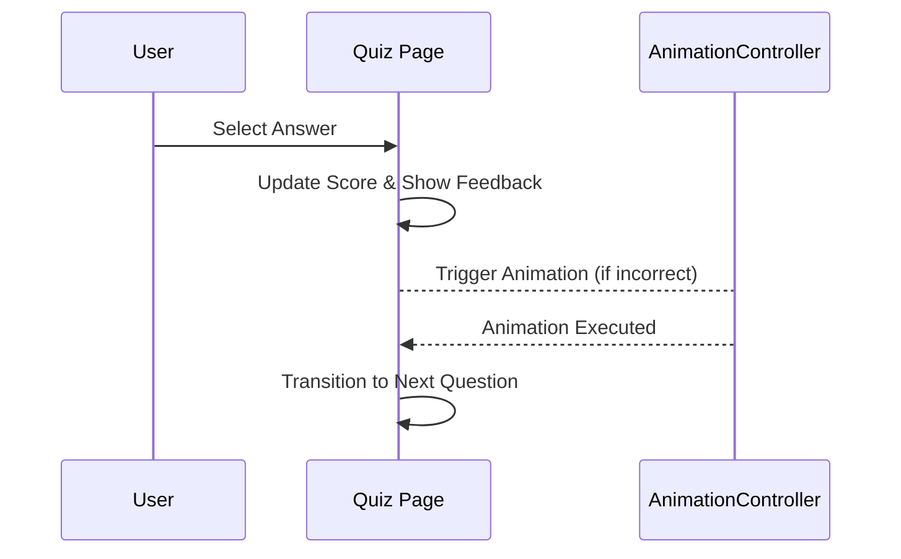

## 10.4.3 Implementing Animations

In this section, we will delve into the exciting world of animations within Flutter, specifically focusing on enhancing the interactive Quiz App. Animations are a powerful tool to improve user experience by providing visual feedback, guiding users through transitions, and making the app feel more dynamic and engaging. We'll explore how to implement page transitions, animate feedback for answers, and update scores with visual effects.

### Understanding the Role of Animations

Animations in mobile applications serve several purposes:

- **Enhance User Experience:** Smooth transitions and visual feedback can make an app feel more intuitive and responsive.
- **Guide User Attention:** Animations can direct users' focus to important elements or changes in the app.
- **Provide Feedback:** Visual cues can confirm user actions, such as selecting the correct answer in a quiz.
- **Increase Engagement:** Interactive and animated elements can make an app more enjoyable to use.

### Implementing Page Transitions

Page transitions are essential for guiding users from one screen to another. In our Quiz App, we'll use `PageRouteBuilder` to create custom animations for transitioning between questions.

#### Using `PageRouteBuilder`

`PageRouteBuilder` allows you to define custom transitions between pages. Here's how you can implement a fade transition between quiz questions:

```dart
Navigator.of(context).push(
  PageRouteBuilder(
    pageBuilder: (context, animation, secondaryAnimation) => NextQuestionPage(),
    transitionsBuilder: (context, animation, secondaryAnimation, child) {
      const begin = 0.0;
      const end = 1.0;
      const curve = Curves.ease;

      var tween = Tween(begin: begin, end: end).chain(CurveTween(curve: curve));

      return FadeTransition(
        opacity: animation.drive(tween),
        child: child,
      );
    },
  ),
);
```

- **PageBuilder:** Defines the new page to display.
- **TransitionsBuilder:** Defines the animation effect. In this case, a `FadeTransition` is used to smoothly fade in the new page.

### Animating Answer Selection Feedback

Providing immediate feedback when a user selects an answer is crucial for engagement. We'll implement animations that shake the question text for incorrect answers and scale the text for correct answers.

#### Shaking Animation for Incorrect Answers

To create a shaking effect, we can use an `AnimationController` combined with a `Tween` to animate the position of the question text:

```dart
class _QuizPageState extends State<QuizPage> with SingleTickerProviderStateMixin {
  late AnimationController _controller;
  late Animation<double> _shakeAnimation;

  @override
  void initState() {
    super.initState();
    _controller = AnimationController(vsync: this, duration: Duration(milliseconds: 500));
    _shakeAnimation = Tween<double>(begin: 0, end: 10).animate(
      CurvedAnimation(parent: _controller, curve: Curves.elasticIn),
    );
  }

  void _answerQuestion(bool isCorrect) {
    if (!isCorrect) {
      _controller.forward().then((_) => _controller.reverse());
    }
  }

  @override
  Widget build(BuildContext context) {
    return AnimatedBuilder(
      animation: _shakeAnimation,
      builder: (context, child) {
        return Transform.translate(
          offset: Offset(_shakeAnimation.value, 0),
          child: child,
        );
      },
      child: Text(
        'Question Text',
        style: TextStyle(fontSize: 24),
      ),
    );
  }
}
```

- **AnimationController:** Manages the animation's lifecycle.
- **Tween:** Defines the range of values for the animation.
- **Transform.translate:** Moves the widget based on the animation value.

#### Scaling Animation for Correct Answers

For correct answers, we can scale the text using a similar approach:

```dart
void _answerQuestion(bool isCorrect) {
  if (isCorrect) {
    setState(() {
      _score++;
    });
    // Implement scaling animation here
  }
}
```

You can use a `ScaleTransition` or manually adjust the `Text` widget's scale using a `Transform.scale`.

### Revealing New Questions with `AnimatedOpacity`

To smoothly transition between questions, `AnimatedOpacity` can be used to fade out the current question and fade in the next one.

```dart
AnimatedOpacity(
  opacity: _showFeedback ? 0.0 : 1.0,
  duration: Duration(seconds: 1),
  child: Text(
    'Next Question Text',
    style: TextStyle(fontSize: 24),
  ),
)
```

- **Opacity:** Controls the visibility of the widget.
- **Duration:** Defines how long the transition takes.

### Managing Animation States

Managing animation states effectively ensures that animations run smoothly and do not interfere with user interactions. This involves using `AnimationController` and `CurvedAnimation` to control the timing and easing of animations.

#### Using `AnimationController` and `CurvedAnimation`

`AnimationController` is used to manage the animation's lifecycle, while `CurvedAnimation` applies an easing curve to the animation:

```dart
late AnimationController _controller;
late Animation<double> _animation;

@override
void initState() {
  super.initState();
  _controller = AnimationController(vsync: this, duration: Duration(milliseconds: 500));
  _animation = CurvedAnimation(parent: _controller, curve: Curves.easeInOut);
}

@override
void dispose() {
  _controller.dispose();
  super.dispose();
}
```

- **vsync:** Prevents off-screen animations from consuming resources.
- **CurvedAnimation:** Applies a curve to the animation, such as `Curves.easeInOut`.

### Ensuring Responsive Animations

Animations should be responsive and not hinder app performance. Here are some best practices:

- **Optimize Animation Duration:** Keep animations short to maintain a snappy user experience.
- **Use `vsync`:** Always provide a `TickerProvider` to `AnimationController` to optimize resource usage.
- **Avoid Overlapping Animations:** Ensure animations do not overlap unnecessarily, which can cause performance issues.

### Code Example

Below is a comprehensive example of how these animations can be implemented in the Quiz App:

```dart
class QuizPage extends StatefulWidget {
  @override
  _QuizPageState createState() => _QuizPageState();
}

class _QuizPageState extends State<QuizPage> with SingleTickerProviderStateMixin {
  int _currentQuestionIndex = 0;
  int _score = 0;
  bool _showFeedback = false;
  bool _isCorrect = false;
  late AnimationController _controller;
  late Animation<double> _shakeAnimation;

  @override
  void initState() {
    super.initState();
    _controller = AnimationController(vsync: this, duration: Duration(milliseconds: 500));
    _shakeAnimation = Tween<double>(begin: 0, end: 10).animate(CurvedAnimation(parent: _controller, curve: Curves.elasticIn));
  }

  @override
  void dispose() {
    _controller.dispose();
    super.dispose();
  }

  void _answerQuestion(bool isCorrect) {
    setState(() {
      _isCorrect = isCorrect;
      _showFeedback = true;
      if (isCorrect) _score++;
    });
    if (!isCorrect) {
      _controller.forward().then((_) => _controller.reverse());
    }
    Future.delayed(Duration(seconds: 1), () {
      setState(() {
        _showFeedback = false;
        _currentQuestionIndex++;
      });
    });
  }

  @override
  Widget build(BuildContext context) {
    if (_currentQuestionIndex >= questions.length) {
      return Scaffold(
        appBar: AppBar(title: Text('Quiz Complete')),
        body: Center(child: Text('Your Score: $_score/${questions.length}')),
      );
    }
    var question = questions[_currentQuestionIndex];
    return Scaffold(
      appBar: AppBar(title: Text('Quiz App')),
      body: Center(
        child: Column(
          mainAxisAlignment: MainAxisAlignment.center,
          children: [
            AnimatedBuilder(
              animation: _shakeAnimation,
              builder: (context, child) {
                return Transform.translate(
                  offset: Offset(_shakeAnimation.value, 0),
                  child: child,
                );
              },
              child: Text(
                question.question,
                style: TextStyle(fontSize: 24),
                textAlign: TextAlign.center,
              ),
            ),
            SizedBox(height: 20),
            ...question.answers.map((answer) {
              return ElevatedButton(
                onPressed: () => _answerQuestion(answer.isCorrect),
                child: Text(answer.text),
              );
            }).toList(),
            SizedBox(height: 20),
            _showFeedback
                ? AnimatedOpacity(
                    opacity: _showFeedback ? 1.0 : 0.0,
                    duration: Duration(seconds: 1),
                    child: Text(
                      _isCorrect ? 'Correct!' : 'Incorrect!',
                      style: TextStyle(
                        color: _isCorrect ? Colors.green : Colors.red,
                        fontSize: 20,
                        fontWeight: FontWeight.bold,
                      ),
                    ),
                  )
                : Container(),
          ],
        ),
      ),
    );
  }
}

// Sample data
final List<Question> questions = [
  Question(question: 'What is Flutter?', answers: [
    Answer(text: 'A UI toolkit by Google', isCorrect: true),
    Answer(text: 'A programming language', isCorrect: false),
    Answer(text: 'A database system', isCorrect: false),
  ]),
  // Add more questions as needed
];

class Question {
  final String question;
  final List<Answer> answers;
  Question({required this.question, required this.answers});
}

class Answer {
  final String text;
  final bool isCorrect;
  Answer({required this.text, required this.isCorrect});
}
```

### Visualizing the Animation Flow

To better understand the flow of animations in the Quiz App, consider the following sequence diagram:



### Best Practices and Common Pitfalls

- **Test on Multiple Devices:** Ensure animations look good on different screen sizes and resolutions.
- **Avoid Overuse:** Too many animations can overwhelm users and degrade performance.
- **Keep It Simple:** Simple animations are often more effective and less distracting.

### Further Exploration

For those interested in diving deeper into Flutter animations, consider exploring the following resources:

- **Flutter Documentation on Animations:** [Flutter Animations](https://flutter.dev/docs/development/ui/animations)
- **Open-Source Projects:** Explore GitHub for projects that implement complex animations.
- **Online Courses:** Platforms like Udemy and Coursera offer courses on advanced Flutter animations.

By implementing these animations, you will not only enhance the user experience of your Quiz App but also gain valuable skills in creating dynamic and engaging mobile applications.

## Quiz Time!



### What is the primary purpose of animations in mobile applications?

- [x] Enhance user experience
- [ ] Increase app size
- [ ] Decrease app performance
- [ ] Complicate the code

> **Explanation:** Animations enhance user experience by making the app more intuitive and engaging.

### Which widget is used to create custom page transitions in Flutter?

- [x] PageRouteBuilder
- [ ] Navigator
- [ ] AnimatedContainer
- [ ] GestureDetector

> **Explanation:** PageRouteBuilder allows for custom animations during page transitions.

### What is the role of AnimationController in Flutter animations?

- [x] Manages the animation's lifecycle
- [ ] Provides default animations
- [ ] Handles user input
- [ ] Manages app state

> **Explanation:** AnimationController manages the timing and lifecycle of animations.

### How can you create a shaking effect for incorrect answers in a quiz app?

- [x] Use AnimationController with a Tween and Transform.translate
- [ ] Use AnimatedOpacity
- [ ] Use a static image
- [ ] Use a GestureDetector

> **Explanation:** AnimationController with a Tween and Transform.translate can create a shaking effect.

### Which animation widget is suitable for fading in and out widgets?

- [x] AnimatedOpacity
- [ ] AnimatedBuilder
- [ ] AnimatedContainer
- [ ] AnimatedList

> **Explanation:** AnimatedOpacity is used to animate the opacity of a widget.

### What should you consider to ensure animations do not hinder app performance?

- [x] Optimize animation duration
- [x] Use vsync
- [ ] Avoid using animations
- [ ] Use complex animations

> **Explanation:** Optimizing duration and using vsync helps maintain performance.

### What is the purpose of CurvedAnimation in Flutter?

- [x] Applies an easing curve to animations
- [ ] Manages animation state
- [ ] Handles user gestures
- [ ] Provides default animations

> **Explanation:** CurvedAnimation applies easing curves to animations for smoother transitions.

### How can you ensure animations are responsive across different devices?

- [x] Test on multiple devices
- [x] Optimize animation duration
- [ ] Use only one type of animation
- [ ] Avoid animations

> **Explanation:** Testing on multiple devices and optimizing duration ensures responsiveness.

### What is a common pitfall when using animations in mobile apps?

- [x] Overusing animations
- [ ] Using too few animations
- [ ] Not using animations
- [ ] Using animations only for transitions

> **Explanation:** Overusing animations can overwhelm users and degrade performance.

### True or False: AnimatedBuilder is used to animate the opacity of a widget.

- [ ] True
- [x] False

> **Explanation:** AnimatedOpacity is used for animating opacity, not AnimatedBuilder.


