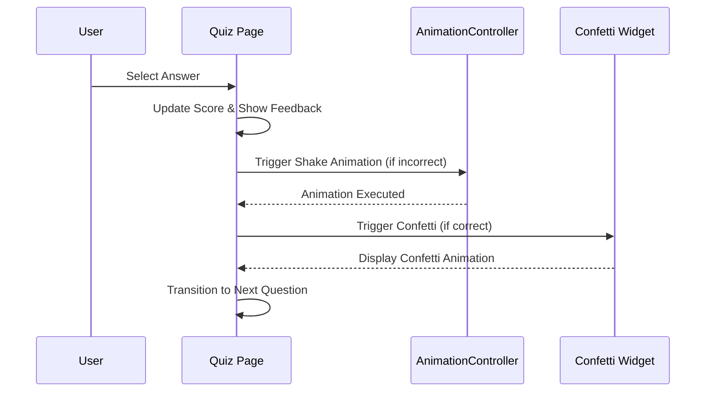

## 10.4.4 Enhancing Interactivity

In this section, we will explore how to enhance the interactivity of your Flutter Quiz App by incorporating animations and dynamic UI elements. These enhancements not only make the app more engaging but also improve the user experience by providing visual feedback and maintaining user interest throughout the quiz. We will cover several techniques, including animated progress indicators, interactive buttons, dynamic score displays, and engaging transitions.

### Adding Animated Progress Bars

Progress bars are a great way to visually indicate the user's progress through the quiz. An animated progress bar can make this feedback more dynamic and engaging. In Flutter, you can use the `LinearProgressIndicator` widget to create a simple progress bar. By animating the progress value, you can provide a smooth transition as the user advances through the quiz.

#### Implementing an Animated Progress Bar

Here's how you can implement an animated progress bar in your quiz app:

```dart
@override
Widget build(BuildContext context) {
  return Scaffold(
    appBar: AppBar(
      title: Text('Quiz App'),
      bottom: PreferredSize(
        preferredSize: Size.fromHeight(4.0),
        child: LinearProgressIndicator(
          value: (_currentQuestionIndex + 1) / questions.length,
          backgroundColor: Colors.grey[300],
          valueColor: AlwaysStoppedAnimation<Color>(Colors.blue),
        ),
      ),
    ),
    body: _buildQuizBody(),
  );
}
```

In this example, the `LinearProgressIndicator` is used to show the user's progress. The `value` property is calculated based on the current question index and the total number of questions. This creates a smooth transition as the user moves from one question to the next.

### Interactive Buttons with Hover and Press Animations

Interactive buttons can significantly enhance the user experience by providing immediate feedback on user actions. Flutter's `ElevatedButton` widget can be customized to include animations for hover and press states, making the buttons more responsive and engaging.

#### Creating Interactive Buttons

To create buttons with hover and press animations, you can use the `ElevatedButton.styleFrom` method to customize the button's appearance:

```dart
ElevatedButton(
  style: ElevatedButton.styleFrom(
    primary: _isCorrect
        ? Colors.green
        : (_showFeedback && !answer.isCorrect
            ? Colors.red
            : Colors.blue),
    onPrimary: Colors.white,
    shadowColor: Colors.black,
    elevation: 5,
    shape: RoundedRectangleBorder(
      borderRadius: BorderRadius.circular(10),
    ),
  ),
  onPressed: () => _answerQuestion(answer.isCorrect),
  child: Text(answer.text),
)
```

In this code snippet, the button's color changes based on whether the answer is correct or incorrect, providing immediate visual feedback. The `elevation` and `shape` properties are used to add depth and rounded corners, enhancing the button's interactivity.

### Animations to Highlight Correct or Incorrect Answers

Animations can be used to draw attention to correct or incorrect answers, making the quiz more engaging. For example, you can use a shake animation to indicate an incorrect answer or a confetti animation to celebrate a correct answer.

#### Implementing Shake and Confetti Animations

Here's how you can implement these animations in your quiz app:

```dart
void _answerQuestion(bool isCorrect) {
  setState(() {
    _isCorrect = isCorrect;
    _showFeedback = true;
    if (isCorrect) _score++;
  });
  if (!isCorrect) {
    _controller.forward().then((_) => _controller.reverse());
  } else {
    _confettiController.forward();
  }
  Future.delayed(Duration(seconds: 2), () {
    setState(() {
      _showFeedback = false;
      _currentQuestionIndex++;
      if (_isCorrect) _confettiController.reset();
    });
  });
}
```

In this example, the `_controller` is used to trigger a shake animation for incorrect answers, while the `_confettiController` triggers a confetti animation for correct answers. These animations provide immediate feedback and make the quiz more interactive.

### Engaging Transitions Between Sections

Transitions between different sections of the app can be enhanced with animations to maintain user interest. Flutter provides several built-in animations and transition widgets that can be used to create smooth and engaging transitions.

#### Creating Engaging Transitions

To create engaging transitions, you can use the `PageRouteBuilder` to define custom transitions between pages:

```dart
Navigator.push(
  context,
  PageRouteBuilder(
    pageBuilder: (context, animation, secondaryAnimation) => NextPage(),
    transitionsBuilder: (context, animation, secondaryAnimation, child) {
      const begin = Offset(1.0, 0.0);
      const end = Offset.zero;
      const curve = Curves.ease;

      var tween = Tween(begin: begin, end: end).chain(CurveTween(curve: curve));

      var offsetAnimation = animation.drive(tween);

      return SlideTransition(
        position: offsetAnimation,
        child: child,
      );
    },
  ),
);
```

In this code snippet, a `SlideTransition` is used to create a sliding effect when navigating to the next page. The `PageRouteBuilder` allows you to customize the transition animation, making the app more dynamic and engaging.

### Incorporating Playful Elements

Adding playful elements like confetti or badges for high scores can make the quiz more enjoyable and rewarding. These elements can be implemented using animations and custom widgets.

#### Implementing Confetti and Badges

To implement a confetti effect, you can use a custom `ConfettiWidget`:

```dart
class ConfettiWidget extends StatelessWidget {
  final AnimationController animationController;
  final bool shouldLoop;

  ConfettiWidget({required this.animationController, this.shouldLoop = false});

  @override
  Widget build(BuildContext context) {
    // Implement a simple confetti effect or integrate a confetti package
    return Container(); // Placeholder
  }
}
```

This widget can be triggered when the user answers a question correctly, providing a celebratory effect. Similarly, you can create badges or other visual rewards to recognize high scores or achievements.

### Ensuring Complementary Animations

While animations can enhance interactivity, it's important to ensure they complement the app's functionality without overwhelming the user. Animations should be used sparingly and purposefully to enhance the user experience.

#### Best Practices for Using Animations

- **Keep It Simple:** Use animations to enhance, not distract. Avoid overly complex animations that can confuse users.
- **Be Consistent:** Maintain consistency in animation styles and durations to create a cohesive user experience.
- **Provide Feedback:** Use animations to provide feedback on user actions, such as confirming a button press or highlighting a correct answer.
- **Test on Devices:** Ensure animations perform well on different devices and screen sizes to maintain a smooth user experience.

### Conclusion

By incorporating these techniques, you can significantly enhance the interactivity of your Flutter Quiz App. Animations and dynamic UI elements not only make the app more engaging but also improve the overall user experience by providing visual feedback and maintaining user interest. Remember to use animations purposefully and ensure they complement the app's functionality without overwhelming the user.

### Further Exploration

For more information on Flutter animations and interactivity, consider exploring the following resources:

- [Flutter Animations Documentation](https://flutter.dev/docs/development/ui/animations)
- [Flutter Widget of the Week: AnimatedContainer](https://www.youtube.com/watch?v=yI-8QHpGIP4)
- [Flutter Cookbook: Animations](https://flutter.dev/docs/cookbook/animation)

These resources provide additional insights and examples to help you master animations and interactivity in Flutter.



## Quiz Time!



### What is the primary purpose of using animations in a Flutter Quiz App?

- [x] To enhance user engagement and provide visual feedback.
- [ ] To make the app more complex.
- [ ] To reduce app performance.
- [ ] To increase development time.

> **Explanation:** Animations are used to enhance user engagement and provide visual feedback, making the app more interactive and enjoyable.

### How can you implement an animated progress bar in Flutter?

- [x] By using the `LinearProgressIndicator` widget.
- [ ] By using the `CircularProgressIndicator` widget.
- [ ] By using the `AnimatedBuilder` widget.
- [ ] By using the `Opacity` widget.

> **Explanation:** The `LinearProgressIndicator` widget is used to create an animated progress bar in Flutter.

### What is the purpose of using `ElevatedButton.styleFrom` in Flutter?

- [x] To customize the appearance of buttons with animations.
- [ ] To create a new button widget.
- [ ] To disable button functionality.
- [ ] To remove button animations.

> **Explanation:** `ElevatedButton.styleFrom` is used to customize the appearance of buttons, including adding animations for hover and press states.

### Which animation can be used to indicate an incorrect answer in a quiz app?

- [x] Shake animation.
- [ ] Fade animation.
- [ ] Scale animation.
- [ ] Rotate animation.

> **Explanation:** A shake animation is often used to indicate an incorrect answer, providing immediate visual feedback.

### How can you create engaging transitions between sections in a Flutter app?

- [x] By using `PageRouteBuilder` with custom transitions.
- [ ] By using `Navigator.pop`.
- [ ] By using `Opacity` widget.
- [ ] By using `Text` widget.

> **Explanation:** `PageRouteBuilder` allows you to define custom transitions between pages, creating engaging transitions.

### What is a best practice when using animations in a Flutter app?

- [x] Keep animations simple and purposeful.
- [ ] Use as many animations as possible.
- [ ] Avoid using animations.
- [ ] Use complex animations to impress users.

> **Explanation:** Keeping animations simple and purposeful ensures they enhance the user experience without overwhelming the user.

### What is the role of `ConfettiWidget` in the quiz app?

- [x] To display a celebratory effect for correct answers.
- [ ] To handle incorrect answers.
- [ ] To manage user input.
- [ ] To update the score.

> **Explanation:** `ConfettiWidget` is used to display a celebratory effect, such as confetti, when a user answers correctly.

### Why is it important to test animations on different devices?

- [x] To ensure animations perform well across various screen sizes and devices.
- [ ] To increase development time.
- [ ] To make the app more complex.
- [ ] To reduce app performance.

> **Explanation:** Testing animations on different devices ensures they perform well and provide a smooth user experience across various screen sizes.

### What should you consider when adding playful elements like confetti to your app?

- [x] Ensure they complement the app's functionality and do not overwhelm the user.
- [ ] Use them as frequently as possible.
- [ ] Avoid using them altogether.
- [ ] Use them to replace core app functionality.

> **Explanation:** Playful elements should complement the app's functionality and enhance the user experience without overwhelming the user.

### True or False: Animations should be used sparingly and purposefully to enhance the user experience.

- [x] True
- [ ] False

> **Explanation:** Animations should be used sparingly and purposefully to enhance the user experience without distracting or overwhelming the user.


