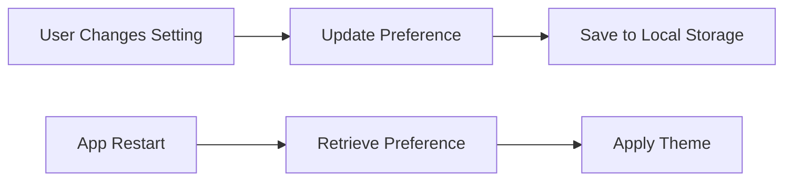

## 11.1.1 Why Persist Data?

In the realm of mobile application development, data persistence is a cornerstone that significantly enhances the user experience and functionality of apps. By understanding and implementing data persistence, developers can create applications that remember user preferences, maintain session states, and provide seamless offline access to data. This section delves into the concept of data persistence, its benefits, and practical applications, providing insights and examples to guide developers in leveraging this essential feature.

### Understanding Data Persistence

**Data persistence** refers to the ability of an application to save data in a non-volatile storage medium, ensuring that the data remains available even after the application is closed or the device is restarted. This capability is crucial for mobile applications, where users expect their data to be retained across sessions, enhancing the overall usability and satisfaction with the app.

#### Definition and Role in Mobile Apps

In mobile applications, data persistence plays a pivotal role in maintaining continuity and personalization. It allows apps to store user-specific information such as settings, preferences, and progress, which can be retrieved and applied when the app is reopened. This not only improves the user experience by providing a personalized interface but also ensures that users do not have to re-enter information or reconfigure settings every time they use the app.

### Benefits of Persisting Data

Persisting data in mobile applications offers numerous advantages that contribute to a more robust and user-friendly experience. Here are some key benefits:

- **Improved User Experience:** By saving user preferences and settings, apps can offer a personalized experience that aligns with the user's expectations and past interactions. For example, an app can remember a user's preferred language, theme, or notification settings, providing a seamless experience across sessions.

- **Offline Data Access:** Data persistence enables apps to function without an active internet connection by storing essential data locally. This is particularly beneficial for apps that require access to information in areas with limited connectivity, such as travel apps or offline maps.

- **Maintaining User Sessions and Authentication States:** Persisting authentication tokens or session data allows users to remain logged in, eliminating the need to re-enter credentials each time they open the app. This is crucial for apps that require secure access, such as banking or social media applications.

- **Storing Application State and Progress:** For apps that involve user progress, such as games or educational tools, data persistence ensures that users can pick up where they left off, maintaining continuity and engagement.

### Real-World Scenarios

To illustrate the necessity of data persistence, consider the following real-world scenarios:

- **E-commerce Apps:** Persisting user preferences, shopping cart contents, and browsing history allows users to have a consistent shopping experience, even if they switch devices or close the app temporarily.

- **Fitness Trackers:** These apps rely on data persistence to store workout history, goals, and achievements, enabling users to track their progress over time.

- **News Applications:** By caching articles and user preferences, news apps can provide personalized content recommendations and offline reading capabilities.

### Transient vs. Persistent Data

In the context of mobile applications, it's important to distinguish between transient and persistent data:

- **Transient Data:** This type of data is temporary and only exists during the app's runtime. It is typically stored in memory and is lost when the app is closed or the device is restarted. Examples include temporary variables or session data that do not need to be retained.

- **Persistent Data:** Unlike transient data, persistent data is stored in a way that survives app closures and device restarts. It is saved in local storage, databases, or remote servers, ensuring long-term availability. Examples include user preferences, saved files, and database records.

### Practical Code Example

To demonstrate how data persistence can be implemented in a Flutter application, consider the following example, which saves and retrieves a user's theme preference using the `shared_preferences` package:

```dart
// Example scenario: Saving and retrieving user theme preference
import 'package:shared_preferences/shared_preferences.dart';

Future<void> saveThemePreference(bool isDarkMode) async {
  final prefs = await SharedPreferences.getInstance();
  await prefs.setBool('isDarkMode', isDarkMode);
}

Future<bool> getThemePreference() async {
  final prefs = await SharedPreferences.getInstance();
  return prefs.getBool('isDarkMode') ?? false;
}
```

In this example, the `saveThemePreference` function stores the user's theme choice (dark mode or light mode) in local storage, while the `getThemePreference` function retrieves this preference when the app is launched. This ensures that the user's theme choice is remembered across sessions, enhancing the app's usability.

### Visualizing Data Persistence

To further illustrate the process of data persistence, consider the following diagram, which outlines the flow of saving and retrieving user preferences:



In this diagram, the user's action of changing a setting triggers an update to the preference, which is then saved to local storage. Upon restarting the app, the preference is retrieved and applied, ensuring a consistent user experience.

### Best Practices and Considerations

When implementing data persistence in mobile applications, consider the following best practices:

- **Choose the Right Storage Solution:** Depending on the type and size of data, select an appropriate storage solution, such as shared preferences for simple key-value pairs or a database for complex data structures.

- **Ensure Data Security:** Protect sensitive data by encrypting it before storing it locally, especially for applications that handle personal or financial information.

- **Optimize for Performance:** Minimize the impact on app performance by efficiently managing data storage and retrieval operations, particularly for large datasets.

- **Handle Data Consistency:** Implement mechanisms to ensure data consistency, especially when syncing data between local storage and remote servers.

### Conclusion

Data persistence is a fundamental aspect of mobile application development that significantly enhances user experience and functionality. By understanding the importance of persisting data and implementing it effectively, developers can create applications that are not only user-friendly but also robust and reliable. Whether it's saving user preferences, maintaining session states, or providing offline access, data persistence is an essential tool in the developer's toolkit.

### Further Exploration

For those interested in diving deeper into data persistence and local storage in Flutter, consider exploring the following resources:

- [Flutter Documentation on Persistence](https://flutter.dev/docs/development/data-and-backend/state-mgmt/intro)
- [Shared Preferences Package](https://pub.dev/packages/shared_preferences)
- [SQLite and sqflite Package](https://pub.dev/packages/sqflite)

These resources provide comprehensive guides and examples to help you master data persistence in your Flutter applications.

## Quiz Time!



### What is data persistence in mobile applications?

- [x] The ability to save data in a non-volatile storage medium
- [ ] The process of deleting user data after app closure
- [ ] A method to increase app performance
- [ ] A technique to enhance app graphics

> **Explanation:** Data persistence refers to saving data in a way that it remains available even after the app is closed or the device is restarted.

### Which of the following is a benefit of data persistence?

- [x] Improved user experience through saved preferences
- [ ] Increased app size
- [ ] Slower app performance
- [ ] Reduced security

> **Explanation:** Data persistence improves user experience by saving preferences and settings, allowing for a personalized and seamless experience.

### What is the difference between transient and persistent data?

- [x] Transient data is temporary, while persistent data is stored long-term
- [ ] Transient data is stored in databases, while persistent data is in memory
- [ ] Transient data is encrypted, while persistent data is not
- [ ] Transient data is user-specific, while persistent data is app-specific

> **Explanation:** Transient data is temporary and lost when the app closes, whereas persistent data is stored long-term and survives app closures.

### Which package is used in Flutter for simple key-value storage?

- [x] shared_preferences
- [ ] sqflite
- [ ] firebase_auth
- [ ] http

> **Explanation:** The `shared_preferences` package is used for simple key-value storage in Flutter applications.

### What is a real-world scenario where data persistence is essential?

- [x] Saving user login states in a social media app
- [ ] Displaying a splash screen
- [ ] Animating a button
- [ ] Changing app icons

> **Explanation:** Persisting login states is crucial for user convenience and security in apps like social media platforms.

### How does data persistence enhance offline data access?

- [x] By storing data locally for access without an internet connection
- [ ] By increasing internet speed
- [ ] By reducing app size
- [ ] By encrypting all data

> **Explanation:** Data persistence allows apps to store data locally, enabling access even without an internet connection.

### What should be considered when choosing a storage solution?

- [x] Type and size of data
- [ ] Color scheme of the app
- [ ] Number of app users
- [ ] Device screen size

> **Explanation:** The type and size of data determine the appropriate storage solution, such as shared preferences or databases.

### Why is data security important in data persistence?

- [x] To protect sensitive information from unauthorized access
- [ ] To increase app download speed
- [ ] To enhance app graphics
- [ ] To reduce app size

> **Explanation:** Data security is crucial to protect sensitive information, especially in apps handling personal or financial data.

### What is a common method to ensure data consistency?

- [x] Syncing data between local storage and remote servers
- [ ] Using only transient data
- [ ] Avoiding data storage
- [ ] Increasing app size

> **Explanation:** Syncing data between local and remote storage helps maintain consistency and accuracy.

### True or False: Data persistence is only necessary for large applications.

- [ ] True
- [x] False

> **Explanation:** Data persistence is important for applications of all sizes to enhance user experience and functionality.


