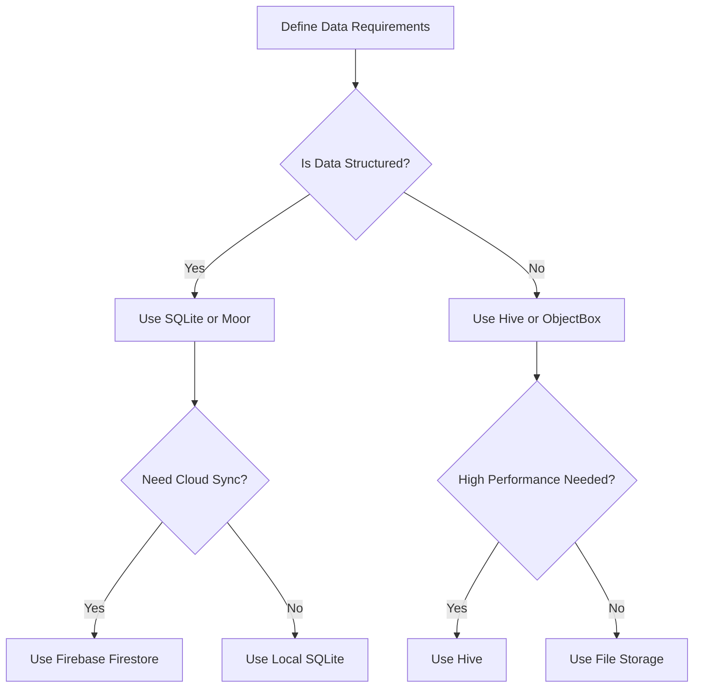

## 11.1.3 Choosing the Right Data Storage Solution for Flutter Apps

In the realm of mobile app development, selecting the appropriate data storage solution is crucial for ensuring optimal performance, scalability, and user satisfaction. This section will guide you through the decision-making process for choosing the right data storage solution for your Flutter application. We'll explore various factors such as data complexity, scalability, performance, ease of use, and platform compatibility. By the end of this section, you'll be equipped with the knowledge to make informed decisions tailored to your app's specific needs.

### Assessing Data Requirements

The first step in choosing a data storage solution is understanding the nature of your data and how it will be used within your application. Consider the following aspects:

- **Nature of the Data (Structured vs. Unstructured):** Determine whether your data is structured (e.g., tabular data with defined fields) or unstructured (e.g., images, videos, or free-form text). Structured data often benefits from relational databases like SQLite, while unstructured data might be better suited for NoSQL solutions like Hive or ObjectBox.

- **Volume of Data and Growth Expectations:** Estimate the current volume of data and anticipate future growth. If your app is expected to handle large datasets or rapidly increasing data, scalability becomes a key consideration.

- **Frequency of Read/Write Operations:** Analyze how often your app will read from or write to the database. High-frequency operations require a solution that can handle frequent access efficiently.

### Performance Considerations

Performance is a critical factor in maintaining a responsive and user-friendly app. Evaluate the following:

- **Speed and Efficiency of Data Access:** Choose a storage solution that provides fast read and write operations. For instance, SQLite is known for its efficient query performance, while Hive offers high-speed access for unstructured data.

- **Impact on App Responsiveness:** Ensure that the chosen solution does not degrade the app's responsiveness. Consider using asynchronous operations to prevent blocking the main thread during data access.

### Scalability

Scalability refers to the ability of your storage solution to handle increasing amounts of data and users without compromising performance. Consider:

- **Ability to Handle Increasing Data Sizes and User Base:** If your app is expected to grow significantly, opt for a solution that can scale horizontally (e.g., cloud-based solutions like Firebase Firestore) or vertically (e.g., optimizing local databases).

### Offline Support

Many apps require offline capabilities to ensure a seamless user experience even without internet connectivity. Consider:

- **Necessity for Data Access Without Internet Connectivity:** If offline access is crucial, choose a solution that supports local data storage and synchronization with the cloud when connectivity is restored.

### Ease of Integration

The ease with which a storage solution can be integrated into your app affects development time and complexity. Consider:

- **Learning Curve and Developer Familiarity:** Choose a solution that aligns with your team's expertise. SQLite is widely known and documented, while newer solutions like Hive may require additional learning.

- **Availability of Documentation and Community Support:** Opt for solutions with comprehensive documentation and active community support to facilitate troubleshooting and learning.

### Security Requirements

Data security is paramount, especially if your app handles sensitive information. Consider:

- **Sensitivity of the Data and Need for Encryption:** Ensure that the chosen solution supports encryption and secure data handling practices. For instance, Hive provides built-in encryption support.

### Platform Compatibility

Your app's target platforms will influence your choice of storage solution. Consider:

- **Support Across iOS, Android, Web, and Desktop:** Ensure that the solution you choose is compatible with all platforms your app targets. Flutter's cross-platform nature makes it essential to select a solution that works seamlessly across different environments.

### Cost Implications

Finally, consider the financial aspect of your storage solution. Evaluate:

- **Licensing Fees or Costs Associated with Cloud Services:** Some solutions may incur costs, especially cloud-based ones. Assess your budget and choose a solution that aligns with your financial constraints.

### Decision-Making Process

To aid in your decision-making process, consider the following decision tree, which outlines potential storage solutions based on your app's requirements:

### Practical Example: Choosing a Storage Solution

Let's consider a practical example to illustrate the decision-making process:

**Scenario:** You are developing a note-taking app that allows users to create, edit, and view notes. The app should work offline and sync data when the internet is available.

1. **Assess Data Requirements:**
   - The data is structured (notes with titles and content).
   - The volume of data is moderate, with potential growth as users add more notes.
   - Read/write operations are frequent as users interact with notes.

2. **Performance Considerations:**
   - Fast access to notes is crucial for a smooth user experience.

3. **Scalability:**
   - The app should handle an increasing number of notes as users grow.

4. **Offline Support:**
   - Users need access to notes offline, with synchronization when online.

5. **Ease of Integration:**
   - The development team is familiar with SQLite and Firebase.

6. **Security Requirements:**
   - Notes may contain sensitive information, requiring encryption.

7. **Platform Compatibility:**
   - The app targets iOS and Android platforms.

8. **Cost Implications:**
   - Budget constraints favor solutions with minimal costs.

**Solution:** Based on these requirements, a combination of SQLite for local storage and Firebase Firestore for cloud synchronization would be appropriate. SQLite provides efficient local data handling, while Firebase Firestore offers seamless cloud sync capabilities.

### Conclusion

Choosing the right data storage solution for your Flutter app involves a careful evaluation of various factors, including data requirements, performance, scalability, offline support, ease of integration, security, platform compatibility, and cost. By understanding these aspects and using decision-making tools like comparison tables and decision trees, you can make informed choices that align with your app's goals and constraints.

### Further Reading and Resources

- [Flutter Documentation on Data Persistence](https://flutter.dev/docs/cookbook/persistence)
- [SQLite Official Documentation](https://www.sqlite.org/docs.html)
- [Firebase Firestore Documentation](https://firebase.google.com/docs/firestore)
- [Hive Documentation](https://docs.hivedb.dev/)
- [ObjectBox Documentation](https://objectbox.io/)

By exploring these resources, you can deepen your understanding of data storage solutions and their applications in Flutter development.

## Quiz Time!



### Which factor is crucial when assessing data requirements for a storage solution?

- [x] Nature of the data (structured vs. unstructured)
- [ ] Color scheme of the app
- [ ] Number of developers on the team
- [ ] Type of IDE used

> **Explanation:** Understanding whether the data is structured or unstructured helps determine the appropriate storage solution, such as using a relational database for structured data.

### What is a key consideration for ensuring app responsiveness?

- [ ] Using bright colors in the UI
- [x] Speed and efficiency of data access
- [ ] Number of screens in the app
- [ ] Type of animations used

> **Explanation:** Fast data access is crucial for maintaining app responsiveness, ensuring that users experience minimal delays when interacting with the app.

### Why is scalability important in choosing a data storage solution?

- [x] It allows the app to handle increasing data sizes and user base.
- [ ] It determines the color scheme of the app.
- [ ] It affects the number of developers needed.
- [ ] It influences the choice of programming language.

> **Explanation:** Scalability ensures that the app can grow with increasing data and users without performance degradation.

### What is a benefit of using Firebase Firestore for data storage?

- [ ] It only works offline.
- [x] It provides cloud synchronization capabilities.
- [ ] It requires no internet connection.
- [ ] It is only available for Android apps.

> **Explanation:** Firebase Firestore offers cloud synchronization, making it suitable for apps that need to sync data across devices.

### Which storage solution is recommended for high-performance unstructured data?

- [ ] SQLite
- [x] Hive
- [ ] Firebase Firestore
- [ ] Local file storage

> **Explanation:** Hive is known for its high-speed access and is suitable for unstructured data, making it a good choice for performance-intensive applications.

### What is a key advantage of using SQLite for local storage?

- [ ] It is only available for web apps.
- [x] It provides efficient query performance for structured data.
- [ ] It requires a cloud connection.
- [ ] It is not suitable for mobile apps.

> **Explanation:** SQLite is efficient for handling structured data and provides fast query performance, making it ideal for local storage needs.

### Why is offline support important for some apps?

- [x] It allows users to access data without internet connectivity.
- [ ] It reduces the number of app screens.
- [ ] It increases the app's color options.
- [ ] It limits the app to Android devices only.

> **Explanation:** Offline support ensures that users can access and interact with app data even when they are not connected to the internet.

### What should be considered regarding security requirements for data storage?

- [ ] The app's color scheme
- [x] Sensitivity of the data and need for encryption
- [ ] Number of developers on the team
- [ ] Type of animations used

> **Explanation:** Ensuring data security, especially for sensitive information, is crucial and may require encryption and secure handling practices.

### Which factor affects the ease of integration of a storage solution?

- [ ] The app's color scheme
- [x] Learning curve and developer familiarity
- [ ] Number of app screens
- [ ] Type of animations used

> **Explanation:** The ease of integration depends on how familiar developers are with the storage solution and the availability of documentation and support.

### True or False: Platform compatibility is not important when choosing a data storage solution for a Flutter app.

- [ ] True
- [x] False

> **Explanation:** Platform compatibility is crucial for ensuring that the chosen storage solution works seamlessly across all target platforms of the app.


