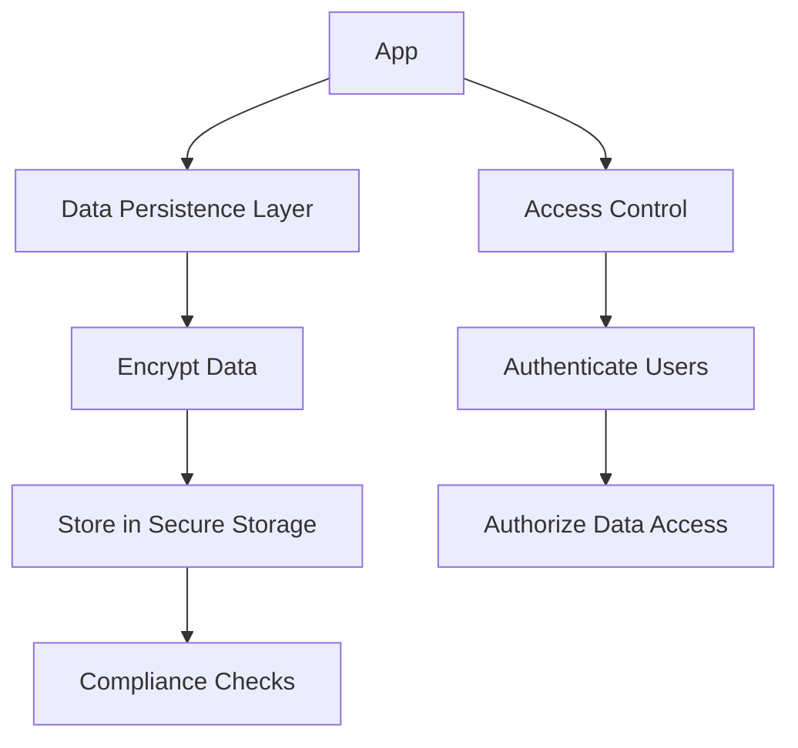

## 11.1.4 Security Considerations

In the realm of mobile app development, data persistence is a double-edged sword. While it enables apps to store and retrieve user data efficiently, it also introduces potential security vulnerabilities that can compromise user privacy. As developers, it is imperative to implement robust security measures to protect persisted data, ensuring compliance with data protection regulations and safeguarding sensitive information. This section delves into the critical aspects of securing data persistence in Flutter applications, offering best practices, practical examples, and guidelines for implementing effective security strategies.

### Importance of Data Security

Data security is paramount in today's digital landscape, where data breaches and unauthorized access can lead to severe consequences, including identity theft, financial loss, and reputational damage. By securing persisted data, developers can:

- Protect user privacy and build trust.
- Comply with legal and regulatory requirements.
- Prevent unauthorized access and data breaches.
- Ensure data integrity and confidentiality.

### Data Encryption

Encryption is a fundamental security measure that transforms readable data into an unreadable format, ensuring that only authorized parties can access it. In the context of Flutter apps, encryption should be applied to data both at rest and in transit.

#### Encrypting Data at Rest

Data at rest refers to inactive data stored on a device. Encrypting this data ensures that even if the storage medium is compromised, the data remains inaccessible without the decryption key.

- **Use Secure Encryption Libraries:** Leverage well-established libraries such as `flutter_secure_storage` to encrypt data stored locally. These libraries provide a straightforward API for secure data storage.

- **Avoid Plain Text Storage:** Never store sensitive information, such as passwords or personal data, in plain text. Always encrypt data before persisting it.

#### Encrypting Data in Transit

Data in transit is data actively moving from one location to another, such as over a network. Encrypting data in transit protects it from interception and eavesdropping.

- **Use HTTPS:** Ensure all network communications are conducted over HTTPS, which encrypts data using SSL/TLS protocols.

- **Implement End-to-End Encryption:** For highly sensitive data, consider implementing end-to-end encryption, ensuring that data remains encrypted from the sender to the receiver.

### Secure Storage Solutions

Choosing the right storage solution is crucial for maintaining data security. Flutter provides several options for secure storage, each with its own strengths and use cases.

#### Platform-Specific Secure Storage

- **iOS Keychain:** Use the iOS Keychain to store sensitive data securely. The Keychain provides a secure way to store small amounts of sensitive data, such as passwords and tokens.

- **Android Keystore:** On Android, the Keystore system allows you to store cryptographic keys in a container, making them more difficult to extract from the device.

#### Avoiding Plain Text Storage

- **Use Encrypted Databases:** When dealing with larger datasets, consider using encrypted databases like SQLCipher, which encrypts the entire database file.

- **Secure Preferences:** Use libraries like `flutter_secure_storage` to securely store key-value pairs, ensuring that even simple preferences are protected.

### Access Controls

Implementing robust access controls is essential to restrict data access to authorized users only. This involves both authentication and authorization mechanisms.

#### Authentication

- **User Authentication:** Implement user authentication to verify the identity of users accessing the app. Use secure authentication methods such as OAuth, JWT, or biometric authentication.

- **Session Management:** Ensure that user sessions are managed securely, with session tokens stored in secure storage and refreshed periodically.

#### Authorization

- **Role-Based Access Control (RBAC):** Implement RBAC to restrict access to certain features or data based on user roles. This ensures that users can only access data they are authorized to view or modify.

- **Least Privilege Principle:** Follow the principle of least privilege, granting users the minimum level of access necessary to perform their tasks.

### Handling Sensitive Information

Sensitive information, such as credentials, tokens, and personal user data, requires special handling to prevent unauthorized access and misuse.

#### Best Practices for Storing Sensitive Data

- **Environment Variables:** Use environment variables to manage sensitive information like API keys and secrets, keeping them out of the source code.

- **Secure APIs:** When interacting with external services, use secure APIs that require authentication and provide encrypted communication.

#### Managing Secrets

- **Secret Management Tools:** Use secret management tools like AWS Secrets Manager or HashiCorp Vault to securely store and manage sensitive information.

- **Regular Key Rotation:** Regularly rotate encryption keys and access tokens to minimize the risk of exposure.

### Compliance with Regulations

Compliance with data protection regulations is not just a legal obligation but also a best practice for ensuring user trust and data security.

#### Understanding Data Protection Laws

- **GDPR:** The General Data Protection Regulation (GDPR) is a comprehensive data protection law in the EU that mandates strict data handling and privacy requirements.

- **CCPA:** The California Consumer Privacy Act (CCPA) provides similar protections for residents of California, emphasizing transparency and user rights.

#### Ensuring Compliance

- **Data Minimization:** Collect only the data necessary for the app's functionality, reducing the risk of data breaches.

- **User Consent:** Obtain explicit user consent for data collection and processing, providing clear information about how data will be used.

- **Data Subject Rights:** Implement mechanisms to allow users to exercise their rights, such as accessing, correcting, or deleting their data.

### Regular Audits and Updates

Security is an ongoing process that requires regular audits and updates to stay ahead of potential threats.

#### Periodic Security Audits

- **Vulnerability Assessments:** Conduct regular vulnerability assessments to identify and address security weaknesses.

- **Penetration Testing:** Perform penetration testing to simulate attacks and evaluate the app's defenses.

#### Staying Informed

- **Security Patches:** Stay informed about security vulnerabilities and apply patches promptly to protect against known threats.

- **Community Engagement:** Engage with the developer community to share knowledge and stay updated on the latest security practices.

### Practical Code Example

Here's a practical example of using `flutter_secure_storage` to securely store sensitive data in a Flutter app:

```dart
import 'package:flutter_secure_storage/flutter_secure_storage.dart';

// Create an instance of FlutterSecureStorage
final storage = FlutterSecureStorage();

// Writing data securely
Future<void> writeSecureData(String key, String value) async {
  await storage.write(key: key, value: value);
}

// Reading data securely
Future<String?> readSecureData(String key) async {
  return await storage.read(key: key);
}

// Deleting data securely
Future<void> deleteSecureData(String key) async {
  await storage.delete(key: key);
}
```

### Visualizing Security Measures

The following Mermaid.js diagram illustrates the flow of data security measures in a Flutter app:



### Conclusion

Securing persisted data in Flutter apps is a multifaceted challenge that requires a comprehensive approach. By implementing encryption, secure storage solutions, access controls, and compliance measures, developers can protect user data and build trust. Regular audits and staying informed about security trends are essential to maintaining robust security over time. As you continue your journey in Flutter development, prioritize data security to ensure your apps are not only functional but also safe and reliable.

## Quiz Time!



### What is the primary purpose of encrypting data at rest?

- [x] To protect data from unauthorized access if the storage medium is compromised.
- [ ] To speed up data retrieval processes.
- [ ] To reduce the size of the data stored.
- [ ] To make data readable by all applications.

> **Explanation:** Encrypting data at rest ensures that even if the storage medium is compromised, the data remains inaccessible without the decryption key, protecting it from unauthorized access.

### Which of the following is a secure storage solution for iOS?

- [x] Keychain
- [ ] Shared Preferences
- [ ] Local Storage
- [ ] SQLite

> **Explanation:** The iOS Keychain is a secure storage solution designed to store sensitive data such as passwords and tokens securely.

### What is the role of HTTPS in data security?

- [x] It encrypts data in transit, protecting it from interception.
- [ ] It compresses data to reduce bandwidth usage.
- [ ] It speeds up data transfer between client and server.
- [ ] It ensures data is stored securely on the server.

> **Explanation:** HTTPS encrypts data in transit using SSL/TLS protocols, protecting it from interception and eavesdropping during network communications.

### Why is it important to implement access controls in an app?

- [x] To restrict data access to authorized users only.
- [ ] To increase the app's performance.
- [ ] To simplify the app's codebase.
- [ ] To reduce the app's storage requirements.

> **Explanation:** Access controls are crucial for restricting data access to authorized users only, preventing unauthorized access and ensuring data security.

### Which of the following is a best practice for managing sensitive information?

- [x] Using environment variables to manage API keys and secrets.
- [ ] Storing API keys directly in the source code.
- [ ] Sharing sensitive information via email.
- [ ] Using plain text files for storing credentials.

> **Explanation:** Using environment variables to manage API keys and secrets keeps them out of the source code, enhancing security.

### What is the principle of least privilege?

- [x] Granting users the minimum level of access necessary to perform their tasks.
- [ ] Allowing all users full access to all app features.
- [ ] Denying access to all users by default.
- [ ] Granting users access based on their seniority.

> **Explanation:** The principle of least privilege involves granting users the minimum level of access necessary to perform their tasks, reducing the risk of unauthorized access.

### How can developers ensure compliance with GDPR?

- [x] By obtaining explicit user consent for data collection and processing.
- [ ] By collecting as much user data as possible.
- [ ] By storing all user data in plain text.
- [ ] By ignoring user requests for data deletion.

> **Explanation:** Ensuring compliance with GDPR involves obtaining explicit user consent for data collection and processing, among other requirements.

### What is the purpose of regular security audits?

- [x] To identify and address security weaknesses in the app.
- [ ] To increase the app's download speed.
- [ ] To reduce the app's file size.
- [ ] To improve the app's user interface.

> **Explanation:** Regular security audits help identify and address security weaknesses in the app, ensuring ongoing data protection.

### Which tool can be used for secret management in a Flutter app?

- [x] AWS Secrets Manager
- [ ] SQLite
- [ ] Shared Preferences
- [ ] Local Storage

> **Explanation:** AWS Secrets Manager is a tool for securely storing and managing sensitive information, such as API keys and secrets.

### True or False: Data minimization involves collecting only the data necessary for the app's functionality.

- [x] True
- [ ] False

> **Explanation:** Data minimization is a principle that involves collecting only the data necessary for the app's functionality, reducing the risk of data breaches.


