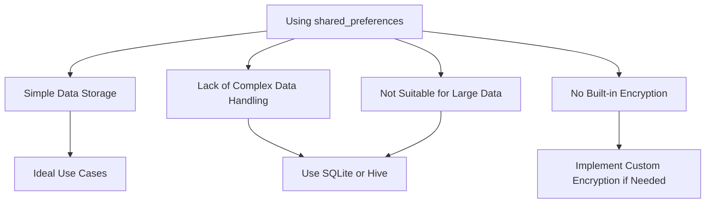

## 11.2.4 Limitations

In the realm of mobile app development, data persistence is a crucial aspect that developers must consider carefully. Flutter provides several options for local storage, one of which is the `shared_preferences` plugin. While `shared_preferences` is a convenient tool for storing simple data, it comes with several limitations that developers need to be aware of. Understanding these limitations will help you make informed decisions about when to use `shared_preferences` and when to opt for more robust storage solutions.

### Data Size Constraints

One of the primary limitations of `shared_preferences` is its inability to handle large amounts of data or complex data structures. This plugin is designed for storing simple key-value pairs, such as user preferences or small configuration settings. Attempting to store large datasets or complex objects can lead to performance issues and is generally not recommended.

#### Practical Example

Consider a scenario where you need to store a large list of items. Using `shared_preferences` for this purpose can lead to inefficiencies:

```dart
// Example scenario: Trying to store a large list (not recommended)
Future<void> saveLargeList(List<String> items) async {
  final prefs = await SharedPreferences.getInstance();
  await prefs.setStringList('large_list', items);
  // May lead to performance issues if the list is too large
}
```

In this example, storing a large list of strings can cause the app to slow down, especially if the list grows over time. This is because `shared_preferences` is not optimized for handling large data volumes.

### Performance Issues

Performance degradation is another concern when using `shared_preferences` for frequent read/write operations. Each operation involves disk I/O, which can be slow, particularly on older devices or when the app is under heavy load. This can result in a noticeable lag in the app's responsiveness.

#### Best Practices

To mitigate performance issues, limit the use of `shared_preferences` to infrequent updates and small data sets. For example, use it to store user settings that change rarely, rather than dynamic data that updates frequently.

### Lack of Relational Capabilities

`shared_preferences` lacks the ability to handle relationships between different pieces of data. It is a simple key-value store, which means it does not support complex queries or data relationships like those found in relational databases.

#### When to Consider Alternatives

If your app requires managing relationships between data entities, consider using a more sophisticated database solution such as SQLite or Hive. These databases provide the necessary tools to handle complex data structures and relationships efficiently.

### Security Concerns

Security is a significant consideration when storing sensitive data. By default, data stored in `shared_preferences` is not encrypted, making it vulnerable to unauthorized access if the device is compromised.

#### Implementing Security Measures

For apps that handle sensitive information, it is advisable to implement custom encryption mechanisms or use a storage solution that provides built-in encryption. This ensures that user data remains secure even if the device is accessed by malicious actors.

### Use Case Suitability

Given these limitations, `shared_preferences` is best suited for simple, small-scale data storage needs. It is ideal for storing:

- User preferences (e.g., theme settings, language preferences)
- Small configuration settings
- Flags or simple state indicators

For more extensive data management needs, consider alternative storage solutions.

### Alternatives for Complex Needs

When your app's requirements exceed the capabilities of `shared_preferences`, consider using more robust storage solutions such as:

- **SQLite**: A powerful relational database that supports complex queries and data relationships.
- **Hive**: A lightweight and fast NoSQL database that is easy to use and supports encryption.
- **Moor**: A reactive persistence library for Flutter and Dart, built on top of SQLite, offering a more developer-friendly API.

These alternatives provide the necessary features to handle large datasets, complex data structures, and enhanced security.

### Visualizing the Limitations

To better understand the limitations of `shared_preferences`, consider the following diagram:



### Conclusion

While `shared_preferences` is a valuable tool for certain scenarios, it is essential to recognize its limitations and choose the appropriate storage solution based on your app's specific needs. By understanding when and how to use `shared_preferences`, you can ensure that your app remains efficient, secure, and scalable.

For further exploration, consider delving into the official documentation for `shared_preferences`, SQLite, Hive, and Moor. Additionally, online courses and articles on data persistence in Flutter can provide deeper insights and practical examples.

## Quiz Time!



### What is a primary limitation of using `shared_preferences` for data storage?

- [x] It cannot handle large amounts of data or complex data structures.
- [ ] It is only available on Android devices.
- [ ] It requires internet access to function.
- [ ] It automatically encrypts all stored data.

> **Explanation:** `shared_preferences` is designed for simple key-value storage and is not suitable for large datasets or complex data structures.

### How can performance issues arise when using `shared_preferences`?

- [x] Excessive read/write operations can lead to performance degradation.
- [ ] It requires a lot of memory to operate.
- [ ] It only works with high-speed internet connections.
- [ ] It is incompatible with most mobile devices.

> **Explanation:** Frequent read/write operations involve disk I/O, which can slow down the app, especially on older devices.

### What is a significant security concern with `shared_preferences`?

- [x] Data is not encrypted by default.
- [ ] It automatically shares data with other apps.
- [ ] It requires user authentication for every read/write operation.
- [ ] It stores data in the cloud by default.

> **Explanation:** Data stored in `shared_preferences` is not encrypted, making it vulnerable to unauthorized access if the device is compromised.

### When is `shared_preferences` most suitable for use?

- [x] For storing simple, small-scale data like user preferences.
- [ ] For managing large databases with complex relationships.
- [ ] For storing real-time data updates.
- [ ] For encrypting sensitive user information.

> **Explanation:** `shared_preferences` is ideal for simple data storage needs, such as user preferences and small configuration settings.

### Which of the following is NOT an alternative to `shared_preferences` for complex data needs?

- [ ] SQLite
- [ ] Hive
- [ ] Moor
- [x] HTTP

> **Explanation:** HTTP is a protocol for network communication, not a local storage solution. SQLite, Hive, and Moor are suitable alternatives for complex data storage needs.

### What should you consider using if your app requires handling relationships between data entities?

- [x] SQLite or Hive
- [ ] Only `shared_preferences`
- [ ] HTTP requests
- [ ] JSON files

> **Explanation:** SQLite and Hive provide the necessary tools to handle complex data structures and relationships efficiently.

### How can you enhance security when using `shared_preferences`?

- [x] Implement custom encryption mechanisms.
- [ ] Store data in plain text for easy access.
- [ ] Use HTTP to transfer data securely.
- [ ] Avoid storing any user data.

> **Explanation:** Implementing custom encryption mechanisms can help secure data stored in `shared_preferences`.

### Which of the following is a common pitfall when using `shared_preferences`?

- [x] Attempting to store large datasets.
- [ ] Using it for temporary data storage.
- [ ] Storing user preferences.
- [ ] Using it for configuration settings.

> **Explanation:** `shared_preferences` is not optimized for handling large datasets, which can lead to performance issues.

### What is a recommended practice to avoid performance issues with `shared_preferences`?

- [x] Limit its use to infrequent updates and small data sets.
- [ ] Use it for all types of data storage needs.
- [ ] Store data in encrypted format by default.
- [ ] Avoid using it on older devices.

> **Explanation:** Limiting the use of `shared_preferences` to infrequent updates and small data sets helps mitigate performance issues.

### True or False: `shared_preferences` is a relational database.

- [ ] True
- [x] False

> **Explanation:** `shared_preferences` is a simple key-value store and does not support relational database features.


