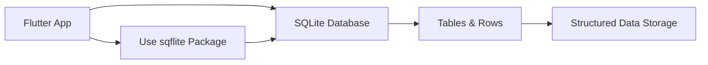

## 11.3.1 Introduction to SQLite

In the realm of mobile app development, managing data efficiently is crucial for creating robust and user-friendly applications. SQLite, a powerful relational database system, offers a compelling solution for local data storage in Flutter apps. This section delves into SQLite's integration with Flutter through the `sqflite` package, highlighting its benefits, use cases, and how it compares to other database solutions.

### What is SQLite?

SQLite is a lightweight, serverless, and self-contained SQL database engine. Unlike traditional database systems, SQLite does not require a separate server process, making it an ideal choice for mobile applications where simplicity and efficiency are paramount. Here are some key characteristics of SQLite:

- **Lightweight**: SQLite is designed to be compact and efficient, with a small footprint that makes it suitable for mobile devices.
- **Serverless**: It operates directly within the application, eliminating the need for a separate server, which simplifies deployment and reduces overhead.
- **Self-contained**: All database functionalities are contained within a single library, making it easy to integrate and manage.

### Benefits of Using SQLite in Flutter

SQLite offers several advantages when used in Flutter applications, particularly for managing structured data:

- **Structured Data Storage**: SQLite allows developers to store data in tables with defined schemas, supporting complex relationships and data integrity.
- **Support for Complex Queries**: With full SQL support, SQLite enables developers to perform sophisticated queries and transactions, enhancing data manipulation capabilities.
- **Offline Data Access**: SQLite stores data locally on the device, ensuring that apps can function without an internet connection and synchronize data when connectivity is restored.

### Use Cases for SQLite

SQLite is versatile and can be used in various scenarios within Flutter applications:

- **Storing User-Generated Content**: Apps that allow users to create and manage content, such as notes or tasks, can benefit from SQLite's structured storage.
- **App Settings and Preferences**: Persisting user settings and preferences locally ensures a consistent user experience across sessions.
- **Managing Relational Data**: Applications that require complex data relationships, such as e-commerce apps with users and orders, can leverage SQLite's relational capabilities.

### Integration with Flutter

The `sqflite` package is the go-to solution for integrating SQLite into Flutter applications. It provides a simple API for interacting with SQLite databases, making it easy to perform CRUD (Create, Read, Update, Delete) operations. Here's a high-level overview of how SQLite operates within a Flutter app:

- **Compatibility**: The `sqflite` package is compatible with both iOS and Android platforms, ensuring cross-platform functionality.
- **Ease of Use**: With `sqflite`, developers can execute SQL commands directly or use helper methods for common operations, streamlining database interactions.

### Comparison with Other Databases

When choosing a database solution for your Flutter app, it's essential to consider the specific needs of your application. Here's how SQLite compares to other popular databases:

- **SQLite vs. NoSQL Solutions**: While SQLite excels at managing structured data with complex relationships, NoSQL databases like Hive or Firestore are better suited for unstructured data and real-time synchronization.
- **Offline Capabilities**: SQLite's local storage is advantageous for offline access, whereas Firestore offers cloud-based storage with offline caching.

### Conclusion

SQLite, integrated via the `sqflite` package, provides a robust solution for local data storage in Flutter applications. Its structured data management, support for complex queries, and offline capabilities make it an excellent choice for many app scenarios. By understanding SQLite's benefits and use cases, developers can make informed decisions about incorporating it into their projects.

This diagram illustrates the relationship between a Flutter app and an SQLite database, highlighting the use of the `sqflite` package for structured data storage.

### Further Exploration

For those interested in diving deeper into SQLite and its integration with Flutter, consider exploring the following resources:

- [SQLite Official Documentation](https://www.sqlite.org/docs.html)
- [sqflite Package on pub.dev](https://pub.dev/packages/sqflite)
- [Flutter's Official Documentation on Persistence](https://flutter.dev/docs/cookbook/persistence/sqlite)

These resources provide comprehensive insights and examples to enhance your understanding and application of SQLite in Flutter projects.

## Quiz Time!



### What is SQLite?

- [x] A lightweight, serverless SQL database engine
- [ ] A cloud-based NoSQL database
- [ ] A server-dependent relational database
- [ ] A file storage system

> **Explanation:** SQLite is a lightweight, serverless, and self-contained SQL database engine, ideal for local data storage in mobile applications.

### Which package is used to integrate SQLite with Flutter?

- [x] sqflite
- [ ] firebase
- [ ] hive
- [ ] shared_preferences

> **Explanation:** The `sqflite` package is used to integrate SQLite with Flutter, providing a simple API for database operations.

### What is a key benefit of using SQLite in Flutter apps?

- [x] Offline data access
- [ ] Real-time data synchronization
- [ ] Cloud-based storage
- [ ] Unstructured data management

> **Explanation:** SQLite stores data locally on the device, allowing apps to access data offline and synchronize when online.

### When should you choose SQLite over NoSQL solutions?

- [x] When managing structured data with complex relationships
- [ ] When needing real-time data updates
- [ ] When storing unstructured data
- [ ] When requiring cloud-based storage

> **Explanation:** SQLite is ideal for structured data with complex relationships, whereas NoSQL solutions are better for unstructured data and real-time updates.

### What does the `sqflite` package provide?

- [x] An API for interacting with SQLite databases
- [ ] A cloud-based database service
- [ ] A UI framework for Flutter
- [ ] A tool for real-time data synchronization

> **Explanation:** The `sqflite` package provides an API for interacting with SQLite databases, enabling CRUD operations in Flutter apps.

### Which of the following is NOT a use case for SQLite?

- [ ] Storing user-generated content
- [ ] Managing relational data
- [ ] Persisting app settings
- [x] Real-time data synchronization

> **Explanation:** SQLite is used for local data storage and does not support real-time data synchronization, which is a feature of cloud-based databases.

### What is a characteristic of SQLite?

- [x] Serverless operation
- [ ] Requires a separate server process
- [ ] Only supports NoSQL data
- [ ] Cloud-based storage

> **Explanation:** SQLite operates serverlessly, meaning it does not require a separate server process, making it ideal for mobile apps.

### What type of data storage does SQLite provide?

- [x] Structured data storage
- [ ] Unstructured data storage
- [ ] Cloud-based storage
- [ ] Real-time data storage

> **Explanation:** SQLite provides structured data storage, allowing data to be organized in tables with defined schemas.

### Which platforms is the `sqflite` package compatible with?

- [x] iOS and Android
- [ ] Only iOS
- [ ] Only Android
- [ ] Web and Desktop

> **Explanation:** The `sqflite` package is compatible with both iOS and Android platforms, ensuring cross-platform functionality.

### True or False: SQLite is a cloud-based database solution.

- [ ] True
- [x] False

> **Explanation:** False. SQLite is a local database solution, storing data directly on the device rather than in the cloud.


