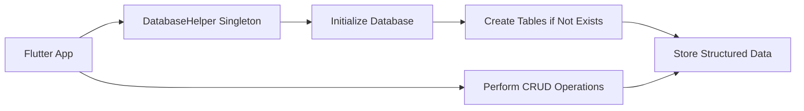

## 11.3.2 Using `sqflite` Package

In this section, we will delve into the integration of the `sqflite` package within a Flutter project to manage local databases effectively. The `sqflite` package is a popular choice for Flutter developers looking to implement SQLite databases in their applications. It provides a robust solution for data persistence, allowing you to store, retrieve, and manipulate structured data efficiently. This guide will walk you through setting up the database, creating tables, performing basic operations, and managing database versions and migrations.

### Adding the `sqflite` Package

To begin using `sqflite`, you need to add it to your Flutter project's dependencies. Additionally, the `path_provider` package is required to locate the database file path on the device.

#### Updating `pubspec.yaml`

Add the following dependencies to your `pubspec.yaml` file:

```yaml
dependencies:
  sqflite: ^2.0.0+4
  path_provider: ^2.0.11
  path: ^1.8.2
```

After updating the file, run the following command to install the packages:

```bash
flutter pub get
```

### Importing Necessary Libraries

Once the packages are installed, you need to import the necessary libraries in your Dart files to perform database operations.

```dart
import 'package:sqflite/sqflite.dart';
import 'package:path/path.dart';
import 'package:path_provider/path_provider.dart';
import 'dart:io';
```

### Initializing the Database

The first step in working with a local database is to initialize it. This involves creating or opening a database file on the device.

#### Using `getDatabasesPath` and `openDatabase`

The `getDatabasesPath` function helps in locating the directory for storing the database file, while `openDatabase` is used to open or create the database.

```dart
class DatabaseHelper {
  static final DatabaseHelper _instance = DatabaseHelper._internal();
  factory DatabaseHelper() => _instance;
  DatabaseHelper._internal();

  static Database? _database;

  Future<Database> get database async {
    if (_database != null) return _database!;
    _database = await _initDatabase();
    return _database!;
  }

  Future<Database> _initDatabase() async {
    Directory documentsDirectory = await getApplicationDocumentsDirectory();
    String path = join(documentsDirectory.path, 'app.db');
    return await openDatabase(
      path,
      version: 1,
      onCreate: _onCreate,
      onUpgrade: _onUpgrade,
    );
  }
}
```

### Creating Tables

Once the database is initialized, you can create tables to store your data. This is done using SQL `CREATE TABLE` statements.

#### Executing SQL `CREATE TABLE` Statements

Define the structure of your tables by specifying the columns, data types, and primary keys.

```dart
Future _onCreate(Database db, int version) async {
  await db.execute('''
    CREATE TABLE users(
      id INTEGER PRIMARY KEY AUTOINCREMENT,
      name TEXT NOT NULL,
      age INTEGER
    )
  ''');
}
```

### Managing Database Versions

As your application evolves, you may need to update the database schema. This requires handling database versions and migrations.

#### Implementing Versioning to Handle Schema Changes

Specify the database version in the `openDatabase` function. Use the `onUpgrade` callback to manage schema changes.

```dart
Future _onUpgrade(Database db, int oldVersion, int newVersion) async {
  if (oldVersion < newVersion) {
    // Handle migrations here
  }
}
```

### Best Practices

When working with local databases, it's important to follow best practices to ensure efficient and reliable data management.

#### Structuring Database Helper Classes

Encapsulate database operations within a helper class to promote code reusability and maintainability.

#### Ensuring Thread Safety and Managing Asynchronous Operations

Database operations can be time-consuming, so it's crucial to handle them asynchronously to avoid blocking the UI thread.

### Code Example

Here's a complete example of a database helper class that initializes the database, creates a table, and manages versions:

```dart
import 'package:sqflite/sqflite.dart';
import 'package:path/path.dart';
import 'package:path_provider/path_provider.dart';
import 'dart:io';

class DatabaseHelper {
  static final DatabaseHelper _instance = DatabaseHelper._internal();
  factory DatabaseHelper() => _instance;
  DatabaseHelper._internal();

  static Database? _database;

  Future<Database> get database async {
    if (_database != null) return _database!;
    _database = await _initDatabase();
    return _database!;
  }

  Future<Database> _initDatabase() async {
    Directory documentsDirectory = await getApplicationDocumentsDirectory();
    String path = join(documentsDirectory.path, 'app.db');
    return await openDatabase(
      path,
      version: 1,
      onCreate: _onCreate,
      onUpgrade: _onUpgrade,
    );
  }

  Future _onCreate(Database db, int version) async {
    await db.execute('''
      CREATE TABLE users(
        id INTEGER PRIMARY KEY AUTOINCREMENT,
        name TEXT NOT NULL,
        age INTEGER
      )
    ''');
  }

  Future _onUpgrade(Database db, int oldVersion, int newVersion) async {
    if (oldVersion < newVersion) {
      // Handle migrations here
    }
  }
}
```

### Practical Example: User Management

Let's consider a practical example where you manage user data in your application. You can perform CRUD (Create, Read, Update, Delete) operations using the `sqflite` package.

#### Creating a User

To insert a new user into the database, use the `insert` method.

```dart
Future<int> insertUser(Map<String, dynamic> user) async {
  final db = await database;
  return await db.insert('users', user);
}
```

#### Reading Users

To retrieve users from the database, use the `query` method.

```dart
Future<List<Map<String, dynamic>>> getUsers() async {
  final db = await database;
  return await db.query('users');
}
```

#### Updating a User

To update user information, use the `update` method.

```dart
Future<int> updateUser(Map<String, dynamic> user) async {
  final db = await database;
  return await db.update(
    'users',
    user,
    where: 'id = ?',
    whereArgs: [user['id']],
  );
}
```

#### Deleting a User

To remove a user from the database, use the `delete` method.

```dart
Future<int> deleteUser(int id) async {
  final db = await database;
  return await db.delete(
    'users',
    where: 'id = ?',
    whereArgs: [id],
  );
}
```

### Handling Database Migrations

As your application grows, you may need to modify the database schema. This requires careful handling of migrations to ensure data integrity.

#### Using the `onUpgrade` Callback

The `onUpgrade` callback is triggered when the database version is incremented. Use this callback to apply schema changes.

```dart
Future _onUpgrade(Database db, int oldVersion, int newVersion) async {
  if (oldVersion < newVersion) {
    await db.execute('ALTER TABLE users ADD COLUMN email TEXT');
  }
}
```

### Ensuring Data Integrity

Maintaining data integrity is crucial when working with databases. Here are some strategies to ensure your data remains consistent and reliable:

- **Use Transactions:** Group multiple operations into a single transaction to ensure atomicity.
- **Validate Data:** Implement validation checks before inserting or updating data.
- **Handle Exceptions:** Use try-catch blocks to handle exceptions and prevent crashes.

### Mermaid.js Diagram

To visualize the workflow of integrating `sqflite` in a Flutter app, consider the following diagram:



### Conclusion

Integrating the `sqflite` package into your Flutter project provides a powerful solution for managing local databases. By following the steps outlined in this guide, you can set up a robust database system that supports data persistence, retrieval, and manipulation. Remember to adhere to best practices, handle migrations carefully, and ensure data integrity throughout your application's lifecycle.

For further exploration, consider diving into the official [sqflite documentation](https://pub.dev/packages/sqflite) and exploring additional resources on database management in Flutter.

## Quiz Time!



### What is the primary purpose of the `sqflite` package in Flutter?

- [x] To manage local SQLite databases in Flutter apps.
- [ ] To handle network requests and API calls.
- [ ] To provide UI components for Flutter apps.
- [ ] To manage state in Flutter applications.

> **Explanation:** The `sqflite` package is used for managing local SQLite databases in Flutter applications, allowing for data persistence and manipulation.

### Which package is required alongside `sqflite` to locate the database file path?

- [x] `path_provider`
- [ ] `http`
- [ ] `provider`
- [ ] `shared_preferences`

> **Explanation:** The `path_provider` package is used to locate the database file path on the device, which is necessary for setting up the database with `sqflite`.

### How do you specify the database version in `sqflite`?

- [x] By setting the `version` parameter in the `openDatabase` function.
- [ ] By creating a separate configuration file.
- [ ] By using a global variable in the app.
- [ ] By setting an environment variable.

> **Explanation:** The database version is specified by setting the `version` parameter in the `openDatabase` function, which helps manage schema changes and migrations.

### What is the purpose of the `onUpgrade` callback in `sqflite`?

- [x] To handle database schema changes during version upgrades.
- [ ] To initialize the database when the app starts.
- [ ] To perform data validation before insertion.
- [ ] To close the database connection.

> **Explanation:** The `onUpgrade` callback is used to handle database schema changes when the database version is incremented, allowing for seamless migrations.

### Which SQL statement is used to create a new table in `sqflite`?

- [x] `CREATE TABLE`
- [ ] `INSERT INTO`
- [ ] `SELECT FROM`
- [ ] `UPDATE TABLE`

> **Explanation:** The `CREATE TABLE` SQL statement is used to define a new table in the database, specifying columns, data types, and primary keys.

### What is a best practice for structuring database operations in Flutter?

- [x] Encapsulating operations within a helper class.
- [ ] Writing all operations in the main Dart file.
- [ ] Using global variables for database access.
- [ ] Performing operations directly in the UI code.

> **Explanation:** Encapsulating database operations within a helper class promotes code reusability, maintainability, and separation of concerns.

### How can you ensure thread safety when performing database operations in Flutter?

- [x] By handling operations asynchronously.
- [ ] By using synchronous operations.
- [ ] By locking the UI thread.
- [ ] By using global variables.

> **Explanation:** Handling database operations asynchronously ensures that the UI thread is not blocked, maintaining a responsive user interface.

### What is the purpose of using transactions in database operations?

- [x] To ensure atomicity and consistency of multiple operations.
- [ ] To speed up database queries.
- [ ] To simplify database schema design.
- [ ] To manage user authentication.

> **Explanation:** Transactions group multiple operations into a single unit, ensuring atomicity and consistency, which is crucial for maintaining data integrity.

### Which method is used to insert a new record into a table in `sqflite`?

- [x] `insert`
- [ ] `add`
- [ ] `create`
- [ ] `save`

> **Explanation:** The `insert` method is used to add a new record to a table in the database, specifying the table name and data to be inserted.

### True or False: The `sqflite` package can be used for managing remote databases.

- [ ] True
- [x] False

> **Explanation:** The `sqflite` package is designed for managing local SQLite databases on the device, not for remote database management.


