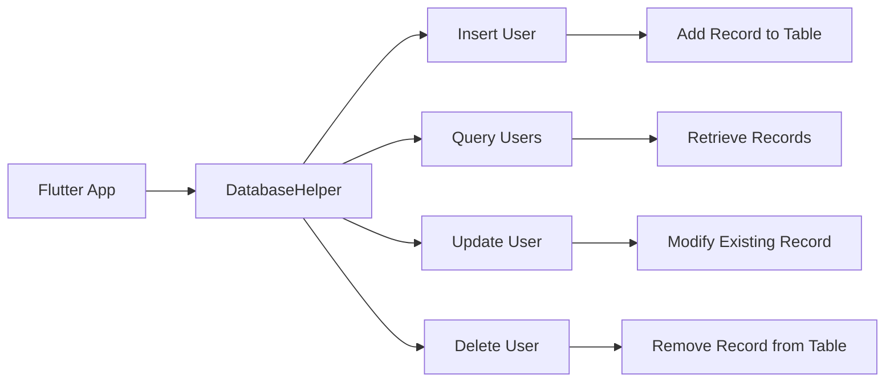

## 11.3.3 CRUD Operations

In the world of app development, managing data efficiently is crucial for creating responsive and reliable applications. In Flutter, the `sqflite` package provides a robust solution for handling local databases, allowing developers to perform Create, Read, Update, and Delete (CRUD) operations seamlessly. This section will guide you through the intricacies of CRUD operations using `sqflite`, emphasizing best practices and practical examples to ensure data consistency and integrity.

### Introduction to CRUD Operations

CRUD operations form the backbone of any database-driven application. They allow you to:

- **Create**: Insert new records into the database.
- **Read**: Query and retrieve existing data.
- **Update**: Modify existing records.
- **Delete**: Remove records from the database.

Understanding how to implement these operations effectively is essential for any developer working with databases.

### Setting Up sqflite in Your Flutter Project

Before diving into CRUD operations, ensure that your Flutter project is set up with the `sqflite` package. Add the following dependencies to your `pubspec.yaml` file:

```yaml
dependencies:
  flutter:
    sdk: flutter
  sqflite: ^2.0.0+3
  path: ^1.8.0
```

Run `flutter pub get` to install the packages.

### Creating a Database Helper Class

To manage database operations efficiently, it's best to encapsulate them within a helper class. This class will handle database initialization and provide methods for CRUD operations.

```dart
import 'package:sqflite/sqflite.dart';
import 'package:path/path.dart';

class DatabaseHelper {
  static final DatabaseHelper _instance = DatabaseHelper._internal();
  factory DatabaseHelper() => _instance;
  DatabaseHelper._internal();

  static Database? _database;

  Future<Database> get database async {
    if (_database != null) return _database!;
    _database = await _initDatabase();
    return _database!;
  }

  Future<Database> _initDatabase() async {
    String path = join(await getDatabasesPath(), 'app_database.db');
    return await openDatabase(
      path,
      version: 1,
      onCreate: _onCreate,
    );
  }

  Future<void> _onCreate(Database db, int version) async {
    await db.execute('''
      CREATE TABLE users(
        id INTEGER PRIMARY KEY AUTOINCREMENT,
        name TEXT,
        age INTEGER
      )
    ''');
  }
}
```

### Create (Insert) Operation

The `insert` method allows you to add new records to the database. It's crucial to handle conflicts and ensure data integrity.

```dart
Future<int> insertUser(User user) async {
  final db = await database;
  return await db.insert(
    'users',
    user.toMap(),
    conflictAlgorithm: ConflictAlgorithm.replace,
  );
}
```

- **ConflictAlgorithm.replace**: This handles conflicts by replacing the existing record with the new one if a conflict occurs, ensuring unique constraints are maintained.

### Read (Query) Operation

Reading data involves querying the database to retrieve records. You can implement filtering, sorting, and limiting results to optimize performance.

```dart
Future<List<User>> getUsers() async {
  final db = await database;
  final List<Map<String, dynamic>> maps = await db.query('users');
  return List.generate(maps.length, (i) {
    return User.fromMap(maps[i]);
  });
}
```

- **Filtering and Sorting**: Use SQL `WHERE` clauses and `ORDER BY` to filter and sort data.
- **Mapping Results**: Convert query results into Dart objects for easier manipulation.

### Update Operation

Updating records involves modifying existing entries in the database. Use the `update` method to specify conditions for identifying records.

```dart
Future<int> updateUser(User user) async {
  final db = await database;
  return await db.update(
    'users',
    user.toMap(),
    where: 'id = ?',
    whereArgs: [user.id],
  );
}
```

- **Conditions**: Use the `where` clause to specify which records to update, ensuring only the intended records are modified.

### Delete Operation

Deleting records is straightforward with the `delete` method. Ensure proper identification of records to prevent accidental data loss.

```dart
Future<int> deleteUser(int id) async {
  final db = await database;
  return await db.delete(
    'users',
    where: 'id = ?',
    whereArgs: [id],
  );
}
```

- **Identification**: Use unique identifiers to accurately target records for deletion.

### Managing Transactions

Transactions allow you to group multiple operations, ensuring data integrity. If any operation fails, the entire transaction is rolled back.

```dart
Future<void> performTransaction() async {
  final db = await database;
  await db.transaction((txn) async {
    await txn.insert('users', {'name': 'Alice', 'age': 30});
    await txn.update('users', {'age': 31}, where: 'name = ?', whereArgs: ['Alice']);
  });
}
```

### Error Handling

Handling exceptions is crucial for robust database operations. Use try-catch blocks to manage errors gracefully.

```dart
Future<void> safeInsertUser(User user) async {
  try {
    await insertUser(user);
  } catch (e) {
    print('Error inserting user: $e');
  }
}
```

### Practical Example: User Management

Let's bring it all together with a practical example of managing user data in a Flutter app.

```dart
class User {
  final int? id;
  final String name;
  final int age;

  User({this.id, required this.name, required this.age});

  Map<String, dynamic> toMap() {
    return {
      'id': id,
      'name': name,
      'age': age,
    };
  }

  factory User.fromMap(Map<String, dynamic> map) {
    return User(
      id: map['id'],
      name: map['name'],
      age: map['age'],
    );
  }
}

class DatabaseHelper {
  // ... (previous code)

  Future<int> insertUser(User user) async {
    final db = await database;
    return await db.insert('users', user.toMap(), conflictAlgorithm: ConflictAlgorithm.replace);
  }

  Future<List<User>> getUsers() async {
    final db = await database;
    final List<Map<String, dynamic>> maps = await db.query('users');
    return List.generate(maps.length, (i) {
      return User.fromMap(maps[i]);
    });
  }

  Future<int> updateUser(User user) async {
    final db = await database;
    return await db.update(
      'users',
      user.toMap(),
      where: 'id = ?',
      whereArgs: [user.id],
    );
  }

  Future<int> deleteUser(int id) async {
    final db = await database;
    return await db.delete(
      'users',
      where: 'id = ?',
      whereArgs: [id],
    );
  }
}
```

### Visualizing CRUD Operations with Mermaid.js

To better understand the flow of CRUD operations, let's visualize it using a Mermaid.js diagram.



### Best Practices and Common Pitfalls

- **Asynchronous Operations**: Always handle database operations asynchronously to prevent blocking the UI thread.
- **Data Consistency**: Use transactions for operations that must be atomic.
- **Error Handling**: Implement comprehensive error handling to manage exceptions and ensure app stability.
- **Security**: Protect sensitive data by encrypting the database if necessary.

### Further Reading and Resources

- [Official sqflite Documentation](https://pub.dev/packages/sqflite)
- [SQLite Documentation](https://www.sqlite.org/docs.html)
- [Flutter State Management](https://flutter.dev/docs/development/data-and-backend/state-mgmt/intro)
- [Effective Dart: Style](https://dart.dev/guides/language/effective-dart/style)

By mastering CRUD operations with `sqflite`, you can create powerful, data-driven Flutter applications that provide a seamless user experience. Experiment with the examples provided, and consider extending them to suit your application's needs.

## Quiz Time!



### What does CRUD stand for in database operations?

- [x] Create, Read, Update, Delete
- [ ] Create, Retrieve, Update, Delete
- [ ] Create, Remove, Update, Delete
- [ ] Create, Read, Upload, Delete

> **Explanation:** CRUD stands for Create, Read, Update, and Delete, which are the four basic operations for managing data in a database.

### Which method is used to insert a new record in the sqflite package?

- [x] insert
- [ ] add
- [ ] create
- [ ] put

> **Explanation:** The `insert` method is used to add new records to a database table in the sqflite package.

### How can you handle conflicts when inserting data using sqflite?

- [x] By using the conflictAlgorithm parameter
- [ ] By using the conflictHandler parameter
- [ ] By using the conflictResolver parameter
- [ ] By using the conflictManager parameter

> **Explanation:** The `conflictAlgorithm` parameter in the `insert` method allows you to specify how to handle conflicts, such as replacing existing records.

### What is the purpose of the where clause in update and delete operations?

- [x] To specify conditions for identifying records
- [ ] To sort the records
- [ ] To group the records
- [ ] To join tables

> **Explanation:** The `where` clause is used to specify conditions for identifying which records to update or delete.

### Which method is used to retrieve data from a database using sqflite?

- [x] query
- [ ] fetch
- [ ] get
- [ ] select

> **Explanation:** The `query` method is used to retrieve data from a database table in the sqflite package.

### What is the benefit of using transactions in database operations?

- [x] To ensure data integrity by grouping multiple operations
- [ ] To speed up database operations
- [ ] To simplify code structure
- [ ] To reduce database size

> **Explanation:** Transactions ensure data integrity by allowing multiple operations to be executed as a single unit, rolling back all changes if any operation fails.

### How can you convert query results into Dart objects?

- [x] By mapping the results to Dart objects
- [ ] By using the toDart method
- [ ] By using the convert method
- [ ] By using the transform method

> **Explanation:** Query results can be converted into Dart objects by mapping each result to a Dart object using a factory constructor or a mapping function.

### What is the purpose of the ConflictAlgorithm.replace option?

- [x] To replace existing records in case of a conflict
- [ ] To ignore new records in case of a conflict
- [ ] To merge records in case of a conflict
- [ ] To delete conflicting records

> **Explanation:** The `ConflictAlgorithm.replace` option replaces existing records with new ones if a conflict occurs during an insert operation.

### Why is it important to handle database operations asynchronously in Flutter?

- [x] To prevent blocking the UI thread
- [ ] To increase database security
- [ ] To simplify code
- [ ] To reduce memory usage

> **Explanation:** Handling database operations asynchronously prevents blocking the UI thread, ensuring a smooth user experience.

### True or False: The sqflite package automatically encrypts data stored in the database.

- [ ] True
- [x] False

> **Explanation:** The sqflite package does not automatically encrypt data. Developers must implement encryption if needed.


