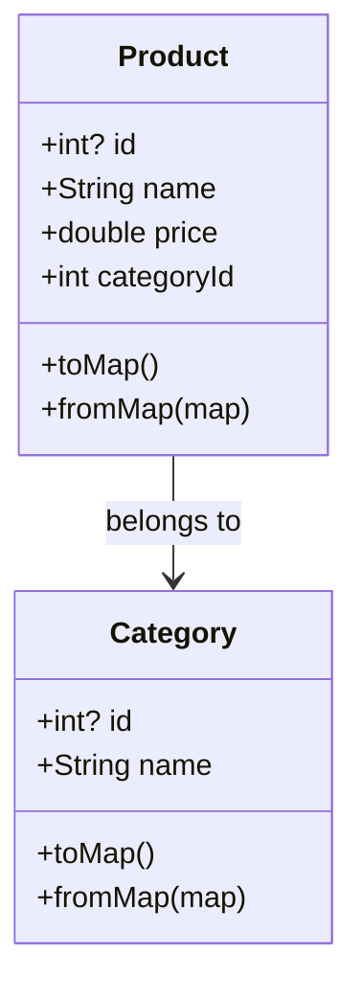

## 11.3.4 Data Models

In the realm of mobile app development, data persistence is a cornerstone for creating robust applications that can store and retrieve user data efficiently. When working with local databases like SQLite in Flutter, defining clear and structured data models is crucial. These models serve as the blueprint for how data is stored, retrieved, and manipulated within your application. In this section, we will delve into the intricacies of creating effective data models in Dart, explore serialization and deserialization techniques, and discuss best practices for managing complex data relationships.

### Defining Data Models

Data models in Flutter are typically represented by Dart classes that mirror the structure of your database tables. These classes encapsulate the properties of the data you wish to store and provide methods for converting between Dart objects and database records.

#### Creating Dart Classes

To create a data model, you define a Dart class with fields that correspond to the columns in your database table. Each field should have a type that matches the expected data type in the database. For instance, consider a simple `Product` class:

```dart
class Product {
  final int? id;
  final String name;
  final double price;
  final int categoryId;

  Product({this.id, required this.name, required this.price, required this.categoryId});
}
```

Here, the `Product` class has fields for `id`, `name`, `price`, and `categoryId`, which correspond to columns in a hypothetical `products` table.

#### Constructors and Factory Methods

Constructors in Dart are used to initialize objects. For data models, you often use named constructors or factory methods to facilitate the creation of objects from database records. A factory method is particularly useful for creating instances from a `Map`, which is a common format for database records:

```dart
factory Product.fromMap(Map<String, dynamic> map) {
  return Product(
    id: map['id'],
    name: map['name'],
    price: map['price'],
    categoryId: map['category_id'],
  );
}
```

This method allows you to easily instantiate a `Product` object from a database record.

### Serialization and Deserialization

Serialization is the process of converting a Dart object into a format suitable for storage or transmission, such as a `Map`. Deserialization is the reverse process, where you convert stored data back into a Dart object.

#### Converting Dart Objects to Maps

To store a Dart object in a database, you first convert it into a `Map` where keys are column names and values are the corresponding data:

```dart
Map<String, dynamic> toMap() {
  return {
    'id': id,
    'name': name,
    'price': price,
    'category_id': categoryId,
  };
}
```

This `toMap` method is essential for database operations like insertions and updates.

#### Parsing Maps into Dart Objects

When retrieving data from a database, you typically get a `Map` representation of the record. Using the `fromMap` factory method, you can convert this `Map` back into a Dart object:

```dart
factory Product.fromMap(Map<String, dynamic> map) {
  return Product(
    id: map['id'],
    name: map['name'],
    price: map['price'],
    categoryId: map['category_id'],
  );
}
```

This method ensures that your application can seamlessly transition between database records and in-memory objects.

### Handling Complex Relationships

In real-world applications, data often has complex relationships, such as one-to-many or many-to-many associations. Properly managing these relationships is crucial for maintaining data integrity and reducing redundancy.

#### One-to-Many Relationships

A one-to-many relationship occurs when a single record in one table is associated with multiple records in another table. For example, a `Category` can have many `Products`. To model this, you might have a `categoryId` field in the `Product` class that references the `Category`:

```dart
class Category {
  final int? id;
  final String name;

  Category({this.id, required this.name});
}
```

In your database schema, you would ensure that `categoryId` in the `products` table is a foreign key referencing the `categories` table.

#### Many-to-Many Relationships

Many-to-many relationships are more complex and typically require a junction table to manage the associations. For instance, if `Products` can belong to multiple `Tags`, you would create a `product_tags` table with `product_id` and `tag_id` columns.

#### Normalizing Data

Normalization is the process of organizing data to minimize redundancy. By breaking down data into related tables and using foreign keys, you can ensure that each piece of information is stored only once, which simplifies updates and maintains consistency.

### Ensuring Data Integrity

Data integrity is vital for ensuring that your database remains accurate and reliable. This involves validating data before insertion or updates and enforcing constraints through both your data models and database schemas.

#### Validating Data

Before inserting or updating records, validate the data to ensure it meets the required criteria. This can include checking for null values, ensuring data types match, and verifying that foreign keys exist.

#### Enforcing Constraints

Constraints such as primary keys, foreign keys, and unique constraints can be enforced at the database level to maintain data integrity. These constraints prevent invalid data from being stored and ensure that relationships between tables are respected.

### Best Practices

When designing data models, adhere to best practices to ensure your code is maintainable and efficient.

#### Keeping Models Simple

Data models should be simple and focused on representing the data structure. Avoid embedding business logic within models, as this can complicate maintenance and testing.

#### Avoiding Business Logic

Business logic should reside in separate service or controller classes, not within data models. This separation of concerns makes your codebase more modular and easier to manage.

### Code Example

Here's a complete example of `Product` and `Category` classes with serialization and deserialization methods:

```dart
class Product {
  final int? id;
  final String name;
  final double price;
  final int categoryId;

  Product({this.id, required this.name, required this.price, required this.categoryId});

  Map<String, dynamic> toMap() {
    return {
      'id': id,
      'name': name,
      'price': price,
      'category_id': categoryId,
    };
  }

  factory Product.fromMap(Map<String, dynamic> map) {
    return Product(
      id: map['id'],
      name: map['name'],
      price: map['price'],
      categoryId: map['category_id'],
    );
  }
}

class Category {
  final int? id;
  final String name;

  Category({this.id, required this.name});

  Map<String, dynamic> toMap() {
    return {
      'id': id,
      'name': name,
    };
  }

  factory Category.fromMap(Map<String, dynamic> map) {
    return Category(
      id: map['id'],
      name: map['name'],
    );
  }
}
```

### Visualizing Data Models

To better understand the relationship between `Product` and `Category`, consider the following class diagram:



This diagram illustrates that each `Product` belongs to a `Category`, highlighting the one-to-many relationship.

### Conclusion

Defining clear and structured data models is essential for effective data management in Flutter applications. By creating Dart classes that mirror your database tables and implementing serialization and deserialization methods, you can ensure seamless data operations. Handling complex relationships and ensuring data integrity are critical for maintaining a reliable and efficient database. By adhering to best practices, you can create maintainable and scalable applications that effectively leverage local databases.

### Further Reading and Resources

- [Flutter Documentation on SQLite](https://flutter.dev/docs/cookbook/persistence/sqlite)
- [Dart Language Tour](https://dart.dev/guides/language/language-tour)
- [SQLite Official Documentation](https://www.sqlite.org/docs.html)
- [Effective Dart: Style](https://dart.dev/guides/language/effective-dart/style)

## Quiz Time!



### What is the primary purpose of defining data models in Flutter?

- [x] To represent the structure of database tables in Dart classes.
- [ ] To handle user interface design.
- [ ] To manage network requests.
- [ ] To perform animations.

> **Explanation:** Data models in Flutter are used to represent the structure of database tables, allowing for seamless data storage and retrieval.

### Which method is used to convert a Dart object into a format suitable for database storage?

- [x] toMap()
- [ ] fromMap()
- [ ] serialize()
- [ ] deserialize()

> **Explanation:** The `toMap()` method is used to convert a Dart object into a `Map`, which is a format suitable for database storage.

### What is the role of the factory method `fromMap()` in data models?

- [x] To create a Dart object from a database record.
- [ ] To update a database record.
- [ ] To delete a database record.
- [ ] To perform data validation.

> **Explanation:** The `fromMap()` factory method is used to create a Dart object from a database record, facilitating deserialization.

### How can you manage a one-to-many relationship in a database using Dart classes?

- [x] By using a foreign key in the child class to reference the parent class.
- [ ] By creating a separate table for each relationship.
- [ ] By storing all data in a single table.
- [ ] By using a many-to-many junction table.

> **Explanation:** A one-to-many relationship is managed by using a foreign key in the child class to reference the parent class.

### What is the benefit of normalizing data in a database?

- [x] To reduce redundancy and ensure data consistency.
- [ ] To increase data redundancy.
- [ ] To simplify database queries.
- [ ] To enhance user interface design.

> **Explanation:** Normalizing data reduces redundancy and ensures data consistency, making updates and maintenance easier.

### Why should business logic be avoided within data models?

- [x] To keep models simple and focused on data representation.
- [ ] To enhance data retrieval speed.
- [ ] To improve user interface design.
- [ ] To increase database storage capacity.

> **Explanation:** Business logic should be avoided within data models to keep them simple and focused on representing data structures.

### What is a common method for enforcing data integrity in a database?

- [x] Using constraints such as primary keys and foreign keys.
- [ ] Storing all data in a single table.
- [ ] Using complex queries.
- [ ] Avoiding data validation.

> **Explanation:** Data integrity is commonly enforced using constraints like primary keys and foreign keys, which ensure valid data relationships.

### Which of the following is a best practice for designing data models?

- [x] Keeping models simple and avoiding business logic.
- [ ] Embedding complex logic within models.
- [ ] Using a single class for all data types.
- [ ] Ignoring data validation.

> **Explanation:** A best practice for designing data models is to keep them simple and avoid embedding business logic, ensuring maintainability.

### What is the purpose of serialization in the context of data models?

- [x] To convert Dart objects into a format suitable for storage or transmission.
- [ ] To enhance user interface design.
- [ ] To manage network requests.
- [ ] To perform animations.

> **Explanation:** Serialization is the process of converting Dart objects into a format suitable for storage or transmission, such as a `Map`.

### True or False: A many-to-many relationship requires a junction table to manage associations.

- [x] True
- [ ] False

> **Explanation:** True. A many-to-many relationship typically requires a junction table to manage associations between records in two tables.


