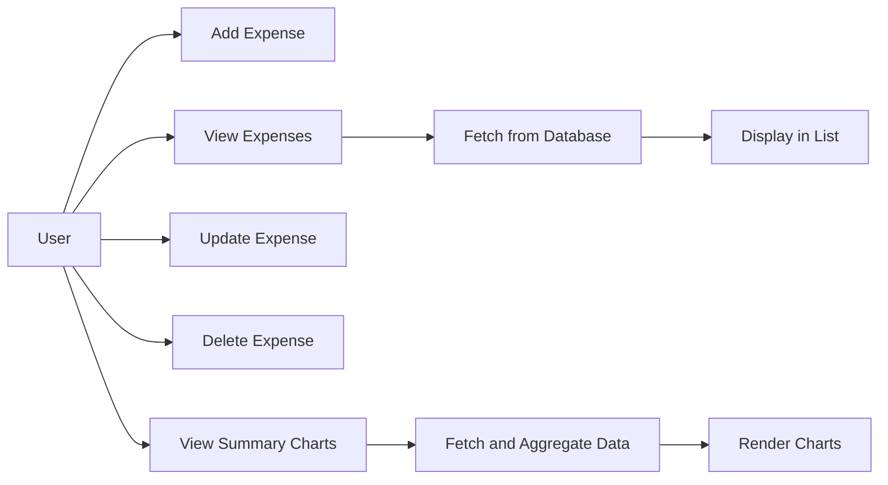

## 11.4.1 Project Overview

In this section, we embark on an exciting journey to build a comprehensive Expense Tracker App using Flutter. This hands-on project will guide you through the process of creating an application that allows users to manage their expenses effectively. The app will enable users to add, view, update, and delete expense records, categorize them for better organization, and visualize spending patterns through summary statistics and charts. This project not only reinforces your understanding of Flutter but also introduces you to essential concepts in data persistence and local storage.

### Project Objectives and Features

The Expense Tracker App is designed to provide a seamless experience for users to manage their financial records. Here are the core features and objectives of the project:

- **Adding New Expenses:** Users can add new expenses by entering details such as the amount, category, and date. This feature ensures that all relevant information is captured for each transaction.

- **Viewing Expenses:** The app will display a list of all recorded expenses, allowing users to review their spending history. This feature is crucial for tracking financial activities over time.

- **Updating and Deleting Expenses:** Users can update existing expense records or delete them if necessary. This functionality provides flexibility in managing financial data.

- **Categorizing Expenses:** Expenses can be categorized (e.g., food, transportation, entertainment) to help users organize their spending. Categorization aids in identifying spending patterns and areas for potential savings.

- **Displaying Summary Statistics and Charts:** The app will offer visual insights into spending habits through summary statistics and charts. This feature enhances user experience by providing a clear overview of financial health.

### Technologies and Packages Used

To build this robust application, we will leverage several technologies and packages that are integral to Flutter development:

- **`sqflite`:** This package is used for local database management. It allows us to perform CRUD (Create, Read, Update, Delete) operations on SQLite databases, which are ideal for storing structured data persistently on mobile devices.

- **`path_provider`:** This package helps locate the database file on the device. It provides a platform-agnostic way to access commonly used locations on the filesystem.

- **`provider` (optional):** For state management, we may use the `provider` package. It simplifies the management of state across the app, making it easier to share data between widgets.

- **`charts_flutter`:** This package (or a similar one) will be used for data visualization. It allows us to create interactive charts that display spending patterns and summary statistics.

### Expected Learning Outcomes

By the end of this project, you will have gained valuable skills and knowledge in several key areas:

- **Implementing CRUD Operations with SQLite:** You will learn how to perform basic database operations using SQLite, a lightweight and powerful database engine.

- **Designing Effective Data Models:** You will understand how to structure data models that efficiently represent expense records and support the app's functionality.

- **Managing State in Flutter Applications:** You will explore state management techniques to ensure that the app's UI reflects the current state of the data.

- **Integrating Data with UI Components:** You will learn how to connect the app's data layer with its UI components, ensuring a seamless user experience.

- **Enhancing User Experience with Data Visualization:** You will discover how to use charts and graphs to provide users with meaningful insights into their spending habits.

### Project Workflow and Architecture

To visualize the workflow and architecture of the Expense Tracker App, consider the following Mermaid.js diagram:



**Diagram Explanation:**

- **User Interactions:** The user can perform various actions such as adding, viewing, updating, and deleting expenses. These interactions form the core functionalities of the app.

- **Database Operations:** When viewing expenses, the app fetches data from the local SQLite database. This ensures that the displayed information is up-to-date and accurate.

- **Data Visualization:** Users can view summary charts that aggregate and visualize expense data. This feature provides insights into spending patterns and helps users make informed financial decisions.

### Practical Code Examples

Let's explore some practical code snippets that illustrate key components of the Expense Tracker App:

#### Setting Up the SQLite Database

To set up the SQLite database, we use the `sqflite` package. Here's a basic example of how to initialize the database and create a table for storing expenses:

```dart
import 'package:sqflite/sqflite.dart';
import 'package:path/path.dart';

Future<Database> initializeDatabase() async {
  final databasePath = await getDatabasesPath();
  final path = join(databasePath, 'expenses.db');

  return openDatabase(
    path,
    onCreate: (db, version) {
      return db.execute(
        'CREATE TABLE expenses(id INTEGER PRIMARY KEY, amount REAL, category TEXT, date TEXT)',
      );
    },
    version: 1,
  );
}
```

**Code Explanation:**

- **Database Initialization:** We obtain the path to the database file using the `path_provider` package and open the database with `openDatabase`.

- **Table Creation:** The `onCreate` callback is used to execute SQL commands that create the `expenses` table with columns for `id`, `amount`, `category`, and `date`.

#### Adding a New Expense

To add a new expense, we insert a record into the database. Here's an example function that performs this operation:

```dart
Future<void> addExpense(Database db, double amount, String category, String date) async {
  await db.insert(
    'expenses',
    {'amount': amount, 'category': category, 'date': date},
    conflictAlgorithm: ConflictAlgorithm.replace,
  );
}
```

**Code Explanation:**

- **Insert Operation:** We use the `insert` method to add a new record to the `expenses` table. The `conflictAlgorithm` parameter specifies how to handle conflicts, such as duplicate entries.

#### Viewing Expenses

To view expenses, we query the database and retrieve all records. Here's an example function that fetches expenses:

```dart
Future<List<Map<String, dynamic>>> getExpenses(Database db) async {
  return await db.query('expenses');
}
```

**Code Explanation:**

- **Query Operation:** We use the `query` method to fetch all records from the `expenses` table. The result is a list of maps, where each map represents a row in the table.

#### Updating an Expense

To update an existing expense, we modify the corresponding record in the database. Here's an example function:

```dart
Future<void> updateExpense(Database db, int id, double amount, String category, String date) async {
  await db.update(
    'expenses',
    {'amount': amount, 'category': category, 'date': date},
    where: 'id = ?',
    whereArgs: [id],
  );
}
```

**Code Explanation:**

- **Update Operation:** We use the `update` method to modify a record in the `expenses` table. The `where` clause specifies which record to update based on the `id`.

#### Deleting an Expense

To delete an expense, we remove the corresponding record from the database. Here's an example function:

```dart
Future<void> deleteExpense(Database db, int id) async {
  await db.delete(
    'expenses',
    where: 'id = ?',
    whereArgs: [id],
  );
}
```

**Code Explanation:**

- **Delete Operation:** We use the `delete` method to remove a record from the `expenses` table. The `where` clause specifies which record to delete based on the `id`.

### Best Practices and Challenges

Building an Expense Tracker App involves several best practices and potential challenges:

- **Data Integrity:** Ensure that all database operations maintain data integrity. Use transactions for complex operations that involve multiple steps.

- **User Experience:** Design the UI to be intuitive and responsive. Use meaningful icons and labels to guide users through the app's features.

- **Error Handling:** Implement robust error handling to manage database errors and user input validation. Provide clear feedback to users when errors occur.

- **Performance Optimization:** Optimize database queries and UI rendering to ensure smooth performance, especially when dealing with large datasets.

### Additional Resources

To deepen your understanding of the concepts covered in this project, consider exploring the following resources:

- **Flutter Documentation:** The official Flutter documentation provides comprehensive guides and references for building Flutter apps. [Flutter Documentation](https://flutter.dev/docs)

- **SQLite Documentation:** Learn more about SQLite and its features by visiting the official SQLite website. [SQLite Documentation](https://www.sqlite.org/docs.html)

- **Provider Package:** Explore the `provider` package for state management in Flutter. [Provider Documentation](https://pub.dev/packages/provider)

- **Charts Flutter Package:** Discover how to create interactive charts with the `charts_flutter` package. [Charts Flutter Documentation](https://pub.dev/packages/charts_flutter)

### Conclusion

The Expense Tracker App project offers a rich learning experience that combines Flutter development with essential concepts in data persistence and visualization. By building this app, you will gain practical skills in managing local databases, designing user-friendly interfaces, and providing valuable insights through data visualization. As you progress through the project, remember to experiment with different features and explore additional functionalities that can enhance the app's utility.

---

## Quiz Time!



### What is the primary purpose of the Expense Tracker App?

- [x] To allow users to manage their expenses by adding, viewing, updating, and deleting records.
- [ ] To provide a platform for users to share their expenses with others.
- [ ] To offer investment advice based on user spending patterns.
- [ ] To connect users with financial advisors.

> **Explanation:** The primary purpose of the Expense Tracker App is to enable users to manage their expenses effectively by providing functionalities to add, view, update, and delete expense records.

### Which package is used for local database management in the Expense Tracker App?

- [x] `sqflite`
- [ ] `path_provider`
- [ ] `provider`
- [ ] `charts_flutter`

> **Explanation:** The `sqflite` package is used for local database management, allowing the app to perform CRUD operations on SQLite databases.

### What feature allows users to organize their expenses in the app?

- [x] Categorizing expenses
- [ ] Sharing expenses
- [ ] Exporting expenses
- [ ] Importing expenses

> **Explanation:** Categorizing expenses allows users to organize their spending by grouping expenses into categories such as food, transportation, and entertainment.

### What is the role of the `path_provider` package in the project?

- [x] To locate the database file on the device
- [ ] To manage state across the app
- [ ] To create interactive charts
- [ ] To handle user authentication

> **Explanation:** The `path_provider` package helps locate the database file on the device, providing a platform-agnostic way to access filesystem locations.

### Which of the following is NOT a core feature of the Expense Tracker App?

- [ ] Adding new expenses
- [ ] Viewing a list of expenses
- [ ] Updating and deleting expenses
- [x] Sharing expenses on social media

> **Explanation:** Sharing expenses on social media is not a core feature of the Expense Tracker App. The app focuses on managing expenses locally.

### What is the purpose of summary statistics and charts in the app?

- [x] To provide visual insights into spending habits
- [ ] To allow users to export data to spreadsheets
- [ ] To enable users to share their expenses with friends
- [ ] To offer personalized financial advice

> **Explanation:** Summary statistics and charts provide visual insights into spending habits, helping users understand their financial health.

### Which package is suggested for data visualization in the project?

- [x] `charts_flutter`
- [ ] `sqflite`
- [ ] `provider`
- [ ] `path_provider`

> **Explanation:** The `charts_flutter` package is suggested for data visualization, allowing the app to create interactive charts that display spending patterns.

### What is a key learning outcome of the Expense Tracker App project?

- [x] Implementing CRUD operations with SQLite
- [ ] Developing a web-based application
- [ ] Creating a social media platform
- [ ] Building a game using Flutter

> **Explanation:** A key learning outcome of the project is implementing CRUD operations with SQLite, which is essential for managing data persistence in mobile apps.

### True or False: The `provider` package is mandatory for state management in the Expense Tracker App.

- [ ] True
- [x] False

> **Explanation:** The `provider` package is optional for state management in the Expense Tracker App. It is suggested for simplifying state management but is not mandatory.

### What is the first step in setting up the SQLite database for the app?

- [x] Initializing the database and creating a table for expenses
- [ ] Designing the user interface
- [ ] Implementing data visualization
- [ ] Setting up user authentication

> **Explanation:** The first step in setting up the SQLite database is initializing the database and creating a table for expenses, which lays the foundation for data storage.


