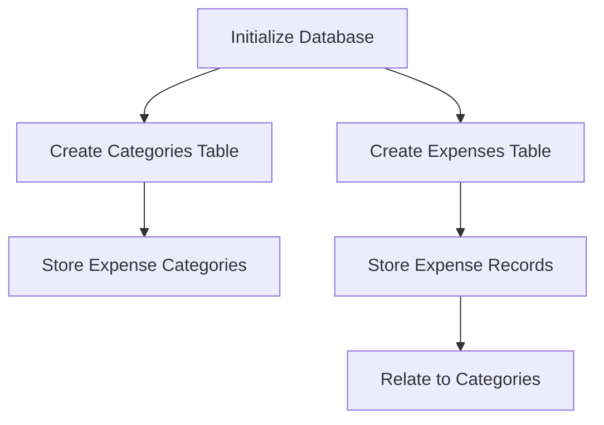

## 11.4.2 Setting Up the SQLite Database for Your Expense Tracker App

In this section, we will delve into setting up a local SQLite database for your Expense Tracker App using the `sqflite` package. This process involves initializing the database, creating necessary tables, defining schemas, and handling database migrations. By the end of this guide, you'll have a robust database setup that ensures efficient data storage and retrieval, which is crucial for any data-driven application.

### Initializing the Database

The first step in setting up your database is initialization. This involves creating or opening the database file where your data will be stored. In Flutter, we use the `sqflite` package to handle SQLite databases. Here’s how you can initialize your database:

#### Using `getDatabasesPath` and `openDatabase`

1. **Install the `sqflite` Package:**

   Add the `sqflite` package to your `pubspec.yaml` file:

   ```yaml
   dependencies:
     flutter:
       sdk: flutter
     sqflite: ^2.0.0+3
     path_provider: ^2.0.11
   ```

   Run `flutter pub get` to install the package.

2. **Initialize the Database:**

   Use the `getDatabasesPath` to get the path to the database directory and `openDatabase` to create or open the database.

   ```dart
   import 'package:sqflite/sqflite.dart';
   import 'package:path/path.dart';
   import 'package:path_provider/path_provider.dart';
   import 'dart:io';

   class DatabaseHelper {
     static final DatabaseHelper _instance = DatabaseHelper._internal();
     factory DatabaseHelper() => _instance;
     DatabaseHelper._internal();

     static Database? _database;

     Future<Database> get database async {
       if (_database != null) return _database!;
       _database = await _initDatabase();
       return _database!;
     }

     Future<Database> _initDatabase() async {
       Directory documentsDirectory = await getApplicationDocumentsDirectory();
       String path = join(documentsDirectory.path, 'expense_tracker.db');
       return await openDatabase(
         path,
         version: 1,
         onCreate: _onCreate,
         onUpgrade: _onUpgrade,
       );
     }
   }
   ```

   **Explanation:**
   - **`getApplicationDocumentsDirectory()`**: This function retrieves the directory where you can store application-specific data.
   - **`join()`**: Combines the directory path with the database file name.
   - **`openDatabase()`**: Opens the database at the specified path, creating it if it doesn't exist.

### Creating Tables

Once the database is initialized, the next step is to create tables. For our Expense Tracker App, we need tables for expenses and categories.

#### Defining Tables for Expenses and Categories

1. **Create the Categories Table:**

   This table will store different expense categories.

   ```dart
   Future _onCreate(Database db, int version) async {
     await db.execute('''
       CREATE TABLE categories(
         id INTEGER PRIMARY KEY AUTOINCREMENT,
         name TEXT NOT NULL
       )
     ''');
   }
   ```

   **Explanation:**
   - **`id INTEGER PRIMARY KEY AUTOINCREMENT`**: This defines a unique identifier for each category, automatically incremented.
   - **`name TEXT NOT NULL`**: This column stores the name of the category and cannot be null.

2. **Create the Expenses Table:**

   This table will store individual expense records.

   ```dart
   await db.execute('''
     CREATE TABLE expenses(
       id INTEGER PRIMARY KEY AUTOINCREMENT,
       amount REAL NOT NULL,
       category_id INTEGER,
       date TEXT NOT NULL,
       description TEXT,
       FOREIGN KEY (category_id) REFERENCES categories(id)
     )
   ''');
   ```

   **Explanation:**
   - **`amount REAL NOT NULL`**: Stores the expense amount as a real number.
   - **`category_id INTEGER`**: References the `id` in the categories table, establishing a relationship.
   - **`date TEXT NOT NULL`**: Stores the date of the expense.
   - **`description TEXT`**: Optional description of the expense.
   - **`FOREIGN KEY (category_id) REFERENCES categories(id)`**: Enforces referential integrity between expenses and categories.

### Defining Schemas

A well-defined schema is crucial for maintaining data integrity and optimizing performance. Here’s how you can define efficient schemas for your tables:

#### Specifying Data Types and Constraints

- **Data Types**: Choose appropriate data types for each column to ensure efficient storage and retrieval. For instance, use `INTEGER` for IDs, `REAL` for monetary values, and `TEXT` for strings.
- **Constraints**: Use constraints like `NOT NULL` to enforce data integrity. This ensures that critical fields are always populated.

#### Ensuring Data Integrity

- **Primary Keys**: Ensure each table has a primary key to uniquely identify records.
- **Foreign Keys**: Use foreign keys to maintain relationships between tables, ensuring that related data is consistent.

### Handling Migrations

As your app evolves, you may need to change the database schema. Properly handling migrations is essential to ensure data integrity and continuity.

#### Planning for Future Schema Changes

- **Versioning**: Use the `version` parameter in `openDatabase` to manage schema versions.
- **Migration Strategy**: Plan how you will handle changes, such as adding new columns or tables.

#### Implementing `onUpgrade`

The `onUpgrade` callback is used to handle database migrations when the schema version changes.

```dart
Future _onUpgrade(Database db, int oldVersion, int newVersion) async {
  if (oldVersion < newVersion) {
    // Example: Adding a new column
    await db.execute('ALTER TABLE expenses ADD COLUMN notes TEXT');
  }
}
```

**Explanation:**
- **`ALTER TABLE`**: SQL command used to modify an existing table structure.
- **Conditional Logic**: Use conditions to handle different upgrade paths based on the version.

### Best Practices

To ensure your database is efficient and maintainable, consider the following best practices:

- **Normalization**: Keep your table schemas normalized to reduce redundancy and improve data integrity.
- **Indexes**: Use indexes on columns that are frequently queried to speed up data retrieval.
- **Connection Management**: Open and close database connections efficiently to conserve resources.

### Practical Code Example

Here is a complete example of setting up the database with the `sqflite` package:

```dart
import 'package:sqflite/sqflite.dart';
import 'package:path/path.dart';
import 'package:path_provider/path_provider.dart';
import 'dart:io';

class DatabaseHelper {
  static final DatabaseHelper _instance = DatabaseHelper._internal();
  factory DatabaseHelper() => _instance;
  DatabaseHelper._internal();

  static Database? _database;

  Future<Database> get database async {
    if (_database != null) return _database!;
    _database = await _initDatabase();
    return _database!;
  }

  Future<Database> _initDatabase() async {
    Directory documentsDirectory = await getApplicationDocumentsDirectory();
    String path = join(documentsDirectory.path, 'expense_tracker.db');
    return await openDatabase(
      path,
      version: 1,
      onCreate: _onCreate,
      onUpgrade: _onUpgrade,
    );
  }

  Future _onCreate(Database db, int version) async {
    await db.execute('''
      CREATE TABLE categories(
        id INTEGER PRIMARY KEY AUTOINCREMENT,
        name TEXT NOT NULL
      )
    ''');
    await db.execute('''
      CREATE TABLE expenses(
        id INTEGER PRIMARY KEY AUTOINCREMENT,
        amount REAL NOT NULL,
        category_id INTEGER,
        date TEXT NOT NULL,
        description TEXT,
        FOREIGN KEY (category_id) REFERENCES categories(id)
      )
    ''');
  }

  Future _onUpgrade(Database db, int oldVersion, int newVersion) async {
    if (oldVersion < newVersion) {
      // Handle migrations here
    }
  }
}
```

### Visualizing the Database Setup

To better understand the flow of setting up the database, here is a Mermaid.js diagram:



**Explanation:**
- **Initialize Database**: The starting point where the database is created or opened.
- **Create Tables**: Steps to create the necessary tables for storing data.
- **Store Data**: The process of storing categories and expenses, with relationships maintained through foreign keys.

### Conclusion

Setting up a local SQLite database for your Expense Tracker App is a critical step in ensuring efficient data management. By following the steps outlined in this guide, you can create a robust database structure that supports your app's functionality and future growth. Remember to adhere to best practices and plan for migrations to maintain data integrity and performance.

### Additional Resources

- [Flutter Documentation](https://flutter.dev/docs)
- [sqflite Package Documentation](https://pub.dev/packages/sqflite)
- [SQLite Documentation](https://www.sqlite.org/docs.html)

These resources provide further insights and examples to help you deepen your understanding of database management in Flutter.

## Quiz Time!



### What is the primary purpose of using the `sqflite` package in Flutter?

- [x] To manage SQLite databases within Flutter apps.
- [ ] To handle network requests in Flutter.
- [ ] To create UI components in Flutter.
- [ ] To manage state in Flutter applications.

> **Explanation:** The `sqflite` package is specifically used for managing SQLite databases in Flutter applications, allowing developers to perform CRUD operations and manage data locally.

### Which function is used to retrieve the directory path for storing application-specific data?

- [ ] `getDatabasesPath()`
- [x] `getApplicationDocumentsDirectory()`
- [ ] `getExternalStorageDirectory()`
- [ ] `getTemporaryDirectory()`

> **Explanation:** `getApplicationDocumentsDirectory()` is used to retrieve the directory path where application-specific data can be stored, which is essential for locating the database file.

### What SQL command is used to create a new table in the database?

- [x] `CREATE TABLE`
- [ ] `INSERT INTO`
- [ ] `ALTER TABLE`
- [ ] `DROP TABLE`

> **Explanation:** The `CREATE TABLE` command is used in SQL to create a new table within the database, defining its columns and constraints.

### What is the purpose of the `onUpgrade` function in the database setup?

- [ ] To initialize the database.
- [x] To handle database schema changes between versions.
- [ ] To close the database connection.
- [ ] To insert initial data into the database.

> **Explanation:** The `onUpgrade` function is used to handle changes in the database schema when the database version is updated, ensuring smooth migrations.

### Which of the following is a best practice for database schema design?

- [x] Normalizing table schemas to reduce redundancy.
- [ ] Using as few tables as possible.
- [ ] Avoiding the use of primary keys.
- [ ] Storing all data in a single table.

> **Explanation:** Normalizing table schemas is a best practice to reduce redundancy and improve data integrity, ensuring efficient and organized data storage.

### What is the role of a foreign key in a database table?

- [x] To establish a relationship between two tables.
- [ ] To uniquely identify each record in a table.
- [ ] To store large amounts of text data.
- [ ] To index a column for faster queries.

> **Explanation:** A foreign key is used to establish a relationship between two tables, linking a column in one table to a primary key in another, ensuring referential integrity.

### How can you improve query performance in a database?

- [x] By using indexes on frequently queried columns.
- [ ] By increasing the number of tables.
- [ ] By avoiding the use of constraints.
- [ ] By storing all data in a single column.

> **Explanation:** Using indexes on columns that are frequently queried can significantly improve query performance by allowing faster data retrieval.

### What data type is typically used to store monetary values in a SQLite database?

- [ ] INTEGER
- [x] REAL
- [ ] TEXT
- [ ] BLOB

> **Explanation:** The `REAL` data type is typically used to store monetary values in a SQLite database, as it can represent decimal numbers.

### Why is it important to handle database migrations?

- [x] To ensure data integrity and continuity when the schema changes.
- [ ] To reduce the size of the database file.
- [ ] To increase the number of tables.
- [ ] To simplify the database schema.

> **Explanation:** Handling database migrations is important to ensure data integrity and continuity when the schema changes, allowing for smooth transitions between different versions.

### True or False: The `sqflite` package automatically handles all database migrations without any developer intervention.

- [ ] True
- [x] False

> **Explanation:** False. The `sqflite` package provides tools for handling migrations, but developers must implement the logic for managing schema changes and data transformations.


