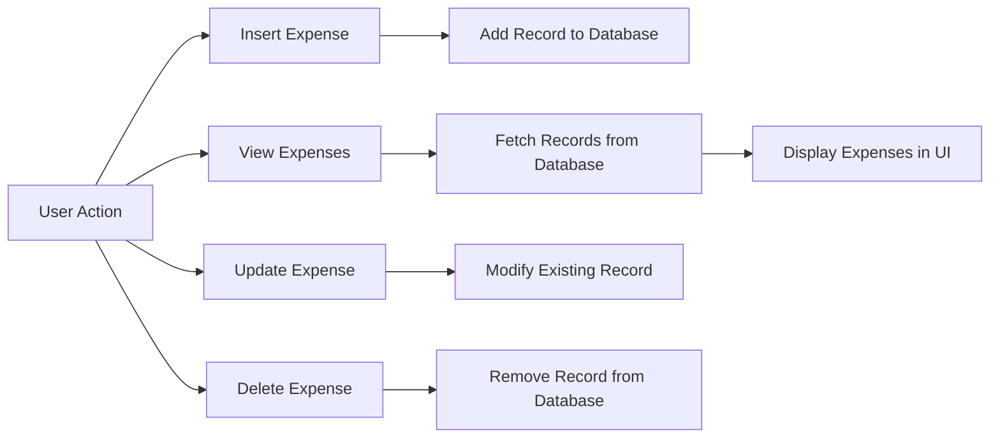

## 11.4.3 Implementing Data Operations

In this section, we will delve into implementing CRUD (Create, Read, Update, Delete) operations for managing expenses within our Expense Tracker App. These operations are fundamental for any application that requires data persistence, allowing users to interact with their data effectively. We'll use SQLite, a lightweight database engine, to store and manage our expense records. This approach ensures that our app can function offline and provides a robust solution for data management.

### Overview of CRUD Operations

CRUD operations are the backbone of any data-driven application. Here's a brief overview of what each operation entails:

- **Create (Insert):** Adding new records to the database.
- **Read (Retrieve):** Fetching existing records from the database.
- **Update:** Modifying existing records in the database.
- **Delete:** Removing records from the database.

We'll implement these operations using Dart's async/await syntax to handle asynchronous database interactions, ensuring a smooth and responsive user experience.

### Setting Up the Expense Model

Before we dive into the CRUD operations, let's define our `Expense` model. This model will represent the structure of our expense records in the database.

```dart
class Expense {
  final int? id;
  final double amount;
  final int? categoryId;
  final String date;
  final String? description;

  Expense({this.id, required this.amount, this.categoryId, required this.date, this.description});

  Map<String, dynamic> toMap() {
    return {
      'id': id,
      'amount': amount,
      'category_id': categoryId,
      'date': date,
      'description': description,
    };
  }

  factory Expense.fromMap(Map<String, dynamic> map) {
    return Expense(
      id: map['id'],
      amount: map['amount'],
      categoryId: map['category_id'],
      date: map['date'],
      description: map['description'],
    );
  }
}
```

### Inserting Expenses

To insert a new expense into the database, we'll create a method that takes an `Expense` object, converts it to a map, and inserts it into the `expenses` table.

```dart
class ExpenseDatabaseHelper {
  final DatabaseHelper _dbHelper = DatabaseHelper();

  Future<int> insertExpense(Expense expense) async {
    final db = await _dbHelper.database;
    return await db.insert('expenses', expense.toMap());
  }
}
```

#### Handling Relationships with Categories

If your app categorizes expenses, ensure that each expense entry references a valid category ID. This can be managed by maintaining a separate `categories` table and using foreign keys to establish relationships.

### Retrieving Expenses

Fetching expenses from the database involves querying the `expenses` table and converting the results into a list of `Expense` objects.

```dart
Future<List<Expense>> getExpenses() async {
  final db = await _dbHelper.database;
  final List<Map<String, dynamic>> maps = await db.query('expenses', orderBy: 'date DESC');
  return List.generate(maps.length, (i) {
    return Expense.fromMap(maps[i]);
  });
}
```

#### Filtering Expenses

You can enhance the retrieval process by adding filters, such as fetching expenses by date or category. This can be achieved by modifying the query parameters.

### Updating Expenses

Updating an expense involves modifying an existing record in the database. We'll use the `update` method, specifying the record to update using its ID.

```dart
Future<int> updateExpense(Expense expense) async {
  final db = await _dbHelper.database;
  return await db.update(
    'expenses',
    expense.toMap(),
    where: 'id = ?',
    whereArgs: [expense.id],
  );
}
```

#### Ensuring Data Consistency

When updating records, ensure that the data remains consistent. For example, if an expense's category changes, verify that the new category ID is valid.

### Deleting Expenses

To delete an expense, we'll use the `delete` method, specifying the record to remove using its ID.

```dart
Future<int> deleteExpense(int id) async {
  final db = await _dbHelper.database;
  return await db.delete(
    'expenses',
    where: 'id = ?',
    whereArgs: [id],
  );
}
```

#### Confirming Deletions

To prevent accidental data loss, consider implementing a confirmation dialog before performing the deletion.

### Managing Asynchronous Operations

Handling database operations asynchronously is crucial for maintaining a responsive UI. Dart's `async` and `await` keywords simplify this process, allowing you to write asynchronous code that reads like synchronous code.

```dart
Future<void> performDatabaseOperation() async {
  try {
    // Perform some database operation
    await someAsyncFunction();
  } catch (e) {
    // Handle exceptions
  }
}
```

### Error Handling

Robust error handling is essential for a smooth user experience. Catch potential exceptions during database operations and provide meaningful feedback to the user.

```dart
try {
  await insertExpense(expense);
  // Notify user of success
} catch (e) {
  // Handle error and notify user
}
```

### Visualizing the Workflow

Here's a diagram illustrating the flow of CRUD operations in our Expense Tracker App:



### Conclusion

Implementing CRUD operations in your Flutter app is a critical step towards building a fully functional and user-friendly application. By leveraging SQLite for data persistence and Dart's async/await for handling asynchronous operations, you can ensure that your app remains responsive and efficient. Remember to handle errors gracefully and provide users with clear feedback to enhance their experience.

### Further Reading and Resources

- [Flutter Documentation](https://flutter.dev/docs)
- [SQLite Documentation](https://www.sqlite.org/docs.html)
- [Dart Language Tour](https://dart.dev/guides/language/language-tour)
- [Async Programming in Dart](https://dart.dev/codelabs/async-await)

By mastering these concepts, you'll be well-equipped to implement data operations in your own projects, paving the way for more complex and feature-rich applications.

## Quiz Time!



### What is the primary purpose of CRUD operations in an app?

- [x] To manage data within the app
- [ ] To enhance the app's UI design
- [ ] To improve app performance
- [ ] To handle user authentication

> **Explanation:** CRUD operations are essential for managing data within an app, allowing users to create, read, update, and delete records.

### Which Dart feature is used to handle asynchronous database operations?

- [x] async/await
- [ ] FutureBuilder
- [ ] StreamBuilder
- [ ] setState

> **Explanation:** The async/await syntax in Dart is used to handle asynchronous operations, making it easier to manage database interactions without blocking the UI.

### How can you ensure data consistency when updating an expense record?

- [x] By verifying that all related data, such as category IDs, are valid
- [ ] By using a faster database engine
- [ ] By implementing a caching mechanism
- [ ] By increasing the app's memory allocation

> **Explanation:** Ensuring data consistency involves verifying that all related data is valid and correctly updated, such as checking category IDs when updating an expense.

### What method is used to convert a Dart object to a map for database insertion?

- [x] toMap()
- [ ] fromMap()
- [ ] toJson()
- [ ] fromJson()

> **Explanation:** The toMap() method is used to convert a Dart object into a map, which can then be inserted into the database.

### What should you do before deleting an expense record to prevent accidental data loss?

- [x] Implement a confirmation dialog
- [ ] Automatically back up the database
- [ ] Log the deletion in a file
- [ ] Notify the app administrator

> **Explanation:** Implementing a confirmation dialog before deletion helps prevent accidental data loss by ensuring the user intends to delete the record.

### Which method is used to fetch all expense records from the database?

- [x] query()
- [ ] insert()
- [ ] update()
- [ ] delete()

> **Explanation:** The query() method is used to fetch records from the database, allowing you to retrieve all expense records.

### What is the purpose of the Expense.fromMap() factory constructor?

- [x] To create an Expense object from a map
- [ ] To convert an Expense object to a map
- [ ] To serialize an Expense object to JSON
- [ ] To deserialize JSON into an Expense object

> **Explanation:** The Expense.fromMap() factory constructor is used to create an Expense object from a map, typically retrieved from the database.

### How can you filter expenses by category when retrieving them from the database?

- [x] By modifying the query parameters to include a WHERE clause
- [ ] By sorting the results after retrieval
- [ ] By using a different database table
- [ ] By implementing a custom sorting algorithm

> **Explanation:** Filtering expenses by category can be achieved by modifying the query parameters to include a WHERE clause that specifies the desired category.

### What is a common practice to handle exceptions during database operations?

- [x] Using try-catch blocks
- [ ] Ignoring the exceptions
- [ ] Logging the exceptions to a file
- [ ] Displaying a generic error message

> **Explanation:** Using try-catch blocks is a common practice to handle exceptions during database operations, allowing you to manage errors gracefully.

### True or False: The delete() method requires the ID of the record to be deleted.

- [x] True
- [ ] False

> **Explanation:** True. The delete() method requires the ID of the record to be deleted to ensure that the correct record is removed from the database.


