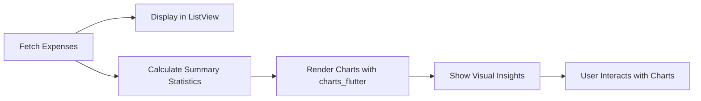

## 11.4.4 Displaying Data Visually

In this section, we will explore how to present stored expense data in a user-friendly and visually appealing manner using Flutter. We'll delve into displaying lists of expenses, categorizing them, summarizing statistics, and visualizing data with charts. By the end of this section, you'll be equipped to enhance your Expense Tracker App with engaging visual elements that provide users with insightful analytics.

### Displaying Lists of Expenses

Displaying data in a list format is a fundamental aspect of many applications, especially those dealing with dynamic datasets like expenses. Flutter's `ListView.builder` is a powerful widget that allows us to efficiently render lists, even with large datasets.

#### Using `ListView.builder`

The `ListView.builder` widget is ideal for creating lists where the number of items is not fixed. It builds list items on demand, which is efficient for performance.

```dart
import 'package:flutter/material.dart';

class ExpenseListPage extends StatelessWidget {
  final List<Expense> expenses;

  ExpenseListPage({required this.expenses});

  @override
  Widget build(BuildContext context) {
    return Scaffold(
      appBar: AppBar(title: Text('Your Expenses')),
      body: ListView.builder(
        itemCount: expenses.length,
        itemBuilder: (context, index) {
          final expense = expenses[index];
          return ListTile(
            leading: Icon(Icons.money),
            title: Text('\$${expense.amount.toStringAsFixed(2)}'),
            subtitle: Text(expense.description ?? 'No Description'),
            trailing: Text(expense.date),
          );
        },
      ),
    );
  }
}
```

**Key Points:**
- **Dynamic Rendering:** `ListView.builder` only builds the visible items, which is efficient for large lists.
- **Customization:** Each `ListTile` can be customized to display relevant expense details such as amount, description, and date.

#### Styling List Items

To enhance the clarity and aesthetics of list items, consider the following styling tips:
- **Icons and Colors:** Use icons and colors to represent different categories or statuses of expenses.
- **Typography:** Choose fonts and sizes that improve readability.
- **Spacing and Dividers:** Use padding and dividers to separate items visually.

### Categorizing Expenses

Grouping expenses by category helps users understand their spending patterns. Flutter provides various ways to categorize and filter data.

#### Grouping Expenses by Category

You can group expenses by category and display them in sections. This can be achieved using a combination of `ListView` and `ExpansionTile`.

```dart
import 'package:flutter/material.dart';

class CategorizedExpenseList extends StatelessWidget {
  final Map<String, List<Expense>> categorizedExpenses;

  CategorizedExpenseList({required this.categorizedExpenses});

  @override
  Widget build(BuildContext context) {
    return ListView(
      children: categorizedExpenses.keys.map((category) {
        return ExpansionTile(
          title: Text(category),
          children: categorizedExpenses[category]!.map((expense) {
            return ListTile(
              title: Text('\$${expense.amount.toStringAsFixed(2)}'),
              subtitle: Text(expense.description ?? 'No Description'),
            );
          }).toList(),
        );
      }).toList(),
    );
  }
}
```

**Key Points:**
- **ExpansionTile:** Allows users to expand and collapse categories, making the UI cleaner.
- **Dynamic Grouping:** Expenses are grouped dynamically based on their category.

#### Providing Filter Options

Implementing filters enables users to view specific categories or date ranges. You can use `DropdownButton` or `PopupMenuButton` for filter selection.

```dart
DropdownButton<String>(
  value: selectedCategory,
  items: categories.map((String category) {
    return DropdownMenuItem<String>(
      value: category,
      child: Text(category),
    );
  }).toList(),
  onChanged: (String? newValue) {
    setState(() {
      selectedCategory = newValue!;
      // Update the displayed expenses based on the selected category
    });
  },
)
```

### Summary Statistics

Providing summary statistics gives users a quick overview of their financial status. This can include total expenses, average spending, and more.

#### Calculating and Displaying Statistics

Use Flutter widgets like `Card`, `Container`, and `Text` to display summary statistics.

```dart
import 'package:flutter/material.dart';

class ExpenseSummary extends StatelessWidget {
  final double totalExpenses;
  final double averageSpending;

  ExpenseSummary({required this.totalExpenses, required this.averageSpending});

  @override
  Widget build(BuildContext context) {
    return Card(
      margin: EdgeInsets.all(16.0),
      child: Padding(
        padding: const EdgeInsets.all(16.0),
        child: Column(
          children: [
            Text('Total Expenses: \$${totalExpenses.toStringAsFixed(2)}'),
            Text('Average Spending: \$${averageSpending.toStringAsFixed(2)}'),
          ],
        ),
      ),
    );
  }
}
```

**Key Points:**
- **Clarity:** Use clear and concise text to convey statistics.
- **Visual Hierarchy:** Arrange statistics in a way that highlights the most important information.

### Data Visualization

Visualizing data with charts can significantly enhance the analytical capabilities of your app. Flutter supports several charting libraries, such as `charts_flutter` and `fl_chart`.

#### Integrating Charting Libraries

To visualize expense data, you can use the `charts_flutter` library to create various types of charts.

```dart
import 'package:flutter/material.dart';
import 'package:charts_flutter/flutter.dart' as charts;

class ExpenseChartPage extends StatelessWidget {
  final List<Expense> expenses;

  ExpenseChartPage({required this.expenses});

  @override
  Widget build(BuildContext context) {
    final data = _buildChartData();

    List<charts.Series<ExpenseCategory, String>> series = [
      charts.Series(
        id: 'Expenses',
        domainFn: (ExpenseCategory category, _) => category.category,
        measureFn: (ExpenseCategory category, _) => category.amount,
        data: data,
        labelAccessorFn: (ExpenseCategory category, _) => '\$${category.amount}',
      )
    ];

    return Scaffold(
      appBar: AppBar(title: Text('Expenses Chart')),
      body: Padding(
        padding: const EdgeInsets.all(16.0),
        child: charts.PieChart<String>(
          series,
          animate: true,
          defaultRenderer: charts.ArcRendererConfig(
            arcRendererDecorators: [charts.ArcLabelDecorator()],
          ),
        ),
      ),
    );
  }

  List<ExpenseCategory> _buildChartData() {
    Map<String, double> categoryMap = {};
    for (var expense in expenses) {
      String category = expense.categoryId.toString(); // Replace with actual category name
      categoryMap[category] = (categoryMap[category] ?? 0) + expense.amount;
    }
    return categoryMap.entries
        .map((entry) => ExpenseCategory(category: entry.key, amount: entry.value))
        .toList();
  }
}

class ExpenseCategory {
  final String category;
  final double amount;

  ExpenseCategory({required this.category, required this.amount});
}
```

**Key Points:**
- **Chart Types:** Use pie charts for category distribution, bar charts for monthly trends, and line graphs for spending over time.
- **Customization:** Customize colors, labels, and animations to improve readability.

#### Customizing Charts

Customize your charts to enhance user experience and provide better insights.

- **Colors and Themes:** Match chart colors with your app's theme for consistency.
- **Labels and Legends:** Ensure labels are clear and legends are informative.
- **Interactivity:** Allow users to tap on chart elements for more details.

### Interactive UI Elements

Interactive elements make data visualization more engaging and informative.

#### Allowing User Interaction

Enable users to interact with charts to explore data in more detail.

- **Tap and Hover Effects:** Highlight chart segments on tap or hover.
- **Tooltips:** Display additional information when users interact with chart elements.

#### Implementing Animations

Animations can make transitions between data states smoother and more engaging.

```dart
import 'package:flutter/material.dart';
import 'package:charts_flutter/flutter.dart' as charts;

class AnimatedExpenseChart extends StatelessWidget {
  final List<charts.Series> seriesList;
  final bool animate;

  AnimatedExpenseChart(this.seriesList, {this.animate = false});

  @override
  Widget build(BuildContext context) {
    return charts.PieChart(
      seriesList,
      animate: animate,
      animationDuration: Duration(seconds: 1),
      defaultRenderer: charts.ArcRendererConfig(
        arcRendererDecorators: [charts.ArcLabelDecorator()],
      ),
    );
  }
}
```

**Key Points:**
- **Smooth Transitions:** Use animations to transition between different data views.
- **Engagement:** Animated charts can capture user attention and make data exploration more enjoyable.

### Responsive Design

Ensuring that your visual components adapt to different screen sizes and orientations is crucial for a seamless user experience.

#### Adapting to Screen Sizes

Use responsive design principles to ensure your app looks great on all devices.

- **Flexible Layouts:** Use `Flexible` and `Expanded` widgets to adjust layouts dynamically.
- **Orientation Changes:** Handle orientation changes gracefully by adjusting UI components.

#### Testing for Responsiveness

Test your app on various devices and screen sizes to ensure a consistent experience.

- **Simulators and Emulators:** Use device simulators to test different screen sizes.
- **Physical Devices:** Test on real devices to catch issues that simulators might miss.

### Conclusion

Displaying data visually in your Expense Tracker App not only enhances the user experience but also provides valuable insights into spending habits. By leveraging Flutter's powerful widgets and charting libraries, you can create an engaging and informative interface that helps users manage their finances effectively.

### Mermaid.js Diagram

To summarize the process of displaying data visually, here's a flowchart:



This diagram illustrates the flow from fetching expense data to displaying it visually and allowing user interaction.

### Further Resources

- [Flutter Documentation](https://flutter.dev/docs)
- [charts_flutter Package](https://pub.dev/packages/charts_flutter)
- [Responsive Design in Flutter](https://flutter.dev/docs/development/ui/layout/responsive)

By following these guidelines and utilizing the provided code examples, you can enhance your Expense Tracker App with visually appealing and informative data presentations. Experiment with different chart types and styles to find what best suits your app's needs and your users' preferences.

## Quiz Time!



### What is the primary advantage of using `ListView.builder` in Flutter?

- [x] Efficient rendering of large datasets
- [ ] Static list creation
- [ ] Automatic data sorting
- [ ] Built-in filtering capabilities

> **Explanation:** `ListView.builder` is designed for efficient rendering of large datasets by building list items on demand.

### Which widget can be used to group expenses by category in a collapsible manner?

- [ ] ListView
- [x] ExpansionTile
- [ ] GridView
- [ ] Card

> **Explanation:** `ExpansionTile` allows for grouping items in a collapsible manner, making it suitable for categorizing expenses.

### What is a key benefit of visualizing data with charts in an app?

- [x] Enhanced analytical capabilities
- [ ] Reduced app size
- [ ] Faster data processing
- [ ] Simplified codebase

> **Explanation:** Visualizing data with charts enhances analytical capabilities by providing users with clear insights into data patterns and trends.

### Which chart type is best suited for displaying category distribution?

- [ ] Line chart
- [ ] Bar chart
- [x] Pie chart
- [ ] Scatter plot

> **Explanation:** Pie charts are ideal for displaying category distribution as they visually represent parts of a whole.

### How can you allow users to interact with charts for more detailed information?

- [x] Implementing tooltips and tap effects
- [ ] Using static images
- [ ] Disabling animations
- [ ] Removing labels

> **Explanation:** Implementing tooltips and tap effects allows users to interact with charts and access more detailed information.

### What should be considered when customizing charts for better readability?

- [x] Colors, labels, and legends
- [ ] Code complexity
- [ ] Data source
- [ ] App permissions

> **Explanation:** Customizing colors, labels, and legends improves chart readability and user understanding.

### What is the purpose of using animations in data visualization?

- [x] To make transitions smoother and more engaging
- [ ] To increase data accuracy
- [ ] To reduce app load time
- [ ] To simplify code logic

> **Explanation:** Animations make transitions between data states smoother and more engaging, enhancing user experience.

### Which Flutter widget is commonly used for displaying summary statistics?

- [ ] ListView
- [ ] GridView
- [x] Card
- [ ] Scaffold

> **Explanation:** The `Card` widget is commonly used to display summary statistics in a visually appealing manner.

### How can you ensure your app's visual components adapt to different screen sizes?

- [x] Use responsive design principles
- [ ] Hardcode dimensions
- [ ] Limit app to one screen size
- [ ] Disable orientation changes

> **Explanation:** Using responsive design principles ensures that visual components adapt to different screen sizes and orientations.

### True or False: Testing on physical devices is unnecessary if you use simulators.

- [ ] True
- [x] False

> **Explanation:** Testing on physical devices is necessary to catch issues that simulators might miss, ensuring a consistent user experience.


