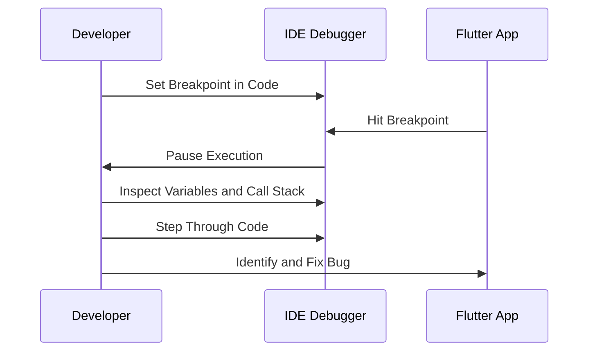

## 12.1.1 Debugging in IDEs

Debugging is a critical skill for any developer, and mastering it can significantly enhance your productivity and the quality of your applications. Integrated Development Environments (IDEs) like Visual Studio Code, Android Studio, and IntelliJ IDEA provide powerful debugging tools that are indispensable for Flutter development. This section will guide you through the essential debugging features these IDEs offer, helping you efficiently identify and resolve issues in your Flutter apps.

### Overview of IDE Debugging

IDEs are more than just code editors; they are comprehensive environments that support the entire development lifecycle, including debugging. Debugging within an IDE allows you to:

- **Identify and Fix Bugs Efficiently:** IDEs provide tools to pause execution, inspect variables, and understand the flow of your application, making it easier to pinpoint and resolve issues.
- **Enhance Code Quality:** By using debugging tools, you can ensure that your code behaves as expected, leading to more robust and reliable applications.
- **Improve Development Speed:** With features like breakpoints and watches, you can quickly test and iterate on your code, reducing the time spent on trial and error.

#### Comparison of Popular IDEs for Flutter

- **Visual Studio Code (VS Code):** Known for its lightweight nature and extensive plugin ecosystem, VS Code offers a robust Flutter extension that includes debugging capabilities.
- **Android Studio:** As the official IDE for Android development, it provides comprehensive support for Flutter, including advanced debugging tools tailored for mobile applications.
- **IntelliJ IDEA:** Offers a powerful set of features for Flutter development, with a focus on productivity and deep integration with the Dart language.

Each of these IDEs has its strengths, and the choice often depends on personal preference and specific project requirements. However, all of them provide essential debugging features that we will explore in detail.

### Setting Breakpoints

Breakpoints are a fundamental debugging tool that allows you to pause the execution of your application at specific points. This enables you to inspect the state of your application and understand its behavior.

- **How to Set Breakpoints:**
  - In **Visual Studio Code**, you can set a breakpoint by clicking in the gutter next to the line number where you want to pause execution.
  - In **Android Studio** and **IntelliJ IDEA**, breakpoints can be set similarly by clicking in the left margin next to the line number.

- **Managing Breakpoints:**
  - You can enable or disable breakpoints without removing them, allowing you to control which parts of your code are paused during execution.
  - Breakpoints can also be removed by clicking on them again.

- **Conditional Breakpoints:**
  - Sometimes, you may want to pause execution only when certain conditions are met. Conditional breakpoints allow you to specify these conditions, making your debugging process more efficient.

### Watches and Variables Inspection

Watches and variable inspection are crucial for understanding the state of your application at any given point.

- **Monitoring Variable Values:**
  - IDEs allow you to inspect the values of variables when execution is paused. This helps you verify that your code is working as expected or identify where it might be going wrong.

- **Using Watches:**
  - Watches let you track specific variables or expressions over time. You can add a watch to monitor changes in a variable's value as you step through your code.

### Call Stack Navigation

Understanding the call stack is essential for tracing the execution flow of your application.

- **Understanding the Call Stack:**
  - The call stack shows the sequence of function calls that led to the current point in execution. This helps you understand how your application reached its current state.

- **Navigating the Call Stack:**
  - You can click on different frames in the call stack to view the state of your application at various points in its execution. This is particularly useful for identifying where an error originated.

### Step Execution

Stepping through your code allows you to control the execution flow and examine how your application behaves at each step.

- **Stepping Into, Over, and Out of Functions:**
  - **Step Into:** Moves the execution to the first line of the function being called, allowing you to debug inside the function.
  - **Step Over:** Executes the current line and moves to the next one, skipping over function calls.
  - **Step Out:** Completes the execution of the current function and returns to the calling function.

These stepping actions give you granular control over the execution flow, enabling you to closely examine how your code operates.

### Practical Example

Let's walk through a practical example using a sample Flutter widget with an intentional bug. This example will demonstrate how to set breakpoints and inspect variables to identify and fix the issue.

```dart
// Sample Flutter widget with intentional bug for demonstration
class BuggyWidget extends StatelessWidget {
  @override
  Widget build(BuildContext context) {
    String message = "Hello, Flutter!";
    // Intentional bug: Null assignment
    message = null; // This will cause a runtime error
    return Scaffold(
      appBar: AppBar(title: Text('Buggy Widget')),
      body: Center(
        child: Text(message),
      ),
    );
  }
}
```

In this example, the `message` variable is assigned a `null` value, which will cause a runtime error when trying to display it in the `Text` widget.

#### Debugging Steps:

1. **Set a Breakpoint:**
   - Place a breakpoint on the line where `message` is assigned `null`.

2. **Run the App in Debug Mode:**
   - Start the app in debug mode. The execution will pause at the breakpoint.

3. **Inspect Variables:**
   - Use the variable inspection tools to check the value of `message`. You will see that it is `null`.

4. **Step Through Code:**
   - Step over the assignment to see how the application behaves. Notice the error when trying to display `null`.

5. **Fix the Bug:**
   - Change the assignment to a valid string, such as `message = "Hello, Flutter!";`.

6. **Rerun the App:**
   - Remove the breakpoint and run the app again to verify that the issue is resolved.

### Mermaid.js Diagram

To visualize the debugging process, consider the following sequence diagram:



This diagram illustrates the interaction between the developer, the IDE debugger, and the Flutter app during the debugging process.

### Best Practices and Tips

- **Use Breakpoints Wisely:** Avoid setting too many breakpoints, as this can slow down your debugging process. Focus on critical areas where issues are likely to occur.
- **Leverage Conditional Breakpoints:** Use conditions to pause execution only when specific criteria are met, reducing unnecessary interruptions.
- **Regularly Inspect Variables:** Keep an eye on variable values to catch unexpected changes early.
- **Understand the Call Stack:** Familiarize yourself with the call stack to quickly trace the source of errors.
- **Practice Step Execution:** Use stepping actions to gain a deeper understanding of your code's behavior.

### Common Pitfalls

- **Ignoring the Call Stack:** Failing to examine the call stack can lead to missed insights about the execution flow.
- **Overlooking Variable Changes:** Not monitoring variable values can result in undetected bugs.
- **Relying Solely on Print Statements:** While `print` statements can be helpful, they are not a substitute for proper debugging tools.

### Additional Resources

- [Flutter Debugging Documentation](https://flutter.dev/docs/testing/debugging)
- [Visual Studio Code Flutter Extension](https://marketplace.visualstudio.com/items?itemName=Dart-Code.flutter)
- [Android Studio Debugging Guide](https://developer.android.com/studio/debug)
- [IntelliJ IDEA Debugging Guide](https://www.jetbrains.com/help/idea/debugging-code.html)

### Conclusion

Debugging is an essential part of the development process, and mastering the tools available in your IDE can greatly enhance your ability to identify and resolve issues. By understanding how to set breakpoints, inspect variables, navigate the call stack, and control execution flow, you can become a more effective and efficient developer.

## Quiz Time!



### What is the primary benefit of using an IDE for debugging?

- [x] Efficiently identify and resolve issues
- [ ] Write code faster
- [ ] Automatically generate documentation
- [ ] Enhance code readability

> **Explanation:** IDEs provide tools like breakpoints and variable inspection that help developers efficiently identify and resolve issues.

### Which IDE is known for its lightweight nature and extensive plugin ecosystem?

- [x] Visual Studio Code
- [ ] Android Studio
- [ ] IntelliJ IDEA
- [ ] Eclipse

> **Explanation:** Visual Studio Code is known for being lightweight and having a vast array of plugins, including those for Flutter development.

### How can you set a breakpoint in Visual Studio Code?

- [x] Click in the gutter next to the line number
- [ ] Right-click the line and select "Set Breakpoint"
- [ ] Use the command palette to search for "Add Breakpoint"
- [ ] Press Ctrl+B

> **Explanation:** In Visual Studio Code, you set a breakpoint by clicking in the gutter next to the line number.

### What is the purpose of a conditional breakpoint?

- [x] To pause execution only when specific conditions are met
- [ ] To pause execution at every line of code
- [ ] To automatically fix bugs
- [ ] To enhance code readability

> **Explanation:** Conditional breakpoints allow you to specify conditions under which the execution should pause, making debugging more efficient.

### What does the call stack show?

- [x] The sequence of function calls leading to the current point
- [ ] The list of all variables in the program
- [ ] The history of all breakpoints set
- [ ] The current memory usage of the application

> **Explanation:** The call stack shows the sequence of function calls that led to the current execution point, helping trace the flow of the program.

### What does "Step Over" do during debugging?

- [x] Executes the current line and moves to the next one
- [ ] Moves into the function being called
- [ ] Completes the execution of the current function
- [ ] Restarts the application

> **Explanation:** "Step Over" executes the current line and moves to the next, skipping over function calls.

### Why is it important to inspect variables during debugging?

- [x] To verify that the code is working as expected
- [ ] To automatically fix bugs
- [ ] To enhance code readability
- [ ] To generate documentation

> **Explanation:** Inspecting variables helps verify that the code is working as expected and identify any discrepancies.

### What is a common pitfall when debugging?

- [x] Ignoring the call stack
- [ ] Using too many breakpoints
- [ ] Writing too many comments
- [ ] Using print statements

> **Explanation:** Ignoring the call stack can lead to missed insights about the execution flow and the source of errors.

### What is the role of watches in debugging?

- [x] To track specific variables or expressions over time
- [ ] To automatically fix bugs
- [ ] To enhance code readability
- [ ] To generate documentation

> **Explanation:** Watches allow you to monitor specific variables or expressions over time, helping track changes during execution.

### True or False: Print statements are a substitute for proper debugging tools.

- [ ] True
- [x] False

> **Explanation:** While print statements can be helpful, they are not a substitute for the comprehensive debugging tools available in IDEs.


