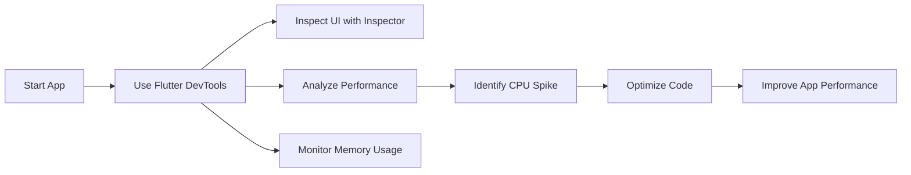

## 12.1.2 Flutter DevTools

Flutter DevTools is an essential suite of performance and debugging tools specifically designed for Flutter applications. It empowers developers to monitor app performance, inspect UI elements, analyze memory usage, and debug network requests effectively. This comprehensive guide will walk you through the various features of Flutter DevTools, providing you with the knowledge to optimize and troubleshoot your Flutter apps efficiently.

### Introduction to Flutter DevTools

Flutter DevTools is a web-based suite of tools that provides a rich set of features for debugging and performance analysis of Flutter applications. It is integrated with popular IDEs like Visual Studio Code and Android Studio, making it accessible and easy to use for developers.

#### What is Flutter DevTools and Its Significance?

Flutter DevTools offers a wide range of functionalities that are crucial for maintaining high-performance, bug-free applications. By leveraging DevTools, developers can:

- **Inspect and Modify Widget Trees:** Visualize and interact with the widget hierarchy to understand the UI structure.
- **Monitor Performance:** Track CPU and GPU usage to identify bottlenecks and optimize performance.
- **Analyze Memory Usage:** Detect memory leaks and analyze memory allocation to ensure efficient resource management.
- **Debug Network Requests:** Monitor HTTP requests and responses to troubleshoot network-related issues.
- **View Logs:** Access detailed application logs and debug messages for in-depth analysis.

#### How to Launch DevTools from Different IDEs

Launching Flutter DevTools is straightforward and can be done directly from your development environment:

- **Visual Studio Code:** 
  - Install the Flutter extension.
  - Run your Flutter application.
  - Open the command palette (`Ctrl+Shift+P` or `Cmd+Shift+P` on macOS) and type "Flutter: Open DevTools".

- **Android Studio:**
  - Ensure the Flutter plugin is installed.
  - Run your Flutter application.
  - Navigate to the "Flutter Inspector" tab and click on "Open DevTools".

### UI Inspector

The UI Inspector is a powerful feature that allows developers to inspect and modify the widget tree of a Flutter application.

#### Inspecting and Modifying Widget Trees

The UI Inspector provides a visual representation of the widget hierarchy, enabling developers to:

- **Explore Widget Properties:** Click on any widget to view its properties and modify them in real-time.
- **Highlight Layout Issues:** Identify layout problems such as overflow or misalignment.
- **Visualize Widget Hierarchy:** Understand the parent-child relationships within the widget tree.

#### Visualizing the Widget Hierarchy and Layout

The widget tree is displayed in a hierarchical format, allowing developers to navigate through the structure easily. This visualization helps in understanding how widgets are nested and how they contribute to the overall layout.

### Performance View

The Performance View is crucial for monitoring the CPU and GPU usage of your Flutter application.

#### Monitoring CPU and GPU Usage

By analyzing the performance metrics, developers can:

- **Identify Performance Bottlenecks:** Detect areas where the app is consuming excessive resources.
- **Optimize Rendering:** Ensure smooth animations and transitions by monitoring frame rendering times.

#### Identifying and Addressing Performance Bottlenecks

The Performance View provides detailed insights into the app's execution, helping developers pinpoint and resolve issues that may lead to slow performance or jank.

### Memory View

The Memory View is designed to help developers track memory allocation and detect memory leaks.

#### Tracking Memory Allocation and Detecting Memory Leaks

Memory management is critical for ensuring that your app runs efficiently without crashing due to resource exhaustion. The Memory View allows you to:

- **Monitor Memory Usage:** Track how memory is allocated and released over time.
- **Detect Memory Leaks:** Identify objects that are not being properly disposed of, leading to memory leaks.

#### Analyzing Memory Snapshots

Developers can take memory snapshots to analyze the state of memory at a specific point in time. This analysis helps in understanding memory usage patterns and optimizing resource management.

### Network View

The Network View provides insights into the network activity of your Flutter application.

#### Monitoring HTTP Requests and Responses

Network performance is vital for apps that rely on external data sources. The Network View allows developers to:

- **Track HTTP Requests:** Monitor outgoing requests and incoming responses.
- **Analyze Network Performance:** Identify slow or failing requests and optimize network interactions.

### Logging View

The Logging View is a comprehensive tool for viewing application logs and debug messages.

#### Viewing Application Logs and Debug Messages

Logs are essential for understanding the behavior of your application. The Logging View provides:

- **Detailed Log Output:** Access to all logs generated by the app.
- **Filtering and Searching:** Tools to filter and search logs for specific information.

### Practical Example: Using DevTools to Identify and Fix a Performance Issue

Let's explore a practical example of using Flutter DevTools to identify and fix a performance issue in a sample Flutter app.

#### Code Example

Consider the following Flutter widget with a performance issue:

```dart
// Sample Flutter app with performance issue for demonstration
class PerformanceIssueWidget extends StatefulWidget {
  @override
  _PerformanceIssueWidgetState createState() => _PerformanceIssueWidgetState();
}

class _PerformanceIssueWidgetState extends State<PerformanceIssueWidget> {
  @override
  Widget build(BuildContext context) {
    // Intensive computation in build method causing performance lag
    List<int> numbers = List.generate(1000000, (index) => index);
    return Scaffold(
      appBar: AppBar(title: Text('Performance Issue')),
      body: Center(
        child: Text('Computed ${numbers.length} numbers'),
      ),
    );
  }
}
```

In this example, the `build` method performs an intensive computation, generating a list of one million numbers. This operation can cause performance lag, especially on lower-end devices.

#### Using DevTools to Diagnose the Issue

1. **Launch DevTools:** Open DevTools from your IDE and navigate to the Performance View.
2. **Record a Performance Trace:** Start recording and interact with the app to capture performance data.
3. **Analyze the Trace:** Look for spikes in CPU usage during the build process.
4. **Identify the Bottleneck:** The trace will highlight the `build` method as a performance bottleneck.

#### Optimizing the Code

To resolve the issue, move the intensive computation outside the `build` method:

```dart
class PerformanceIssueWidget extends StatefulWidget {
  @override
  _PerformanceIssueWidgetState createState() => _PerformanceIssueWidgetState();
}

class _PerformanceIssueWidgetState extends State<PerformanceIssueWidget> {
  List<int> numbers;

  @override
  void initState() {
    super.initState();
    // Perform computation once during initialization
    numbers = List.generate(1000000, (index) => index);
  }

  @override
  Widget build(BuildContext context) {
    return Scaffold(
      appBar: AppBar(title: Text('Performance Issue')),
      body: Center(
        child: Text('Computed ${numbers.length} numbers'),
      ),
    );
  }
}
```

By moving the computation to the `initState` method, we ensure that it only runs once, significantly improving performance.

### Visualizing the Process with Mermaid.js

The following diagram illustrates the process of using Flutter DevTools to identify and resolve a performance issue:



### Best Practices and Common Pitfalls

- **Regularly Monitor Performance:** Use DevTools frequently to catch performance issues early.
- **Avoid Intensive Computations in Build Methods:** Move heavy computations to `initState` or other lifecycle methods.
- **Keep an Eye on Memory Usage:** Regularly check for memory leaks and optimize memory allocation.
- **Utilize Logging Effectively:** Use logs to gain insights into app behavior and troubleshoot issues.

### Additional Resources

- [Flutter DevTools Documentation](https://flutter.dev/docs/development/tools/devtools/overview)
- [Dart DevTools GitHub Repository](https://github.com/flutter/devtools)
- [Flutter Performance Best Practices](https://flutter.dev/docs/perf)

By mastering Flutter DevTools, you can significantly enhance your ability to develop high-performance, reliable Flutter applications. The insights and tools provided by DevTools are invaluable for both debugging and optimizing your apps.

## Quiz Time!



### What is the primary purpose of Flutter DevTools?

- [x] To monitor app performance and debug issues
- [ ] To design UI layouts
- [ ] To compile Flutter applications
- [ ] To manage app deployments

> **Explanation:** Flutter DevTools is a suite of tools designed to monitor app performance, inspect UI elements, analyze memory usage, and debug network requests.

### How can you launch Flutter DevTools from Visual Studio Code?

- [x] Use the command palette and type "Flutter: Open DevTools"
- [ ] Right-click on the project and select "Open DevTools"
- [ ] Use the terminal command `flutter devtools`
- [ ] Navigate to the Flutter website and open DevTools

> **Explanation:** In Visual Studio Code, you can launch DevTools by opening the command palette and typing "Flutter: Open DevTools".

### Which view in Flutter DevTools helps in identifying memory leaks?

- [ ] Performance View
- [ ] Network View
- [x] Memory View
- [ ] Logging View

> **Explanation:** The Memory View in Flutter DevTools is used to track memory allocation and detect memory leaks.

### What is the function of the UI Inspector in Flutter DevTools?

- [ ] To compile the Flutter app
- [x] To inspect and modify widget trees
- [ ] To manage app deployments
- [ ] To analyze network requests

> **Explanation:** The UI Inspector allows developers to inspect and modify widget trees, providing a visual representation of the widget hierarchy.

### In the provided code example, what causes the performance issue?

- [x] Intensive computation in the build method
- [ ] Incorrect widget hierarchy
- [ ] Network request delays
- [ ] Memory leaks

> **Explanation:** The performance issue is caused by intensive computation in the build method, which should be avoided.

### How can you optimize the performance issue in the provided code example?

- [x] Move the computation to the `initState` method
- [ ] Increase the device's CPU
- [ ] Use a different widget
- [ ] Reduce the number of widgets

> **Explanation:** Moving the computation to the `initState` method ensures it only runs once, improving performance.

### Which view in Flutter DevTools is used to monitor HTTP requests?

- [ ] Performance View
- [x] Network View
- [ ] Memory View
- [ ] Logging View

> **Explanation:** The Network View is used to monitor HTTP requests and responses, helping to analyze network performance.

### What is a common pitfall when using the build method in Flutter?

- [ ] Using too few widgets
- [x] Performing intensive computations
- [ ] Not using enough animations
- [ ] Overusing network requests

> **Explanation:** Performing intensive computations in the build method can lead to performance issues and should be avoided.

### Which tool in Flutter DevTools helps in filtering and searching logs?

- [ ] UI Inspector
- [ ] Performance View
- [ ] Network View
- [x] Logging View

> **Explanation:** The Logging View provides tools to filter and search logs for specific information.

### True or False: Flutter DevTools can only be used with Android Studio.

- [ ] True
- [x] False

> **Explanation:** Flutter DevTools can be used with multiple IDEs, including Visual Studio Code and Android Studio.


