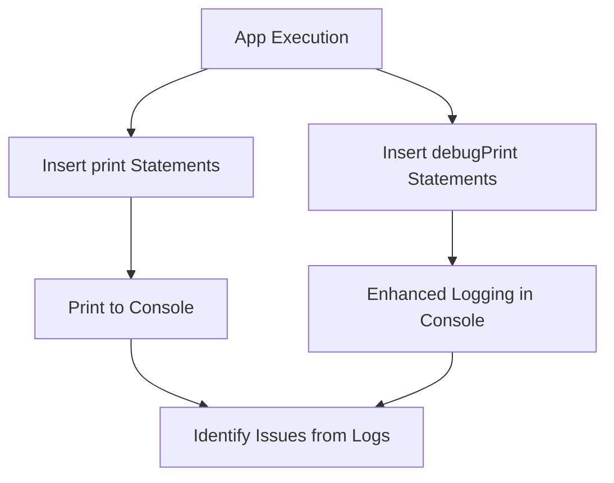

## 12.1.3 Logging with `print` and `debugPrint`

In the realm of software development, debugging is an indispensable skill that every developer must master. Logging is a fundamental aspect of debugging, providing insights into the application's behavior and helping identify issues. In Flutter, two primary functions facilitate logging: `print` and `debugPrint`. This section delves into the nuances of these functions, offering guidance on their effective use and best practices for logging in Flutter applications.

### Introduction to Logging

Logging serves as a window into the internal workings of an application. It allows developers to track the flow of execution, monitor variable states, and capture error messages. Effective logging can significantly reduce the time spent on debugging by providing clear and concise information about the application's state at various points in its lifecycle.

#### Importance of Logging in Identifying and Resolving Issues

- **Visibility into Application Behavior:** Logging provides a real-time view of what the application is doing, which is crucial for diagnosing issues that may not be immediately apparent from the user interface.
- **Error Tracking:** By logging error messages and stack traces, developers can quickly pinpoint the source of a problem.
- **Performance Monitoring:** Logging can also be used to measure the performance of different parts of the application, helping identify bottlenecks.

#### Differences Between `print` and `debugPrint`

Both `print` and `debugPrint` are used to output messages to the console, but they serve slightly different purposes:

- **`print`:** A straightforward function for outputting text to the console. It is suitable for simple messages and quick debugging tasks.
- **`debugPrint`:** An enhanced version of `print` that handles long messages more gracefully by truncating them to avoid overwhelming the console. It is better suited for more complex logging scenarios.

### Using `print`

The `print` function is the most basic form of logging in Flutter. It outputs a string to the console, which can be useful for quick checks and simple debugging tasks.

#### Basic Usage for Simple Debugging

The `print` function is straightforward to use. Here's a simple example:

```dart
void main() {
  print('Hello, Flutter!');
}
```

This will output the message "Hello, Flutter!" to the console. It's a quick way to verify that a piece of code is being executed.

#### Limitations When Dealing with Long Outputs

One of the main limitations of `print` is its handling of long messages. If the message exceeds a certain length, it may be truncated, making it difficult to read the entire output. This is where `debugPrint` becomes more useful.

### Using `debugPrint`

The `debugPrint` function offers enhanced logging capabilities, particularly when dealing with long or complex messages.

#### Enhanced Logging Capabilities with Message Truncation Handling

`debugPrint` automatically splits long messages into smaller chunks, ensuring that the entire message is displayed in the console. This makes it ideal for logging detailed information, such as JSON responses from an API.

```dart
void main() {
  debugPrint('This is a very long message that might get truncated if printed using the print function.', wrapWidth: 1024);
}
```

In this example, `debugPrint` ensures that the entire message is visible in the console, regardless of its length.

#### Suitable for Larger and More Complex Logs

When dealing with complex data structures or large amounts of information, `debugPrint` is the preferred choice. It provides a more reliable way to output detailed logs without losing information.

### Best Practices for Logging

Effective logging requires more than just outputting messages to the console. Here are some best practices to consider:

#### Keeping Log Messages Clear and Concise

- **Clarity:** Ensure that log messages are easy to understand and provide meaningful information.
- **Conciseness:** Avoid overly verbose messages that can clutter the console.

#### Using Consistent Formats and Tags for Easier Searching

- **Consistency:** Use a consistent format for log messages to make them easier to search and filter.
- **Tags:** Include tags or identifiers in log messages to categorize them by severity or component.

#### Avoiding Logging Sensitive Information

- **Security:** Be mindful of logging sensitive information, such as passwords or personal data, which could be exposed in logs.

#### Implementing Different Log Levels (e.g., info, warning, error)

- **Log Levels:** Use different log levels to categorize messages by their importance. For example, use "info" for general information, "warning" for potential issues, and "error" for critical problems.

### Organizing Log Statements

Proper organization of log statements can greatly enhance their usefulness.

#### Structuring Logs to Correlate with App Components and Actions

- **Component-Based Logging:** Structure log messages to reflect the components or actions they relate to, making it easier to trace issues back to their source.

#### Utilizing Conditional Logging for Different Environments (Development vs. Production)

- **Environment-Specific Logging:** Use conditional logging to output different messages based on the environment. For example, verbose logging might be enabled in development but disabled in production.

### Practical Example

Let's see how `print` and `debugPrint` can be effectively used in a Flutter application:

```dart
class LoggingDemo extends StatelessWidget {
  @override
  Widget build(BuildContext context) {
    print('Build method called'); // Simple debug message
    
    debugPrint('Fetching data from API...', wrapWidth: 1024); // Enhanced debug message
    
    return Scaffold(
      appBar: AppBar(title: Text('Logging Demo')),
      body: Center(
        child: ElevatedButton(
          onPressed: () {
            print('Button pressed');
            debugPrint('User pressed the submit button for the login form');
          },
          child: Text('Submit'),
        ),
      ),
    );
  }
}
```

In this example, `print` is used for simple messages, while `debugPrint` handles more detailed logs. This approach ensures that important information is captured without overwhelming the console.

### Visualizing the Logging Process

To better understand the flow of logging in a Flutter application, consider the following diagram:



This diagram illustrates how `print` and `debugPrint` statements are inserted into the application, outputting messages to the console and aiding in issue identification.

### Conclusion

Logging is a powerful tool in the developer's arsenal, providing insights into the application's behavior and helping diagnose issues. By understanding the differences between `print` and `debugPrint`, and following best practices for logging, developers can create more maintainable and debuggable Flutter applications.

### Further Reading and Resources

- [Flutter Documentation on Debugging](https://flutter.dev/docs/testing/debugging)
- [Effective Dart: Usage](https://dart.dev/guides/language/effective-dart/usage)
- [Logging in Flutter: Best Practices](https://medium.com/flutter-community/logging-in-flutter-best-practices-8b2b8f4e9e4e)

By mastering logging techniques, you can enhance your debugging skills and build more robust Flutter applications. Remember to apply these practices in your projects and continue exploring advanced logging strategies as you grow as a developer.

## Quiz Time!



### What is the primary purpose of logging in software development?

- [x] To provide insights into the application's behavior
- [ ] To increase the application's performance
- [ ] To reduce the application's size
- [ ] To enhance the application's UI

> **Explanation:** Logging provides insights into the application's behavior, helping developers diagnose and resolve issues.

### Which function is better suited for handling long messages in Flutter?

- [ ] print
- [x] debugPrint
- [ ] log
- [ ] console.log

> **Explanation:** `debugPrint` is designed to handle long messages by truncating them to avoid overwhelming the console.

### What is a key limitation of the `print` function in Flutter?

- [x] It may truncate long messages
- [ ] It cannot output to the console
- [ ] It is not available in release mode
- [ ] It requires additional configuration

> **Explanation:** The `print` function may truncate long messages, making it less suitable for detailed logs.

### Why is it important to avoid logging sensitive information?

- [x] To protect user privacy and security
- [ ] To reduce the size of log files
- [ ] To improve application performance
- [ ] To comply with open-source licenses

> **Explanation:** Logging sensitive information can expose user data, compromising privacy and security.

### What is a recommended practice for organizing log statements?

- [x] Structuring logs to correlate with app components and actions
- [ ] Logging every function call
- [ ] Using random formats for variety
- [ ] Avoiding log messages in development

> **Explanation:** Structuring logs to correlate with app components and actions helps trace issues back to their source.

### How can developers implement different log levels in Flutter?

- [x] By categorizing messages as info, warning, or error
- [ ] By using different colors for each message
- [ ] By logging only in production
- [ ] By disabling logs in development

> **Explanation:** Implementing log levels like info, warning, and error helps categorize messages by importance.

### What is a benefit of using `debugPrint` over `print`?

- [x] It handles long messages more gracefully
- [ ] It is faster than `print`
- [ ] It requires less code
- [ ] It is only available in release mode

> **Explanation:** `debugPrint` handles long messages more gracefully by truncating them to avoid overwhelming the console.

### Which of the following is a best practice for logging?

- [x] Keeping log messages clear and concise
- [ ] Logging every variable change
- [ ] Using cryptic messages for security
- [ ] Avoiding logs in production

> **Explanation:** Keeping log messages clear and concise ensures they are easy to understand and useful for debugging.

### What is the role of conditional logging?

- [x] To output different messages based on the environment
- [ ] To log only when errors occur
- [ ] To reduce the number of log statements
- [ ] To enhance the application's UI

> **Explanation:** Conditional logging allows developers to output different messages based on the environment, such as development or production.

### True or False: `debugPrint` is only available in debug mode.

- [x] True
- [ ] False

> **Explanation:** `debugPrint` is primarily used in debug mode to provide detailed logging without affecting performance in release mode.


