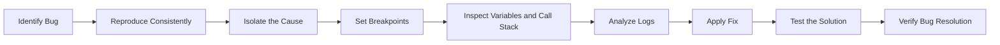

## 12.1.4 Common Debugging Tips

Debugging is an essential skill for any developer, and mastering it can significantly enhance your productivity and the quality of your applications. In the context of Flutter development, understanding how to effectively debug your apps can save you time and frustration. This section provides a comprehensive guide to debugging strategies and tips that can help you identify and fix issues swiftly.

### Understand the Problem

Before diving into the code, it's crucial to have a clear understanding of the problem you're facing. This involves defining the issue precisely and ensuring you can reproduce the bug consistently. Here's how you can approach this:

- **Clearly Define the Issue:** Start by describing the problem in detail. What is the expected behavior, and what is the actual behavior? Are there any error messages or unusual outputs?
  
- **Reproduce the Bug Consistently:** A bug that cannot be reproduced consistently is challenging to fix. Try to identify the conditions under which the bug occurs. This might involve specific user inputs, device states, or network conditions.

### Isolate the Cause

Once you have a clear understanding of the problem, the next step is to isolate the cause. This involves narrowing down the source of the issue by examining different sections of your code.

- **Narrow Down the Source:** Begin by identifying the part of your codebase where the problem might originate. This could be a specific widget, function, or module.

- **Use Binary Search Technique:** If the codebase is large, use a binary search approach to isolate the problematic code. Comment out half of the code and check if the issue persists. Continue this process until you pinpoint the exact location of the bug.

### Use Breakpoints Effectively

Breakpoints are a powerful tool in debugging, allowing you to pause the execution of your program and inspect the state of variables and the flow of execution.

- **Strategically Place Breakpoints:** Identify key points in your code where you suspect the issue might be occurring. Place breakpoints at these locations to inspect variable states and program flow.

- **Inspect Variable States:** Use breakpoints to check the values of variables at different stages of execution. This can help you identify unexpected values or states that might be causing the issue.

### Inspect Widget Trees

Flutter's UI is built using a tree of widgets, and understanding this hierarchy is crucial for debugging UI-related issues.

- **Utilize the UI Inspector:** Flutter's DevTools provide a UI inspector that allows you to examine the widget tree and properties. Use this tool to ensure that widgets are being rendered as expected and that their properties are set correctly.

- **Check for Misplaced Widgets:** Sometimes, UI issues arise from widgets being placed incorrectly in the widget tree. Use the inspector to verify the structure and hierarchy of your widgets.

### Check Logs and Console Output

Logs and console output can provide valuable insights into what your application is doing and where it might be going wrong.

- **Analyze Log Messages:** Use `print` or `debugPrint` statements to output log messages at critical points in your code. Analyze these messages to understand the flow of execution and identify any anomalies.

- **Examine Stack Traces:** When an error occurs, Flutter provides a stack trace that shows the sequence of function calls leading to the error. Use this information to trace back to the source of the problem.

### Leverage Hot Reload and Hot Restart

Flutter's hot reload feature is a game-changer for debugging, allowing you to test fixes in real-time without restarting your app.

- **Use Hot Reload for Quick Fixes:** Make changes to your code and use hot reload to see the effects immediately. This is particularly useful for UI changes and minor logic adjustments.

- **Hot Restart for State Changes:** If your changes affect the app's state or require a full restart, use hot restart to reset the app without a full rebuild.

### Consult Documentation and Community Resources

When you're stuck, don't hesitate to consult the wealth of resources available to Flutter developers.

- **Refer to Official Documentation:** Flutter's official documentation is comprehensive and well-organized. Use it to understand how different components work and to find examples and best practices.

- **Explore GitHub Issues and Community Forums:** Platforms like GitHub and Stack Overflow are great places to find solutions to common problems. Search for similar issues and learn from the experiences of other developers.

### Implement Defensive Programming

Defensive programming involves writing code that anticipates and handles potential errors gracefully.

- **Write Null-Safe Code:** With Dart's null safety feature, ensure that your code is null-safe by default. Use the `?` operator and null-aware operators to handle nullable types.

- **Validate Inputs:** Always validate user inputs and external data to prevent unexpected behavior and errors.

### Use Version Control Effectively

Version control systems like Git are invaluable for tracking changes and identifying when and where issues were introduced.

- **Track Changes with Git:** Use Git to commit changes frequently. This allows you to revert to previous versions of your code if a new change introduces a bug.

- **Use Branches for New Features:** Develop new features and fixes in separate branches. This keeps your main branch stable and allows you to test changes in isolation.

### Practical Example: Debugging a Sample Flutter App

Let's walk through a practical example of debugging a Flutter app with multiple widgets. This example will demonstrate how to apply the debugging tips discussed above.

```dart
// Sample Flutter app with multiple widgets to demonstrate debugging tips
class DebuggingTipsDemo extends StatelessWidget {
  @override
  Widget build(BuildContext context) {
    return Scaffold(
      appBar: AppBar(title: Text('Debugging Tips Demo')),
      body: Column(
        children: [
          Expanded(child: DebugWidgetA()),
          Expanded(child: DebugWidgetB()),
        ],
      ),
    );
  }
}

class DebugWidgetA extends StatelessWidget {
  @override
  Widget build(BuildContext context) {
    String userName = "John Doe";
    int userAge = 30;
    
    // Intentional error: Accessing a widget property that doesn't exist
    // To demonstrate debugging with breakpoints and logs
    // debugPrint(userEmail); // Uncommenting this line will cause an error
    
    debugPrint('User Name: $userName, User Age: $userAge');
    
    return Container(
      color: Colors.blue,
      child: Text('User Info'),
    );
  }
}

class DebugWidgetB extends StatelessWidget {
  @override
  Widget build(BuildContext context) {
    List<String> items = ['Item 1', 'Item 2', 'Item 3'];
    
    // Intentional error: Out-of-bounds access
    // String firstItem = items[5]; // Uncommenting this line will cause a runtime error
    
    debugPrint('Number of items: ${items.length}');
    
    return Container(
      color: Colors.green,
      child: ListView.builder(
        itemCount: items.length,
        itemBuilder: (context, index) {
          return ListTile(title: Text(items[index]));
        },
      ),
    );
  }
}
```

### Debugging Process

1. **Identify the Bug:** In the above code, there are two intentional errors. The first is an attempt to access a non-existent variable `userEmail`, and the second is an out-of-bounds access in the list `items`.

2. **Reproduce the Bug:** Uncomment the lines causing errors to reproduce the issues consistently.

3. **Isolate the Cause:** Use breakpoints to pause execution before the error lines and inspect the state of variables.

4. **Inspect Widget Trees:** Use the Flutter DevTools to inspect the widget tree and ensure that the widgets are structured correctly.

5. **Check Logs:** Use `debugPrint` statements to output the state of variables and confirm the flow of execution.

6. **Apply Fixes:** Correct the errors by defining the missing variable and ensuring list access is within bounds.

7. **Test the Solution:** Use hot reload to test the fixes and verify that the app behaves as expected.

### Mermaid.js Diagram

To visualize the debugging process, consider the following flowchart:



### Conclusion

Debugging is a critical skill that requires a methodical approach and the right tools. By understanding the problem, isolating the cause, and using tools like breakpoints and logs effectively, you can quickly identify and fix issues in your Flutter applications. Remember to leverage community resources and documentation, and practice defensive programming to prevent common bugs. With these strategies, you'll be well-equipped to tackle any debugging challenges you encounter.

## Quiz Time!



### What is the first step in effective debugging?

- [x] Clearly define the issue
- [ ] Apply a fix immediately
- [ ] Consult community forums
- [ ] Use hot reload

> **Explanation:** The first step in effective debugging is to clearly define the issue. Understanding the problem is crucial before attempting to fix it.

### How can you isolate the cause of a bug in a large codebase?

- [x] Use a binary search technique
- [ ] Comment out all code
- [ ] Rewrite the entire codebase
- [ ] Use hot reload

> **Explanation:** Using a binary search technique helps isolate the problematic code by systematically narrowing down the source of the issue.

### What tool can you use to inspect the widget tree in Flutter?

- [x] Flutter DevTools
- [ ] GitHub
- [ ] Stack Overflow
- [ ] Visual Studio Code

> **Explanation:** Flutter DevTools provides a UI inspector that allows you to examine the widget tree and properties.

### What is the purpose of using breakpoints in debugging?

- [x] To pause execution and inspect variable states
- [ ] To automatically fix errors
- [ ] To delete problematic code
- [ ] To speed up the application

> **Explanation:** Breakpoints allow you to pause execution and inspect the state of variables and the flow of execution.

### Why is it important to reproduce a bug consistently?

- [x] To understand the conditions under which it occurs
- [ ] To make the application crash
- [x] To ensure the bug is real
- [ ] To confuse the debugger

> **Explanation:** Reproducing a bug consistently helps understand the conditions under which it occurs and ensures the bug is real.

### What is a common use of the `debugPrint` function?

- [x] Outputting log messages
- [ ] Deleting code
- [ ] Compiling the application
- [ ] Styling widgets

> **Explanation:** The `debugPrint` function is used to output log messages at critical points in your code.

### How can version control help in debugging?

- [x] By tracking changes and identifying when issues were introduced
- [ ] By automatically fixing bugs
- [x] By allowing you to revert to previous versions
- [ ] By deleting problematic code

> **Explanation:** Version control helps track changes, identify when issues were introduced, and allows you to revert to previous versions.

### What is defensive programming?

- [x] Writing code that anticipates and handles potential errors
- [ ] Writing code that is difficult to understand
- [ ] Writing code that is not tested
- [ ] Writing code that is not documented

> **Explanation:** Defensive programming involves writing code that anticipates and handles potential errors gracefully.

### What is the benefit of using hot reload in Flutter?

- [x] To test fixes in real-time without restarting the app
- [ ] To delete code
- [ ] To compile the application
- [ ] To style widgets

> **Explanation:** Hot reload allows you to test fixes in real-time without restarting the app, making it particularly useful for UI changes and minor logic adjustments.

### True or False: Consulting community resources is not helpful in debugging.

- [ ] True
- [x] False

> **Explanation:** False. Consulting community resources can be very helpful in debugging, as you can learn from the experiences of other developers and find solutions to common problems.


