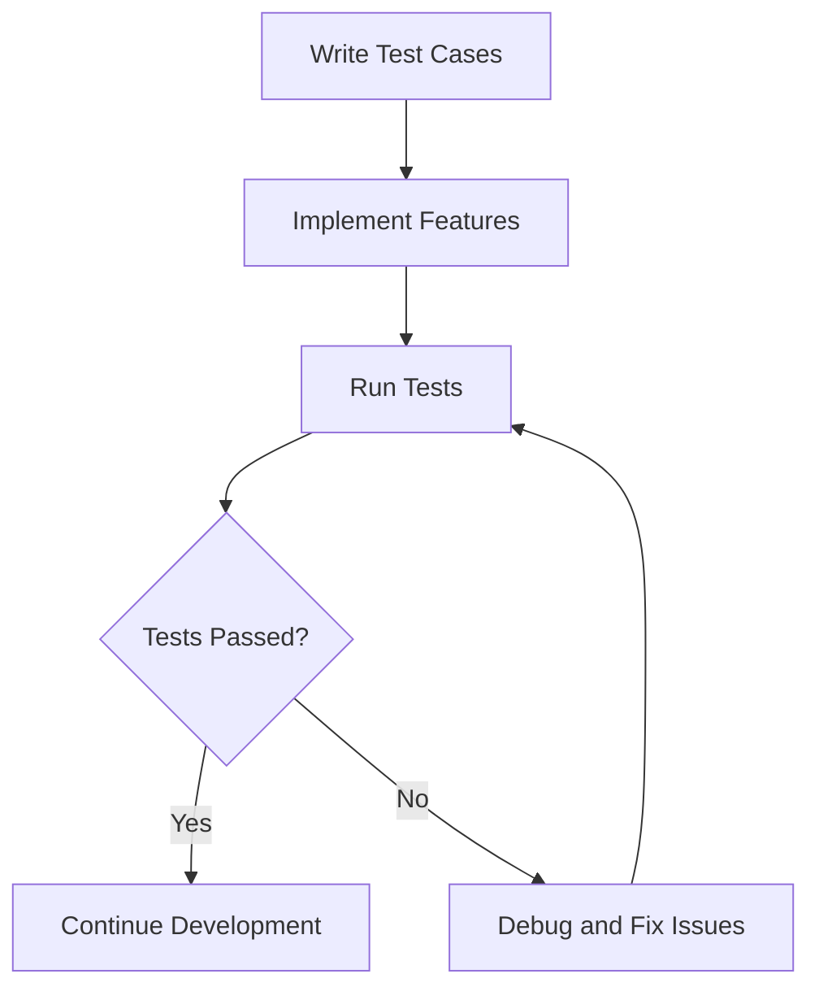

## 12.2.1 Why Testing Matters

In the world of software development, testing is not just a step in the process—it's a fundamental practice that ensures the reliability, stability, and quality of applications. For Flutter developers, understanding the importance of testing is crucial to delivering robust and user-friendly apps. This section delves into why testing matters, the different types of tests, the benefits of automated testing, and the principles of Test-Driven Development (TDD).

### Importance of Testing

Testing plays a pivotal role in the software development lifecycle. Here are some key reasons why testing is indispensable:

- **Preventing Regressions and Reducing Bugs:** Testing helps catch bugs early in the development process, preventing them from reaching production. By identifying and fixing issues early, developers can avoid costly and time-consuming bug fixes later on.

- **Ensuring New Features Work as Intended:** As new features are added to an application, testing ensures that these features work correctly without introducing new bugs or breaking existing functionality. This is particularly important in agile development environments where changes are frequent.

- **Facilitating Refactoring and Code Maintenance:** With a comprehensive suite of tests, developers can refactor code with confidence, knowing that any unintended changes will be caught by the tests. This leads to cleaner, more maintainable codebases.

- **Improving Code Quality and Developer Productivity:** Testing encourages developers to write better code. It provides a safety net that allows developers to experiment and innovate without fear of breaking the application. This, in turn, boosts productivity and fosters a culture of quality.

### Types of Testing

In Flutter development, there are several types of tests, each serving a specific purpose:

- **Unit Testing:** This involves testing individual functions, methods, or classes in isolation. Unit tests are fast and help ensure that the smallest parts of an application work as expected. They are the foundation of a robust testing strategy.

- **Widget Testing:** Widget tests (or component tests) verify that individual UI components behave as intended. These tests ensure that widgets render correctly and respond to user interactions appropriately. Widget testing is crucial for maintaining UI consistency.

- **Integration Testing:** Integration tests evaluate the complete app flow and interactions between different components. They simulate real user scenarios and ensure that the app functions as a whole. Integration tests are essential for catching issues that arise from the interaction of multiple components.

### Benefits of Automated Testing

Automated testing offers numerous advantages over manual testing:

- **Speed and Efficiency:** Automated tests can be run quickly and repeatedly, making them much faster than manual testing. This allows developers to test more frequently and catch issues sooner.

- **Continuous Integration and Delivery:** Automated tests are integral to continuous integration (CI) and continuous delivery (CD) pipelines. They enable teams to automatically test and deploy code changes, ensuring that the application remains stable and reliable.

- **Documentation and Examples:** Automated tests serve as documentation for the expected behavior of the application. They provide concrete examples of how the code should function, which is invaluable for new team members or when revisiting old code.

### Test-Driven Development (TDD)

Test-Driven Development is a software development approach where tests are written before the actual code. TDD follows a simple cycle:

1. **Write a Test:** Before writing any functional code, a developer writes a test for the next bit of functionality to be implemented.

2. **Run the Test:** Initially, the test will fail because the feature is not yet implemented.

3. **Implement the Feature:** Write the minimum amount of code necessary to pass the test.

4. **Refactor:** Clean up the code while ensuring that all tests still pass.

TDD encourages better design and clearer requirements. By focusing on the test first, developers are forced to think about the desired outcome and how the code should behave, leading to more thoughtful and deliberate design decisions.

### Practical Example

Let's look at a simple example of a unit test in a Flutter application. Suppose we have a utility function that adds two numbers:

```dart
// File: lib/math_utils.dart
int add(int a, int b) {
  return a + b;
}
```

We can write a unit test for this function as follows:

```dart
// File: test/math_utils_test.dart
import 'package:flutter_test/flutter_test.dart';
import 'package:your_app/math_utils.dart';

void main() {
  test('adds two numbers', () {
    expect(add(2, 3), 5);
    expect(add(-1, 1), 0);
  });
}
```

In this test, we use the `test` function from the `flutter_test` package to define a test case. The `expect` function checks whether the result of `add(2, 3)` is `5` and `add(-1, 1)` is `0`. If the function behaves as expected, the test will pass.

### Visualizing the Testing Process

To better understand the testing process, consider the following flowchart:



This diagram illustrates the iterative nature of testing and development. Tests are written first, features are implemented, and tests are run. If tests pass, development continues; if not, debugging and fixing are necessary before proceeding.

### Conclusion

Testing is a cornerstone of high-quality software development. It not only ensures that applications work correctly but also enhances developer productivity and code quality. By adopting a comprehensive testing strategy that includes unit, widget, and integration tests, and by embracing practices like TDD, Flutter developers can build reliable, maintainable, and user-friendly applications.

### Further Reading and Resources

- [Flutter Testing Documentation](https://flutter.dev/docs/testing)
- [Test-Driven Development by Example by Kent Beck](https://www.amazon.com/Test-Driven-Development-Kent-Beck/dp/0321146530)
- [Effective Dart: Testing](https://dart.dev/guides/language/effective-dart/testing)

## Quiz Time!



### What is the primary purpose of testing in software development?

- [x] To ensure the reliability, stability, and quality of applications.
- [ ] To increase the complexity of the codebase.
- [ ] To make development slower and more cumbersome.
- [ ] To replace the need for documentation.

> **Explanation:** Testing ensures that applications are reliable, stable, and of high quality by catching bugs early and verifying that features work as intended.

### Which type of testing involves verifying individual functions or methods?

- [x] Unit Testing
- [ ] Widget Testing
- [ ] Integration Testing
- [ ] System Testing

> **Explanation:** Unit testing focuses on testing individual functions or methods in isolation to ensure they work correctly.

### What is a key benefit of automated testing?

- [x] It is faster and more efficient than manual testing.
- [ ] It requires more manual intervention.
- [ ] It is less reliable than manual testing.
- [ ] It cannot be integrated into CI/CD pipelines.

> **Explanation:** Automated testing is faster and more efficient than manual testing, allowing for frequent and reliable testing, especially in CI/CD environments.

### What does TDD stand for in software development?

- [x] Test-Driven Development
- [ ] Test-Driven Design
- [ ] Test-Driven Documentation
- [ ] Test-Driven Debugging

> **Explanation:** TDD stands for Test-Driven Development, a practice where tests are written before the actual code to guide development.

### In TDD, what is the first step in the development cycle?

- [x] Write a Test
- [ ] Implement the Feature
- [ ] Refactor the Code
- [ ] Run the Test

> **Explanation:** In TDD, the first step is to write a test that defines the desired functionality before implementing the feature.

### What is the role of widget testing in Flutter?

- [x] To test UI components in isolation.
- [ ] To test the entire app flow.
- [ ] To test backend services.
- [ ] To test network connectivity.

> **Explanation:** Widget testing in Flutter focuses on testing individual UI components to ensure they render and behave correctly.

### Which of the following is NOT a benefit of testing?

- [ ] Preventing regressions and reducing bugs.
- [ ] Facilitating refactoring and code maintenance.
- [x] Increasing the number of bugs.
- [ ] Improving code quality and developer productivity.

> **Explanation:** Testing helps prevent regressions, facilitates maintenance, and improves code quality, but it does not increase the number of bugs.

### What is the purpose of integration testing?

- [x] To test the complete app flow and interactions between components.
- [ ] To test individual functions in isolation.
- [ ] To test only the UI components.
- [ ] To test the database schema.

> **Explanation:** Integration testing evaluates the complete app flow and interactions between components to ensure they work together as expected.

### How does automated testing contribute to continuous integration?

- [x] By enabling automatic testing and deployment of code changes.
- [ ] By requiring manual testing for each code change.
- [ ] By slowing down the integration process.
- [ ] By eliminating the need for version control.

> **Explanation:** Automated testing is integral to continuous integration, allowing for automatic testing and deployment, ensuring stability and reliability.

### True or False: TDD encourages better design and clearer requirements.

- [x] True
- [ ] False

> **Explanation:** TDD encourages better design and clearer requirements by focusing on writing tests first, which define the desired functionality and guide development.


