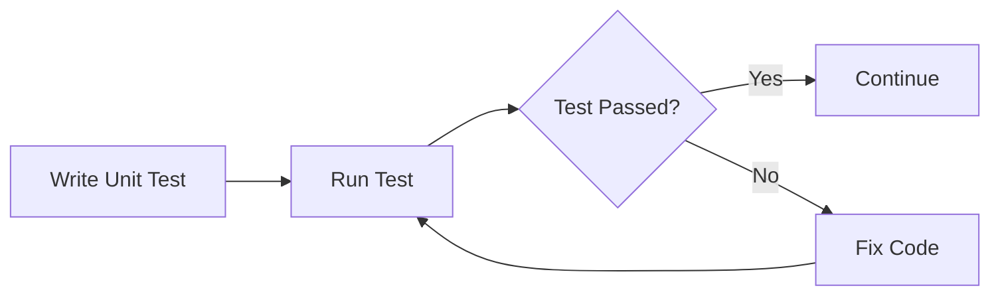

## 12.2.2 Unit Testing

Unit testing is a critical aspect of software development, ensuring that individual units of code function as expected. In the context of Flutter, unit tests focus on testing the smallest parts of your application, such as functions, methods, and classes, in isolation from the rest of the app. This section will guide you through the essentials of unit testing in Flutter, providing insights into writing effective tests, structuring test files, and using assertions to validate outcomes.

### Definition of Unit Testing

**Purpose and Scope of Unit Tests**

Unit tests are designed to verify the correctness of a specific section of code, typically at the function or method level. The primary goal is to ensure that each unit of code performs as intended, handling both expected and edge cases. By isolating these units, developers can quickly identify and fix bugs, leading to more reliable and maintainable code.

**Differences Between Unit, Widget, and Integration Tests**

- **Unit Tests:** Focus on individual functions or methods. They are fast to execute and do not require any UI or external dependencies.
- **Widget Tests:** Test the UI components of your Flutter app. They ensure that widgets render correctly and respond to user interactions as expected.
- **Integration Tests:** Validate the complete application flow, testing how different parts of the app work together. These tests are more comprehensive but also more complex and time-consuming.

### Setting Up Unit Tests

To start writing unit tests in Flutter, you need to set up your testing environment by adding the necessary packages and creating test files.

**Adding the `flutter_test` Package**

Flutter provides a built-in package called `flutter_test` that includes all the necessary tools for writing unit tests. This package is included by default in Flutter projects, but you can ensure it's available by checking your `pubspec.yaml` file:

```yaml
dev_dependencies:
  flutter_test:
    sdk: flutter
```

**Creating Test Files Corresponding to Dart Files**

For each Dart file you want to test, create a corresponding test file in the `test` directory. This helps keep your tests organized and easy to manage. For example, if you have a Dart file named `string_utils.dart`, create a test file named `string_utils_test.dart` in the `test` directory.

### Writing Unit Tests

Writing effective unit tests involves structuring your test cases properly and using assertions to validate the outcomes.

**Structuring Test Cases Using the `test` and `group` Functions**

The `flutter_test` package provides the `test` and `group` functions to organize your test cases. Use `group` to categorize related tests and `test` to define individual test cases.

```dart
import 'package:flutter_test/flutter_test.dart';
import 'package:your_app/string_utils.dart';

void main() {
  group('capitalize', () {
    test('capitalizes the first letter', () {
      expect(capitalize('hello'), 'Hello');
      expect(capitalize('flutter'), 'Flutter');
    });

    test('handles empty strings', () {
      expect(capitalize(''), '');
    });

    test('handles single character strings', () {
      expect(capitalize('a'), 'A');
      expect(capitalize('Z'), 'Z');
    });

    test('handles already capitalized strings', () {
      expect(capitalize('Hello'), 'Hello');
    });
  });
}
```

**Using `expect` Statements for Assertions**

The `expect` function is used to assert that a particular condition holds true. It compares the actual output of your code with the expected result.

**Testing Both Positive and Negative Scenarios**

Ensure your tests cover both expected (positive) and unexpected (negative) scenarios. This helps identify edge cases and potential bugs.

### Mocking Dependencies

In unit testing, it's crucial to isolate the unit of code being tested. This often involves mocking dependencies that the code interacts with.

**Introduction to Mocking for Isolating Units**

Mocking allows you to simulate the behavior of complex objects or external systems, enabling you to test a unit of code in isolation.

**Using Packages Like `mockito` for Creating Mock Objects**

`mockito` is a popular Dart package for creating mock objects. It allows you to define how mocked methods should behave and verify interactions with these methods.

```yaml
dev_dependencies:
  mockito: ^5.0.0
```

Here's a simple example of using `mockito`:

```dart
import 'package:flutter_test/flutter_test.dart';
import 'package:mockito/mockito.dart';
import 'package:your_app/data_service.dart';

class MockDataService extends Mock implements DataService {}

void main() {
  group('DataService', () {
    MockDataService mockDataService;

    setUp(() {
      mockDataService = MockDataService();
    });

    test('returns data when fetchData is called', () {
      when(mockDataService.fetchData()).thenReturn('Mock Data');

      expect(mockDataService.fetchData(), 'Mock Data');
    });
  });
}
```

### Best Practices

To write effective unit tests, follow these best practices:

- **Keeping Tests Independent and Idempotent:** Ensure that each test can run independently and does not affect the outcome of other tests.
- **Writing Clear and Descriptive Test Names:** Use descriptive names for your test cases to make it clear what each test is verifying.
- **Covering Edge Cases and Error Conditions:** Test not only the expected behavior but also edge cases and potential error conditions.

### Practical Example

Let's write and run unit tests for a sample Dart function that capitalizes the first letter of a string.

**Sample Dart Function**

```dart
// File: lib/string_utils.dart
String capitalize(String s) {
  if (s.isEmpty) return s;
  return s[0].toUpperCase() + s.substring(1).toLowerCase();
}
```

**Unit Test for the Function**

```dart
// File: test/string_utils_test.dart
import 'package:flutter_test/flutter_test.dart';
import 'package:your_app/string_utils.dart';

void main() {
  group('capitalize', () {
    test('capitalizes the first letter', () {
      expect(capitalize('hello'), 'Hello');
      expect(capitalize('flutter'), 'Flutter');
    });

    test('handles empty strings', () {
      expect(capitalize(''), '');
    });

    test('handles single character strings', () {
      expect(capitalize('a'), 'A');
      expect(capitalize('Z'), 'Z');
    });

    test('handles already capitalized strings', () {
      expect(capitalize('Hello'), 'Hello');
    });
  });
}
```

### Running Unit Tests

To run your unit tests, use the following command in your terminal:

```bash
flutter test
```

This command will execute all the tests in your `test` directory and provide a summary of the results.

### Visualizing the Testing Process

To better understand the unit testing process, consider the following diagram:



### Conclusion

Unit testing is an essential practice in Flutter development, providing confidence that your code behaves as expected. By writing comprehensive unit tests, you can catch bugs early, improve code quality, and ensure that your app remains robust as it evolves. Remember to follow best practices, such as keeping tests independent and covering edge cases, to maximize the effectiveness of your tests.

### Additional Resources

- [Flutter Testing Documentation](https://flutter.dev/docs/testing)
- [Mockito Package](https://pub.dev/packages/mockito)
- [Effective Dart: Testing](https://dart.dev/guides/language/effective-dart/testing)

## Quiz Time!



### What is the primary goal of unit testing?

- [x] To verify the correctness of individual units of code.
- [ ] To test the entire application flow.
- [ ] To ensure UI components render correctly.
- [ ] To simulate user interactions.

> **Explanation:** Unit testing focuses on verifying the functionality of individual units of code, such as functions or methods, to ensure they behave as expected.

### Which package is used for writing unit tests in Flutter?

- [x] flutter_test
- [ ] mockito
- [ ] sqflite
- [ ] provider

> **Explanation:** The `flutter_test` package is used for writing unit tests in Flutter, providing tools for structuring and running tests.

### What is the purpose of the `expect` function in unit tests?

- [x] To assert that a condition holds true.
- [ ] To define test cases.
- [ ] To mock dependencies.
- [ ] To organize related tests.

> **Explanation:** The `expect` function is used to assert that a particular condition holds true, comparing the actual output with the expected result.

### What is the role of the `group` function in unit testing?

- [x] To organize related test cases.
- [ ] To execute tests in parallel.
- [ ] To mock dependencies.
- [ ] To handle exceptions.

> **Explanation:** The `group` function is used to organize related test cases, making it easier to manage and understand the tests.

### Which package is commonly used for mocking dependencies in Dart?

- [x] mockito
- [ ] flutter_test
- [ ] provider
- [ ] http

> **Explanation:** `mockito` is a popular Dart package used for creating mock objects, allowing developers to simulate the behavior of complex objects or external systems.

### What should you ensure when writing unit tests?

- [x] Tests should be independent and idempotent.
- [ ] Tests should depend on each other.
- [ ] Tests should cover only positive scenarios.
- [ ] Tests should be written after deployment.

> **Explanation:** Unit tests should be independent and idempotent, meaning they can run independently and produce the same result every time.

### What is the benefit of covering edge cases in unit tests?

- [x] To identify potential bugs and ensure robustness.
- [ ] To reduce the number of test cases.
- [ ] To simplify the testing process.
- [ ] To focus only on expected behavior.

> **Explanation:** Covering edge cases helps identify potential bugs and ensures that the code can handle unexpected inputs or conditions.

### How do you run unit tests in a Flutter project?

- [x] Use the `flutter test` command.
- [ ] Use the `flutter run` command.
- [ ] Use the `dart test` command.
- [ ] Use the `flutter build` command.

> **Explanation:** The `flutter test` command is used to execute all the tests in the `test` directory of a Flutter project.

### What is the advantage of using `mockito` for unit testing?

- [x] It allows for creating mock objects to isolate units of code.
- [ ] It simplifies UI testing.
- [ ] It provides integration testing tools.
- [ ] It enhances performance testing.

> **Explanation:** `mockito` allows developers to create mock objects, which helps isolate units of code by simulating the behavior of dependencies.

### True or False: Unit tests should be dependent on external systems.

- [ ] True
- [x] False

> **Explanation:** Unit tests should not depend on external systems. They should isolate the unit of code being tested to ensure accurate and reliable results.


