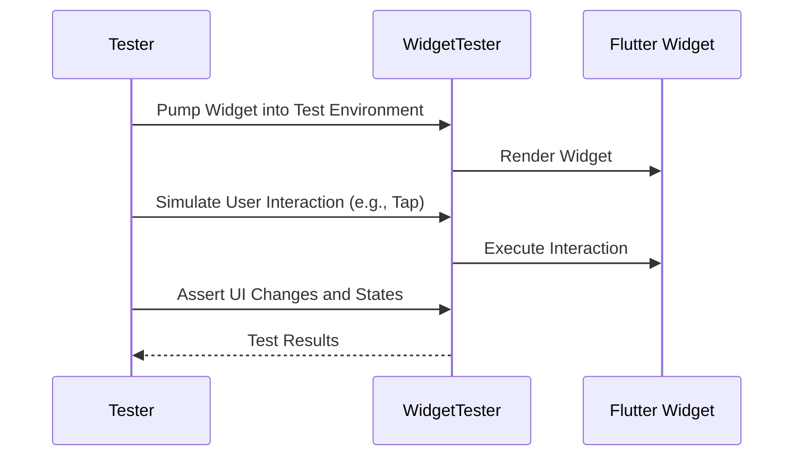

## 12.2.3 Widget Testing

In the world of mobile app development, ensuring that your user interface (UI) behaves as expected is crucial. Widget testing in Flutter allows developers to verify the behavior and appearance of individual widgets in isolation, ensuring that each component of the UI functions correctly. This section will delve into the purpose and scope of widget testing, how to set up and write widget tests, and best practices to follow. We will also explore a practical example to solidify these concepts.

### Definition of Widget Testing

Widget testing focuses on verifying the behavior and appearance of individual widgets in isolation from the rest of the application. Unlike integration tests, which test the interaction between multiple components, widget tests are more granular and aim to ensure that a specific widget renders and functions as intended.

#### Purpose and Scope of Widget Tests

- **Purpose:** Widget tests are designed to validate the UI components' behavior and appearance. They ensure that widgets render correctly, respond to user interactions, and maintain the expected state.
- **Scope:** These tests focus on individual widgets rather than the entire app. They are ideal for testing UI components separately from business logic, allowing developers to catch UI-related bugs early in the development process.

#### Importance of Testing UI Components Separately

Testing UI components separately from business logic has several advantages:
- **Isolation:** By isolating widgets, you can test them without interference from other parts of the application, leading to more reliable and focused tests.
- **Efficiency:** Widget tests are faster to run than integration tests, making them suitable for frequent execution during development.
- **Maintainability:** Isolated tests are easier to maintain and update as the UI evolves.

### Setting Up Widget Tests

Before writing widget tests, you need to set up your testing environment. This involves configuring test files and importing necessary packages.

#### Configuring Test Files for Widget Testing

To begin, create a test file in the `test` directory of your Flutter project. The file should have a descriptive name that reflects the widget being tested, such as `login_form_test.dart`.

#### Importing Necessary Packages

You'll need to import the `flutter_test` package, which provides the tools necessary for widget testing. Additionally, import any other packages your widget depends on, such as `material.dart`.

```dart
import 'package:flutter/material.dart';
import 'package:flutter_test/flutter_test.dart';
import 'package:your_app/login_form.dart';
```

### Writing Widget Tests

Writing widget tests involves using the `WidgetTester` class to pump widgets into the test environment, simulate user interactions, and assert the presence and properties of UI elements.

#### Using `WidgetTester` to Pump Widgets

The `WidgetTester` class is central to widget testing. It allows you to pump widgets into the test environment, simulating how they would appear in a real app.

```dart
await tester.pumpWidget(
  MaterialApp(
    home: Scaffold(
      body: LoginForm(
        onSubmit: (username, password) {
          // Handle submission
        },
      ),
    ),
  ),
);
```

#### Testing Widget Presence and Properties

To verify that widgets are rendered correctly, use the `find` and `expect` functions. The `find` function locates widgets in the widget tree, while `expect` asserts their properties.

```dart
expect(find.byType(TextField), findsNWidgets(2)); // Checks for two TextFields
expect(find.text('Login'), findsOneWidget); // Checks for a button with text 'Login'
```

#### Simulating User Interactions

Simulate user interactions such as taps, swipes, and text input using methods provided by `WidgetTester`.

```dart
await tester.enterText(find.byKey(Key('usernameField')), 'testuser');
await tester.tap(find.byKey(Key('submitButton')));
await tester.pump(); // Rebuild the widget after interaction
```

### Asserting UI States

After simulating interactions, assert changes in the UI to ensure the widget behaves as expected.

#### Verifying Changes in the UI

Check for changes in the UI state after interactions. For example, verify that a form submission updates the state correctly.

```dart
expect(submittedUsername, 'testuser');
expect(submittedPassword, 'password123');
```

#### Checking for the Existence or Absence of Widgets

Ensure that specific widgets appear or disappear as expected after interactions.

```dart
expect(find.byKey(Key('errorText')), findsNothing); // Ensure no error message is shown
```

### Best Practices

Following best practices in widget testing ensures that your tests are effective and maintainable.

#### Keeping Tests Focused

Focus each test on a specific behavior or aspect of the widget. Avoid testing multiple behaviors in a single test.

#### Avoiding Reliance on Widget Hierarchy

Test the widget's behavior and appearance without relying heavily on its position in the widget tree. This makes tests more robust to changes in the UI structure.

#### Using Mock Data and Dependencies

Isolate widgets by using mock data and dependencies. This prevents external factors from affecting the test results.

### Practical Example: Writing and Running a Widget Test

Let's walk through a practical example of writing and running a widget test for a custom Flutter widget.

#### Code Example

Consider a simple login form widget:

```dart
// File: lib/login_form.dart
import 'package:flutter/material.dart';

class LoginForm extends StatefulWidget {
  final void Function(String username, String password) onSubmit;

  LoginForm({required this.onSubmit});

  @override
  _LoginFormState createState() => _LoginFormState();
}

class _LoginFormState extends State<LoginForm> {
  final TextEditingController _usernameController = TextEditingController();
  final TextEditingController _passwordController = TextEditingController();

  void _submit() {
    widget.onSubmit(_usernameController.text, _passwordController.text);
  }

  @override
  Widget build(BuildContext context) {
    return Column(
      children: [
        TextField(
          key: Key('usernameField'),
          controller: _usernameController,
          decoration: InputDecoration(labelText: 'Username'),
        ),
        TextField(
          key: Key('passwordField'),
          controller: _passwordController,
          decoration: InputDecoration(labelText: 'Password'),
          obscureText: true,
        ),
        ElevatedButton(
          key: Key('submitButton'),
          onPressed: _submit,
          child: Text('Login'),
        ),
      ],
    );
  }
}
```

Now, let's write a widget test for this login form:

```dart
// File: test/login_form_test.dart
import 'package:flutter/material.dart';
import 'package:flutter_test/flutter_test.dart';
import 'package:your_app/login_form.dart';

void main() {
  testWidgets('LoginForm submits correct values', (WidgetTester tester) async {
    String? submittedUsername;
    String? submittedPassword;

    await tester.pumpWidget(
      MaterialApp(
        home: Scaffold(
          body: LoginForm(
            onSubmit: (username, password) {
              submittedUsername = username;
              submittedPassword = password;
            },
          ),
        ),
      ),
    );

    // Enter username
    await tester.enterText(find.byKey(Key('usernameField')), 'testuser');
    // Enter password
    await tester.enterText(find.byKey(Key('passwordField')), 'password123');
    // Tap the login button
    await tester.tap(find.byKey(Key('submitButton')));
    // Rebuild the widget after the state has changed
    await tester.pump();

    expect(submittedUsername, 'testuser');
    expect(submittedPassword, 'password123');
  });
}
```

### Mermaid.js Diagram

To visualize the widget testing process, consider the following sequence diagram:



### Conclusion

Widget testing in Flutter is a powerful tool for ensuring that your UI components behave as expected. By isolating widgets and testing them in a controlled environment, you can catch UI-related bugs early and maintain a high standard of quality in your app. Remember to keep your tests focused, use mock data to isolate widgets, and follow best practices to ensure your tests are effective and maintainable.

## Quiz Time!



### What is the primary purpose of widget testing in Flutter?

- [x] To verify the behavior and appearance of individual widgets in isolation.
- [ ] To test the interaction between multiple components.
- [ ] To ensure the entire app functions correctly.
- [ ] To test the backend logic of the application.

> **Explanation:** Widget testing focuses on verifying the behavior and appearance of individual widgets in isolation, ensuring they render and function correctly.

### Which package is essential for writing widget tests in Flutter?

- [x] flutter_test
- [ ] flutter_driver
- [ ] test
- [ ] flutter_ui

> **Explanation:** The `flutter_test` package provides the tools necessary for writing widget tests in Flutter.

### What is the role of the `WidgetTester` class in widget testing?

- [x] It allows you to pump widgets into the test environment and simulate user interactions.
- [ ] It is used to test the backend logic of the application.
- [ ] It provides tools for integration testing.
- [ ] It is used for performance testing.

> **Explanation:** The `WidgetTester` class is central to widget testing, allowing you to pump widgets into the test environment and simulate user interactions.

### How can you simulate a user entering text into a `TextField` during a widget test?

- [x] Use the `enterText` method of `WidgetTester`.
- [ ] Use the `tap` method of `WidgetTester`.
- [ ] Use the `pump` method of `WidgetTester`.
- [ ] Use the `find` method of `WidgetTester`.

> **Explanation:** The `enterText` method of `WidgetTester` is used to simulate a user entering text into a `TextField`.

### What is a best practice when writing widget tests?

- [x] Keep tests focused on a specific widget behavior.
- [ ] Test multiple behaviors in a single test.
- [ ] Rely heavily on the widget hierarchy.
- [ ] Avoid using mock data.

> **Explanation:** Keeping tests focused on a specific widget behavior ensures they are effective and maintainable.

### What should you do after simulating a user interaction in a widget test?

- [x] Call the `pump` method to rebuild the widget.
- [ ] Call the `find` method to locate widgets.
- [ ] Call the `tap` method to simulate another interaction.
- [ ] Call the `expect` method to assert properties.

> **Explanation:** After simulating a user interaction, call the `pump` method to rebuild the widget and reflect any state changes.

### Why is it important to use mock data in widget tests?

- [x] To isolate widgets and prevent external factors from affecting test results.
- [ ] To test the entire app's functionality.
- [ ] To ensure the backend logic is correct.
- [ ] To improve the performance of the tests.

> **Explanation:** Using mock data helps isolate widgets and prevents external factors from affecting the test results.

### What is the purpose of the `expect` function in widget testing?

- [x] To assert the properties and presence of UI elements.
- [ ] To simulate user interactions.
- [ ] To pump widgets into the test environment.
- [ ] To find widgets in the widget tree.

> **Explanation:** The `expect` function is used to assert the properties and presence of UI elements in widget testing.

### Which method is used to locate widgets in the widget tree during a test?

- [x] find
- [ ] tap
- [ ] pump
- [ ] expect

> **Explanation:** The `find` method is used to locate widgets in the widget tree during a test.

### True or False: Widget tests are slower to run than integration tests.

- [ ] True
- [x] False

> **Explanation:** Widget tests are generally faster to run than integration tests, making them suitable for frequent execution during development.


