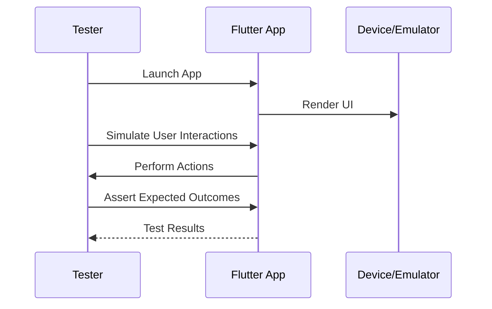

## 12.2.4 Integration Testing

Integration testing is a pivotal aspect of the software development lifecycle, especially in mobile app development with Flutter. It ensures that different parts of an application work together as expected, providing a seamless user experience. This comprehensive guide will delve into the nuances of integration testing in Flutter, offering insights into setting up, writing, and executing tests that mimic real-world user interactions.

### Understanding Integration Testing

#### Definition of Integration Testing

Integration testing is a testing methodology where individual units or components of a software application are combined and tested as a group. The primary goal is to identify issues that occur when different parts of an application interact. In the context of Flutter, integration tests verify that the app's UI and business logic work together correctly.

- **Purpose and Scope:**
  - Validate the interaction between different modules.
  - Ensure that the app behaves as expected in real-world scenarios.
  - Detect interface defects between integrated components.

- **Differences Between Unit, Widget, and Integration Tests:**
  - **Unit Tests:** Focus on testing individual functions or classes in isolation.
  - **Widget Tests:** Test individual widgets and their interactions with the framework.
  - **Integration Tests:** Test the complete app or large parts of it, simulating user interactions across multiple screens.

### Setting Up Integration Tests

#### Adding the `integration_test` Package

To begin with integration testing in Flutter, you need to add the `integration_test` package to your project. This package provides the necessary tools to write and execute integration tests.

```yaml
dev_dependencies:
  flutter_test:
    sdk: flutter
  integration_test:
    sdk: flutter
```

#### Configuring the Test Environment

Setting up the test environment involves configuring your app to run on different platforms such as iOS and Android. This includes setting up emulators or simulators and ensuring that your development environment is properly configured.

- **iOS Configuration:**
  - Ensure Xcode is installed and configured.
  - Use the iOS simulator for testing.

- **Android Configuration:**
  - Install Android Studio and set up an Android emulator.
  - Ensure that the Android SDK is properly configured.

#### Setting Up Device or Emulator Configurations

Running integration tests requires a device or emulator. You can use either physical devices or emulators/simulators. Ensure that the devices are set up and connected properly.

### Writing Integration Tests

#### Structuring Test Files and Naming Conventions

Organizing your test files is crucial for maintaining readability and manageability. Follow a consistent naming convention and structure for your test files.

- **File Naming:** Use descriptive names that reflect the test's purpose, such as `login_flow_test.dart`.
- **Directory Structure:** Place integration tests in a dedicated directory, typically `integration_test/`.

#### Using `WidgetTester` for Interaction Simulations

The `WidgetTester` class is a powerful tool for simulating user interactions in integration tests. It allows you to interact with widgets, enter text, tap buttons, and more.

- **Example Usage:**

  ```dart
  testWidgets('Login flow test', (WidgetTester tester) async {
    await tester.pumpWidget(MyApp());

    // Simulate user entering text
    await tester.enterText(find.byKey(Key('usernameField')), 'testuser');
    await tester.enterText(find.byKey(Key('passwordField')), 'password123');

    // Simulate button tap
    await tester.tap(find.byKey(Key('submitButton')));
    await tester.pumpAndSettle();

    // Verify navigation to home screen
    expect(find.text('Welcome, testuser!'), findsOneWidget);
  });
  ```

#### Automating Complex User Flows

Integration tests are ideal for automating complex user flows such as login, navigation, and data entry. These tests ensure that the app behaves correctly when users perform typical actions.

- **Example Flow:**
  - User logs in.
  - Navigates to a home screen.
  - Adds an item to a list.
  - Verifies that the item appears in the list.

### Running Integration Tests

#### Executing Tests on Emulators, Simulators, and Physical Devices

Running integration tests can be done on various platforms. Use the following command to execute tests:

```bash
flutter drive --target=integration_test/app_test.dart
```

- **On Emulators/Simulators:** Ensure that the emulator or simulator is running before executing the tests.
- **On Physical Devices:** Connect the device via USB and ensure it is recognized by the development environment.

#### Interpreting Test Results and Logs

After running the tests, review the results and logs to identify any issues. The test output will indicate whether tests passed or failed, along with any error messages.

### Best Practices for Integration Testing

#### Keeping Tests Reliable and Independent

- **Isolate Tests:** Ensure that each test can run independently without relying on the outcome of other tests.
- **Use Mock Data:** Avoid using live data to prevent tests from failing due to external changes.

#### Managing Test Data and State Setups

- **Set Up and Tear Down:** Use setup and teardown methods to prepare and clean up test data.
- **Consistent State:** Ensure that the app is in a consistent state before each test.

#### Avoiding Flakiness

Flaky tests are unreliable and can lead to false positives or negatives. To avoid flakiness:

- **Use `pumpAndSettle`:** Ensure that all animations and transitions are complete before making assertions.
- **Avoid Hard-Coded Delays:** Use `await tester.pumpAndSettle()` instead of arbitrary delays.

### Practical Example: Writing and Running an Integration Test

Let's walk through a practical example of writing and running an integration test for a sample Flutter app with multiple screens and user interactions.

#### Code Example

```dart
// File: integration_test/app_test.dart
import 'package:flutter/material.dart';
import 'package:flutter_test/flutter_test.dart';
import 'package:integration_test/integration_test.dart';
import 'package:your_app/main.dart' as app;

void main() {
  IntegrationTestWidgetsFlutterBinding.ensureInitialized();

  testWidgets('Full App Test', (WidgetTester tester) async {
    app.main();
    await tester.pumpAndSettle();

    // Navigate to Login Screen
    expect(find.text('Login'), findsOneWidget);
    await tester.enterText(find.byKey(Key('usernameField')), 'testuser');
    await tester.enterText(find.byKey(Key('passwordField')), 'password123');
    await tester.tap(find.byKey(Key('submitButton')));
    await tester.pumpAndSettle();

    // Verify Navigation to Home Screen
    expect(find.text('Welcome, testuser!'), findsOneWidget);

    // Add an Expense
    await tester.tap(find.byKey(Key('addExpenseButton')));
    await tester.pumpAndSettle();
    await tester.enterText(find.byKey(Key('expenseAmountField')), '50.0');
    await tester.enterText(find.byKey(Key('expenseDescriptionField')), 'Groceries');
    await tester.tap(find.byKey(Key('saveExpenseButton')));
    await tester.pumpAndSettle();

    // Verify Expense Added
    expect(find.text('\$50.00'), findsOneWidget);
    expect(find.text('Groceries'), findsOneWidget);
  });
}
```

#### Explanation of the Code

- **Initialization:** The `IntegrationTestWidgetsFlutterBinding.ensureInitialized()` method is called to set up the integration test environment.
- **App Launch:** The app is launched using `app.main()`.
- **User Interactions:** The test simulates user interactions such as entering text and tapping buttons.
- **Assertions:** The test verifies that the app behaves as expected by checking for specific text or widget states.

### Visualizing Integration Testing with Mermaid.js

To better understand the flow of integration testing, consider the following sequence diagram:



### Conclusion

Integration testing is an essential practice for ensuring that your Flutter app functions correctly as a whole. By simulating real-world user interactions, integration tests help catch issues that may not be apparent in unit or widget tests. By following best practices and leveraging Flutter's testing tools, you can create reliable and effective integration tests that enhance the quality of your applications.

### Further Reading and Resources

- [Flutter Integration Testing Documentation](https://flutter.dev/docs/testing/integration-tests)
- [Effective Flutter Testing](https://flutter.dev/docs/testing)
- [Continuous Integration with Flutter](https://flutter.dev/docs/testing/codelabs)

## Quiz Time!



### What is the primary purpose of integration testing in Flutter?

- [x] To verify that different parts of the app work together seamlessly.
- [ ] To test individual functions or classes in isolation.
- [ ] To ensure that the app's UI components render correctly.
- [ ] To check for syntax errors in the code.

> **Explanation:** Integration testing focuses on verifying the interactions between different parts of the app, ensuring they work together as expected.

### Which package is essential for writing integration tests in Flutter?

- [ ] flutter_test
- [x] integration_test
- [ ] test
- [ ] flutter_driver

> **Explanation:** The `integration_test` package provides the necessary tools for writing and executing integration tests in Flutter.

### How can you ensure that your integration tests are not flaky?

- [x] Use `pumpAndSettle` to wait for animations to complete.
- [ ] Use hard-coded delays to wait for actions to complete.
- [ ] Avoid using assertions in tests.
- [ ] Run tests only on physical devices.

> **Explanation:** Using `pumpAndSettle` ensures that all animations and transitions are complete before making assertions, reducing flakiness.

### What is the role of the `WidgetTester` class in integration testing?

- [x] It simulates user interactions with the app.
- [ ] It compiles the app for testing.
- [ ] It logs errors during test execution.
- [ ] It manages test data and state setups.

> **Explanation:** `WidgetTester` is used to simulate user interactions such as tapping buttons and entering text in integration tests.

### Which command is used to run integration tests in Flutter?

- [x] flutter drive --target=integration_test/app_test.dart
- [ ] flutter test
- [ ] flutter run
- [ ] flutter analyze

> **Explanation:** The `flutter drive` command is used to execute integration tests, specifying the target test file.

### What is a key difference between unit tests and integration tests?

- [x] Unit tests focus on individual functions, while integration tests focus on the app as a whole.
- [ ] Unit tests require physical devices, while integration tests do not.
- [ ] Integration tests are faster to execute than unit tests.
- [ ] Integration tests do not require assertions.

> **Explanation:** Unit tests focus on testing individual functions or classes, whereas integration tests verify the interactions between different parts of the app.

### Why is it important to keep integration tests independent?

- [x] To ensure that each test can run without relying on the outcome of other tests.
- [ ] To reduce the number of test files.
- [ ] To make tests run faster.
- [ ] To avoid using mock data.

> **Explanation:** Keeping tests independent ensures that they can run in any order and do not depend on the results of other tests.

### What should you do if an integration test fails?

- [x] Review the test logs and error messages to identify the issue.
- [ ] Ignore the failure and proceed with development.
- [ ] Remove the failing test from the suite.
- [ ] Increase the test timeout duration.

> **Explanation:** Analyzing the test logs and error messages helps identify the root cause of the failure, allowing you to address the issue.

### Which of the following is a best practice for managing test data in integration tests?

- [x] Use setup and teardown methods to prepare and clean up test data.
- [ ] Use live data from production servers.
- [ ] Hard-code test data within the test files.
- [ ] Avoid using any test data.

> **Explanation:** Using setup and teardown methods ensures that test data is prepared and cleaned up appropriately, maintaining a consistent test environment.

### True or False: Integration tests can only be run on physical devices.

- [ ] True
- [x] False

> **Explanation:** Integration tests can be run on both physical devices and emulators/simulators, providing flexibility in testing environments.


