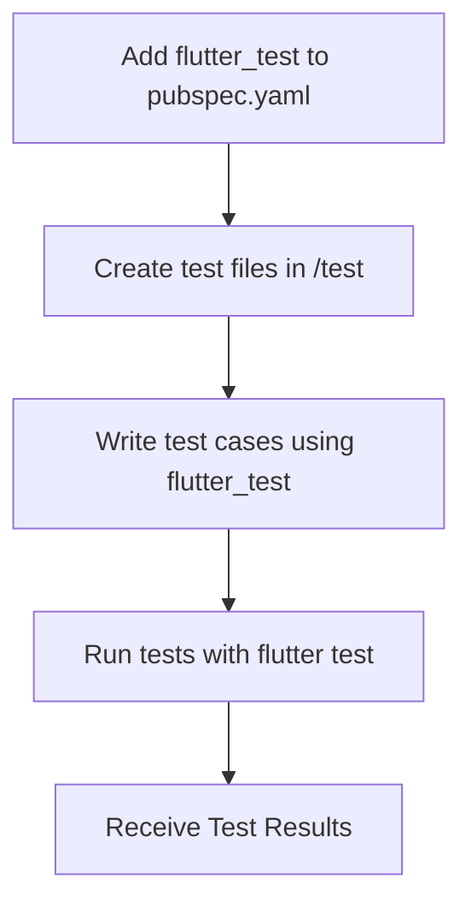

## 12.3.1 Setting Up Tests

Testing is a crucial part of software development, ensuring that your Flutter applications are reliable, maintainable, and bug-free. In this section, we'll explore how to set up a testing environment in a Flutter project using the `flutter_test` package. We'll cover everything from adding necessary dependencies to organizing your test files and running tests effectively.

### Adding Dependencies

To begin setting up your testing environment, you need to ensure that the necessary dependencies are included in your Flutter project. The primary package for testing in Flutter is `flutter_test`, which provides a rich set of tools for writing unit and widget tests.

#### Step-by-Step Guide to Adding Dependencies

1. **Open `pubspec.yaml`:** This file is the central configuration file for your Flutter project, where you define dependencies.

2. **Add `flutter_test`:** Ensure that `flutter_test` is included as a dev dependency. This package is part of the Flutter SDK and provides the necessary tools for testing.

3. **Include Additional Packages:** Depending on your testing needs, you might want to include additional packages such as `mockito` for mocking dependencies or `integration_test` for integration testing.

Here's an example of how your `pubspec.yaml` might look:

```yaml
dev_dependencies:
  flutter_test:
    sdk: flutter
  mockito: ^5.2.0
  integration_test:
    sdk: flutter
```

### Directory Structure

Organizing your test files is essential for maintaining a clean and manageable codebase. Flutter follows a convention where test files are placed in a `test/` directory at the root of your project.

#### Best Practices for Directory Structure

- **Create a `test/` Directory:** This is where all your test files should reside. Keeping tests separate from your source code helps maintain clarity.

- **Naming Conventions:** Use a naming convention that mirrors your source files. For example, if you have a source file named `login_form.dart`, the corresponding test file should be named `login_form_test.dart`.

- **Subdirectories for Organization:** If your project is large, consider using subdirectories within the `test/` directory to group related tests. For example, you might have `test/widgets/` for widget tests and `test/models/` for model tests.

### Configuring Test Environment

Setting up the test environment involves configuring your project to support both widget and integration tests. This includes managing environment-specific settings and ensuring that your tests can run smoothly in different configurations.

#### Key Configurations

- **Widget Tests:** These tests are designed to test individual widgets in isolation. Ensure that your test environment can render widgets by using the `pumpWidget` method provided by `flutter_test`.

- **Integration Tests:** For testing the complete app flow, use the `integration_test` package. This requires additional setup, such as configuring the `integration_test` directory and ensuring that your app can run in a test mode.

### Using Test Runners

Running your tests efficiently is crucial for a smooth development workflow. Flutter provides several ways to execute tests, both through IDE-integrated test runners and the command line.

#### Running Tests

- **IDE Test Runners:** Most modern IDEs, such as Android Studio and Visual Studio Code, have integrated test runners that allow you to run tests directly from the editor. This provides a convenient way to see test results and debug failures.

- **Command Line:** You can also run tests from the command line using the `flutter test` command. This is useful for automated testing and continuous integration setups.

```bash
flutter test
```

### Organizing Test Suites

Grouping related tests into suites can help improve the organization and readability of your test code. Flutter's `flutter_test` package provides a `group` function to facilitate this.

#### Structuring Test Suites

- **Use `group` Function:** Group related tests together to provide context and improve readability. This is especially useful for tests that share setup code.

- **Maintainability:** Keep your test suites organized and maintainable by regularly reviewing and refactoring your test code.

### Practical Example: Setting Up a Basic Test File

Let's walk through setting up a basic test file for a sample Flutter widget. This example will demonstrate how to write a simple widget test using the `flutter_test` package.

#### Sample Code

```dart
// File: test/sample_widget_test.dart
import 'package:flutter/material.dart';
import 'package:flutter_test/flutter_test.dart';
import 'package:your_app/sample_widget.dart';

void main() {
  testWidgets('SampleWidget has a title and message', (WidgetTester tester) async {
    // Build our app and trigger a frame.
    await tester.pumpWidget(
      MaterialApp(
        home: SampleWidget(title: 'Test Title', message: 'Test Message'),
      ),
    );

    // Verify that the title and message are displayed.
    expect(find.text('Test Title'), findsOneWidget);
    expect(find.text('Test Message'), findsOneWidget);
  });
}

// File: lib/sample_widget.dart
import 'package:flutter/material.dart';

class SampleWidget extends StatelessWidget {
  final String title;
  final String message;

  SampleWidget({required this.title, required this.message});

  @override
  Widget build(BuildContext context) {
    return Scaffold(
      appBar: AppBar(title: Text(title)),
      body: Center(child: Text(message)),
    );
  }
}
```

### Understanding the Code

- **Test Setup:** The `testWidgets` function is used to define a widget test. It takes a description and a callback function where you set up the test.

- **Building the Widget:** Use `pumpWidget` to build the widget tree. This simulates rendering the widget in a test environment.

- **Assertions:** Use `expect` to verify that the widget displays the expected text. The `find.text` function locates widgets by their text content.

### Visualizing the Testing Workflow

To better understand the testing workflow, consider the following Mermaid.js diagram, which outlines the steps involved in setting up and running tests in a Flutter project.



### Best Practices and Common Pitfalls

- **Consistency:** Maintain consistent naming conventions and directory structures to make your tests easier to navigate and understand.

- **Isolation:** Ensure that each test is independent and does not rely on the state of other tests. This helps prevent flaky tests and makes debugging easier.

- **Mocking:** Use mocking libraries like `mockito` to simulate dependencies and isolate the unit under test.

- **Continuous Testing:** Integrate your tests into a continuous integration pipeline to automatically run tests on code changes.

### Additional Resources

For further exploration of testing in Flutter, consider the following resources:

- [Flutter Testing Documentation](https://flutter.dev/docs/testing)
- [Mockito Package](https://pub.dev/packages/mockito)
- [Integration Testing in Flutter](https://flutter.dev/docs/testing/integration-tests)

### Conclusion

Setting up a robust testing environment in Flutter is essential for building reliable and maintainable applications. By following the guidelines outlined in this section, you can ensure that your tests are well-organized, efficient, and effective. Remember to continuously refine your testing practices and explore advanced testing techniques as your project evolves.

## Quiz Time!



### What is the primary package used for testing in Flutter?

- [x] flutter_test
- [ ] flutter_testing
- [ ] flutter_check
- [ ] test_flutter

> **Explanation:** The `flutter_test` package is the primary package used for testing in Flutter, providing tools for writing unit and widget tests.

### Where should test files be located in a Flutter project?

- [x] In the `test/` directory
- [ ] In the `lib/` directory
- [ ] In the `src/` directory
- [ ] In the `assets/` directory

> **Explanation:** Test files should be located in the `test/` directory at the root of the Flutter project to maintain organization and clarity.

### What command is used to run tests from the command line in Flutter?

- [x] flutter test
- [ ] flutter run test
- [ ] flutter execute test
- [ ] flutter start test

> **Explanation:** The `flutter test` command is used to run tests from the command line in a Flutter project.

### Which function is used to group related tests in Flutter?

- [x] group
- [ ] suite
- [ ] cluster
- [ ] bundle

> **Explanation:** The `group` function is used to group related tests in Flutter, providing context and improving readability.

### What is the purpose of the `pumpWidget` method in widget tests?

- [x] To build and render the widget tree in a test environment
- [ ] To simulate user interactions
- [ ] To initialize the test environment
- [ ] To clean up after tests

> **Explanation:** The `pumpWidget` method is used to build and render the widget tree in a test environment, simulating how the widget would appear in the app.

### Which package is commonly used for mocking dependencies in Flutter tests?

- [x] mockito
- [ ] faker
- [ ] mock
- [ ] simulate

> **Explanation:** The `mockito` package is commonly used for mocking dependencies in Flutter tests, allowing for isolation of the unit under test.

### What is the benefit of using IDE-integrated test runners?

- [x] They provide a convenient way to run tests and see results directly in the editor
- [ ] They automatically fix test failures
- [ ] They eliminate the need for writing test cases
- [ ] They are faster than command line test runners

> **Explanation:** IDE-integrated test runners provide a convenient way to run tests and see results directly in the editor, aiding in debugging and development.

### What should be considered when organizing test suites?

- [x] Group related tests for clarity and maintainability
- [ ] Include all tests in a single file
- [ ] Avoid using the `group` function
- [ ] Run tests only after major changes

> **Explanation:** Grouping related tests using the `group` function helps maintain clarity and improve the maintainability of the test code.

### What is a common pitfall in writing tests?

- [x] Tests that depend on the state of other tests
- [ ] Using the `flutter_test` package
- [ ] Running tests frequently
- [ ] Writing too many tests

> **Explanation:** Tests that depend on the state of other tests can lead to flaky tests and make debugging difficult. Each test should be independent.

### True or False: The `flutter_test` package is part of the Flutter SDK.

- [x] True
- [ ] False

> **Explanation:** True. The `flutter_test` package is part of the Flutter SDK and provides tools for writing unit and widget tests.


