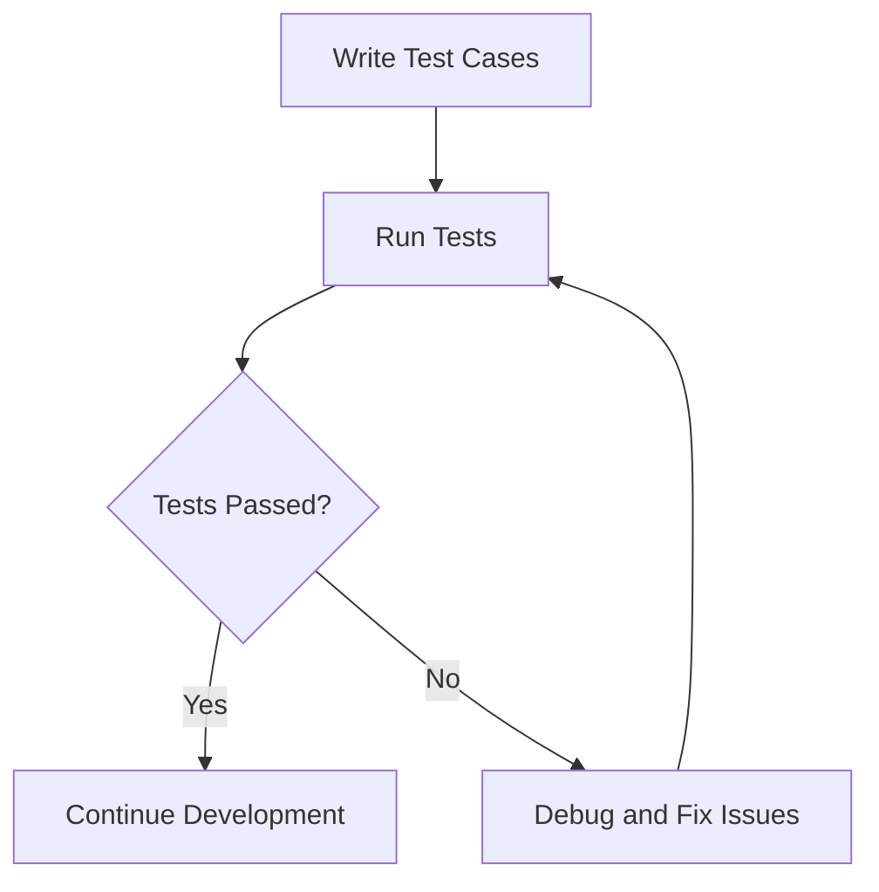

## 12.3.2 Writing Test Cases

In the world of software development, testing is a cornerstone of delivering robust, reliable applications. Flutter, with its rich ecosystem, provides a powerful testing framework through the `flutter_test` package. This section will guide you through the process of writing effective test cases, ensuring your Flutter applications are both functional and resilient.

### Understanding Test Structure

Before diving into writing test cases, it's crucial to understand the structure of a test in Flutter. The `flutter_test` package offers a comprehensive set of tools to facilitate testing, including the `test` and `group` functions, which help organize and execute tests efficiently.

#### Using `test` for Individual Test Cases

The `test` function is the fundamental building block for writing test cases in Flutter. Each `test` represents a single unit of testing logic, designed to verify a specific functionality or behavior of your code. Here's a basic structure:

```dart
import 'package:flutter_test/flutter_test.dart';

void main() {
  test('description of the test', () {
    // Arrange: Set up any necessary data or state.
    
    // Act: Execute the function or method being tested.
    
    // Assert: Verify the result using expect statements.
  });
}
```

#### Grouping Related Tests with `group`

To maintain organization and readability, especially in larger projects, you can group related tests using the `group` function. This allows you to categorize tests logically, making it easier to manage and understand the test suite.

```dart
import 'package:flutter_test/flutter_test.dart';

void main() {
  group('Group Name', () {
    test('test 1', () {
      // Test logic
    });

    test('test 2', () {
      // Test logic
    });
  });
}
```

#### Utilizing `setUp` and `tearDown`

The `setUp` and `tearDown` functions are used to initialize and clean up the test environment before and after each test, respectively. This ensures that each test runs in isolation, without interference from other tests.

```dart
import 'package:flutter_test/flutter_test.dart';

void main() {
  group('Counter Tests', () {
    Counter counter;

    setUp(() {
      counter = Counter();
    });

    tearDown(() {
      // Clean up resources if necessary
    });

    test('initial count is 0', () {
      expect(counter.count, 0);
    });
  });
}
```

### Writing Clear Test Names

A well-named test is self-explanatory, conveying its purpose without needing to delve into the implementation details. Here are some guidelines for writing clear test names:

- **Descriptive Titles:** Use names that describe the behavior being tested and the expected outcome. For example, `increment increases count by 1`.
- **Consistency:** Follow a consistent naming convention throughout your test suite. This could be `methodName_shouldExpectedBehavior_whenCondition`.

### Using Assertions

Assertions are the core of any test case, used to validate the expected outcome against the actual result. In Flutter, the `expect` function is used for assertions, often paired with matchers to specify the expected result.

#### Employing `expect` Statements

The `expect` function takes two arguments: the actual value and the expected value or matcher. Here's a simple example:

```dart
expect(actualValue, expectedValue);
```

#### Different Types of Matchers

Flutter provides a variety of matchers to enhance the expressiveness of your tests:

- **equals:** Checks if two values are equal.
- **isNull:** Verifies that a value is null.
- **isNotNull:** Ensures a value is not null.
- **findsOneWidget:** Used in widget tests to verify that a specific widget is present in the widget tree.

### Testing Asynchronous Code

Asynchronous operations are common in Flutter applications, especially when dealing with network requests or animations. Testing such code requires handling async functions properly.

#### Handling Async Functions

Use the `async` and `await` keywords to manage asynchronous operations within your tests. This ensures that the test waits for the operation to complete before proceeding.

```dart
test('asynchronous test', () async {
  // Arrange

  // Act
  await someAsyncFunction();

  // Assert
  expect(actualValue, expectedValue);
});
```

#### Using `pump` and `pumpAndSettle`

In widget tests, `pump` and `pumpAndSettle` are used to simulate the passage of time and allow the widget tree to rebuild. This is crucial for testing animations or state changes.

```dart
await tester.pump(); // Rebuilds the widget tree once.
await tester.pumpAndSettle(); // Rebuilds the widget tree until all animations have completed.
```

### Example Test Cases

Let's explore some practical examples of writing test cases in Flutter, covering unit, widget, and integration tests.

#### Unit Test for a Dart Function

Unit tests focus on testing individual functions or methods in isolation. Here's an example of a unit test for a simple counter class:

```dart
// File: lib/counter.dart
class Counter {
  int _count = 0;
  int get count => _count;
  void increment() {
    _count++;
  }
  void decrement() {
    _count--;
  }
}

// File: test/counter_test.dart
import 'package:flutter_test/flutter_test.dart';
import 'package:your_app/counter.dart';

void main() {
  group('Counter', () {
    Counter counter;

    setUp(() {
      counter = Counter();
    });

    test('initial count is 0', () {
      expect(counter.count, 0);
    });

    test('increment increases count by 1', () {
      counter.increment();
      expect(counter.count, 1);
    });

    test('decrement decreases count by 1', () {
      counter.decrement();
      expect(counter.count, -1);
    });
  });
}
```

#### Widget Test for a Custom Flutter Widget

Widget tests verify the behavior and appearance of Flutter widgets. Here's an example of a widget test:

```dart
import 'package:flutter_test/flutter_test.dart';
import 'package:flutter/material.dart';
import 'package:your_app/my_widget.dart';

void main() {
  testWidgets('MyWidget has a title and message', (WidgetTester tester) async {
    // Build the widget.
    await tester.pumpWidget(MyWidget(title: 'T', message: 'M'));

    // Create the Finders.
    final titleFinder = find.text('T');
    final messageFinder = find.text('M');

    // Use the `findsOneWidget` matcher to verify that the Text widgets appear exactly once in the widget tree.
    expect(titleFinder, findsOneWidget);
    expect(messageFinder, findsOneWidget);
  });
}
```

#### Integration Test for a User Flow in the App

Integration tests cover complete user flows, ensuring that different parts of the application work together as expected. Here's a basic example:

```dart
import 'package:flutter_test/flutter_test.dart';
import 'package:integration_test/integration_test.dart';
import 'package:your_app/main.dart' as app;

void main() {
  IntegrationTestWidgetsFlutterBinding.ensureInitialized();

  testWidgets('complete user flow test', (WidgetTester tester) async {
    app.main();
    await tester.pumpAndSettle();

    // Perform actions and verify results.
    await tester.tap(find.byIcon(Icons.add));
    await tester.pumpAndSettle();

    expect(find.text('1'), findsOneWidget);
  });
}
```

### Best Practices

Writing effective test cases involves adhering to best practices that ensure your tests are reliable, maintainable, and efficient.

- **Keep Tests Independent:** Each test should run independently, without relying on the outcome of other tests.
- **Avoid External Dependencies:** Tests should not depend on external systems or states, such as network services or databases.
- **Maintain Clarity:** Write tests that are easy to understand, with clear logic and descriptive names.
- **Regularly Run Tests:** Integrate tests into your development workflow, running them frequently to catch issues early.

### Mermaid.js Diagram

To visualize the testing process, consider the following diagram:



This diagram illustrates the iterative nature of testing, where writing and running tests lead to either continued development or debugging and fixing issues.

### Conclusion

Writing test cases is an essential skill for any Flutter developer, ensuring that your applications are reliable and maintainable. By understanding the structure of test cases, using assertions effectively, and adhering to best practices, you can build a robust test suite that enhances the quality of your applications.

For further exploration, consider delving into the official [Flutter testing documentation](https://flutter.dev/docs/testing) and exploring additional resources such as books and online courses on software testing.

## Quiz Time!



### What is the primary function used to write individual test cases in Flutter?

- [x] `test`
- [ ] `group`
- [ ] `expect`
- [ ] `setUp`

> **Explanation:** The `test` function is used to define individual test cases in Flutter.

### Which function is used to group related tests together?

- [ ] `test`
- [x] `group`
- [ ] `expect`
- [ ] `tearDown`

> **Explanation:** The `group` function is used to organize related tests into logical groups.

### What is the purpose of the `setUp` function in a test suite?

- [x] To initialize the test environment before each test
- [ ] To clean up resources after each test
- [ ] To execute the test case
- [ ] To assert test results

> **Explanation:** The `setUp` function is used to prepare the test environment before each test runs.

### Which matcher would you use to verify that a widget is present in the widget tree?

- [ ] `equals`
- [x] `findsOneWidget`
- [ ] `isNull`
- [ ] `isNotNull`

> **Explanation:** The `findsOneWidget` matcher is used to verify the presence of a widget in the widget tree.

### How do you handle asynchronous operations in a Flutter test?

- [x] Using `async` and `await`
- [ ] Using `setUp` and `tearDown`
- [ ] Using `group` and `test`
- [ ] Using `expect` and `equals`

> **Explanation:** Asynchronous operations in Flutter tests are handled using `async` and `await`.

### What is the role of `pumpAndSettle` in widget tests?

- [x] To rebuild the widget tree until all animations have completed
- [ ] To initialize the test environment
- [ ] To clean up resources after each test
- [ ] To execute the test case

> **Explanation:** `pumpAndSettle` is used to rebuild the widget tree until all animations have completed.

### Which of the following is a best practice for writing test cases?

- [x] Keeping tests independent and isolated
- [ ] Relying on external systems
- [ ] Writing complex and hard-to-understand tests
- [ ] Running tests infrequently

> **Explanation:** Keeping tests independent and isolated is a best practice to ensure reliability.

### What is the purpose of the `tearDown` function in a test suite?

- [ ] To initialize the test environment before each test
- [x] To clean up resources after each test
- [ ] To execute the test case
- [ ] To assert test results

> **Explanation:** The `tearDown` function is used to clean up resources after each test runs.

### Which of the following is NOT a type of matcher in Flutter tests?

- [ ] `equals`
- [ ] `findsOneWidget`
- [x] `setUp`
- [ ] `isNull`

> **Explanation:** `setUp` is not a matcher; it is used to prepare the test environment.

### True or False: Integration tests cover complete user flows in an application.

- [x] True
- [ ] False

> **Explanation:** Integration tests are designed to cover complete user flows, ensuring different parts of the application work together as expected.


