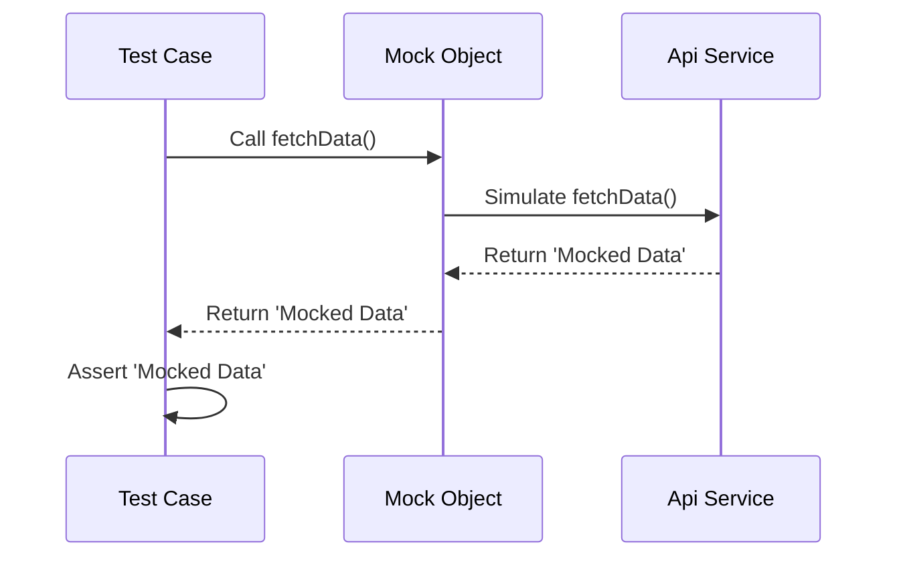

## 12.3.3 Mocking and Stubbing

In the realm of software testing, particularly in Flutter development, the concepts of mocking and stubbing play a pivotal role in ensuring that tests are both effective and efficient. These techniques allow developers to isolate units of code, simulate dependencies, and focus on testing the functionality of specific components without interference from external factors. This section will delve into the importance of mocking and stubbing, how to implement these techniques using the `mockito` package, and best practices to ensure your tests remain robust and reliable.

### Definition and Importance

**What are Mocks and Stubs?**

- **Mocks** are objects that mimic the behavior of real objects. They are used to simulate the interactions with dependencies that a unit of code might have. Mocks can be programmed to return specific values or throw exceptions, allowing you to test how your code handles various scenarios.
  
- **Stubs** are a simpler form of mocks. They provide predefined responses to method calls, but unlike mocks, they do not track how they are used. Stubs are typically used to provide fixed data for testing purposes.

**Why Mocking is Essential for Unit and Widget Testing**

Mocking is crucial in unit and widget testing for several reasons:

- **Isolation**: By replacing real dependencies with mocks, you can isolate the unit of code under test. This ensures that tests are not affected by the behavior of external components, leading to more reliable results.

- **Control**: Mocks allow you to control the behavior of dependencies, enabling you to test how your code reacts to different conditions, such as network failures or unexpected data formats.

- **Efficiency**: Testing with mocks is often faster than using real dependencies, especially when those dependencies involve network calls or database operations.

### Using the `mockito` Package

The `mockito` package is a popular choice for creating mock objects in Dart and Flutter. It provides a simple API for defining mock classes and specifying their behavior.

**Adding `mockito` to the Project**

To start using `mockito`, you need to add it to your project's `pubspec.yaml` file under `dev_dependencies`:

```yaml
dev_dependencies:
  mockito: ^5.2.0
  build_runner: ^2.0.0
```

The `build_runner` package is also required to generate mock classes.

**Generating Mock Classes Using `build_runner`**

Once `mockito` is added, you can generate mock classes using the `build_runner` tool. This involves creating a test file where you define the classes you want to mock.

### Creating Mock Objects

**Extending `Mock` to Create Mock Versions of Classes**

To create a mock object, you extend the `Mock` class provided by `mockito` and implement the interface or abstract class you want to mock. Here's an example:

```dart
// File: lib/api_service.dart
abstract class ApiService {
  Future<String> fetchData();
}

// File: test/api_service_test.dart
import 'package:flutter_test/flutter_test.dart';
import 'package:mockito/mockito.dart';
import 'package:your_app/api_service.dart';

// Generate a MockApiService using Mockito
class MockApiService extends Mock implements ApiService {}

void main() {
  group('ApiService', () {
    MockApiService mockApiService;

    setUp(() {
      mockApiService = MockApiService();
    });

    test('fetchData returns expected data', () async {
      // Arrange
      when(mockApiService.fetchData()).thenAnswer((_) async => 'Mocked Data');

      // Act
      String data = await mockApiService.fetchData();

      // Assert
      expect(data, 'Mocked Data');
      verify(mockApiService.fetchData()).called(1);
    });
  });
}
```

**Overriding Methods to Provide Controlled Responses**

In the example above, the `when` function is used to specify the behavior of the `fetchData` method. It is set to return `'Mocked Data'` when called, allowing you to test how your code handles this specific response.

### Injecting Mocks into Tests

**Utilizing Dependency Injection to Insert Mock Objects**

Dependency injection is a technique used to provide dependencies to a class from outside rather than creating them internally. This makes it easier to replace real dependencies with mocks during testing.

**Replacing Real Dependencies with Mocks During Testing**

In the test setup, you replace the real `ApiService` with `MockApiService`. This ensures that all interactions with `ApiService` in the test are handled by the mock object, allowing you to control and verify these interactions.

### Example Scenarios

**Mocking a Network Service to Test Data Fetching**

Consider a scenario where your application fetches data from a network service. By mocking the network service, you can simulate various responses, such as successful data retrieval, network errors, or unexpected data formats, and test how your application handles each case.

**Mocking a Repository to Isolate Data Layer During Widget Tests**

In widget tests, you might want to focus on the UI logic without involving the data layer. By mocking the repository, you can provide predefined data to the widgets and test their behavior in isolation.

### Best Practices

**Keeping Mock Implementations Simple and Focused**

- Avoid adding unnecessary complexity to your mock implementations. Keep them simple and focused on the specific behavior you want to test.

**Avoiding Over-Mocking, Which Can Lead to Brittle Tests**

- Over-mocking can make tests brittle and difficult to maintain. Ensure that you only mock what is necessary for the test and rely on real implementations where possible.

**Ensuring That Mocks Accurately Represent Real Dependencies**

- Mocks should accurately represent the behavior of real dependencies. If the real implementation changes, update the mocks accordingly to ensure tests remain valid.

### Code Example

Here is a complete example of using `mockito` to test a simple API service:

```dart
// File: lib/api_service.dart
abstract class ApiService {
  Future<String> fetchData();
}

// File: test/api_service_test.dart
import 'package:flutter_test/flutter_test.dart';
import 'package:mockito/mockito.dart';
import 'package:your_app/api_service.dart';

// Generate a MockApiService using Mockito
class MockApiService extends Mock implements ApiService {}

void main() {
  group('ApiService', () {
    MockApiService mockApiService;

    setUp(() {
      mockApiService = MockApiService();
    });

    test('fetchData returns expected data', () async {
      // Arrange
      when(mockApiService.fetchData()).thenAnswer((_) async => 'Mocked Data');

      // Act
      String data = await mockApiService.fetchData();

      // Assert
      expect(data, 'Mocked Data');
      verify(mockApiService.fetchData()).called(1);
    });
  });
}
```

### Mermaid.js Diagram

To visually represent the process of mocking and testing, consider the following sequence diagram:



### Conclusion

Mocking and stubbing are powerful techniques in the toolkit of a Flutter developer, enabling the creation of isolated, reliable, and efficient tests. By using the `mockito` package, you can easily create mock objects that simulate real dependencies, allowing you to focus on testing the functionality of your code without external interference. Remember to follow best practices to keep your tests maintainable and reflective of real-world scenarios.

For further exploration, consider diving into the official [Mockito documentation](https://pub.dev/packages/mockito) and exploring additional resources on software testing and Flutter development.

## Quiz Time!



### What is the primary purpose of mocking in testing?

- [x] To simulate dependencies and isolate units of code
- [ ] To increase the complexity of tests
- [ ] To replace all real objects with fake ones
- [ ] To ensure tests run slower

> **Explanation:** Mocking is used to simulate dependencies and isolate units of code, allowing for focused and reliable testing.

### Which package is commonly used for mocking in Flutter?

- [x] Mockito
- [ ] Provider
- [ ] Bloc
- [ ] Dio

> **Explanation:** The `mockito` package is widely used for creating mock objects in Flutter testing.

### What is the role of the `build_runner` package in mocking?

- [x] To generate mock classes
- [ ] To run the application
- [ ] To compile Dart code
- [ ] To manage state

> **Explanation:** The `build_runner` package is used to generate mock classes when using the `mockito` package.

### How do you specify the behavior of a mock method in Mockito?

- [x] Using the `when` function
- [ ] Using the `then` function
- [ ] Using the `mock` function
- [ ] Using the `simulate` function

> **Explanation:** The `when` function is used to specify the behavior of a mock method in Mockito.

### What is a common pitfall to avoid when using mocks?

- [x] Over-mocking
- [ ] Under-mocking
- [ ] Using real objects
- [ ] Using too many tests

> **Explanation:** Over-mocking can lead to brittle tests that are difficult to maintain.

### In the provided code example, what does the `verify` function do?

- [x] It checks that a method was called a specific number of times
- [ ] It initializes the mock object
- [ ] It generates the mock class
- [ ] It runs the test

> **Explanation:** The `verify` function checks that a method was called a specific number of times, ensuring expected interactions.

### Why is it important to keep mock implementations simple?

- [x] To maintain test reliability and focus
- [ ] To make tests more complex
- [ ] To simulate all possible scenarios
- [ ] To replace all real dependencies

> **Explanation:** Keeping mock implementations simple helps maintain test reliability and focus on specific behaviors.

### What is the difference between mocks and stubs?

- [x] Mocks can verify interactions, while stubs provide predefined responses
- [ ] Mocks are real objects, while stubs are fake
- [ ] Mocks are used for UI testing, while stubs are for unit testing
- [ ] Mocks are faster than stubs

> **Explanation:** Mocks can verify interactions and track usage, while stubs provide predefined responses without tracking.

### What is the benefit of using dependency injection with mocks?

- [x] It allows easy replacement of real dependencies with mocks
- [ ] It makes the code more complex
- [ ] It reduces the number of tests needed
- [ ] It ensures all tests pass

> **Explanation:** Dependency injection allows easy replacement of real dependencies with mocks, facilitating isolated testing.

### True or False: Mocks should always be used instead of real objects in tests.

- [ ] True
- [x] False

> **Explanation:** Mocks should be used judiciously to simulate dependencies, but real objects can be used where appropriate to ensure comprehensive testing.


