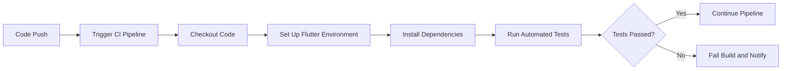

## 12.3.4 Continuous Integration (Introduction)

In the fast-paced world of software development, ensuring that your application is reliable and bug-free is crucial. Continuous Integration (CI) is a practice that helps developers achieve this by automating the testing and building process whenever code changes are made. This section will introduce you to the concept of CI, its benefits, and how you can set up a CI pipeline for your Flutter projects using popular tools like GitHub Actions, Bitrise, Jenkins, and CircleCI.

### What is Continuous Integration?

Continuous Integration is a development practice where developers integrate code into a shared repository frequently, ideally several times a day. Each integration is verified by an automated build and test process, allowing teams to detect problems early.

#### Definition and Purpose of CI

- **Definition:** Continuous Integration is the practice of merging all developers' working copies to a shared mainline several times a day.
- **Purpose:** The main goal of CI is to prevent integration problems, referred to as "integration hell," by frequently integrating and testing code changes.

#### Benefits of Implementing CI

- **Early Bug Detection:** CI helps in identifying bugs early in the development cycle, reducing the cost and effort required to fix them.
- **Streamlined Workflows:** Automating the build and test process saves time and allows developers to focus on writing code.
- **Improved Code Quality:** Regular testing ensures that code quality is maintained and that new changes do not break existing functionality.
- **Faster Release Cycles:** By automating repetitive tasks, CI enables faster and more reliable releases.

### Popular CI Tools for Flutter

Several CI tools can be used to automate the testing and building of Flutter applications. Here, we will discuss some of the most popular ones:

#### GitHub Actions

- **Overview:** GitHub Actions is a CI/CD tool that is natively integrated with GitHub repositories. It allows you to automate workflows directly from your GitHub repository.
- **Features:** Easy setup, extensive community support, and seamless integration with GitHub.

#### Bitrise

- **Overview:** Bitrise is a mobile-focused CI/CD platform that provides a wide range of integrations and automation options specifically for mobile app development.
- **Features:** Pre-configured workflows for mobile apps, easy setup, and a user-friendly interface.

#### Jenkins

- **Overview:** Jenkins is a highly customizable, open-source automation server that can be used to automate all sorts of tasks related to building, testing, and deploying software.
- **Features:** Extensive plugin ecosystem, flexibility, and strong community support.

#### CircleCI

- **Overview:** CircleCI is a fast and scalable CI service that supports a wide range of languages and frameworks, including Flutter.
- **Features:** Parallelism, advanced caching, and easy integration with version control systems.

### Setting Up a Basic CI Pipeline

Setting up a CI pipeline involves integrating your Flutter project with a CI tool, configuring workflows to run tests on code changes, and understanding build logs and test reports.

#### Integrating a Flutter Project with a CI Tool

To integrate a Flutter project with a CI tool, you typically need to:

- **Create a Configuration File:** This file defines the steps that the CI tool should perform whenever code changes are pushed to the repository.
- **Specify Triggers:** Determine when the CI pipeline should run, such as on every push or pull request.
- **Define Jobs:** Outline the tasks that need to be executed, such as checking out the code, setting up the environment, installing dependencies, and running tests.

#### Configuring Workflows to Run Tests on Code Changes

Workflows are a series of jobs that are executed in a specific order. In a typical CI pipeline for a Flutter project, you might configure workflows to:

- **Run Unit Tests:** Execute tests to ensure that individual units of code function correctly.
- **Perform Code Analysis:** Use tools like `flutter analyze` to check for code quality issues.
- **Build the Application:** Compile the application to ensure that it builds successfully.

#### Understanding Build Logs and Test Reports

Build logs and test reports provide valuable insights into the CI process:

- **Build Logs:** These logs contain detailed information about each step of the CI pipeline, helping you identify where errors occur.
- **Test Reports:** These reports summarize the results of the tests, indicating which tests passed or failed.

### Automating Test Runs

Automating test runs ensures that all tests pass before code is merged into the main branch, maintaining code quality and stability.

#### Ensuring All Tests Pass Before Merging Code

- **Branch Protection Rules:** Set up rules that prevent code from being merged unless all tests pass. This ensures that only tested and verified code is integrated into the main branch.

#### Setting Up Branch Protection Rules Based on Test Results

- **Configure Branch Protection:** Use your version control system to enforce branch protection rules, requiring that all CI checks pass before a pull request can be merged.

### Advanced CI Configurations

For larger projects, you may need to implement more advanced CI configurations to optimize the CI process.

#### Parallelizing Test Runs for Faster Feedback

- **Parallel Execution:** Run tests in parallel to reduce the time it takes to get feedback. This is especially useful for large test suites.

#### Deploying Builds Automatically After Successful Tests

- **Continuous Deployment (CD):** Extend your CI pipeline to include deployment steps, automatically deploying builds to staging or production environments after successful tests.

#### Integrating Code Coverage and Linting Checks

- **Code Coverage:** Measure the percentage of code that is covered by tests, ensuring that critical parts of your application are tested.
- **Linting Checks:** Use linting tools to enforce coding standards and catch potential issues early.

### Practical Example: Setting Up GitHub Actions

Let's walk through setting up a basic CI pipeline using GitHub Actions to run Flutter tests on push and pull requests.

#### GitHub Actions Configuration

Create a `.github/workflows/flutter-ci.yml` file in your repository with the following content:

```yaml
name: Flutter CI
on:
  push:
    branches: [ main ]
  pull_request:
    branches: [ main ]
jobs:
  build:
    runs-on: ubuntu-latest
    steps:
    - uses: actions/checkout@v3
    - name: Set up Flutter
      uses: subosito/flutter-action@v2
      with:
        flutter-version: '3.10.0' # Specify the Flutter version
    - name: Install Dependencies
      run: flutter pub get
    - name: Run Tests
      run: flutter test
    - name: Analyze Code
      run: flutter analyze
```

#### Explanation of the Workflow

- **Triggering Events:** The workflow is triggered on pushes and pull requests to the `main` branch.
- **Jobs and Steps:** The `build` job runs on an `ubuntu-latest` runner and includes steps to check out the code, set up Flutter, install dependencies, run tests, and analyze the code.

### Visualizing the CI Pipeline

Below is a Mermaid.js diagram that illustrates the CI pipeline process:



### Conclusion

Continuous Integration is a powerful practice that can significantly enhance the quality and reliability of your Flutter applications. By automating the testing and building process, you can catch bugs early, streamline your workflow, and ensure that your codebase remains stable. Whether you choose GitHub Actions, Bitrise, Jenkins, or CircleCI, setting up a CI pipeline is a valuable investment in your development process.

### Further Reading and Resources

- [GitHub Actions Documentation](https://docs.github.com/en/actions)
- [Bitrise Documentation](https://devcenter.bitrise.io/)
- [Jenkins Documentation](https://www.jenkins.io/doc/)
- [CircleCI Documentation](https://circleci.com/docs/)
- [Flutter CI/CD with GitHub Actions](https://flutter.dev/docs/deployment/cd)

## Quiz Time!



### What is the primary goal of Continuous Integration (CI)?

- [x] To prevent integration problems by frequently integrating and testing code changes.
- [ ] To automate the deployment of applications to production.
- [ ] To replace manual testing with automated testing.
- [ ] To ensure that all code is written in a consistent style.

> **Explanation:** The primary goal of CI is to prevent integration problems by frequently integrating and testing code changes, ensuring that issues are detected early.

### Which CI tool is natively integrated with GitHub repositories?

- [x] GitHub Actions
- [ ] Bitrise
- [ ] Jenkins
- [ ] CircleCI

> **Explanation:** GitHub Actions is natively integrated with GitHub repositories, allowing for seamless automation of workflows directly from the repository.

### What is a key benefit of implementing CI in a development workflow?

- [x] Early bug detection
- [ ] Increased manual testing
- [ ] Slower release cycles
- [ ] Reduced code quality

> **Explanation:** A key benefit of CI is early bug detection, which helps reduce the cost and effort required to fix issues.

### What does a CI pipeline typically include?

- [x] Automated build and test processes
- [ ] Manual code reviews
- [ ] Deployment to production
- [ ] User acceptance testing

> **Explanation:** A CI pipeline typically includes automated build and test processes to ensure code quality and stability.

### Which CI tool is known for being highly customizable and open-source?

- [ ] GitHub Actions
- [ ] Bitrise
- [x] Jenkins
- [ ] CircleCI

> **Explanation:** Jenkins is known for being highly customizable and open-source, with an extensive plugin ecosystem.

### What is the purpose of branch protection rules in CI?

- [x] To prevent code from being merged unless all tests pass
- [ ] To enforce code style guidelines
- [ ] To automate deployment to production
- [ ] To manage user permissions

> **Explanation:** Branch protection rules prevent code from being merged unless all tests pass, ensuring that only tested and verified code is integrated.

### How can you reduce the time it takes to get feedback from a CI pipeline?

- [x] By parallelizing test runs
- [ ] By increasing the number of manual tests
- [ ] By reducing the number of automated tests
- [ ] By deploying to production more frequently

> **Explanation:** Parallelizing test runs can reduce the time it takes to get feedback from a CI pipeline, especially for large test suites.

### What is the role of code coverage in a CI pipeline?

- [x] To measure the percentage of code covered by tests
- [ ] To enforce coding standards
- [ ] To automate deployment
- [ ] To manage version control

> **Explanation:** Code coverage measures the percentage of code covered by tests, ensuring that critical parts of the application are tested.

### What file format is commonly used to define CI workflows in GitHub Actions?

- [x] YAML
- [ ] JSON
- [ ] XML
- [ ] INI

> **Explanation:** YAML is commonly used to define CI workflows in GitHub Actions due to its readability and simplicity.

### True or False: Continuous Integration can help improve code quality by automating testing and building processes.

- [x] True
- [ ] False

> **Explanation:** True. Continuous Integration helps improve code quality by automating testing and building processes, ensuring that code changes are verified frequently.


