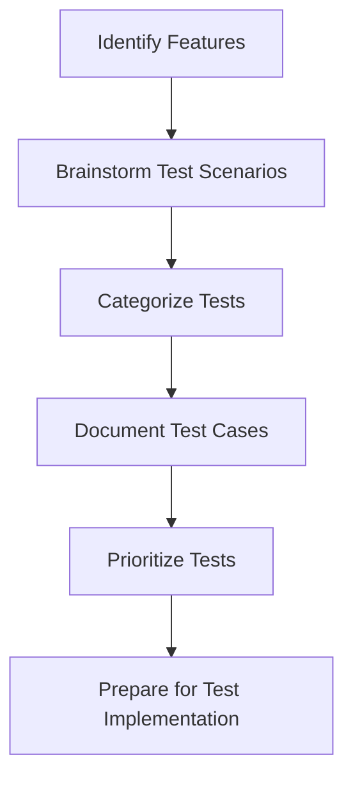

## 12.4.1 Identifying Test Scenarios

In the realm of software development, testing is a crucial phase that ensures the reliability, functionality, and usability of an application. For our Expense Tracker App, identifying comprehensive test scenarios is essential to guarantee that the app performs as expected under various conditions. This section will guide you through the process of identifying and documenting test scenarios, focusing on different aspects such as user interactions, data handling, and edge cases.

### Understanding App Features

Before diving into test scenarios, it's important to have a clear understanding of the app's features. The Expense Tracker App includes functionalities such as:

- **Adding Expenses:** Users can input details like amount, category, date, and description.
- **Viewing Expenses:** A list view displays all recorded expenses, sortable by different criteria.
- **Updating Expenses:** Users can modify existing expense entries.
- **Deleting Expenses:** Users can remove expenses from the list.
- **Data Persistence:** Expenses are stored in a local database for retrieval and manipulation.

Understanding these features helps in identifying the areas that require testing and ensures that no functionality is overlooked.

### Categorizing Test Scenarios

Once you have a grasp of the app's features, the next step is to categorize test scenarios. This categorization helps in organizing tests and ensuring comprehensive coverage.

#### Functional Tests

Functional tests verify that each feature of the app works as intended. For the Expense Tracker App, functional tests might include:

- Adding a new expense and verifying its appearance in the list.
- Editing an expense and checking that changes are saved correctly.
- Deleting an expense and ensuring it is removed from the database.

#### Edge Cases

Edge cases involve testing the app with unusual or unexpected inputs. These tests ensure that the app can handle extreme conditions gracefully. Examples include:

- Adding an expense with a very large amount.
- Entering special characters in the description field.
- Attempting to delete an expense that does not exist.

#### Error Handling

Error handling tests ensure that the app manages errors and invalid data appropriately. These tests might involve:

- Submitting the expense form with missing required fields.
- Entering invalid data types (e.g., text in a numeric field).
- Handling database connection failures.

#### Performance Tests

Performance tests assess the app's responsiveness and efficiency, especially under load. For instance:

- Loading a large number of expenses and measuring response time.
- Testing the app's performance on different devices.

#### Security Tests

Security tests validate data protection and access controls, ensuring that sensitive information is secure. These might include:

- Verifying that expense data is encrypted.
- Ensuring that only authenticated users can access the app.

### Brainstorming Test Cases

Brainstorming test cases involves thinking from the user's perspective and considering both typical usage patterns and potential misuse. Encourage creativity and thoroughness in this process to uncover as many scenarios as possible.

- **Typical Usage:** Consider how a typical user would interact with the app. What are the common tasks they would perform?
- **Potential Misuse:** Think about how users might misuse the app, either intentionally or unintentionally. How should the app respond?

### Documenting Test Scenarios

Documenting test scenarios is crucial for tracking and managing tests. Use spreadsheets or test management tools to list and track test cases. Include details such as:

- **Test Description:** A brief summary of what the test will verify.
- **Expected Outcome:** The result you expect if the app functions correctly.
- **Status:** Whether the test is planned, in progress, or completed.

Here's an example of how you might document test scenarios for the Expense Tracker App:

| Test ID | Description                          | Expected Outcome                          | Status    |
|---------|--------------------------------------|-------------------------------------------|-----------|
| T001    | Add a new expense                    | Expense appears in the list               | Planned   |
| T002    | Edit an existing expense             | Changes are saved and displayed correctly | Planned   |
| T003    | Delete an expense                    | Expense is removed from the list          | Planned   |
| T004    | Submit form with missing fields      | Error message is displayed                | Planned   |
| T005    | Load 1000 expenses                   | App remains responsive                    | Planned   |
| T006    | Access app without authentication    | Access is denied                          | Planned   |

### Prioritizing Tests

Not all tests are created equal. Prioritizing tests helps focus efforts on the most critical scenarios first. Consider factors such as:

- **Impact:** How critical is the feature to the app's functionality?
- **Likelihood:** How likely is the scenario to occur?
- **Complexity:** How complex is the test to implement?

Focus initially on high-impact and high-likelihood scenarios, addressing less critical tests as development progresses.

### Practical Example

Let's present a list of identified test scenarios for key features of the Expense Tracker App:

```dart
/*
  Sample Test Scenarios for Expense Tracker App
  1. Adding a New Expense:
     - Verify the expense form accepts valid inputs.
     - Validate that the expense is saved correctly in the database.
     - Ensure the new expense appears in the expense list.
  2. Viewing Expenses:
     - Confirm that the expense list displays all saved expenses.
     - Check that expenses are sorted correctly (e.g., by date).
  3. Updating an Expense:
     - Ensure that updating an expense changes the correct record in the database.
     - Validate that the updated expense reflects in the expense list.
  4. Deleting an Expense:
     - Confirm that deleting an expense removes it from the database.
     - Ensure the expense is no longer visible in the expense list.
  5. Handling Invalid Inputs:
     - Test submitting the expense form with empty fields.
     - Verify that the app displays appropriate error messages.
  6. Performance:
     - Assess the app's responsiveness when handling a large number of expenses.
  7. Security:
     - Ensure that expense data is stored securely.
     - Validate user authentication and authorization for data access.
*/
```

### Visualizing the Process

To better understand the process of identifying test scenarios, consider the following diagram:



This diagram illustrates the flow from identifying features to preparing for test implementation, emphasizing the structured approach to testing.

### Conclusion

Identifying test scenarios is a foundational step in ensuring the quality and reliability of your app. By understanding the app's features, categorizing test scenarios, brainstorming test cases, documenting them, and prioritizing tests, you can create a comprehensive testing strategy that covers all aspects of the Expense Tracker App. This structured approach not only helps in catching bugs early but also ensures a smooth and satisfying user experience.

### Additional Resources

For further exploration of testing in Flutter, consider the following resources:

- [Flutter Testing Documentation](https://flutter.dev/docs/testing)
- [Effective Dart: Testing](https://dart.dev/guides/language/effective-dart/testing)
- [Test-Driven Development with Flutter](https://www.udemy.com/course/test-driven-development-with-flutter/)
- [Flutter Community on GitHub](https://github.com/flutter/flutter)

These resources provide deeper insights into testing methodologies and best practices, helping you refine your testing skills and apply them effectively in your projects.

## Quiz Time!



### What is the first step in identifying test scenarios for an app?

- [x] Understanding the app's features
- [ ] Writing test cases
- [ ] Running the app
- [ ] Debugging the code

> **Explanation:** Understanding the app's features is crucial to identify what needs to be tested and ensure comprehensive coverage.

### Which category of tests ensures that each feature works as intended?

- [x] Functional Tests
- [ ] Edge Cases
- [ ] Performance Tests
- [ ] Security Tests

> **Explanation:** Functional tests verify that each feature of the app works as intended.

### What is the purpose of edge case testing?

- [x] To handle unusual or unexpected inputs and states
- [ ] To verify that each feature works as intended
- [ ] To assess the app's responsiveness
- [ ] To validate data protection

> **Explanation:** Edge case testing ensures that the app can handle unusual or unexpected inputs and states gracefully.

### What should be included in the documentation of test scenarios?

- [x] Test description, expected outcome, and status
- [ ] Only the test description
- [ ] Only the expected outcome
- [ ] Only the status

> **Explanation:** Documenting test scenarios should include a test description, expected outcome, and status for comprehensive tracking.

### Why is it important to prioritize test scenarios?

- [x] To focus on critical and high-impact scenarios first
- [ ] To save time by skipping some tests
- [ ] To ensure all tests are of equal importance
- [ ] To avoid testing altogether

> **Explanation:** Prioritizing test scenarios helps focus efforts on the most critical and high-impact scenarios first.

### Which test category assesses the app's responsiveness and efficiency?

- [x] Performance Tests
- [ ] Functional Tests
- [ ] Edge Cases
- [ ] Security Tests

> **Explanation:** Performance tests assess the app's responsiveness and efficiency, especially under load.

### What is a key consideration when brainstorming test cases?

- [x] Thinking from the user's perspective
- [ ] Focusing only on typical usage
- [ ] Ignoring potential misuse
- [ ] Writing code instead of tests

> **Explanation:** Brainstorming test cases involves thinking from the user's perspective, considering both typical usage and potential misuse.

### What is the role of security tests in app testing?

- [x] To validate data protection and access controls
- [ ] To ensure the app is fast
- [ ] To verify that features work as intended
- [ ] To handle unusual inputs

> **Explanation:** Security tests validate data protection and access controls, ensuring sensitive information is secure.

### How can test scenarios be documented effectively?

- [x] Using spreadsheets or test management tools
- [ ] Writing them on paper
- [ ] Memorizing them
- [ ] Ignoring documentation

> **Explanation:** Test scenarios can be documented effectively using spreadsheets or test management tools to list and track test cases.

### True or False: All test scenarios should be treated with equal priority.

- [ ] True
- [x] False

> **Explanation:** Not all test scenarios are of equal importance; prioritizing helps focus on critical and high-impact scenarios first.


