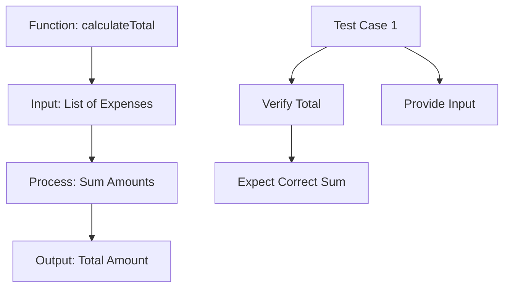

## 12.4.2 Writing Unit Tests

Unit testing is a critical aspect of software development, ensuring that individual components of your application work as expected. In this section, we will delve into writing unit tests for the Expense Tracker App, focusing on testing data processing functions and business logic. This guide will help you validate that your functions behave correctly under various conditions, including typical use cases and edge cases. We'll emphasize the importance of isolating units of code to ensure that tests are reliable and maintainable.

### Targeting Business Logic

When writing unit tests, it's essential to focus on the core functions and methods responsible for data manipulation. In the context of the Expense Tracker App, this includes functions like adding, updating, and deleting expenses. By targeting these areas, you can ensure that the business logic of your application is robust and error-free.

#### Identifying Core Functions

- **Adding Expenses:** Ensure that the function correctly adds new expenses to the list.
- **Updating Expenses:** Verify that existing expenses can be updated with new values.
- **Deleting Expenses:** Confirm that expenses can be removed from the list without affecting other entries.

### Structuring Unit Tests

Organizing your tests is crucial for maintainability and readability. Use the `group` function to categorize similar tests and provide descriptive test names to indicate their purpose.

#### Example Structure

```dart
void main() {
  group('Expense Operations', () {
    test('should add an expense correctly', () {
      // Test implementation
    });

    test('should update an expense correctly', () {
      // Test implementation
    });

    test('should delete an expense correctly', () {
      // Test implementation
    });
  });
}
```

### Using Assertions Effectively

Assertions are the backbone of unit tests. They validate that the actual output of a function matches the expected outcome. Use `expect` statements to test both successful operations and expected failures.

#### Example Assertions

```dart
expect(calculator.calculateTotal(expenses), 150.0);
expect(calculator.calculateTotal([]), 0.0);
expect(calculator.calculateTotal(negativeExpenses), 70.0);
```

### Mocking Dependencies

To isolate business logic, it's often necessary to mock dependencies such as database interactions. The `mockito` package is a powerful tool for simulating database responses and other external dependencies.

#### Mocking Example

```dart
import 'package:mockito/mockito.dart';

class MockDatabase extends Mock implements Database {}

void main() {
  MockDatabase mockDatabase;

  setUp(() {
    mockDatabase = MockDatabase();
  });

  test('should interact with the database correctly', () {
    // Use mockDatabase to simulate interactions
  });
}
```

### Best Practices

- **Independence:** Keep tests independent and free from side effects to ensure reliability.
- **Coverage:** Aim for high coverage without redundant tests to maximize efficiency.
- **Maintenance:** Regularly update tests to reflect code changes and maintain accuracy.

### Practical Example: Calculating Total Expenses

Let's write unit tests for a function that calculates the total expenses. This function should handle various scenarios, such as an empty list, negative amounts, and typical usage.

#### Code Example

```dart
// File: lib/expense_calculator.dart
class ExpenseCalculator {
  double calculateTotal(List<Expense> expenses) {
    return expenses.fold(0.0, (sum, item) => sum + item.amount);
  }
}

// File: test/expense_calculator_test.dart
import 'package:flutter_test/flutter_test.dart';
import 'package:your_app/expense_calculator.dart';
import 'package:your_app/expense.dart';

void main() {
  group('ExpenseCalculator', () {
    ExpenseCalculator calculator;

    setUp(() {
      calculator = ExpenseCalculator();
    });

    test('calculates total expenses correctly', () {
      List<Expense> expenses = [
        Expense(amount: 50.0),
        Expense(amount: 25.5),
        Expense(amount: 74.5),
      ];
      expect(calculator.calculateTotal(expenses), 150.0);
    });

    test('returns 0.0 for empty expense list', () {
      List<Expense> expenses = [];
      expect(calculator.calculateTotal(expenses), 0.0);
    });

    test('handles negative expense amounts', () {
      List<Expense> expenses = [
        Expense(amount: 100.0),
        Expense(amount: -30.0),
      ];
      expect(calculator.calculateTotal(expenses), 70.0);
    });
  });
}

// File: lib/expense.dart
class Expense {
  final double amount;
  Expense({required this.amount});
}
```

### Visualizing the Process with Mermaid.js

To better understand the flow of the `calculateTotal` function, let's visualize it using a Mermaid.js diagram.



### Conclusion

Writing unit tests is an essential skill for any Flutter developer. By focusing on business logic, structuring tests effectively, using assertions, and mocking dependencies, you can ensure that your application is reliable and maintainable. Remember to follow best practices and regularly update your tests to keep them relevant.

## Quiz Time!



### What is the primary focus when writing unit tests for the Expense Tracker App?

- [x] Testing data processing functions and business logic
- [ ] Testing UI components
- [ ] Testing network requests
- [ ] Testing third-party integrations

> **Explanation:** The primary focus is on testing data processing functions and business logic to ensure the core functionality of the app works correctly.

### How should unit tests be organized?

- [x] Using `group` to categorize similar tests
- [ ] Using `setUp` to initialize variables
- [ ] Using `tearDown` to clean up after tests
- [ ] Using `expect` to validate outcomes

> **Explanation:** Unit tests should be organized using `group` to categorize similar tests, making them easier to manage and understand.

### What is the purpose of using `expect` statements in unit tests?

- [x] To validate expected outcomes
- [ ] To initialize test data
- [ ] To clean up after tests
- [ ] To categorize tests

> **Explanation:** `expect` statements are used to validate that the actual output of a function matches the expected outcome.

### Why is it important to mock dependencies in unit tests?

- [x] To isolate business logic
- [ ] To test UI components
- [ ] To increase test coverage
- [ ] To improve performance

> **Explanation:** Mocking dependencies allows you to isolate business logic, ensuring that tests are focused and reliable.

### Which package is commonly used for mocking in Dart?

- [x] `mockito`
- [ ] `flutter_test`
- [ ] `http`
- [ ] `provider`

> **Explanation:** The `mockito` package is commonly used for mocking dependencies in Dart, allowing you to simulate interactions with external systems.

### What should be the goal of unit test coverage?

- [x] High coverage without redundancy
- [ ] 100% coverage at all costs
- [ ] Minimal coverage to save time
- [ ] Coverage only for critical functions

> **Explanation:** The goal should be high coverage without redundancy, ensuring that all important aspects of the code are tested without unnecessary duplication.

### What is the role of the `setUp` function in unit tests?

- [x] To initialize variables before each test
- [ ] To clean up after each test
- [ ] To validate test outcomes
- [ ] To categorize tests

> **Explanation:** The `setUp` function is used to initialize variables or set up the environment before each test, ensuring consistency across tests.

### How can you ensure that unit tests remain relevant over time?

- [x] Regularly update tests to reflect code changes
- [ ] Write tests only once and never change them
- [ ] Focus only on new features
- [ ] Ignore deprecated functions

> **Explanation:** Regularly updating tests to reflect code changes ensures that they remain relevant and accurate as the codebase evolves.

### What is the benefit of using descriptive test names?

- [x] They indicate the purpose of the test
- [ ] They make tests run faster
- [ ] They reduce the need for comments
- [ ] They improve code performance

> **Explanation:** Descriptive test names clearly indicate the purpose of the test, making it easier to understand what is being tested and why.

### True or False: Unit tests should be dependent on each other to ensure consistency.

- [ ] True
- [x] False

> **Explanation:** Unit tests should be independent to ensure that they do not affect each other, maintaining reliability and consistency.


