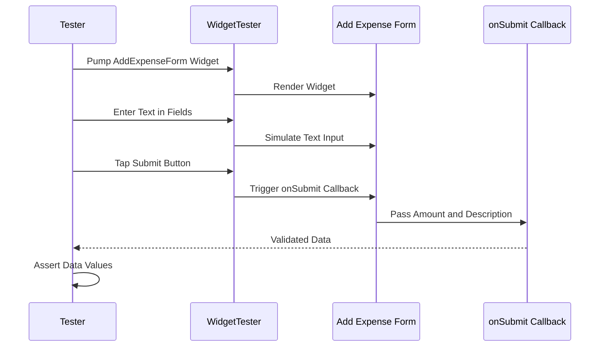

## 12.4.3 Conducting Widget Tests

In the realm of mobile app development, ensuring that your user interface (UI) behaves as expected is crucial. Widget testing in Flutter provides a robust way to verify the functionality and appearance of UI components. This section delves into conducting widget tests for the Expense Tracker App, focusing on simulating user interactions, asserting widget properties, and ensuring that widgets respond correctly to state changes.

### Importance of Widget Testing

Widget testing is a vital part of the development process for several reasons:

- **Ensuring UI Components Function as Intended:** Widget tests help verify that each UI component behaves correctly under various conditions, catching issues early in the development cycle.
- **Catching Layout and Rendering Issues Early:** By testing widgets in isolation, you can identify and fix layout and rendering problems before they affect the entire application.

### Setting Up Widget Tests

To begin widget testing in Flutter, you need to set up your test environment correctly:

- **Creating Test Files:** Place your test files in the `test/` directory of your Flutter project. This is a convention that helps organize your tests and makes them easy to locate.
- **Importing Necessary Packages:** Use the `flutter_test` package to access testing utilities. Import your target widgets to test their behavior.

```dart
import 'package:flutter/material.dart';
import 'package:flutter_test/flutter_test.dart';
import 'package:your_app/add_expense_form.dart';
```

### Writing Widget Tests

Writing effective widget tests involves using the `WidgetTester` class to interact with your widgets:

- **Using `WidgetTester` to Pump Widgets:** The `pumpWidget` method is used to render a widget in the test environment. This simulates the widget being displayed on the screen.

```dart
await tester.pumpWidget(
  MaterialApp(
    home: Scaffold(
      body: AddExpenseForm(
        onSubmit: (amount, description) {
          // Handle submission
        },
      ),
    ),
  ),
);
```

- **Finding Widgets:** Use the `find` methods to locate widgets in the widget tree. Common methods include `find.byKey`, `find.text`, and `find.byType`.

```dart
final amountField = find.byKey(Key('amountField'));
final descriptionField = find.byKey(Key('descriptionField'));
final submitButton = find.byKey(Key('submitExpenseButton'));
```

- **Simulating User Interactions:** Simulate user actions like taps, swipes, and text input using methods such as `enterText` and `tap`.

```dart
await tester.enterText(amountField, '75.5');
await tester.enterText(descriptionField, 'Dinner');
await tester.tap(submitButton);
await tester.pump(); // Rebuild the widget after the state change
```

### Asserting Widget Properties

Assertions are used to verify that widgets are in the expected state:

- **Verifying Widget States:** Check that text fields contain the correct values and that buttons trigger the expected actions.

```dart
expect(submittedAmount, 75.5);
expect(submittedDescription, 'Dinner');
```

- **Ensuring Visibility and Presence:** Confirm that widgets are visible and present in the widget tree.

```dart
expect(find.text('Add Expense'), findsOneWidget);
```

### Handling Asynchronous Operations

Flutter's widget tests can handle asynchronous operations using `pump` and `pumpAndSettle`:

- **Using `pump`:** This method rebuilds the widget tree, allowing you to simulate time passing in the test environment.
- **Using `pumpAndSettle`:** This method waits for all animations and state changes to complete before proceeding, ensuring that the widget is in a stable state.

### Best Practices

To write effective widget tests, consider the following best practices:

- **Keep Tests Focused:** Each test should focus on a single widget functionality to make it easier to identify issues.
- **Isolate Widgets with Dependencies:** Use mocks or stubs to isolate widgets from their dependencies, ensuring that tests are not affected by external factors.
- **Write Clear and Maintainable Tests:** Use descriptive test names and comments to make your tests easy to understand and maintain.

### Practical Example: Testing the Expense Addition Form

Let's write a widget test for the `AddExpenseForm` to ensure it saves data correctly:

```dart
// File: test/add_expense_form_test.dart
import 'package:flutter/material.dart';
import 'package:flutter_test/flutter_test.dart';
import 'package:your_app/add_expense_form.dart';

void main() {
  testWidgets('AddExpenseForm submits correct data', (WidgetTester tester) async {
    double? submittedAmount;
    String? submittedDescription;

    await tester.pumpWidget(
      MaterialApp(
        home: Scaffold(
          body: AddExpenseForm(
            onSubmit: (amount, description) {
              submittedAmount = amount;
              submittedDescription = description;
            },
          ),
        ),
      ),
    );

    // Enter amount
    await tester.enterText(find.byKey(Key('amountField')), '75.5');
    // Enter description
    await tester.enterText(find.byKey(Key('descriptionField')), 'Dinner');
    // Tap submit button
    await tester.tap(find.byKey(Key('submitExpenseButton')));
    await tester.pump();

    expect(submittedAmount, 75.5);
    expect(submittedDescription, 'Dinner');
  });
}
```

### Mermaid.js Diagram

To visualize the widget testing process, consider the following sequence diagram:



### Conclusion

Widget testing is an essential part of ensuring the reliability and functionality of your Flutter applications. By simulating user interactions and asserting widget properties, you can catch issues early and maintain a high-quality user experience. As you continue to develop your Expense Tracker App, consider incorporating widget tests to verify the behavior of all interactive elements.

## Quiz Time!



### What is the primary purpose of widget testing in Flutter?

- [x] To ensure UI components function as intended
- [ ] To test backend logic
- [ ] To optimize app performance
- [ ] To manage app state

> **Explanation:** Widget testing focuses on verifying the behavior and appearance of UI components, ensuring they function as intended.

### Where should you place your widget test files in a Flutter project?

- [ ] lib/
- [ ] assets/
- [x] test/
- [ ] build/

> **Explanation:** Test files should be placed in the `test/` directory, which is the standard location for organizing tests in a Flutter project.

### Which package is essential for writing widget tests in Flutter?

- [ ] flutter_localizations
- [x] flutter_test
- [ ] provider
- [ ] http

> **Explanation:** The `flutter_test` package provides the necessary tools and utilities for writing widget tests in Flutter.

### What method is used to render a widget in the test environment?

- [ ] buildWidget
- [x] pumpWidget
- [ ] renderWidget
- [ ] displayWidget

> **Explanation:** The `pumpWidget` method is used to render a widget in the test environment, simulating its display on the screen.

### How do you simulate a user entering text into a text field during a widget test?

- [ ] tester.typeText
- [x] tester.enterText
- [ ] tester.inputText
- [ ] tester.writeText

> **Explanation:** The `enterText` method is used to simulate a user entering text into a text field during a widget test.

### What method should you use to wait for all animations and state changes to complete in a widget test?

- [ ] pump
- [ ] pumpWidget
- [x] pumpAndSettle
- [ ] waitForAnimations

> **Explanation:** The `pumpAndSettle` method waits for all animations and state changes to complete, ensuring the widget is in a stable state.

### Which method is used to find a widget by its key in a widget test?

- [ ] find.byType
- [x] find.byKey
- [ ] find.byValue
- [ ] find.byName

> **Explanation:** The `find.byKey` method is used to locate a widget by its key in a widget test.

### What is a best practice when writing widget tests?

- [x] Keep tests focused on single widget functionalities
- [ ] Test multiple widgets in one test
- [ ] Avoid using mocks or stubs
- [ ] Write tests without comments

> **Explanation:** Keeping tests focused on single widget functionalities makes it easier to identify issues and maintain the tests.

### What is the role of the `WidgetTester` class in widget testing?

- [ ] To manage app state
- [x] To interact with widgets in the test environment
- [ ] To render backend logic
- [ ] To optimize app performance

> **Explanation:** The `WidgetTester` class is used to interact with widgets in the test environment, simulating user actions and verifying widget properties.

### True or False: Widget tests can only verify the appearance of widgets, not their behavior.

- [ ] True
- [x] False

> **Explanation:** Widget tests can verify both the appearance and behavior of widgets, ensuring they function as intended.


