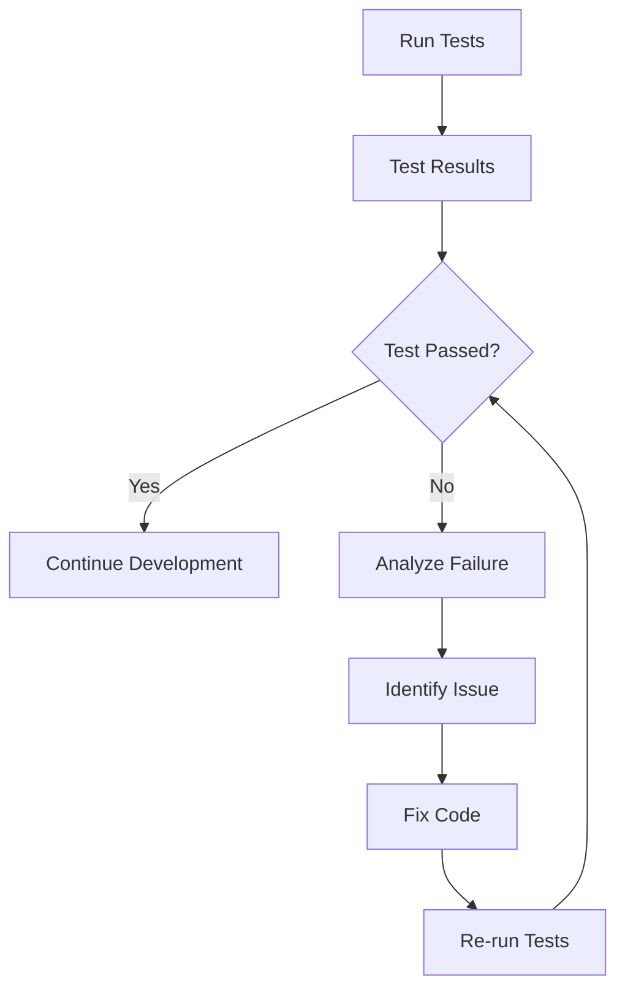

## 12.4.4 Interpreting Test Results

In the world of software development, testing is a crucial step that ensures the reliability and correctness of your code. As you develop your Flutter applications, understanding how to interpret test results is essential for maintaining a robust and healthy codebase. This section will guide you through the process of analyzing and interpreting automated test results, identifying issues, and verifying code correctness. We'll explore strategies for addressing failing tests and maintaining a healthy test suite, using practical examples and code snippets to illustrate key concepts.

### Understanding Test Outcomes

When you run automated tests, the results typically fall into two categories: passing and failing tests. Understanding these outcomes is the first step in interpreting test results.

- **Passing Tests:** A passing test indicates that the code behaves as expected for the given test case. Success indicators usually include green checkmarks or messages like "All tests passed" in your test output. Passing tests provide confidence that your code meets the specified requirements.

- **Failing Tests:** A failing test suggests that the code does not meet the expected behavior. Failure messages often include red crosses or error messages detailing the nature of the failure. It's crucial to pay attention to these messages as they provide insights into what went wrong.

### Analyzing Test Failures

When a test fails, it's important to analyze the failure to understand the root cause. Here are some common types of test failures and how to address them:

- **Reading Stack Traces:** Stack traces provide a detailed account of the function calls leading up to the failure. By examining the stack trace, you can pinpoint the exact location in the code where the error occurred. This is especially useful for identifying logical errors or incorrect assumptions in your code.

- **Identifying Assertion Failures:** Assertion failures occur when the actual output of a function does not match the expected output. These failures are often accompanied by messages indicating the expected and actual values. Carefully compare these values to understand the discrepancy.

- **Understanding Timeout Errors:** Timeout errors occur when a test takes too long to execute, often due to infinite loops or unresponsive code. To address timeout errors, review the code for performance bottlenecks or conditions that prevent the test from completing.

### Using Test Reports

Test reports provide a comprehensive overview of your test suite's performance. They can help you identify untested code and areas that require improvement.

- **Leveraging Formatter Tools:** Formatter tools enhance the readability of test outputs by organizing results into a structured format. This makes it easier to identify patterns in test failures and successes.

- **Integrating Test Coverage Reports:** Test coverage reports highlight the portions of your code that are covered by tests. By identifying untested code, you can prioritize writing additional tests to improve coverage and ensure comprehensive testing.

### Addressing Failing Tests

Once you've identified the cause of a test failure, it's time to address it. Here are some strategies for resolving failing tests:

- **Debugging Code Based on Test Failure Feedback:** Use the information from the test failure to guide your debugging efforts. Focus on the specific lines of code implicated in the failure and consider edge cases that may not have been accounted for.

- **Refactoring Code to Pass Tests:** Sometimes, failing tests reveal design flaws or inefficiencies in your code. Refactoring involves restructuring your code to improve its readability, maintainability, and performance while ensuring it passes all tests.

- **Ensuring Tests Themselves Are Correct:** Occasionally, the issue lies within the test itself rather than the code being tested. Review the test logic to ensure it accurately reflects the intended behavior and correct any errors.

### Maintaining a Healthy Test Suite

A healthy test suite is essential for continuous integration and deployment. Here are some best practices for maintaining your test suite:

- **Regularly Running Tests During Development:** Make it a habit to run tests frequently during development. This helps catch issues early and ensures that new code doesn't introduce regressions.

- **Keeping Tests Up-to-Date with Code Changes:** As your codebase evolves, update your tests to reflect changes in functionality. This prevents outdated tests from providing misleading results.

- **Removing Obsolete or Redundant Tests:** Over time, some tests may become obsolete or redundant. Regularly review your test suite to remove these tests, reducing maintenance overhead and improving test execution speed.

### Practical Example: Analyzing a Failing Test Case in the Expense Tracker App

Let's walk through a practical example of analyzing and resolving a failing test case in the Expense Tracker App. We'll use the following code snippet as our starting point:

```dart
// File: lib/expense_validator.dart
class ExpenseValidator {
  String? validateAmount(String? value) {
    if (value == null || value.isEmpty) {
      return 'Amount is required';
    }
    double? amount = double.tryParse(value);
    if (amount == null || amount <= 0) {
      return 'Enter a valid amount';
    }
    return null;
  }

  String? validateDescription(String? value) {
    if (value == null || value.isEmpty) {
      return 'Description is required';
    }
    return null;
  }
}

// File: test/expense_validator_test.dart
import 'package:flutter_test/flutter_test.dart';
import 'package:your_app/expense_validator.dart';

void main() {
  group('ExpenseValidator', () {
    ExpenseValidator validator;
    setUp(() {
      validator = ExpenseValidator();
    });

    test('validateAmount returns error for empty input', () {
      expect(validator.validateAmount(''), 'Amount is required');
    });

    test('validateAmount returns error for non-numeric input', () {
      expect(validator.validateAmount('abc'), 'Enter a valid amount');
    });

    test('validateAmount returns error for negative input', () {
      expect(validator.validateAmount('-50'), 'Enter a valid amount');
    });

    test('validateAmount returns null for valid input', () {
      expect(validator.validateAmount('100'), null);
    });

    test('validateDescription returns error for empty input', () {
      expect(validator.validateDescription(''), 'Description is required');
    });

    test('validateDescription returns null for valid input', () {
      expect(validator.validateDescription('Groceries'), null);
    });
  });
}
```

Suppose the test `validateAmount returns error for non-numeric input` fails with the following error message:

```
Expected: 'Enter a valid amount'
  Actual: null
```

#### Analyzing the Failure

- **Stack Trace Examination:** The stack trace points to the `validateAmount` method, indicating that the logic for handling non-numeric input is flawed.

- **Assertion Failure:** The test expected the error message `'Enter a valid amount'`, but the method returned `null`, suggesting that the condition for non-numeric input is not being met.

#### Resolving the Issue

- **Debugging the Code:** Review the `validateAmount` method to ensure it correctly identifies non-numeric input. The issue may lie in the `double.tryParse(value)` call, which returns `null` for non-numeric strings.

- **Refactoring the Code:** Adjust the logic to handle non-numeric input appropriately. For example, ensure that the method returns the correct error message when `double.tryParse(value)` returns `null`.

```dart
String? validateAmount(String? value) {
  if (value == null || value.isEmpty) {
    return 'Amount is required';
  }
  double? amount = double.tryParse(value);
  if (amount == null || amount <= 0) {
    return 'Enter a valid amount';
  }
  return null;
}
```

- **Re-running the Test:** After making the necessary changes, re-run the test suite to verify that the issue is resolved. The test should now pass, confirming that the code behaves as expected.

### Mermaid.js Diagram: Test Analysis Workflow

To visually represent the process of analyzing and resolving test failures, consider the following Mermaid.js diagram:



This diagram illustrates the iterative nature of testing and debugging, emphasizing the importance of continuous improvement and refinement.

### Conclusion

Interpreting test results is a critical skill for any developer aiming to maintain a reliable and robust codebase. By understanding test outcomes, analyzing failures, and using test reports effectively, you can identify and resolve issues efficiently. Maintaining a healthy test suite through regular testing and updates ensures that your code remains in top condition, ready for deployment and further development.

### Additional Resources

For further exploration of testing and debugging in Flutter, consider the following resources:

- [Flutter Testing Documentation](https://flutter.dev/docs/testing)
- [Effective Dart: Testing](https://dart.dev/guides/language/effective-dart/testing)
- [Test Coverage in Flutter](https://medium.com/flutter-community/test-coverage-in-flutter-6fcb1a8b4c94)
- [Continuous Integration with Flutter](https://flutter.dev/docs/deployment/cd)

These resources provide deeper insights into testing practices and tools, helping you refine your skills and enhance your development workflow.

## Quiz Time!



### What does a passing test indicate?

- [x] The code behaves as expected for the given test case.
- [ ] The code has a logical error.
- [ ] The test case is incorrect.
- [ ] The code needs refactoring.

> **Explanation:** A passing test indicates that the code behaves as expected for the given test case, providing confidence in its correctness.

### What is the purpose of a stack trace in test failures?

- [x] To pinpoint the exact location in the code where the error occurred.
- [ ] To provide a summary of all test cases.
- [ ] To list all the variables in the code.
- [ ] To show the expected output of the test.

> **Explanation:** A stack trace provides a detailed account of the function calls leading up to the failure, helping to pinpoint the exact location in the code where the error occurred.

### How can you address a timeout error in a test?

- [x] Review the code for performance bottlenecks or conditions that prevent the test from completing.
- [ ] Increase the timeout duration indefinitely.
- [ ] Ignore the error and proceed.
- [ ] Remove the test case.

> **Explanation:** Timeout errors occur when a test takes too long to execute. Reviewing the code for performance bottlenecks or conditions that prevent the test from completing is essential to address the issue.

### What is the benefit of using formatter tools for test outputs?

- [x] They enhance the readability of test outputs by organizing results into a structured format.
- [ ] They automatically fix failing tests.
- [ ] They generate random test cases.
- [ ] They increase the execution speed of tests.

> **Explanation:** Formatter tools enhance the readability of test outputs by organizing results into a structured format, making it easier to identify patterns in test failures and successes.

### What should you do if a test fails due to an incorrect test case?

- [x] Review the test logic to ensure it accurately reflects the intended behavior and correct any errors.
- [ ] Delete the test case.
- [ ] Ignore the failure and continue development.
- [ ] Increase the test timeout.

> **Explanation:** If a test fails due to an incorrect test case, it's important to review the test logic to ensure it accurately reflects the intended behavior and correct any errors.

### Why is it important to keep tests up-to-date with code changes?

- [x] To prevent outdated tests from providing misleading results.
- [ ] To increase the number of test cases.
- [ ] To reduce the execution time of tests.
- [ ] To remove the need for debugging.

> **Explanation:** Keeping tests up-to-date with code changes prevents outdated tests from providing misleading results, ensuring that the test suite accurately reflects the current state of the codebase.

### What is the role of test coverage reports?

- [x] To highlight the portions of your code that are covered by tests.
- [ ] To automatically fix failing tests.
- [ ] To generate new test cases.
- [ ] To increase the execution speed of tests.

> **Explanation:** Test coverage reports highlight the portions of your code that are covered by tests, helping you identify untested code and prioritize writing additional tests.

### How can you ensure that your test suite remains healthy?

- [x] Regularly run tests during development and keep them up-to-date with code changes.
- [ ] Only run tests before deployment.
- [ ] Ignore failing tests if they are not critical.
- [ ] Remove all tests after initial development.

> **Explanation:** Ensuring that your test suite remains healthy involves regularly running tests during development and keeping them up-to-date with code changes, which helps catch issues early and ensures that new code doesn't introduce regressions.

### What should you do if a test fails due to a logical error in the code?

- [x] Use the information from the test failure to guide your debugging efforts and focus on the specific lines of code implicated in the failure.
- [ ] Delete the test case.
- [ ] Ignore the failure and continue development.
- [ ] Increase the test timeout.

> **Explanation:** If a test fails due to a logical error in the code, use the information from the test failure to guide your debugging efforts and focus on the specific lines of code implicated in the failure.

### True or False: A failing test always indicates a problem with the code being tested.

- [ ] True
- [x] False

> **Explanation:** A failing test does not always indicate a problem with the code being tested. Sometimes, the issue lies within the test itself, such as incorrect test logic or assumptions.


